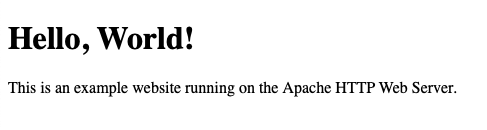

The Apache HTTP Web Server — usually just called Apache — is one of the most widely used open-source web servers. It comes with a long history of success in a wide range of applications. In this guide, you can see how to install Apache on Ubuntu 20.04 and learn how to get started using it.

## Before You Begin

1. Familiarize yourself with our [Getting Started with Linode](/docs/products/platform/get-started/) guide, and complete the steps for setting your Linode's hostname and timezone.

1. This guide uses `sudo` wherever possible. Complete the sections of our [How to Secure Your Server](/docs/products/compute/compute-instances/guides/set-up-and-secure/) guide to create a standard user account, harden SSH access, and remove unnecessary network services.

1. Update your system:

    ```command
    sudo apt update && sudo apt upgrade
    ```


This guide is written for a non-root user. Commands that require elevated privileges are prefixed with `sudo`. If you’re not familiar with the `sudo` command, see the [Linux Users and Groups](/docs/guides/linux-users-and-groups/) guide.


## Installing Apache

1.  Install Apache from the package manager using the following command:

    ```command
    sudo apt install apache2
    ```

1.  Start the Apache service using the following command:

    ```command
    sudo systemctl start apache2
    ```

1.  To have Apache begin running at system startup, enable the Apache service using the following command:

    ```command
    sudo systemctl enable apache2
    ```

## Managing Apache

### Apache Service

The Apache service runs on `systemd`, which can be used to manage the Apache service.

1.  View the current status of the Apache service using the following command:

    ```command
    sudo systemctl status apache2
    ```

1.  To stop the Apache service, use the following command:

    ```command
    sudo systemctl stop apache2
    ```

    You can then start the Apache service backup using the command below:

    ```command
    sudo systemctl start apache2
    ```

1.  To disable the Apache service, preventing it from beginning automatically at system startup, use the command below:

    ```command
    sudo systemctl disable apache2
    ```

    You can enable the Apache service again using the command below:

    ```command
    sudo systemctl enable apache2
    ```

1.  Restart the Apache service using the command below:

    ```command
    sudo systemctl restart apache2
    ```

1.  To reload Apache's configuration files, use the command below:

    ```command
    sudo systemctl reload apache2
    ```

### Apache Modules

Apache can be extended and modified with modules. These range from modules that integrate interpreters like PHP and Python, enabling dynamic content, to modules that change Apache's fundamental model for handling connections. (See the next section for more on the latter type of modules, called [Multi-processing Modules](/docs/guides/how-to-install-apache-ubuntu-2004/#multi-processing-modules)).

Apache modules are typically installed via the package manager. After that, you can manage modules through Apache.

1.  To search for available modules, use the command below:

    ```command
    sudo apt search libapache2-*
    ```

1.  To install a module, use a command like the following. In this and the following examples, the guide uses the `php7.4` module, which is available in the package manager as `libapache2-mod-php7.4`:

    ```command
    sudo apt install libapache2-mod-php7.4
    ```

1.  You can enable a module as follows. When managing a module via Apache, you use the module name, rather than the package name:

    ```command
    sudo a2enmod php7.4
    ```

    Usually, the module name is the last part of the package name, as in `libapache-mod-{module_name}` or `libapache2-{module_name}`.

1.  You can subsequently disable a module using the command below:

    ```command
    sudo a2dismod php7.4
    ```

1.  To list the modules currently enabled, use the command below

    ```command
    sudo apache2ctl -M
    ```

## Multi-processing Modules

Apache supports several models for handling connections through a particular kind of module: Multi-processing Modules (MPMs). On Ubuntu and many other Linux distributions, the `event` module is Apache's default MPM. This section provides an overview of each of the three MPMs available and gives you the necessary commands for using them.

### Prefork Module

This MPM provides a single-threaded server. It has a single-parent process that spawns child processes, each of which is responsible for a single incoming request. While the `prefork` MPM is more resource-intensive, it is necessary for applications that do not support multiple threads, like PHP.

1.  Enable the `prefork` MPM. Be sure to first disable your current MPM — the `event` MPM in this example:

    ```command
    sudo a2dismod mpm_event
    sudo a2enmod mpm_prefork
    ```

1.  Find the configuration file for the `prefork` MPM here: `/etc/apache2/mods-available/mpm_prefork.conf`. Modify the defaults as needed.

    The `prefork` MPM is considered highly self-regulating, so usually it is not necessary to adjust its default configuration. However, you may want to review the `MaxRequestWorkers` value. You should ensure that it is large enough to handle the expected request volume but small enough not to exceed hardware memory limits.

1.  Restart the Apache service:

    ```command
    sudo systemctl restart apache2
    ```

### Worker Module

This MPM is a multi-threaded hybrid. Like the `prefork` MPM, it consists of a parent process that spawns child processes. But, unlike the `prefork` MPM, the `worker` MPM's child processes are each multi-threaded, allowing each to handle multiple tasks in parallel.

1.  Enable the `worker` MPM. Be sure to first disable your current MPM — the `event` MPM in this example:

    ```command
    sudo a2dismod mpm_event
    sudo a2enmod mpm_worker
    ```

1.  Find the configuration file for the `worker` MPM here: `/etc/apache2/mods-available/mpm_worker.conf`. Modify the defaults as needed.

1.  Restart the Apache service:

    ```command
    sudo systemctl restart apache2
    ```

### Event Module

This MPM functions similarly to the `worker` MPM. However, it adds listener threads. These threads handle the task of waiting on incoming requests, which frees up worker threads to continue processing new requests.

1.  The `event` MPM is enabled by default. Use the following command to re-enable it if needed. Remember to use `a2dismod` to disable any other enabled MPM first, as shown for the `prefork` and `worker` MPMs above:

    ```command
     sudo a2enmod mpm_prefork
    ```

1.  Find the configuration file for the `event` MPM here: `/etc/apache2/mods-available/mpm_event.conf`. Modify the defaults as needed.

1.  Restart the Apache service:

    ```command
    sudo systemctl restart apache2
    ```

## Using Apache

This section walks you through setting up your own website using Apache. In doing so, it also illustrates how to use Apache's configuration files to set up *name-based virtual hosting*. This allows you to map one or more domains to your server's IP address.

### Apache Configuration

1.  Apache comes with a default site configuration. Since this guide is setting up a custom configuration, you need to disable the default using the following command:

    ```command
    sudo a2dissite 000-default.conf
    ```

1.  Create a configuration file for your site. Site configuration files should typically live in the `/etc/apache2/sites-available` directory, with each file being named according to the domain name you are using it for.

    In this example, replace `example.com` with your site's domain, in both the filename (`example.com.conf`) and in the file's contents. Do the same whenever you see `example.com` from here on:

    ```file {title="/etc/apache2/sites-available/example.com.conf" lang="aconf"}
    <VirtualHost *:80>
        ServerAdmin webmaster@example.com
        ServerName example.com
        ServerAlias www.example.com
        DocumentRoot /var/www/example.com/public/
        ErrorLog /var/www/example.com/logs/error.log
        CustomLog /var/www/example.com/logs/access.log combined
    </VirtualHost>
    ```

    This sets up a name-based virtual host for the `example.com` domain. You can host additional domain names by adding a configuration file for each.

1.  Create the directories to be used by your website. The first holds the website's static content and the second holds its log files:

    ```command
    sudo mkdir -p /var/www/example.com/public
    sudo mkdir -p /var/www/example.com/logs
    ```

1.  Enable the site in Apache:

    ```command
    sudo a2ensite example.com
    ```

1.  Restart Apache for the configuration changes to take effect:

    ```command
    sudo systemctl restart apache2
    ```

1.  Open port `80` on your system's firewall. UFW is the front end typically used to manage firewall rules on Ubuntu. You can use the following command to open port `80` with UFW:

    ```command
    sudo ufw allow http
    ```

    Refer to our [How to Configure a Firewall with UFW](/docs/guides/configure-firewall-with-ufw/) guide for more on how to use UFW for managing your firewall.

### Launching the Website

1.  Give the website some content. Create a page for your website. The file should be named `index.html` and stored in your website's `DocumentRoot` directory:

    ```file {title="/var/www/example.com/public/index.html" lang="html"}
    <!doctype html>
    <html>
    <body>
        <h1>Hello, World!</h1>
        <p>This is an example website running on the Apache HTTP Web Server.</p>
    </body>
    </html>
    ```

1.  In a browser, visit the domain you set up for your website — `example.com` above.

    You should see your website's "Hello, World!" page.

    