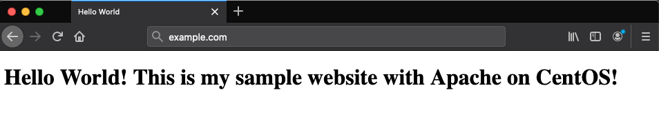

The *Apache HTTP Web Server* (Apache) is an open source web application for deploying web servers. This guide explains how to install and configure an Apache web server on CentOS 8.

If instead you would like to install a full LAMP (Linux, Apache, MySQL and PHP) stack, please see the [How to Install a LAMP Stack on CentOS 8](/docs/guides/how-to-install-a-lamp-stack-on-centos-8/) guide.

## Before You Begin

1.  Set up your Linode in the [Creating a Compute Instance](/docs/guides/creating-a-compute-instance/) and [Setting Up and Securing a Compute Instance](/docs/guides/set-up-and-secure/) guide.

1.  If you want a custom domain name for your site, you can set this up using our [DNS Manager](/docs/guides/dns-manager/) guide.

    - Don't forget to update your `/etc/hosts` file with your Linode's public IP address and your site's fully qualified domain name as explained in the [Update Your System's hosts File](/docs/guides/set-up-and-secure/#update-your-systems-hosts-file) section of the [Setting Up and Securing a Compute Instance](/docs/guides/set-up-and-secure/) guide.

1. Install the SELinux core policy Python utilities. This will give you the ability to manage SELinux settings in a fine-grained way.

        sudo yum install -y policycoreutils-python-utils

    

## Install Apache

1.  Install Apache 2.4:

        sudo yum install httpd

1.  Enable and start the Apache service:

        sudo systemctl enable httpd.service
        sudo systemctl start httpd.service

1.  Open the firewall for both http and https:

        sudo firewall-cmd --permanent --add-service=http
        sudo firewall-cmd --permanent --add-service=https

1.  Reload the firewall:

        sudo firewall-cmd --reload

## Multi-Processing Modules

Apache 2.4 offers several multi-processing modules (MPMs) to handle connections. In CentOS 8 the default MPM is the *event module*, although the *prefork module* is still recommended if you’re using standard PHP. Below are the basic default settings. For detailed explanations and advanced settings for these modules, see the [Tuning Your Apache Server](/docs/web-servers/apache-tips-and-tricks/tuning-your-apache-server/#multi-processing-modules) guide.

1.  You can check which MPM is currently configured with the following command:

        sudo httpd -V | grep -i mpm

    
Server MPM:     event


1.  Before making changes to your configuration file, make a backup:

        sudo cp /etc/httpd/conf/httpd.conf ~/httpd.conf.backup

### The Prefork Module

The Prefork Module is ideal for single threaded applications. It's a single parent with multiple forked child servers that are identical processes which wait for incoming requests. Each child process handles a single request. The Prefork Module is resource intensive but necessary for applications that do not support multi-threading such as PHP.

1.  Add the following section to the `/etc/httpd/conf/httpd.conf` file in your text editor and edit the values as needed. The following are the default values:

    
<IfModule prefork.c>
        StartServers              5
        MinSpareServers           5
        MaxSpareServers           10
        MaxRequestWorkers         150
        MaxConnectionsPerChild    0
</IfModule>


1.  On CentOS 8, the *event module* is enabled by default. Disable it, and enable the *prefork module* edit the `/etc/httpd/conf.modules.d/00-mpm.conf` file. Comment out the line for the event module and uncomment the line for the prefork module:

    
# Select the MPM module which should be used by uncommenting exactly
# one of the following LoadModule lines.  See the httpd.conf(5) man
# page for more information on changing the MPM.

# prefork MPM: Implements a non-threaded, pre-forking web server
# See: http://httpd.apache.org/docs/2.4/mod/prefork.html
#
# NOTE: If enabling prefork, the httpd_graceful_shutdown SELinux
# boolean should be enabled, to allow graceful stop/shutdown.
#
LoadModule mpm_prefork_module modules/mod_mpm_prefork.so

# worker MPM: Multi-Processing Module implementing a hybrid
# multi-threaded multi-process web server
# See: http://httpd.apache.org/docs/2.4/mod/worker.html
#
#LoadModule mpm_worker_module modules/mod_mpm_worker.so

# event MPM: A variant of the worker MPM with the goal of consuming
# threads only for connections with active processing
# See: http://httpd.apache.org/docs/2.4/mod/event.html
#
#LoadModule mpm_event_module modules/mod_mpm_event.so


1.  Restart Apache:

        sudo systemctl restart httpd

### The Worker Module

The Worker Module is a hybrid Prefork, multi-threaded, multi-processor module. It's similar to the Prefork Module, but each child is multi-threaded.

1.  Add the following section to the `/etc/httpd/conf/httpd.conf` file in your text editor and edit the values as needed. The following are the default values:

    
<IfModule worker.c>
        StartServers             2
        MinSpareThreads          25
        MaxSpareThreads          75
        ThreadLimit              64
        ThreadsPerChild          25
        MaxRequestWorkers        150
        MaxConnectionsPerChild   0
</IfModule>


1.  On CentOS 8, the *event module* is enabled by default. Disable it, and enable the *worker module* edit the `/etc/httpd/conf.modules.d/00-mpm.conf` file. Comment out the line for the event module and uncomment the line for the worker module:

    
# Select the MPM module which should be used by uncommenting exactly
# one of the following LoadModule lines.  See the httpd.conf(5) man
# page for more information on changing the MPM.

# prefork MPM: Implements a non-threaded, pre-forking web server
# See: http://httpd.apache.org/docs/2.4/mod/prefork.html
#
# NOTE: If enabling prefork, the httpd_graceful_shutdown SELinux
# boolean should be enabled, to allow graceful stop/shutdown.
#
#LoadModule mpm_prefork_module modules/mod_mpm_prefork.so

# worker MPM: Multi-Processing Module implementing a hybrid
# multi-threaded multi-process web server
# See: http://httpd.apache.org/docs/2.4/mod/worker.html
#
LoadModule mpm_worker_module modules/mod_mpm_worker.so

# event MPM: A variant of the worker MPM with the goal of consuming
# threads only for connections with active processing
# See: http://httpd.apache.org/docs/2.4/mod/event.html
#
#LoadModule mpm_event_module modules/mod_mpm_event.so


1.  Restart Apache:

        sudo systemctl restart httpd

### The Event Module

The Event Module is similar to the Worker Module except each thread has a dedicated listener so that threads are not locked in wait. As of Apache 2.4 the Event Module is considered stable, for versions before 2.4, use the [Worker Module](#the-worker-module).

1.  If you choose to keep the *event module* enabled, open `/etc/httpd/conf/httpd.conf` in your text editor, add this section to the end, and edit the values as needed. The following are the default values:

    
<IfModule event.c>
        StartServers             2
        MinSpareThreads          25
        MaxSpareThreads          75
        ThreadLimit              64
        ThreadsPerChild          25
        MaxRequestWorkers        150
        MaxConnectionsPerChild   0
</IfModule>


1.  Be sure the *event module* is enabled. Edit the `/etc/httpd/conf.modules.d/00-mpm.conf` file. Comment out the lines for the prefork and worker modules and uncomment the line for the event module:

    
# Select the MPM module which should be used by uncommenting exactly
# one of the following LoadModule lines.  See the httpd.conf(5) man
# page for more information on changing the MPM.

# prefork MPM: Implements a non-threaded, pre-forking web server
# See: http://httpd.apache.org/docs/2.4/mod/prefork.html
#
# NOTE: If enabling prefork, the httpd_graceful_shutdown SELinux
# boolean should be enabled, to allow graceful stop/shutdown.
#
#LoadModule mpm_prefork_module modules/mod_mpm_prefork.so

# worker MPM: Multi-Processing Module implementing a hybrid
# multi-threaded multi-process web server
# See: http://httpd.apache.org/docs/2.4/mod/worker.html
#
#LoadModule mpm_worker_module modules/mod_mpm_worker.so

# event MPM: A variant of the worker MPM with the goal of consuming
# threads only for connections with active processing
# See: http://httpd.apache.org/docs/2.4/mod/event.html
#
LoadModule mpm_event_module modules/mod_mpm_event.so


1.  Restart Apache:

        sudo systemctl restart httpd

## Configure Virtual Hosting

Apache supports *name-based virtual hosting*, which allows you to host multiple domains on a single server with a single IP. Although there are different ways to set up virtual hosts, the method below is recommended.

1.  Create the directories for the virtual hosts:

        sudo mkdir /etc/httpd/sites-available
        sudo mkdir /etc/httpd/sites-enabled

1.  Edit the `/etc/httpd/conf/httpd.conf` configuration file to tell Apache to look at these new directories for virtual hosts. Add the following line:

    
IncludeOptional sites-enabled/*.conf


1.  Create an `example.com.conf` file in `/etc/httpd/sites-available` with your text editor, replacing instances of `example.com` with your own domain URL in both the configuration file and in the file name:

    
<VirtualHost *:80>
     ServerAdmin webmaster@example.com
     ServerName example.com
     ServerAlias www.example.com
     DocumentRoot /var/www/example.com/public_html/
     ErrorLog /var/www/example.com/logs/error.log
     CustomLog /var/www/example.com/logs/access.log combined
</VirtualHost>


    Repeat this process for any other domains you host.

1.  Create a symbolic link to the sites-enabled directory for each virtual host:

        sudo ln -s /etc/httpd/sites-available/example.com.conf /etc/httpd/sites-enabled/example.com.conf

1.  Create directories for your websites and websites' logs, replacing `example.com` with your own domain information:

        sudo mkdir -p /var/www/example.com/public_html
        sudo mkdir /var/www/example.com/logs

1.  Change the ownership of the `public_html` directory to yourself:

        sudo chown -R $USER:$USER /var/www/example.com/public_html

1.  Change the permissions on the `/var/www` directory:

        sudo chmod -R 755 /var/www

1.  Create a simple page for your `index.html`.

    
<!DOCTYPE html>
<html>
    <head>
        <title>Hello World</title>
    </head>
    <body>
        <h1>Hello World! This is my sample website with Apache on CentOS!</h1>
    </body>
</html>


1.  Configure SELinux policies on the log directory for each virtual host. This will allow Apache to create and write to the log files. The `restorecon` command applies this setting and persists after a reboot:

        sudo semanage fcontext -a -t httpd_log_t "/var/www/example.com/logs(/.*)?"
        sudo restorecon -R -v /var/www/example.com/logs

1.  You'll see the following output:

    
Relabeled /var/www/example.com/logs from unconfined_u:object_r:httpd_sys_content_t:s0 to unconfined_u:object_r:httpd_log_t:s0


1.  Use can further confirm setting was successful by using the following command:

        sudo ls -dZ /var/www/example.com/logs/

    
unconfined_u:object_r:httpd_log_t:s0 /var/www/example.com/logs


    You should see `httpd_log_t` in this line.

1.  Restart Apache:

        sudo systemctl restart httpd

1.  Visit your site by navigating to your domain name in the web browser.

    

## Apache Mods and Scripting

### Install Apache Modules

One of Apache's strengths is its ability to be customized with modules. The default installation directory for Apache modules is the `/etc/httpd/modules/` directory. Configuration directives for the default modules are located in `/etc/httpd/conf/httpd.conf`, while configuration options for optional modules installed with yum are generally placed in `.conf` files in `/etc/httpd/conf.d/`.

1.  List available Apache modules:

        sudo yum search mod_

1.  Install any desired modules:

        sudo yum install [module-name]

    Modules should be enabled and ready to use following installation.

### Optional: Install Support for Scripting

The following commands install Apache support for server-side scripting in Perl, Python, and PHP. Support for these languages is optional based on your server environment.

Install the EPEL repository:

    sudo yum install epel-release

To install:

-   Perl support:

        sudo yum install mod_perl

-   Python support:

        sudo yum install mod_wsgi

-   PHP support:

        sudo yum install php php-pear

## Check Server Status

You can check your Apache web server status with the following command:

    sudo systemctl status httpd

The output will look similar to the following:


● httpd.service - The Apache HTTP Server
   Loaded: loaded (/usr/lib/systemd/system/httpd.service; enabled; vendor preset: disab>
   Active: active (running) since Tue 2020-03-03 08:32:02 EST; 10s ago
     Docs: man:httpd.service(8)
 Main PID: 4251 (httpd)
   Status: "Running, listening on: port 80"
    Tasks: 213 (limit: 5083)
   Memory: 24.2M
   CGroup: /system.slice/httpd.service
           ├─4251 /usr/sbin/httpd -DFOREGROUND
           ├─4252 /usr/sbin/httpd -DFOREGROUND
           ├─4253 /usr/sbin/httpd -DFOREGROUND
           ├─4254 /usr/sbin/httpd -DFOREGROUND
           └─4255 /usr/sbin/httpd -DFOREGROUND


- From here you can see that the server is running successfully. However, if something isn't working correctly, you can check the logs for errors. The logs locations are defined for each virtual host you set up in [Configure Virtual Hosting](#configure-virtual-hosting).

- Typically they will be at `/var/www/example.com/logs/error.log` and `/var/www/example.com/logs/access.log` where `example.com` is your domain name.

## Controlling Apache

You can control the server in the following ways.

1.  Stopping the server when it's running:

        sudo systemctl stop httpd

1.  Start the server when it's stopped:

        sudo systemctl start httpd

1.  Stop and start the server when it's running:

        sudo systemctl restart httpd

1.  Reload the configurations while the server is running without stopping it:

        sudo systemctl reload httpd

1.  You can disable Apache so that it stops and doesn't restart again when rebooting the system:

        sudo systemctl disable httpd

1.  To re-enable Apache if it's been disabled. This will also enable it to restart when the system reboots:

        sudo systemctl enable httpd