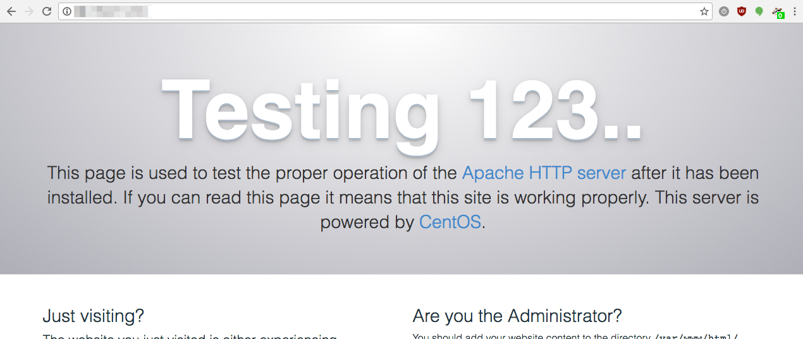
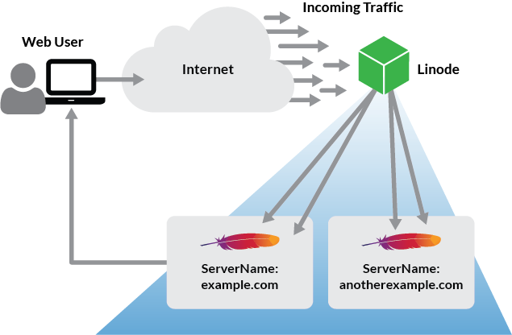

This guide explains how to install and configure the Apache web server on CentOS 7. Apache is an [open-source web server](https://httpd.apache.org/ABOUT_APACHE.html) that can be configured to serve a single or multiple websites using the same Linode.


This guide is written for a non-root user. Commands that require elevated privileges are prefixed with `sudo`. If you're not familiar with the `sudo` command, you can check the [Users and Groups](/docs/guides/linux-users-and-groups/) guide.

Replace each instance of `example.com` in this guide with the domain name of the website.


## Before you begin

1.  Ensure you have followed both the [Getting Started](/docs/products/platform/get-started/) and [Securing Your Server](/docs/products/compute/compute-instances/guides/set-up-and-secure/) guides.

2.  Check that the Linode's [hostname is set](/docs/products/platform/get-started/#setting-the-hostname). To check the hostname run:

        hostname
        hostname -f

    The first command displays a short hostname, and the second displays the Fully Qualified Domain Name (FQDN).

3.  Use `yum` to update the system and make sure everything is up to date:

        sudo yum update

## Configure firewalld to allow web traffic

By default, CentOS 7 is set to block web traffic. Run the following commands to allow web traffic through the firewall:

    sudo firewall-cmd --add-service=http --permanent && sudo firewall-cmd --add-service=https --permanent
    sudo systemctl restart firewalld

## Install and configure Apache

### Installing Apache

1.  Install Apache 2.4 using `yum`:

        sudo yum install httpd

2.  After you confirm the installation, let `yum` install Apache and its dependencies.

### Configuring httpd.conf

1.  Before changing any configuration files, Linode recommends that you make a backup. To make a backup of the `httpd.conf` file, use:

    `cp /etc/httpd/conf/httpd.conf ~/httpd.conf.backup`

2.  Update the `httpd.conf` file with the document root directory in order to point Apache to the files of the website and also add the `<IfModule prefork.c>` section to adjust the resource use settings (these are a good starting point for a **Linode 2GB**)

    
DocumentRoot "/var/www/html/example.com/public_html"

...

<IfModule prefork.c>
    StartServers        5
    MinSpareServers     20
    MaxSpareServers     40
    MaxRequestWorkers   256
    MaxConnectionsPerChild 5500
</IfModule>



These settings may also be added to a separate file. The file must be located in either the `conf.module.d` or `conf` directories and must end in `.conf` (as this is the format of files included in the resulting configuration).


### Configuring a name-based virtual host

#### A single domain

There are multiple ways to set up a virtual host, but this section explains and recommends one of the easier methods.

1.  Within the `conf.d` directory, create the file `vhost.conf` to store the virtual host configurations.

2.  Edit `vhost.conf` using the following example. Remember to substitute the domain name for `example.com`.

    
NameVirtualHost *:80

<VirtualHost *:80>
    ServerAdmin webmaster@example.com
    ServerName example.com
    ServerAlias www.example.com
    DocumentRoot /var/www/html/example.com/public_html/
    ErrorLog /var/www/html/example.com/logs/error.log
    CustomLog /var/www/html/example.com/logs/access.log combined
</VirtualHost>



3.  Create the directories referenced in the previous step:

        sudo mkdir -p /var/www/html/example.com/{public_html,logs}

    
The `ErrorLog` and `CustomLog` entries are suggested for more specific logging, but are not required. If they are defined as in the previous step, create the `logs` directories before you restart Apache.


4.  Enable Apache to start at boot, and restart the service for the above changes to take effect:

        sudo systemctl enable httpd.service
        sudo systemctl restart httpd.service

5.  Visit your domain to test the Apache server. A default Apache page will be visible if no index page is found in the document root declared in `httpd.conf`:

    

#### Multiple Domains

Additional domains may be used with the `vhost.conf` file as necessary. When new requests come in from the internet, Apache checks which VirtualHost block matches the requested URL and serves the appropriate content:

To add additional domains, copy the example in the previous section and add it to the end of the existing file, modify the values for the new domain, create the directories, restart Apache, and test the newly added domain. Repeat as necessary.

Congratulations! You've set up Apache and you're now ready to host websites. If you're wondering what additional configuration changes are available to get the most out of the server, here are some optional steps.

## Next Steps: Additional security and high availability

### Secure the server with SELinux

SELinux is a *mandatory access control* (MAC) system that confines privileged processes and automates security policy creation. To enable it on your Linode, see the [Beginner's Guide  to SELinux on CentOS 7](/docs/guides/a-beginners-guide-to-selinux-on-centos-7/).

### Secure the site with SSL

To add additional security to the site, consider [enabling a *secure sockets layer* (SSL) certificate](/docs/security/ssl/ssl-apache2-centos).

### Install and Configure GlusterFS, Galera, and XtraDB for High Availability

Consult the [Host a Website with High Availability](/docs/guides/host-a-website-with-high-availability/) guide to mitigate downtime through redundancy, monitoring, and failover.
