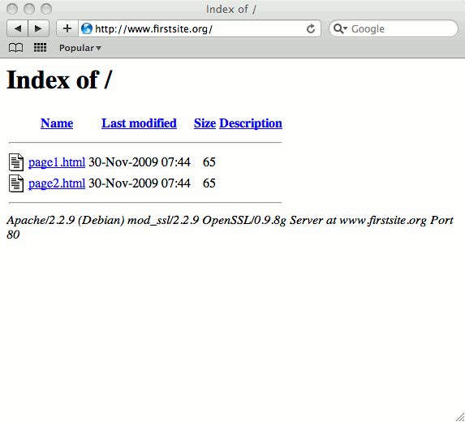
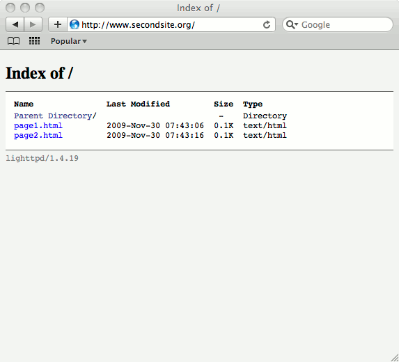

In some cases, administrators find that while Apache meets most of their general-purpose web serving needs, other web or application servers are better suited for certain tasks. Fortunately, it's easy to configure Apache to pass certain requests to other web server processes. These secondary (or tertiary) web servers may be running on the same Linode or separate nodes (perhaps via private networking). Our examples use lighttpd as a secondary web server, but they apply to any web server or application you'd like to proxy HTTP requests to.

We assume you have followed our [Setting Up and Securing a Compute Instance](/docs/products/compute/compute-instances/guides/set-up-and-secure/), and already have Apache running on your Linode. If you don't, you may wish to review our [Apache on Fedora 12 guide](/docs/guides/apache-2-web-server-on-fedora-12/) before proceeding. These steps should be performed as root via a shell session.

## Enabling the Proxy Module

The Fedora package of the Apache HTTP server includes the proxy module. To enable this module, create the `/etc/httpd/conf.d/proxy.conf` file with the following content:


<IfModule mod_proxy.c>
        #turning ProxyRequests on and allowing proxying from all may allow
        #spammers to use your proxy to send email.

        ProxyRequests Off

        <Proxy *>
                AddDefaultCharset off
                Order deny,allow
                Allow from all
        </Proxy>

        # Enable/disable the handling of HTTP/1.1 "Via:" headers.
        # ("Full" adds the server version; "Block" removes all outgoing Via: headers)
        # Set to one of: Off | On | Full | Block

        ProxyVia On
</IfModule>



This turns on proxy support in the module configuration. **Please note** the warning regarding the `ProxyRequests` directive. It should be "off" in your configuration. Next, we'll issue the following command to restart Apache:

    /etc/init.d/httpd restart

Apache should restart cleanly. If you encounter any issues, you may wish to inspect the logs available under `/var/log/httpd/` for more information.

## Proxying a Domain to Lighttpd

We already have a site called "www.firstsite.org" running under Apache as a normal virtual host. We'll use Apache to send requests for the site "www.secondsite.org" to a lighttpd instance, which we've configured to run on port 8080 on localhost. You can proxy to any local and non-local HTTP servers as required by your deployment. Here are the configuration directives for "www.secondsite.org":


<VirtualHost 74.207.231.112:80>
     ServerAdmin support@secondsite.org
     ServerName secondsite.org
     ServerAlias www.secondsite.org

     ProxyPass / http://localhost:8080/

     # Uncomment the line below if your site uses SSL.
     #SSLProxyEngine On
</VirtualHost>



The `ProxyPass` directive tells Apache to forward all requests for this domain to a web server running on port 8080. If our target server was running on another Linode (as with a server that only answers on the backend private network), we could just specify that address instead. We'll enable the site with the following command:

    /etc/init.d/httpd reload

Let's do some testing. Here's the normal Apache-served site "www.firstsite.org" in our browser:

Here's the site "www.secondsite.org" being served by lighttpd via ProxyPass:

## Proxying a Specific URL to Lighttpd

If we wanted to have `http://www.firstsite.org/myapp/` served by a web application running under lighttpd, we'd simply modify its configuration file to look like this:


<VirtualHost 74.207.231.112:80>
     ServerAdmin support@firstsite.org
     ServerName firstsite.org
     ServerAlias www.firstsite.org
     DocumentRoot /srv/www/firstsite.org/public_html/
     ErrorLog /srv/www/firstsite.org/logs/error.log
     CustomLog /srv/www/firstsite.org/logs/access.log combined

     ProxyPass /myapp http://localhost:8080/
</VirtualHost>



Now the location "/myapp" will be served by lighttpd instead of Apache. After reloading the Apache configuration with `/etc/init.d/httpd reload`, we can see that it's functioning correctly:

This is an easy method for hosting multiple application servers (with different web server requirements) under a single domain.

## More Information

You may wish to consult the following resources for additional information on this topic. While these are provided in the hope that they will be useful, please note that we cannot vouch for the accuracy or timeliness of externally hosted materials.

- [Apache Module mod\_proxy](http://httpd.apache.org/docs/2.2/mod/mod_proxy.html)
- [Apache HTTP Server Version 2.2 Docs](http://httpd.apache.org/docs/2.2/)
