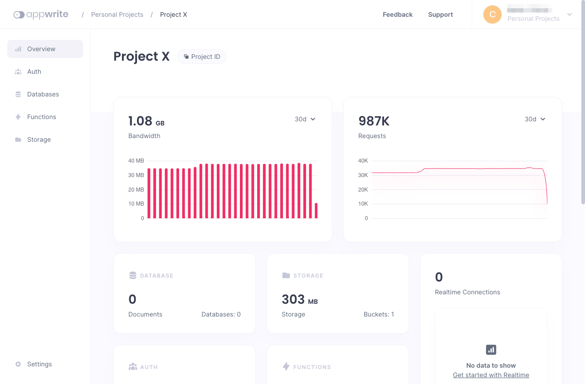

Appwrite is an open source platform for quickly developing RESTful backend services. It is an ideal solution for reducing the time you spend developing repetitive APIs, and instead setting your focus on the frontend. Appwrite seamlessly runs alongside your other backend services, making it an adaptable solution that fits into an existing application or platform.

This tutorial introduces you to Appwrite, highlighting its features and how it compares with similar tools. Follow along to see everything you need to know to install your own Appwrite instance and get it up and running.

## Before You Begin

1.  If you have not already done so, create a Linode account and Compute Instance. See our [Getting Started with Linode](/docs/products/platform/get-started/) and [Creating a Compute Instance](/docs/products/compute/compute-instances/guides/create/) guides.

1.  Follow our [Setting Up and Securing a Compute Instance](/docs/products/compute/compute-instances/guides/set-up-and-secure/) guide to update your system. You may also wish to set the timezone, configure your hostname, create a limited user account, and harden SSH access.

1.  Update your system:

    ```command {title="Debian / Ubuntu"}
    sudo apt update && sudo apt upgrade
    ```

    ```command {title="AlmaLinux / CentOS Stream / Fedora / Rocky Linux"}
    sudo dnf upgrade
    ```


This guide is written for a non-root user. Commands that require elevated privileges are prefixed with `sudo`. If you’re not familiar with the `sudo` command, see the [Users and Groups](/docs/guides/linux-users-and-groups/) guide.


## What Is Appwrite?

[Appwrite](https://appwrite.io/) is an open source, self-hosted, backend-as-a-service (BaaS) platform for quickly building backend services for the web, mobile, and beyond. It aims to abstract the repetitive tasks involved in creating RESTful APIs and microservices, making it quicker and easier to build backend services from scratch. The result is a solution for quicker development and deployment of RESTful services.

Appwrite is especially good when you want to focus on frontend development, and simply need a backend to perform common RESTful API tasks. Because Appwrite simplifies the backend development process, you can have a backend ready to support your frontend quickly and with less effort.

### Appwrite vs Firebase

Appwrite operates in the same space as Google's Firebase. So, what does Appwrite do differently?

Generally, Appwrite offers the same or similar features as Firebase. Like Firebase, Appwrite provides database, storage, authentication, and functions, among other features.

The main difference is that Appwrite is self-hosted, whereas Firebase is exclusively available on Google's cloud. While Appwrite requires more in terms of setup and hosting, it balances that by giving you more control of your instance.

### Appwrite vs Supabase

Supabase is another tool in the same space as Appwrite and Firebase, one that presents itself directly as an alternative to Firebase. Supabase rides the middle ground in terms of hosting, as you can use Supabase on either a cloud- or self-hosted model.

Appwrite, however, provides a more robust self-hosted experience. It uses an easy-to-deploy Docker installation, and its design works seamlessly alongside other backend services. Supabase's own self-hosted option is still maturing, and lacks some of the features and ease of Appwrite.

Appwrite also stands out from Supabase in terms of its database. Supabase uses a Postgres database, meaning that it uses relational (SQL) storage. In fact, Supabase can be thought of as providing a simplifying layer over Postgres, as their features are so closely linked.

Appwrite, on the other hand, uses a NoSQL approach to its database interface, and provides a more abstracted approach. Appwrite is more focused on providing easier RESTful API development than a database solution. As such, its database may be more approachable.

## How to Install Appwrite

These steps take you through everything from installing the prerequisites to starting-up and running your own Appwrite instance.


To automatically install Appwrite on a Compute Instance, consider deploying [Appwrite through the Linode Marketplace](/docs/products/tools/marketplace/guides/appwrite/).


### Installing Docker

The first step is to install Docker, which is used to both install and run your Appwrite instance. This installation process also uses Docker Compose, which organizes and coordinates the Appwrite services.

1.  Install Docker using the steps outlined in one of the following guides, depending on your Linux distribution.

    -  **Debian** and **Ubuntu**: Use our guide [How to Install and Use Docker on Ubuntu and Debian](/docs/guides/installing-and-using-docker-on-ubuntu-and-debian/).

    -  **AlmaLinux**, **CentOS Stream**, **Fedora**, and **Rocky Linux**: Use our guide [How to Install and Use Docker on CentOS and Fedora](/docs/guides/installing-and-using-docker-on-centos-and-fedora/).

1.  Install the Docker Compose plugin using your distribution's package manager.

    ```command {title="Debian / Ubuntu"}
    sudo apt install docker-compose-plugin
    ```

    ```command {title="AlmaLinux / CentOS Stream / Fedora / Rocky Linux"}
    sudo dnf install docker-compose-plugin
    ```

1.  You can verify your Docker installation by checking the version. Your version may not match the one shown below, but that's fine, you just want to get a version response:

    ```command
    docker -v
    ```

    ```output
    Docker version 20.10.17, build 100c701
    ```

    
    On RHEL-derived distributions, you may additionally have to run the following command to ensure the Docker daemon starts:

    ```command {title="AlmaLinux / CentOS Stream / Fedora / Rocky Linux"}
    sudo systemctl start docker
    ```
    

### Installing Appwrite

Appwrite can be installed with a single Docker command. Essentially, this command has Docker simultaneously download and start running the Appwrite services.

The command creates a new `appwrite` directory in the current directory, and this new directory becomes the base for your Appwrite instance:

```command
sudo docker run -it --rm --volume /var/run/docker.sock:/var/run/docker.sock --volume "$(pwd)"/appwrite:/usr/src/code/appwrite:rw --entrypoint="install" appwrite/appwrite:1.2.1
```

Progress through the prompts, which allow you to set the initial configuration options for your Appwrite instance. You can press **Enter** at each prompt to receive the default values.

Docker then runs a Docker Compose command to complete the setup. When this is finished, you should see:

```output
Appwrite installed successfully
```

### Starting Appwrite

Appwrite is now up and running. You can access the dashboard by navigating to `http://localhost` in a web browser on the server.

However, doing so is often not feasible. Likely, you want to access the dashboard remotely. You can do so by navigating to the Appwrite server's URL, which may be an IP address, such as `192.0.2.0`. But first, you need to ensure the server's firewall provides external access to the HTTP port (`80`).

-   **Debian** and **Ubuntu**: Refer to our guide on [How to Configure a Firewall with UFW](/docs/guides/configure-firewall-with-ufw/).

-   **AlmaLinux**, **CentOS Stream**, **Fedora**, and **Rocky Linux**: Refer to our guide on [Enabling and Configuring FirewallD on CentOS](/docs/guides/introduction-to-firewalld-on-centos/).

Having opened the port, navigate to the server's URL/IP address, and you should be greeted by the Appwrite sign-up form.


The user information you enter on this first sign-up creates the root user, or administrator user, for your Appwrite instance.

Once the administrator user has been created, you are directed to the main Appwrite dashboard, where you can start creating Appwrite projects.


## How to Manage the Appwrite Instance

There are a few more things you can do to set up and further configure your Appwrite instance. Additionally, you may want to control the Appwrite services. For instance, turning them on and off as needed for server maintenance.

These next sections give you some of the most useful tools for configuring and managing your Appwrite instance.

### Controlling Appwrite Services

Appwrite runs using Docker Compose, which you can use to control Appwrite's state. To do so, you need to be in the Appwrite directory. From there, you can use the Docker Compose commands to control the Appwrite services.

These are some examples of useful Docker Compose commands for working with your Appwrite instance.

-   To restart the Appwrite services:

    ```command
    sudo docker compose restart
    ```

-   To stop the services:

    ```command
    sudo docker compose stop
    ```

-   To stop and uninstall the services:

    ```command
    sudo docker compose down -v
    ```

    This option leaves the Docker Compose files for Appwrite intact, so you can reinstall and restart Appwrite with the next command.

-   To start the services back up:

    ```command
    sudo docker compose up -d
    ```

### Configuring Appwrite

Appwrite's configurations are primarily controlled by environmental variables set in the `.env` file stored in the `appwrite` directory that was created when you installed Appwrite.

To make a change, take these steps, executing the commands while in the Appwrite directory.

1.  Stop the Appwrite services:

    ```command
    sudo docker compose stop
    ```

1.  Use your preferred text editor to make the necessary changes to the `.env` file.

1.  Start the services up again:

    ```command
    sudo docker compose up -d
    ```

You can see the full range of environmental variables Appwrite uses, each with a helpful description, in the [official documentation](https://appwrite.io/docs/environment-variables).

To get you started, here are a few particularly useful environmental variables Appwrite can be configured with.

-   By default, Appwrite allows anyone to create a new user account, with the environmental variable `_APP_CONSOLE_WHITELIST_ROOT=enabled`. These new users can then create projects on your Appwrite instance.

    It is recommended that you disable this feature for production Appwrite instances. This way, only the Appwrite instance administrator can create and disseminate user accounts:

    ```file {title=".env"}
    _APP_CONSOLE_WHITELIST_ROOT=disabled
    ```

-   Appwrite can be configured with an SMTP server to allow for sending email alerts to users and the administrator. The server's information is entered using a set of environmental variables beginning with `_APP_SMTP`:

    ```file {title=".env"}
    _APP_SMTP_HOST=mail.example.com
    _APP_SMTP_PORT=25
    _APP_SMTP_SECURE=tls
    _APP_SMTP_USERNAME=example-smtp-username
    _APP_SMTP_PASSWORD=example-smtp-password
    ```

-   Appwrite provides usage statistics, which you can view on the Appwrite dashboard. But you can also disable these statistics using the `_APP_USAGE_STATS` environmental variable:

    ```file {title=".env"}
    _APP_USAGE_STATS=disabled
    ```

## How to Create an Appwrite Project

It's beyond the scope of this tutorial to showcase all of Appwrite's features for creating a fully functioning backend server. For that, refer to the links at the end of this tutorial and to our guide [How to Create a React App with Appwrite](/docs/guides/create-react-app-with-appwrite/).

Here you can see the initial steps for creating an Appwrite project. This can serve as the basis for anything else you want to do with Appwrite.

1.  Navigate to the Appwrite dashboard, as described in the [Starting Appwrite](/docs/guides/getting-started-appwrite/#starting-appwrite) section above.

1.  Click the **Create Project** button, and enter the name for your project. This takes you to the dashboard for the new project.

    

1.  From here, you can manage all aspects of your Appwrite project. For instance, from the left-hand sidebar you can:

    -   Use the **Database** option to create a database. Appwrite uses a document-based database, but gives you a graphical interface for adding and managing collections and documents.

    -   Add and manage users for your project with the **Authentication** option.

    -   Add functions to execute custom code from your Appwrite instance using the **Functions** option.

## Conclusion

This tutorial covers everything you need to start working with Appwrite as your next backend server. From here, everything is in place to start putting together an Appwrite instance ready to support your application frontend.

Want to learn more about how to get started on such an application? Take a look at the Appwrite documentation linked below as well as at our guide [How to Create a React App with Appwrite](/docs/guides/create-react-app-with-appwrite/).