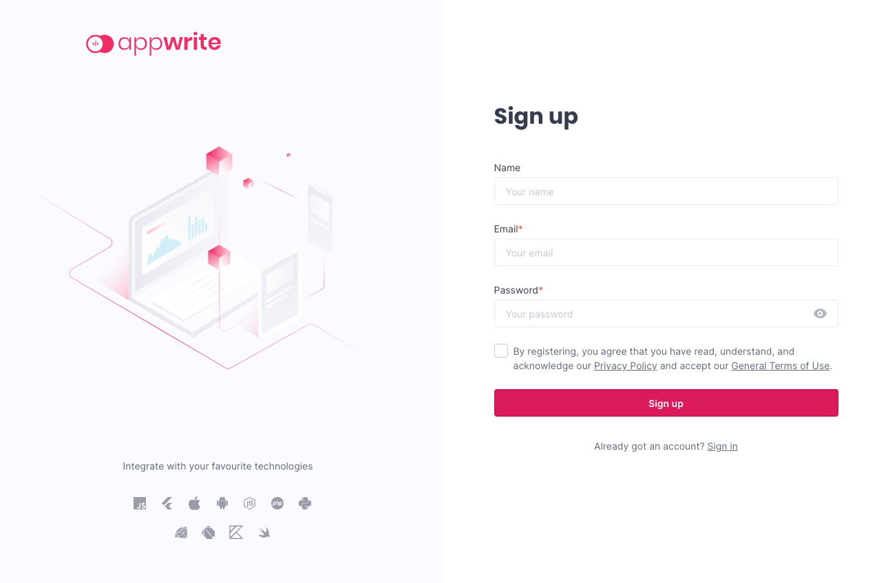

Appwrite is an open-source platform for quickly developing RESTful backend services. It is an ideal solution for reducing time developing repetitive APIs and focusing on the frontend. And the self-hosted Appwrite platform seamlessly runs alongside your other backend services.

This tutorial aims to introduce you to Appwrite, highlighting its features and how it compares with similar tools. Then, follow along to see everything you need to know to install your own Appwrite instance and get it up and running.

## Before You Begin

1. Familiarize yourself with our [Getting Started with Linode](/docs/getting-started/) guide, and complete the steps for setting your Linode's hostname and timezone.

1. This guide uses `sudo` wherever possible. Complete the sections of our [How to Secure Your Server](/docs/security/securing-your-server/) guide to create a standard user account, harden SSH access, and remove unnecessary network services.

1. Update your system.

    - On Debian and Ubuntu, you can do this with:

            sudo apt update && sudo apt upgrade

    - On AlmaLinux, CentOS (8 or later), or Fedora, use:

            sudo dnf upgrade


This guide is written for a non-root user. Commands that require elevated privileges are prefixed with `sudo`. If you’re not familiar with the `sudo` command, see the [Users and Groups](/docs/tools-reference/linux-users-and-groups/) guide.


## What Is Appwrite?

[Appwrite](https://appwrite.io/) is an open-source, self-hosted platform for quickly building backend services for web, mobile, and more, using a backend-as-a-service model. It aims to abstract the repetitive tasks involved in creating RESTful APIs and microservices, making it quicker and easier to building backend services from scratch.

Appwrite takes common elements of RESTful APIs and makes them easier to access and implement. The result is a solution for quicker development and deployment of RESTful services.

Appwrite is especially good for cases when you want to focus on the frontend development and when the backend needs to perform common RESTful API tasks. Because Appwrite simplifies the backend development process, you can have a backend ready to support your frontend quickly and with less effort.

### Appwrite vs Firebase

Appwrite operates in the same space as Google's Firebase. So, what does Appwrite do differently?

Generally, Appwrite offers the same or similar features as Firebase. Appwrite similarly provides database, storage, authentication, and functions, among other features.

The main difference is that Appwrite is exclusively self-hosted, whereas Firebase is exclusively available on Google's cloud. This means that Appwrite simultaneously requires more, in the sense of setup and maintenance, while giving you more control of your instance.

### Appwrite vs Supabase

Supabase is another tool in the same space as Appwrite and Firebase, one the presents itself more directly as an alternative to Firebase. And it rides the middle ground in terms of hosting — you can use Supabase either cloud- or self-hosted.

Appwrite, however, provides a more robust self-hosted experience. It uses an easy-to-deploy Docker installation, and its design works seamlessly alongside other backend services. Supabase's own self-hosted option is still maturing, and lacks some of the features and ease of Appwrite.

Appwrite also stands out from Supabase in terms of its database. Supabase uses a Postgres database, meaning that it uses relational (SQL) storage. Supabase, in fact, can be thought of as providing a simplifying layer over Postgres, so closely linked are their features.

Appwrite, on the other hand, uses a NoSQL approach to its database interface, and provides a more abstracted approach. Appwrite is more focuses on providing easier RESTful API development than a database solution.

## How to Install Appwrite

### Installing Docker

The first step is to install Docker, which is used both to install and run your Appwrite instance. The next step is to install Docker Compose, which organizes and coordinates the Appwrite services.

1. Install Docker using the steps outlined in one of the following guides, depending on your Linux distribution.

    On Debian and Ubuntu, use our guide [How to Install and Use Docker on Ubuntu and Debian](/docs/guides/installing-and-using-docker-on-ubuntu-and-debian/).

    On AlmaLinux, CentOS, and Fedora, use our guide [How to Install and Use Docker on CentOS and Fedora](/docs/guides/installing-and-using-docker-on-centos-and-fedora/).

1. Install the Docker Compose plugin using your distribution's package manager.

    On Debian and Ubuntu, use the command:

        sudo apt install docker-compose-plugin

    On AlmaLinux, CentOS, and Fedora, use the command:

        sudo dnf install docker-compose-plugin

1. You can verify your Docker installation by checking the version. Your version may not match the one shown below, but you just want to make sure that you get a version response:

        docker -v

    
Docker version 20.10.17, build 100c701
    

1. On AlmaLinux, CentOS, and Fedora, you may additionally have to run the following command to ensure the Docker daemon starts:

        sudo systemctl start docker

### Installing Appwrite

Appwrite can be installed with a single Docker command. Essentially, this command has Docker simultaneously download and start running the Appwrite services.

The command creates a new `appwrite` directory in the current directory, and this new directory becomes the base for your Appwrite instance:

    sudo docker run -it --rm --volume /var/run/docker.sock:/var/run/docker.sock --volume "$(pwd)"/appwrite:/usr/src/code/appwrite:rw --entrypoint="install" appwrite/appwrite:0.15.1

Progress through the prompts, which allow you to set the initial configuration options for your Appwrite instance. You can press **Enter** at each prompt to receive the default values.

Docker then runs a Docker Compose command to complete the setup. When this is finished, you should see:


Appwrite installed successfully


### Starting Appwrite

Appwrite is now up and running. You can access the dashboard by navigating to `http://localhost` in a web browser on the server.

However, doing so is often not feasible, especially not for numerous users. Likely, you want to be able to access the dashboard remotely.

You can do so by navigating to the Appwrite server's URL, which may often be an IP address, like `192.0.2.0`. But first, you need to ensure that the server's firewall provides external access to the HTTP port, port `80`.

- For Debian and Ubuntu, refer to our guide on [How to Configure a Firewall with UFW](/docs/guides/configure-firewall-with-ufw/).

- For AlmaLinux, CentOS, and Fedora, refer to our guide on [Enabling and Configuring FirewallD on CentOS](/docs/guides/introduction-to-firewalld-on-centos/)

Having opened the port, navigate to the server's URL/IP address, and you should be greeted by the Appwrite sign-up form.

The user information you enter on this first sign-up creates the root user, or administrator user, for your Appwrite instance.

Once the user has been created, you are directed to the main Appwrite dashboard, where you can start creating Appwrite projects.

## How to Manage the Appwrite Instance

### Controlling Appwrite Services

Appwrite runs using Docker Compose, which you can use to control Appwrite's state. To do so, you need to be in the Appwrite directory. From there, you can use the Docker Compose commands to control the Appwrite services.

These are some examples of useful Docker Compose commands for working with your Appwrite instance.

- To restart the Appwrite services:

        docker compose restart

- To stop the services:

        docker compose stop

- To stop and uninstall the services:

        docker compose down -v

    This option leaves the Docker Compose files for Appwrite, however. This means that you can reinstall Appwrite with the `start` command given next.

- To start the services back up:

        docker compose up -d

### Configuring Appwrite

Appwrite's configurations are primarily controlled by environmental variables set in the `.env` file stored in the `appwrite` directory that was created when you installed Appwrite.

To make a change, take these steps, executing the commands while in the Appwrite directory.

1. Stop the Appwrite services:

        docker compose stop

1. Make the necessary changes to the `.env` file.

1. Start the services up again:

        docker compuse up -d

You can see the full range of environmental variables Appwrite uses, each with a helpful description, in the [official documentation](https://appwrite.io/docs/environment-variables).

To get you started, here are a few useful environmental variables Appwrite can be configured with.

- By default, Appwrite allows anyone to create a new user account, with the environmental variable `_APP_CONSOLE_WHITELIST_ROOT=enabled`. These new users can then create projects on your Appwrite instance.

    It is recommended that you disable this feature for production Appwrite instances. This way, only the Appwrite instance administrator can create and disseminate user accounts:

    
/_APP_CONSOLE_WHITELIST_ROOT=disabled
    

- Appwrite can be configured with an SMTP server to allow for sending email alerts to users and the administrator. The server's information is entered using the `_APP_SMTP` environmental variables:

    
/_APP_SMTP_HOST=mail.example.com
/_APP_SMTP_PORT=25
/_APP_SMTP_SECURE=tls
/_APP_SMTP_USERNAME=example-smtp-username
/_APP_SMTP_PASSWORD=example-smtp-password
    

- Appwrite provides usage statistics, which you can view on the Appwrite dashboard. But you can also disable these statistics using the `_APP_USAGE_STATS` environmental variable:

    
/_APP_USAGE_STATS=disabled
    

## How to Create an Appwrite Project

It is beyond the scope of this tutorial to show you all of the features in Appwrite for creating a full-functioning backend server. For that, you can refer to the links at the end of this tutorial and to our guide [How to Create a React App with Appwrite](/docs/guides/create-react-app-with-appwrite/).

But here you can see the initial step for creating an Appwrite project. This can serve as the basis for anything and everything else you want to do with Appwrite.

1. Navigate to the Appwrite dashboard, as described in the [Starting Appwrite](/docs/guides/getting-started-appwrite/#starting-appwrite) section above.

1. Click the **Create Project** button, and enter the name for your project. This takes you to the dashboard for the new project.

    

1. From here, you can manage all aspects of your Appwrite project.

    You can use the **Database** option on the left menu to create a database. Appwrite uses a document-based database, but gives you a graphical interface for adding and managing collections and documents.

    You can add and manage users for your project using the **Users** option on the left menu.

    And you can control your project's web API features using the **Webhooks** and **API Keys** buttons on the left menu. 

## Conclusion

With this tutorial, you have the base you need to start working with Appwrite. From here, everything is in place to start putting together your own backend server with Appwrite.

Want to learn more about how to do so? Take a look at the Appwrite documentation linked below, and also at our guide [How to Create a React App with Appwrite](/docs/guides/create-react-app-with-appwrite/).

Have more questions or want some help getting started? Feel free to reach out to our [Support](https://www.linode.com/support/) team.

