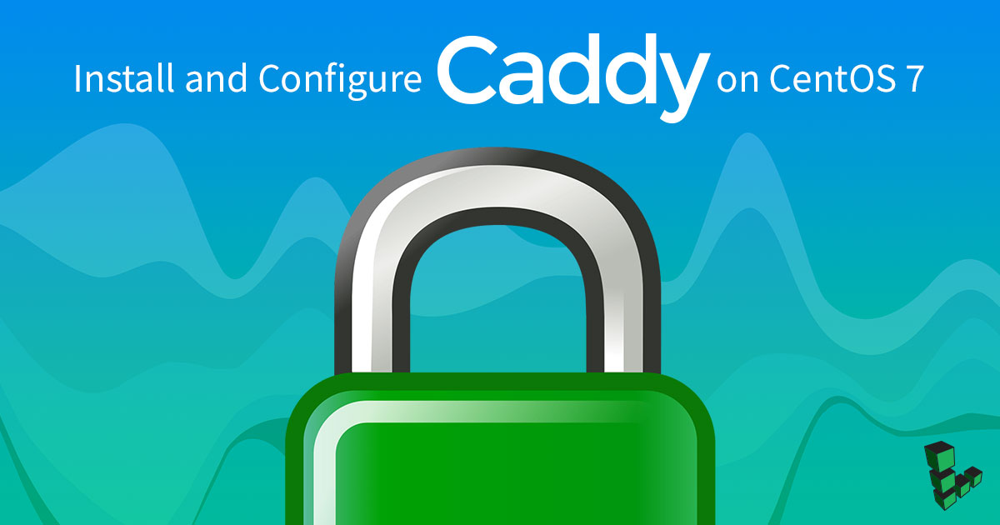

[Caddy](https://caddyserver.com/) is a fast, open-source and security-focused web server written in [Go](https://golang.org/). Caddy includes modern features such as support for virtual hosts, minification of static files, and HTTP/2. Caddy is also the first web-server that can obtain and renew SSL/TLS certificates automatically using [Let's Encrypt](https://letsencrypt.org/).

## Before You Begin

1.  Familiarize yourself with our [Getting Started](/docs/products/platform/get-started/) guide and complete the steps for setting your Linode's hostname and timezone.

2.  This guide uses `sudo` wherever possible. Complete the sections of our [Securing Your Server](/docs/products/compute/compute-instances/guides/set-up-and-secure/) guide to create a standard user account, harden SSH access and remove unnecessary network services.

3.  You need to register your site's domain name and follow our [DNS Manager Overview](/docs/products/networking/dns-manager/#add-records) guide to point your domain to your Linode.

4.  Update your system:

        sudo yum update

## Install Caddy

1.  Install the `yum-plugin-copr` plugin and enable `caddy`:

        sudo yum install yum-plugin-copr
        sudo yum copr enable @caddy/caddy

1.  Install Caddy:

        sudo yum install caddy

1. To verify the installation of caddy type:
       caddy version
    An output similar to the following appears:

        v2.4.3 h1:Y1FaV2N4WO3rBqxSYA8UZsZTQdN+PwcoOcAiZTM8C0I=

## Allow HTTP and HTTPS Connections

Caddy serves websites using HTTP and HTTPS protocols, so you need to allow access to the ports 80, and 443.

        sudo firewall-cmd --permanent --zone=public --add-service=http
        sudo firewall-cmd --permanent --zone=public --add-service=https
        sudo firewall-cmd --reload

## Add Web Content

1.  Set up a home directory, **web root**, for your website:

        sudo mkdir -p /var/www/html/example.com

1.  Create a test page:

        echo '<!doctype html><head><title>Caddy Test Page</title></head><body><h1>Hello, World!</h1></body></html>' > /var/www/html/example.com/index.html

## Configure the Caddyfile

Add your hostname and web root to the Caddy configuration. Use an editor of your choice and replace `:80` with your domain name. Set the root directory of the site to `/var/www/html/example.com` Replace `example.com` with your site's domain name:


example.com {
    root * /var/www/html/example.com
    file_server
}


## Start and Enable the Caddy Service

1.  Enable the Caddy service:

        sudo systemctl start caddy

1. Verify that the service is active:

        sudo systemctl status caddy

    An output similar to the following appears:

    
● caddy.service - Caddy
   Loaded: loaded (/usr/lib/systemd/system/caddy.service; disabled; vendor preset: disabled)
   Active: active (running) since Thu 2021-09-02 18:25:29 IST; 4s ago
     Docs: https://caddyserver.com/docs/
 Main PID: 19314 (caddy)
   CGroup: /system.slice/caddy.service
           └─19314 /usr/bin/caddy run --environ --config /etc/caddy/Caddyfile...

Sep 02 18:25:29 caddy caddy[19314]: SHELL=/sbin/nologin
Sep 02 18:25:29 caddy caddy[19314]: {"level":"info","ts":1630587329.1270738..."}
Sep 02 18:25:29 caddy systemd[1]: Started Caddy.
Sep 02 18:25:29 caddy caddy[19314]: {"level":"info","ts":1630587329.1316314...]}
Sep 02 18:25:29 caddy caddy[19314]: {"level":"info","ts":1630587329.1317837...0}
Sep 02 18:25:29 caddy caddy[19314]: {"level":"info","ts":1630587329.1324193..."}
Sep 02 18:25:29 caddy caddy[19314]: {"level":"info","ts":1630587329.1324632..."}
Sep 02 18:25:29 caddy caddy[19314]: {"level":"info","ts":1630587329.1325648..."}
Sep 02 18:25:29 caddy caddy[19314]: {"level":"info","ts":1630587329.1326034..."}
Sep 02 18:25:29 caddy caddy[19314]: {"level":"info","ts":1630587329.1326299..."}
Hint: Some lines were ellipsized, use -l to show in full.
    

To check the latest logs without truncation use `sudo journalctl -u caddy --no-pager | less +G`.

1.  Type your domain into a browser window on your local machine and you should see the test page. If everything is configured correctly, you should see a green lock symbol in the URL bar, indicating that your connection is secure.
