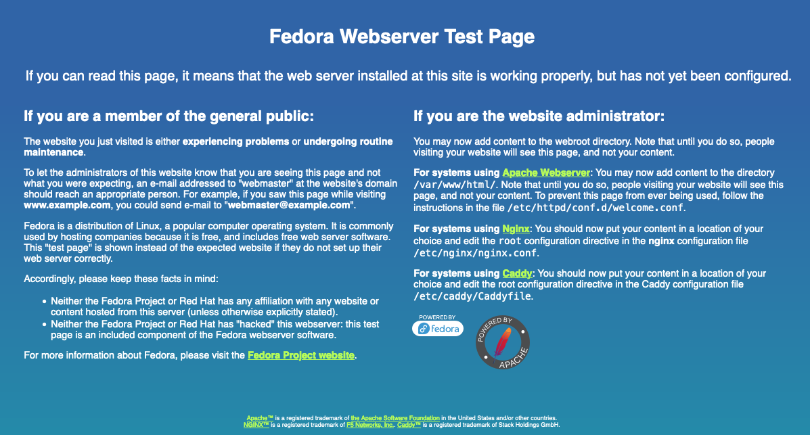
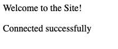

One of the most popular open-source web development platforms is the Linux-based [*LAMP Stack*](https://en.wikipedia.org/wiki/LAMP_(software_bundle)). It provides all the essential components to host dynamic websites and web applications. This guide explains how to install and test a LAMP stack on Fedora 38, as well as compatible RHEL-based distributions like **AlmaLinux 9** and **Rocky Linux 9**.

## What is a LAMP Stack?

The LAMP stack is a foundational architecture for open source web development on Linux systems. It includes four core components: Linux, [Apache](https://httpd.apache.org/), [MySQL](https://dev.mysql.com/) or [MariaDB](https://mariadb.com/), and [PHP](https://www.php.net/), [Perl](https://www.perl.org), or [Python](https://www.python.org). This stack supports a wide range of modern websites and applications, including WordPress.

The main components are:

-   **Linux**: A free and open source UNIX-based operating system. It is available in several distinct implementations, called *distributions*. This guide uses Fedora 38, a cutting-edge distribution with frequent updates. The same instructions apply to AlmaLinux 9 and Rocky Linux 9, which are binary-compatible with Red Hat Enterprise Linux (RHEL). Each distribution of Linux has its own software library which includes the other LAMP stack components.

-   **Apache**: A widely used open source web server. Apache provides the core tools to host web sites and supports additional features through optional modules such as authentication and programming language APIs.

-   **MariaDB/MySQL**: Both are open source *relational database management systems* (RDBMS). MariaDB, a fork of MySQL, offers improved performance and additional features. Either can serve as the database layer in a LAMP stack.

-   **PHP/Perl/Python**: PHP is the most common server-side scripting in LAMP environments. It integrates easily with HTML and powers many popular web applications. PHP is available for free under the PHP License. See the [PHP documentation](https://www.php.net/docs.php) for usage instructions. Perl and Python are supported alternatives.

All components are available through Fedora 38's default software repositories.

## Before You Begin

1.  Before installing the LAMP stack, make sure you have a Linode account and an active Compute Instance. Refer to our [Getting Started with Linode](/docs/products/platform/get-started/) and [Creating a Compute Instance](/docs/products/compute/compute-instances/guides/create/) guides.

1.  Next, follow the [Setting Up and Securing a Compute Instance](/docs/products/compute/compute-instances/guides/set-up-and-secure/) guide to update your system. You may also want to set the timezone, configure the hostname, create a limited user account, and harden SSH access.


This guide assumes you're using a non-root user. Commands that require elevated privileges are prefixed with `sudo`. If you are not familiar with the `sudo` command, see our [Linux Users and Groups](/docs/guides/linux-users-and-groups/) guide.

**Note:**
The commands, file contents, and configuration examples may include placeholders such as domain names, IP addresses, usernames, and passwords. Refer to the table below to replace these values with your own:

| Placeholders: | Replace With: |
| -- | -- |
| `EXAMPLE_DOMAIN`| Your custom domain name. |
| `EXAMPLE_USER` | Your MariaDB (or MySQL) username. |
| `EXAMPLE_PASSWORD`| Your MariaDB (or MySQL) user password. |
| `RELEASE_NUMBER` | The desired release number of PHP (optional). |


## How to Install a LAMP Stack on Fedora

These instructions are designed for Fedora 38, but most steps also apply to AlmaLinux 9 and Rocky Linux 9. Where necessary the guide includes  alternate commands for RHEL-based distributions.

### How to Install the Apache Web Server

1.  Update your system:

    ```command
    sudo dnf upgrade --refresh
    ```

1.  Install Apache:

    ```command
    sudo dnf install httpd -y
    ```

1.  Enable and start Apache. (The `enable` command automatically launches Apache when the system reboots.)

    ```command
    sudo systemctl enable httpd
    sudo systemctl start httpd
    ```

1.  Verify Apache is running:

    ```command
    systemctl status httpd
    ```

```output
    ● httpd.service - The Apache HTTP Server
        Loaded: loaded (/usr/lib/systemd/system/httpd.service; enabled; preset: disabled)
        Drop-In: /usr/lib/systemd/system/service.d
                └─10-timeout-abort.conf
        Active: active (running) since Mon 2023-08-28 12:20:09 EDT; 47s ago
```

    Press <kbd>Q</kbd> to exit the `systemctl status` output and return to the terminal prompt.

1.  Configure the firewall settings to allow HTTP and HTTPS traffic:

    ```command
    sudo firewall-cmd --permanent --add-service=http
    sudo firewall-cmd --permanent --add-service=https
    sudo firewall-cmd --reload
    ```

1.  Test Apache in a Browser

    Open a Web browser and navigate to your server's IP address. You should see the "Fedora Webserver Test Page". AlmaLinux and Rocky Linux display similar default pages.

    

    This indicates the web server is working but has not been fully configured yet. The AlmaLinux and Rocky Linux distributions have their own web server test pages which are similar but slightly different.

    **Note:**
    If the page doesn't load, *Security-Enhanced Linux* (SELinux) may be blocking access. Fedora uses SELinux in enforcing mode by default which is the fairly restrictive. You can temporarily switch to `permissive` mode for troubleshooting:

    ```command
    sudo setenforce 0
    ```
    To make this change persistent (not recommended for production), edit the SELinux config:

    ```
    sudo sed -i 's/^SELINUX=.*/SELINUX=permissive/g' /etc/selinux/config
    ```


    
    If your domain name points to the server, it can be added to the `/etc/httpd/conf/httpd.conf` file for better performance.

    1.  Open the `/etc/httpd/conf/httpd.conf` in a text editor with root permissions:

        ```command
        sudo nano /etc/httpd/conf/httpd.conf
        ```

    2.  Add the following lines at the end of file, replacing `EXAMPLE_DOMAIN` with your fully-qualified domain:

        ```file {title="/etc/httpd/conf/httpd.conf"}
        ServerAdmin admin@EXAMPLE_DOMAIN
        ServerName  EXAMPLE_DOMAIN:80
        ```

    3.  To save and exit, press <kbd>CTRL</kbd>+<kbd>X</kbd>, then <kbd>Y</kbd> then <kbd>Enter</kbd>.

    4.  Restart the Apache web server:

        ```command
        sudo systemctl restart httpd
        ```

    5.  Open a Web browser and navigate to your domain name. The browser should now display the default Fedora web server page.
    

### How to Install the MariaDB Database

This guide installs MariaDB, a drop-in replacement for MySQL and the default database in Fedora 38. MariaDB is widely adopted and offers improved performance and additional features compared to the original MySQL application. While the LAMP stack can also use MySQL, MariaDB is fully compatible and recommended for Fedora-based systems.


If you prefer to use MySQL instead of MariaDB, install it with: `sudo dnf install mysql-server`.
Then follow the same steps to enable, start, and secure the database.
Before running `mysql_secure_installation`, you may need to set a root password manually.

```command
1  sudo mysql
2  ALTER USER 'root'@'localhost' IDENTIFIED BY 'your_secure_password';
3  FLUSH PRIVILEGES;
4  EXIT;
5



1.  Install the MariaDB server:

    ```command
    sudo dnf install mariadb-server -y
    ```

1.  Enable and start MariaDB:

    ```command
    sudo systemctl enable mariadb
    sudo systemctl start mariadb
    ```

1.  Check status to confirm it is `active`:

    ```command
    sudo systemctl status mariadb
    ```

    ```output
    ● mariadb.service - MariaDB 10.5 database server
         Loaded: loaded (/usr/lib/systemd/system/mariadb.service; enabled; preset:>
        Drop-In: /usr/lib/systemd/system/service.d
                 └─10-timeout-abort.conf
         Active: active (running) since Mon 2023-08-28 13:20:57 EDT; 24s ago
    ```

    Depending on your system, output may show MariaDB 10.11.
    Press the <kbd>Q</kbd> key to exit the status output and return to the terminal prompt.

1.  To secure the database, use the interactive `mysql_secure_installation` utility:

    ```command
    sudo mysql_secure_installation
    ```

    Provide the following responses to the questions in the script:

    -   For `Enter current password for root`, press the <kbd>Enter</kbd> key. Because the command is run using `sudo` privileges, a password is not required.
    -   For `Switch to unit_socket authentication`, answer <kbd>n</kbd>.
    -   For `Change the root password?`, answer <kbd>n</kbd>. It is safe to permit local `sudo` access with the standard `root` password.
    -   For `Remove anonymous users?`, answer <kbd>y</kbd>.
    -   For `Disallow root login remotely?`, answer <kbd>y</kbd>`.
    -   For `Remove test database and access to it?`, answer <kbd>y</kbd>.
    -   For `Reload privilege tables now?`, answer <kbd>y</kbd> to apply the changes.

1.  Access the database using `sudo`:

    ```command
    sudo mysql
    ```

    MariaDB displays background information about the application along with the `>` prompt and may show a newer version, 10.11:

    ```output
    Welcome to the MariaDB monitor.  Commands end with ; or \g.
    Your MariaDB connection id is 9
    Server version: 10.11.6-MariaDB MariaDB Server

    Copyright (c) 2000, 2018, Oracle, MariaDB Corporation Ab and others.

    Type 'help;' or '\h' for help. Type '\c' to clear the current input statement.

    MariaDB [(none)]>
    ```

1.  Create the `webdata` database and a user account for web application access. In the `CREATE USER` query, provide a secure password in place of `EXAMPLE_PASSWORD` and a more meaningful username in place of `EXAMPLE_USERNAME`. Finally, grant full rights to the user.

    ```command
    CREATE DATABASE webdata;
    CREATE USER 'EXAMPLE_USERNAME'@'localhost' IDENTIFIED BY 'EXAMPLE_PASSWORD';
    GRANT ALL PRIVILEGES ON webdata.* TO 'EXAMPLE_USERNAME'@'localhost';
    FLUSH PRIVILEGES;
    ```

    MySQL should respond with `Query OK` after each line.

1.  Exit the SQL shell and return to the terminal prompt:

    ```command
    quit
    ```

### How to Install PHP

Fedora 38 includes PHP 8.2 in its default repositories. If you want to install the latest stable version of PHP (such as PHP 8.3 or 8.4), you can use the Remi repository, which is a trusted third-party source for up-to-date PHP packages.

1.  Option 1: Install PHP 8.2 component, (Default Fedora Package)
This includes the `php-mysqlnd` package for database integration):

    ```command
    sudo dnf install -y php php-mysqlnd
    ```
**Note:** This version is maintained by the Fedora project and may not include the latest PHP features. To learn more: [Fedora PHP Packages}(https://packages.fedoraproject.org/pkgs/php/)

1.  Option 2: Install the Latest PHP Version (via Remi Repository)

To install PHP 8.3 or 8.4, enable the Remi repository and select the desired PHP module:

```command
   sudo dnf install -y https://rpms.remirepo.net/fedora/remi-release-38.rpm
   sudo dnf module reset php
   sudo dnf module enable php:remi-8.3
   sudo dnf install php php-mysqlnd
```
This includes the php-mysqlnd package, which enables PHP to communicate with MySQL and MariaDB databases.

**Note:** PHP 8.3 and 8.4 are stable and production-ready. These versions are not available in Fedora's default repositories and must be installed via Remi.

1.  **Optional:** Install a selection of other commonly-used PHP extensions. Different applications might require additional PHP packages. Consult the application documentation for details.

    
    
    ```command
    sudo dnf install php-cli php-gettext php-mbstring php-pear php-curl php-gd php-xml php-bcmath php-zip php-json -y
    ```
    
    
    ```command
    sudo dnf install php-cli php-gettext php-mbstring php-pear php-curl php-gd php-xml php-bcmath php-zip php-json -y
    ```
    
    

    1.  Verify the PHP release to confirm a successful installation:

    ```command
    php -v
    ```

    On Fedora, the current PHP release is `8.2.9`. AlmaLinux and Rocky Linux currently install release `8.0.27`.

    ```output
    PHP 8.2.9 (cli) (built: Aug  3 2023 11:39:08) (NTS gcc x86_64)
    Copyright (c) The PHP Group
    Zend Engine v4.2.9, Copyright (c) Zend Technologies
        with Zend OPcache v8.2.9, Copyright (c), by Zend Technologies
    ```

    
    To determine if a more recent release of PHP is available, use the command `dnf module list php`. To select a non-default release, use the command `dnf module enable php:RELEASE_NUMBER`. Substitute the desired release number for `RELEASE_NUMBER`.
    

1.  Restart Apache to activate the PHP Apache API:

    ```command
    sudo systemctl restart httpd
    ```

## How to Verify the LAMP Stack Installation

To verify the stack components, embed a PHP code block containing a database connection inside an HTML page. PHP code can be integrated into an HTML page. PHP code can be integrated into an HTML file using the <?php tag. The PHP code block can then connect to an SQL-based database using the `mysqli_connect` command. Provide the appropriate database credentials to connect.

To fully test all components of the LAMP stack, follow the steps below.

1.  Change into the `var/www/html` directory and create a new `phptest.php` file:

    ```command
    cd /var/www/html
    sudo nano phptest.php
    ```

1.  Add the following contents to the file. Ensure the `servername` variable is set to `localhost`. Replace `EXAMPLE_USERNAME` and `EXAMPLE_PASSWORD` with the credentials for the database web user account.

    ```file {title="/var/www/html/phptest.php" lang="php" hl_lines="10-11"}
    <html>
        <head>
            <title>PHP Test</title>
        </head>
        <body>
            <?php echo '<p>Welcome to the Site!</p>';

            // When running this script on a local database, the servername must be 'localhost'. Use the name and password of the web user account created earlier. Do not use the root password.
            $servername = "localhost";
            $username = "EXAMPLE_USERNAME";
            $password = "EXAMPLE_PASSWORD";

            // Create MySQL connection
            $conn = mysqli_connect($servername, $username, $password);

            // If the conn variable is empty, the connection has failed. The output for the failure case includes the error message
            if (!$conn) {
                die('<p>Connection failed: </p>' . mysqli_connect_error());
            }
            echo '<p>Connected successfully</p>';
            ?>
        </body>
    </html>
    ```

    When done, press <kbd>CTRL</kbd>+<kbd>X</kbd>, followed by <kbd>Y</kbd> then <kbd>Enter</kbd> to save the file and exit `nano`.

1.  Run the LAMP stack script test. Open a Web browser and navigate to either the IP address or the domain name followed by `/phptest.php`. For example, `http://example.com/phptest.php`, but replace `example.com` with your actual domain name or IP address.

1.  If the test is successful, the browser displays `connected successfully` message:

    

    
    If the page displays the `Connection failed` message, verify the database credentials and try again. If an HTML error occurs, ensure the contents of the sample file are complete and correct. To isolate the PHP functionality, replace the contents between <?php and ?> with `phpinfo();`. This command displays information about the PHP installation and confirms if PHP is working.
    

## Additional LAMP Stack Production Considerations

The previous instructions are sufficient for small personal sites. However, commercial sites might require additional configuration. Here are some other issues to potentially consider.

1.  The database is not currently remotely accessible. To access MariaDB through the firewall, use the following commands:

    ```command
    sudo firewall-cmd --add-service=mysql --permanent
    sudo firewall-cmd --reload
    ```

1.  To run multiple sites from the same server, configure a virtual host for each site. This is considered a more professional configuration even for a single site.

    Configure a virtual host, add a new directory at `/var/www/html/EXAMPLE_DOMAIN/public_html`. Replace `EXAMPLE_DOMAIN` with the actual domain name. Add the website files to this directory. Then edit the file at `/etc/httpd/conf/httpd.conf` to add the virtual hosts. Each virtual host must define a `DocumentRoot`, `ServerName`, and `ServerAdmin`.

    Consult the [Apache Virtual Host documentation](https://httpd.apache.org/docs/current/vhosts/) for more information.

1.  Secure and Optimize MariaDB: After installation, it's important to run `mysql_secure_installation` to remove insecure defaults and set a root password. For production environments, consider configuring `bind-address` in the MariaDB configuration file (typically `/etc/my.cnf.d/mariadb-server.cnf` or `/etc/mysql/mariadb.conf.d/50-server.cnf`) to restrict remote access. You can also improve performance by tuning settings like `innodb_buffer_pool_size, query_cache_size,` and `max_connections` based on your server's workload and available memory.

1.  To remove the default welcome page, edit the file `/etc/httpd/conf.d/welcome.conf` and comment out all directives using the `#` symbol.

## Conclusion

The Fedora LAMP stack consists of the Linux operating system, Apache web server, the MariaDB/MySQL database, and the PHP/Perl/Python programming language. Together, this architecture is suitable for most modern computing environments. All LAMP components are available in the standard Fedora package library and are installed using `dnf`. To test the stack, configure a database for the web user and create a simple script using HTML and PHP.
