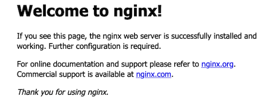
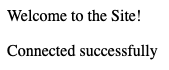

Many [Ubuntu](https://ubuntu.com/server) systems use the well-known [LAMP Stack](https://en.wikipedia.org/wiki/LAMP_(software_bundle)) installation. However, many people consider the *LEMP Stack* to be an even better alternative. A LEMP stack uses the [NGINX web server](https://www.nginx.com/) instead of Apache. This guide explains how to install and configure a LEMP stack on Ubuntu 22.04 LTS. It also provides some background about the LEMP stack and how it contrasts with a LAMP stack.

## What is a LEMP Stack?

The Ubuntu LEMP stack serves as a substitute for the original LAMP Stack. Both stacks consist of the Linux operating system, a web server, a database, and a programming/scripting language. Both stacks allow users to host web applications and implement a fully-functional programming environment. Additionally, the main components of both the LAMP and LEMP stacks can be installed using the default Ubuntu software repository.

The original LAMP Stack includes Linux, [Apache](https://httpd.apache.org/docs/2.4/), [MySQL](https://dev.mysql.com/), and [PHP](https://www.php.net/). The Ubuntu LEMP stack alternative continues to use Linux and PHP, but it includes the NGINX web server instead of Apache. In most cases, a LEMP stack uses the [MariaDB](https://mariadb.org/) database, although MySQL can also be used. In addition, other programming languages are sometimes used instead of PHP.

The LEMP stack consists of the following components:

-   **Linux**: Linux is a free and open source operating system originally based on UNIX. Ubuntu is one of several different Linux implementations, which are known as distributions. Some of the other popular distributions include Debian, Red Hat, and Arch. Each distribution of Linux has its own software library, which is used to install other applications. All of the LEMP stack components are part of the standard Ubuntu library.
-   **NGINX Server**: NGINX is one of the most popular open source web servers. NGINX is pronounced "Engine-x". (This is why **E** is used for the LEMP stack acronym.) NGINX uses an event-driven architecture instead of Apache's process/thread orientation. NGINX is faster and more efficient than Apache, but does not allow site-by-site configuration. It is not as widely deployed as Apache.
-   **Maria DB**: MariaDB is a *relational database management system* (RDBMS) that is a fork of the MySQL application. It is an open source software application developed by the MariaDB Foundation and is available at no cost. Unlike MySQL, which is owned by Oracle, MariaDB more closely follows the open source philosophy. MariaDB is similar to MySQL and uses the same SQL commands and queries. However, MariaDB has more new features and is considered somewhat superior to MySQL in terms of performance and usability.
-   **PHP**: The PHP language is used within the stack for server-side scripting and programming. PHP is frequently used to build websites because PHP code can be efficiently embedded within HTML files. Ubuntu interprets PHP code using a PHP processor. Users can install and use PHP software for free under the PHP License. In lieu of PHP, developers can opt to use Perl or Python instead. All three options work well with the rest of the LEMP stack. However, this guide focuses strictly on PHP.

## Before You Begin

1.  If you have not already done so, create a Linode account and Compute Instance. See our [Getting Started with Linode](/docs/products/platform/get-started/) and [Creating a Compute Instance](/docs/products/compute/compute-instances/guides/create/) guides.

1.  Follow our [Setting Up and Securing a Compute Instance](/docs/products/compute/compute-instances/guides/set-up-and-secure/) guide to update your system. You may also wish to set the timezone, configure your hostname, create a limited user account, and harden SSH access.


This guide is written for a non-root user. Commands that require elevated privileges are prefixed with `sudo`. If you are not familiar with the `sudo` command, see the [Users and Groups](/docs/guides/linux-users-and-groups/) guide.


## How to Install LEMP Stack on Ubuntu

This section explains how to install and configure the LEMP Stack on Ubuntu 22.04 LTS. However, the instructions for the Ubuntu 20.04 LTS release are very similar. The LEMP stack is not available through Tasksel, so the individual components must be installed separately.


These instructions apply with or without a registered domain name. If the server is hosting a domain, a virtual host must be configured. For more information about domain names and how to point the domain to a Linode, consult the [Linode DNS Manager guide](/docs/products/networking/dns-manager/).


The various LEMP stack components can be installed using the `apt` utility. To install the LEMP stack, follow these steps. In all cases, enter `y` to proceed with the installation when Ubuntu asks for confirmation.

1.  Use `apt` to update the Ubuntu packages.

    ```command
    sudo apt update && sudo apt upgrade
    ```

2.  Install the NGINX server.

    ```command
    sudo apt install nginx
    ```

3.  Confirm NGINX is properly running using the `systemctl` utility.

    ```command
    sudo systemctl status nginx
    ```

    
nginx.service - A high performance web server and a reverse proxy server
     Loaded: loaded (/lib/systemd/system/nginx.service; enabled; vendor preset: enabled)
     Active: active (running) since Mon 2022-05-16 16:07:47 UTC; 1h 12min ago
    

4.  Install the MariaDB database.

    ```command
    sudo apt install mariadb-server
    ```

5.  Install the PHP module for MariaDB/MySQL support.

    
Do not install the main `php` module because it is optimized for Apache. PHP support for NGINX is installed later.


    ```command
    sudo apt install php-mysql
    ```

6.  Install the PHP FastCGI Processing Manager. This includes all the PHP packets necessary for NGINX support, along with other core dependencies.

    ```command
    sudo apt install php-fpm
    ```

7.  **(Optional)** Other applications, including WordPress, require additional PHP components. The following optional packages are frequently helpful.

    ```command
    sudo apt install php-curl php-gd php-mbstring php-xml php-xmlrpc
    ```

## How to Configure a LEMP Stack on Ubuntu

At this point, all LEMP Stack components are installed, but the stack is not yet ready to use. The individual elements must be configured or enabled. Each component can immediately be configured after installation, but it's usually easier to install all the applications first and configure them later. The following sections explain how to configure a LEMP stack on Ubuntu 22.04.

### Configuring the NGINX Web Server and Creating a Site Configuration File

NGINX is easier to configure than some other web servers. However, the firewall settings must be configured to allow web access through both HTTP and HTTPS. Additionally, creating a site configuration file in NGINX is highly recommended, even if only one site is hosted on the server. If multiple sites are being hosted, a site configuration file is mandatory. To finish setting up NGINX, follow these steps.

1.  Configure the `ufw` firewall so it accepts NGINX connections. Allow the `Nginx Full` profile, which permits both HTTP and HTTPS connections. Ensure `OpenSSH` connections are also allowed. Enable `ufw` when all changes are complete.

    
The `Nginx Full` profile allows both HTTP and HTTPS traffic. To temporarily limit firewall access to HTTP requests, allow the `Nginx HTTP` profile instead. The `Nginx HTTPS` setting limits firewall access to HTTPS traffic only. You must configure HTTPS on the server before applying this profile.
    

    ```command
    sudo ufw allow OpenSSH
    sudo ufw allow in "Nginx Full"
    sudo ufw enable
    ```

2.  Verify the firewall settings using the `ufw status` command.

    ```command
    sudo ufw status
    ```

    
Status: active

To                         Action      From
--                         ------      ----
OpenSSH                    ALLOW       Anywhere
Nginx Full                 ALLOW       Anywhere
OpenSSH (v6)               ALLOW       Anywhere (v6)
Nginx Full (v6)            ALLOW       Anywhere (v6)
    

3.  After configuring the firewall, ensure NGINX allows web access. Using a browser, visit the IP address of the web server. The site displays the default NGINX welcome page. The page includes the message "Welcome to nginx!"

    ```command
    http://server_IP_address/
    ```

    
To determine the IP address of the Ubuntu system, use the Linode Dashboard.
    

    

4.  Create a root `public_html` directory for the site. Create this directory within the `/var/www/html/domain_name` directory, where `domain_name` is the name of the site. In the following command, replace `example.com` with the actual name of the domain.

    ```command
    sudo mkdir -p /var/www/html/example.com/public_html
    ```

5.  It is simpler to base the site configuration file on the default NGINX welcome page. Copy over the default NGINX configuration file to `/etc/nginx/sites-available/example.com.conf`. Replace `example.com` with the name of the domain. The new configuration file must be named after the domain and have the `.conf` extension.

    ```command
    sudo cp /etc/nginx/sites-enabled/default /etc/nginx/sites-available/example.com.conf
    ```

6.  Edit the `.conf` file for the domain, making the following changes. A line-by-line description is as follows:

    -   Delete the existing uncommented `server` configuration all the way to the line `Virtual Host configuration for example.com`. Change the name of the comment to reflect the name of the domain. Uncomment the remaining lines. All further changes occur inside the remaining code block beginning with `server`.
    -   Leave the `listen` configuration in place. These lines tell NGINX to listen for incoming connections on port `80`.
    -   Change the value for `server_name` to the name of the domain. Enter the domain name with and without the `www` prefix so visitors can use either alternative.
    -   Set `root` to the name of the newly-created root directory for the domain. For `example.com`, this is `/var/www/html/example.com/public_html`.
    -   For most sites, the value of `index` should be `index.html`. However, for WordPress and other sites that use PHP, it must be changed to `index.php`.
    -   The block starting with `location /` should remain unchanged. The `try_files` configuration instructs NGINX to verify the requested file actually exists before processing the request. If the file does not exist, NGINX returns a `404` error.
    -   Add a code block for `location  ~* \.php$`. NGINX applies this configuration to all domain files with the `php` extension. The `*` symbol indicates PHP file names are not case sensitive.
    -   Change the name of `fastcgi_pass` to indicate the socket where PHP should listen to new requests. This is found at `unix:/run/php/php<release_num>-fpm.sock`, where `release_num` is the PHP release number. For instance, if PHP release `8.1` is installed, `fastcgi_pass` should be `unix:/run/php/php8.1-fpm.sock`. To determine the PHP release, use the command `php -v`.
    -   Set the `include` directive to `snippets/fastcgi-php.conf`. This is the name of the configuration file that handles PHP processing.
    -   Add a `location` block for `~ /\.ht`. This tells NGINX not to serve any `.htaccess` files.

    Here is an example of a domain configuration file. Replace `example.com` with the name of the actual domain wherever it occurs.

    ```file {title="/etc/nginx/sites-available/example.com.conf" lang="aconf"}
    server {
        listen 80;
        listen [::]:80;

        server_name example.com www.example.com;
        root /var/www/html/example.com/public_html;
        index index.html;

        location / {
            try_files $uri $uri/ =404;
        }

        location ~ \.php$ {
            fastcgi_pass unix:/var/run/php/php8.1-fpm.sock;
            include snippets/fastcgi-php.conf;
        }

        location ~ /\.ht {
            deny all;
        }
    }
    ```

7.  To enable the site, create a link to the domain configuration file from the `sites-enabled` directory. In the following command, replace `example.com` with the name of the domain.

    ```command
    sudo ln -s /etc/nginx/sites-available/example.com.conf /etc/nginx/sites-enabled/
    ```

8.  **(Optional)** For enhanced security, unlink the default site.

    ```command
    sudo unlink /etc/nginx/sites-enabled/default
    ```

9.  Validate the changes using the `nginx -t` command. If the test command finds any errors, inspect the new file and make any necessary adjustments.

    ```command
    sudo nginx -t
    ```

    
nginx: the configuration file /etc/nginx/nginx.conf syntax is ok
nginx: configuration file /etc/nginx/nginx.conf test is successful
    

Product documentation about NGINX can be found on the [NGINX Docs page](https://docs.nginx.com/).

### Configuring the MariaDB Database

The MariaDB database is ready to use. However, a new database user has to be created for the web application. It is also important to tighten application security. To finish configuring MariaDB, follow these steps.

1.  Log in to the MariaDB shell as the `root` user. The application displays the `MariaDB` prompt.

    ```command
    sudo mysql -u root
    ```

    
Welcome to the MariaDB monitor.  Commands end with ; or \g.
Your MariaDB connection id is 31
Server version: 10.6.7-MariaDB-2ubuntu1 Ubuntu 22.04
...
MariaDB [(none)]
    

2.  Create the `webdata` database.

    ```command
    CREATE DATABASE webdata;
    ```

3.  Use the `CREATE USER` command to add a new "web application" user. Provide a more secure user name and password in place of `webuser` and `password` in the query.

    ```command
    CREATE USER 'webuser' IDENTIFIED BY 'password';
    ```

4.  Grant full rights to the new user. MariaDB should respond with `Query OK` after each line. Use the following SQL commands to configure the database.

    ```command
    GRANT ALL ON webdata.* TO 'webuser';
    ```

5.  Exit the database shell.

    ```command
    quit
    ```

6.  Use the built-in [mysql_secure_installation](https://mariadb.com/kb/en/mysql_secure_installation/) tool to increase the security of the database.

    ```command
    sudo mysql_secure_installation
    ```

7.  It is not necessary to switch over to Unix socket authentication. It is also not necessary to change the root password, and it is safe to leave this field blank when prompted. However, answer `Y` to the following questions:

    -   `Remove anonymous users?`
    -   `Disallow root login remotely?`
    -   `Remove test database and access to it?`
    -   `Reload privilege tables now?`

For further information about MariaDB, consult the [MariaDB Server Documentation](https://mariadb.com/kb/en/documentation/).

## Configuring PHP

PHP does not require any further configuration. However, an extra security measure should be applied. The following command ensures PHP only accepts requests for files that actually exist on the server. Otherwise, it can be tricked into executing malicious code. In the following command, use the socket for the installed release of PHP. This example demonstrates how to apply the configuration for PHP 8.1. If another release of PHP is installed, replace `8.1` with the actual release number.

```command
sudo sed -i 's/;cgi.fix_pathinfo=1/cgi.fix_pathinfo=0/g' /etc/php/8.1/fpm/php.ini
```

For more reference material on how to use PHP, consult the [PHP Documentation Site](https://www.php.net/docs.php).

## Testing the LEMP Stack Installation on the Ubuntu Server

In addition to verifying the web server works properly, it is critical to test the virtual host configuration, PHP integration, and the MariaDB database. This is the only way to confirm all components can interact together.

The easiest way to verify an Ubuntu LEMP stack installation is with a short test script. This script must be placed somewhere within the `DirectoryRoot` directory.

The PHP test code must initiate a connection to MariaDB using the `mysqli_connect` function. Use the username and the password for the account created in the **Configuring the MySQL Database** section. If the connection is successful, the function returns a `Connection` object. The script provides information about the status of the connection attempt along with details about any failures.

To validate the installation, follow these steps.

1.  Restart the `PHP` module. The name of the module consists of `php`, the major and minor release of PHP, and `-fpm`. The following command starts the PHP 8.1 module. Replace `8.1` with the release number of the local PHP installation.

    ```command
    sudo systemctl restart php8.1-fpm
    ```

2.  Reload NGINX to apply the changes.

    ```command
    sudo nginx -s reload
    ```

3.  Confirm NGINX is still running properly using `systemctl status`.

    ```command
    sudo systemctl status nginx
    ```

    
nginx.service - A high performance web server and a reverse proxy server
    Loaded: loaded (/lib/systemd/system/nginx.service; enabled; vendor preset: enabled)
    Active: active (running) since Mon 2022-05-16 16:07:47 UTC; 1 day 20h ago
    

    
If NGINX has failed or is `dead`, use the `sudo nginx -t` command to find configuration errors.
    

4.  Create a test file named `phptest.php` in the `public_html` directory for the domain. Set `servername` to `localhost` and ensure the `username` and `password` match the authentication details for the MariaDB web user account.

    ```file {title="/var/www/html/example.com/public_html/phptest.php" lang="php"}
    <html>
    <head>
        <title>PHP Test</title>
    </head>
        <body>
        <?php echo '<p>Welcome to the Site!</p>';

        // The servername must be 'localhost'. Use the name and password of the web user account created earlier. Do not use the root password.
        $servername = "localhost";
        $username = "webuser";
        $password = "password";

        // Create MySQL connection
        $conn = mysqli_connect($servername, $username, $password);

        // If the conn variable is empty, the connection has failed. The output for the failure case includes the error message
        if (!$conn) {
            die('<p>Connection failed: </p>' . mysqli_connect_error());
        }
        echo '<p>Connected successfully</p>';
        ?>
    </body>
    </html>
    ```

5.  Execute the test script using a web browser. In the address bar, enter the domain name followed by `/phptest.php`. In the following example, substitute the actual name of the domain for `example.com`.

    ```command
    http://example.com/phptest.php
    ```

6.  If everything is installed correctly, the browser should display the text `Welcome to the Site!` and `Connected successfully`. If you see the `Connection Failed:` message, review the SQL error information to debug the problem. See the **Troubleshooting** section for more information.

    

7.  **(Optional)** Alternatively, `curl` can be used to test the script. This method can be used if the DNS entry for the domain has not propagated yet. Replace `example.com` with the name of the domain, and `server-ip-address` with the IP address of the Linode. The output is formatted as HTML code, but it is reasonably easy to determine the outcome.

    ```command
    curl -H "Host: example.com" http://<server-ip-address>/phptest.php
    ```

    
<html>
<head>
    <title>PHP Test</title>
</head>
    <body>
    <p>Welcome to the Site!</p><p>Connected successfully</p></body>
</html>
    

8.  When testing is complete, remove the test script.

    ```command
    sudo rm /var/www/html/example.com/public_html/phptest.php
    ```

## Troubleshooting the Ubuntu LEMP Stack Installation

It is not uncommon to have issues with a new Ubuntu LEMP Stack installation. It is easy to overlook a command or make a mistake with a configuration file. Keep testing as you proceed to quickly find any errors. For instance, visit the IP address of the Ubuntu system immediately after configuring and enabling NGINX.

Here are a few things to consider if the LEMP Stack test script does not work.

-   **Verify NGINX is running**: NGINX might have failed upon a reload or configuration change. Confirm the web server is `active` and restart it if necessary.

    ```command
    sudo systemctl status nginx
    ```

    ```command
    sudo systemctl restart nginx
    ```

-   **Confirm name of the domain and IP address of the server**: If the browser times out, it could be due to an incorrect address or domain name. Confirm and test the IP address first, then visit the domain name. Ensure a DNS record for the domain has been created. The record can take up to one full day to propagate, so try using `curl` in this case.
-   **Confirm the MariaDB configuration**: A database and database user must be created in MariaDB. Ensure the `webdata` database exists and the web user is granted all database rights.
-  **Review all configuration files**: A common source of errors is incorrect information in the `/etc/nginx/sites-available/example.com.conf` file. Ensure the domain specified for the `server_name` is spelled correctly and the `root` matches the root directory for the site. Verify the `location` block for `\.php` is configured and the `fastcgi_pass` variable is correct.
-   **Verify the test script is in the proper directory**: PHP has been configured to reject requests for non-existent files. So if the test script is in a different location or has a different name, NGINX should return an error.
-   **Confirm the username and password in the test script**: The connection to the database can fail due to a wrong server name, password, or user ID. Look for missing or incorrect information in the script.
-   **Review all installation instructions**: It is easy to overlook an important step. Missing PHP modules often cause confusing failures.

## A Summary of How to Install a LEMP Stack on Ubuntu

The Ubuntu LEMP Stack includes the operating system, NGINX web server, MariaDB relational database, and the PHP programming language. A server configured with these free and open source applications can host a modern website and support a rich programming environment. The LEMP stack elements are easy to install and work well together with little extra configuration.

After configuring the LEMP stack on Ubuntu, it is good practice to create an NGINX configuration file for the domain. Create a new database and user account on MariaDB for the website to use and install additional PHP packages for full integration. Test the new installation using a short PHP test script that connects to the database. For more information about each LEMP Stack component, see the **More Information** section for this guide.