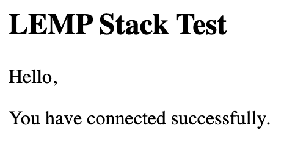

<!--  -->

## What is the LEMP Stack?

The LAMP stack (Linux, Apache, MariaDB, and PHP) is a popular server configuration for developing and hosting web applications. The four components of the stack are not tightly coupled, making it possible to substitute your preferred technologies. The **LEMP** stack is a common variant in which the Apache web server is replaced by NGINX, pronounced "engine-x", thus providing the "E".

## Before You Begin

1.  If you have not already done so, create a Linode account and Compute Instance. See our [Getting Started with Linode](/docs/guides/getting-started/) and [Creating a Compute Instance](/docs/guides/creating-a-compute-instance/) guides.

1.  Follow our [Setting Up and Securing a Compute Instance](/docs/guides/set-up-and-secure/) guide to update your system. You may also wish to set the timezone, configure your hostname, create a limited user account, and harden SSH access.

If you have a registered domain name for your website, then [add the domain](/docs/guides/dns-manager/#add-a-domain) to the Linode server on which you plan to install the LEMP stack. If you do not have a registered domain name, then replace `example.com` with the IP address of the Linode server in the following instructions.

## Installation

### NGINX

1.  Install NGINX from the package repository:

        sudo dnf install nginx

1.  Enable and start the NGINX service:

        sudo systemctl enable nginx
        sudo systemctl start nginx

### MariaDB

MariaDB is a popular fork of MySQL, and its development is considered to be more open and transparent than MySQL's. MariaDB is administered with the same commands as MySQL.

1.  Install the MariaDB server and MySQL/MariaDB-PHP support:

        sudo dnf install mariadb-server php-mysqlnd

1.  Set MariaDB to start at boot and start the daemon for the first time:

        sudo systemctl enable mariadb.service
        sudo systemctl start mariadb.service

1.  Log in to MariaDB's SQL shell:

        mysql -u root

3.  Create a test database and user with access permission. Replace `testdb` and `testuser` with appropriate names for your setup. Replace `password` with a strong password.

    
CREATE DATABASE testdb;
CREATE USER 'testuser' IDENTIFIED BY 'password';
GRANT ALL PRIVILEGES ON testdb.* TO 'testuser';


4.  Exit the SQL shell:

    
quit


5.  Use the *[mysql_secure_installation](https://mariadb.com/kb/en/library/mysql_secure_installation/)* tool to configure additional security options. This tool will ask if you want to set a new password for the MySQL root user, but you can skip that step:

        sudo mysql_secure_installation

    Answer **Y** at the following prompts:

    -  Remove anonymous users?
    -  Disallow root login remotely?
    -  Remove test database and access to it?
    -  Reload privilege tables now?

### PHP

1.  Install the PHP FastCGI Processing Manager, which includes the core PHP dependencies:

        sudo dnf install php-fpm

1.  Enable and start the php-fpm.service:

        sudo systemctl enable php-fpm.service
        sudo systemctl start php-fpm.service

1.  Change the default `user` in `/etc/php-fpm.d/www.conf` from `apache` to `nginx`:

    
…
; RPM: apache user chosen to provide access to the same directories as httpd
user = nginx
; RPM: Keep a group allowed to write in log dir.
group = nginx
…



1.  Tell PHP to only accept URIs for files that actually exist on the server. This mitigates a security vulnerability where the PHP interpreter can be tricked into allowing arbitrary code execution if the requested `.php` file is not present in the filesystem. See [this tutorial](https://www.nginx.com/resources/wiki/start/topics/tutorials/config_pitfalls/?highlight=pitfalls#passing-uncontrolled-requests-to-php) for more information about this vulnerability.

        sudo sed -i 's/;cgi.fix_pathinfo=1/cgi.fix_pathinfo=0/g' /etc/php.ini

## Set an NGINX Site Configuration File

1. Create a root directory where the site's content will live. Replace *example.com* with your site's domain.

        sudo mkdir -p /var/www/html/example.com/public_html

2. Assign the ownership of the directory to `$USER`:

        sudo chown -R $USER:$USER /var/www/html/example.com/public_html

1.  Use SELinux’s `chcon` command to change the file security context for web content, replace `example.com` with your domain name:

        sudo chcon -t httpd_sys_content_t /var/www/html/example.com -R
        sudo chcon -t httpd_sys_rw_content_t /var/www/html/example.com -R

3.  Update the document root location of the web content in `/etc/nginx/nginx.conf` file.

    
server {
    listen       80;
    listen       [::]:80;
    server_name  _;
    root         /var/www/html/example.com/public_html;

    # Load configuration files for the default server block.
    include /etc/nginx/default.d/*.conf;

    location / {
    }

    error_page 404 /404.html;
        location = /40x.html {
    }

    error_page 500 502 503 504 /50x.html;
        location = /50x.html {
    }



3.  Create a `example.com.conf` configuration file for your domain in `etc/nginx/conf.d` directory. Replace *example.com* with your domain in the contents of the file:

    
    server {
    listen         80;
    listen         [::]:80;
    server_name    example.com www.example.com;
    root           /var/www/html/example.com/public_html;
    index          index.html;

    location / {
      try_files $uri $uri/ =404;
    }
    location ~* \.php$ {
      fastcgi_pass unix:/run/php-fpm/www.sock;
      include         fastcgi_params;
      fastcgi_param   SCRIPT_FILENAME    $document_root$fastcgi_script_name;
      fastcgi_param   SCRIPT_NAME        $fastcgi_script_name;
    }
}



## Configure FirewallD

FirewallD is enabled for CentOS 8 Linodes, but HTTP and HTTPS are not included in the default set of services.

1. View the default set of services:

        sudo firewall-cmd --zone=public --list-services

    
cockpit dhcpv6-client ssh


1. To allow connections to NGINX, add HTTP and HTTPS as a service:

        sudo firewall-cmd --zone=public --add-service=http --permanent
        sudo firewall-cmd --zone=public --add-service=https --permanent
        sudo firewall-cmd --reload

In addition, if you plan to use any HTTPD scripts on the server, update the corresponding SELinux Boolean variable. To allow HTTPD scripts and modules to connect to the network, use `sudo setsebool -P httpd_can_network_connect on` command.

## Test the LEMP Stack

1. To ensure that your web server can be reached with your domain name, configure the [DNS records](/docs/guides/dns-manager/) for your domain to point to your Linode's IP address.

2.  Restart PHP and reload the NGINX configuration:

        sudo systemctl restart php-fpm
        sudo nginx -s reload

3.  Test the NGINX configuration:

        sudo nginx -t

4.  Create a test page to verify NGINX can render PHP and connect to the MariaDB database. Replace the `"testuser"` and `"password"` fields with the MariaDB credentials you created above.

    
<html>
<head>
    <h2>LEMP Stack Test</h2>
</head>
    <body>
    <?php echo '
Hello,
';

    // Define PHP variables for the MySQL connection.
    $servername = "localhost";
    $username = "testuser";
    $password = "password";

    // Create a MySQL connection.
    $conn = mysqli_connect($servername, $username, $password);

    // Report if the connection fails or is successful.
    if (!$conn) {
        exit('
Your connection has failed.
' .  mysqli_connect_error());
    }
    echo '
You have connected successfully.
';
    ?>
</body>
</html>



5.  Go to `http://example.com/test.php` in a web browser. It should report that *You have connected successfully*.

    

    If you see an error message or if the page does not load at all, re-check your configuration. If your DNS changes haven't propagated yet, you can test your page with `curl` instead:

        curl -H "Host: example.com" http://<your-ip-address>/test.php

    
<html>
<head>
    <h2>LEMP Stack Test</h2>
</head>
    <body>
    
Hello,

You have connected successfully.
</body>
</html>


6.  Remove the test file once the stack is working correctly:

        sudo rm /var/www/html/example.com/public_html/test.php

## Next Steps

For more on the software in this stack see the following guides:
- [Getting Started with NGINX](/docs/guides/getting-started-with-nginx-part-1-installation-and-basic-setup/)
- [Serve PHP with PHP-FPM and NGINX](/docs/guides/serve-php-php-fpm-and-nginx/)
