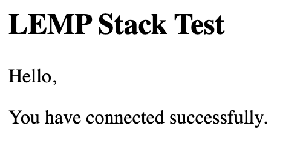

<!--  -->

## What is the LEMP Stack?

The LAMP stack (Linux, Apache, MariaDB, and PHP) is a popular server configuration for developing and hosting web applications. The four components of the stack are not tightly coupled, making it possible to substitute your preferred technologies. The **LEMP** stack is a common variant in which the Apache web server is replaced by NGINX, pronounced "engine-x", thus providing the "E".

## Before You Begin

1.  If you have not already done so, create a Linode account and Compute Instance. See our [Getting Started with Linode](/docs/guides/getting-started/) and [Creating a Compute Instance](/docs/guides/creating-a-compute-instance/) guides.

1.  Follow our [Setting Up and Securing a Compute Instance](/docs/guides/set-up-and-secure/) guide to update your system. You may also wish to set the timezone, configure your hostname, create a limited user account, and harden SSH access.

If you have a registered domain name for your website, then [add the domain](/docs/guides/dns-manager/#add-a-domain) to the Linode server on which you plan to install the LEMP stack. If you do not have a registered domain name, then replace `example.com` with the IP address of the Linode server in the following instructions.

## Installation

### NGINX

Install NGINX from the package repository:

    sudo apt install nginx

### MariaDB

MariaDB is a popular fork of MySQL, and its development is considered to be more open and transparent than MySQL's. MariaDB is administered with the same commands as MySQL.

1.  Install the MariaDB server and MySQL/MariaDB-PHP support:

        sudo apt install mariadb-server php-mysql

2.  Log in to MariaDB's SQL shell:

        sudo mysql -u root

    The database will not prompt you for a password, as it is initially configured to use the `unix_socket` authorization plugin. This authorization scheme allows you to log in to the database's root user as long as you are connecting from the Linux root user on localhost:

        SELECT user,host,authentication_string,plugin FROM mysql.user;

    
+------+-----------+-----------------------+-------------+
| user | host      | authentication_string | plugin      |
+------+-----------+-----------------------+-------------+
| root | localhost |                       | unix_socket |
+------+-----------+-----------------------+-------------+
1 row in set (0.00 sec)


    You can keep using the `unix_socket` plugin for the root user; this is considered a secure option for production systems, and it is needed for certain Ubuntu maintenance scripts to run normally. Further reading on this subject is available in `/usr/share/doc/mariadb-server-10.1/README.Debian.gz` on your filesystem.

3.  Create a test database and user with access permission. Replace `testdb` and `testuser` with appropriate names for your setup. Replace `password` with a strong password.

    
CREATE DATABASE testdb;
CREATE USER 'testuser' IDENTIFIED BY 'password';
GRANT ALL PRIVILEGES ON testdb.* TO 'testuser';


4.  Exit the SQL shell:

    
quit


5.  Use the *[mysql_secure_installation](https://mariadb.com/kb/en/library/mysql_secure_installation/)* tool to configure additional security options. This tool will ask if you want to set a new password for the MariaDB root user, but you can skip that step:

        sudo mysql_secure_installation

    Answer **Y** at the following prompts:

    -  Remove anonymous users?
    -  Disallow root login remotely?
    -  Remove test database and access to it?
    -  Reload privilege tables now?

### PHP

1.  Install the PHP FastCGI Processing Manager, which includes the core PHP dependencies:

        sudo apt install php-fpm

2.  Tell PHP to only accept URIs for files that actually exist on the server. This mitigates a security vulnerability where the PHP interpreter can be tricked into allowing arbitrary code execution if the requested `.php` file is not present in the filesystem. See [this tutorial](https://www.nginx.com/resources/wiki/start/topics/tutorials/config_pitfalls/?highlight=pitfalls#passing-uncontrolled-requests-to-php) for more information about this vulnerability.

        sudo sed -i 's/;cgi.fix_pathinfo=1/cgi.fix_pathinfo=0/g' /etc/php/7.2/fpm/php.ini

## Set an NGINX Site Configuration File

1. Create a root directory where the site's content will live. Replace *example.com* with your site's domain.

        sudo mkdir -p /var/www/html/example.com/public_html

2.  Create a copy of the default configuration file for your site:

        sudo cp /etc/nginx/sites-enabled/default /etc/nginx/sites-available/example.com.conf

3.  Open the new example.com configuration file in your text editor. Create a configuration file with the example content. Replace *example.com* with your domain in both the file name and in the contents of the file:

    
server {
    listen         80;
    listen         [::]:80;
    server_name    example.com www.example.com;
    root           /var/www/html/example.com/public_html;
    index          index.html;

    location / {
      try_files $uri $uri/ =404;
    }

    location ~* \.php$ {
      fastcgi_pass unix:/run/php/php7.2-fpm.sock;
      include         fastcgi_params;
      fastcgi_param   SCRIPT_FILENAME    $document_root$fastcgi_script_name;
      fastcgi_param   SCRIPT_NAME        $fastcgi_script_name;
    }
}


    Here's a breakdown of the `server` block above:

    -  NGINX is listening on port `80` for incoming connections to `example.com` or `www.example.com`.

    -  The site is served out of `/var/www/html/example.com/public_html` and its index page (`index.html`) is a simple `.html` file. **If your index page will use PHP like WordPress does, substitute `index.html` for `index.php`.**

    -  `try_files` tells NGINX to verify that a requested file or directory [actually exists](https://nginx.org/en/docs/http/ngx_http_core_module.html#try_files) in the site's root filesystem before further processing the request. If it does not, a `404` is returned.

    -  `location ~* \.php$` means that NGINX will apply this configuration to all .php files (file names are not case sensitive) in your site’s root directory, including any subdirectories containing PHP files.

    -  The `*` in the `~* \.php$` location directive indicates that PHP file names are not case sensitive. This can be removed if you prefer to enforce letter case.

    -  `fastcgi_pass` specifies the [UNIX socket](https://nginx.org/en/docs/http/ngx_http_fastcgi_module.html#fastcgi_pass) where PHP listens for incoming connections from other local processes.

    -  `include fastcgi_params` tells NGINX to process a list of `fastcgi_param` variables at `/etc/nginx/fastcgi_params`.

    -  The `fastcgi_param` directives contain the [location](https://nginx.org/en/docs/http/ngx_http_fastcgi_module.html#variables) (relative to the site's root directory) and file [naming convention](https://nginx.org/en/docs/http/ngx_http_fastcgi_module.html#fastcgi_index) of PHP scripts to be served when called by NGINX.

4.  Create a link to your website configuration file from within the sites-enabled directory. Change the name of the file to the name you used for your domain:

        sudo ln -s /etc/nginx/sites-available/example.com.conf /etc/nginx/sites-enabled/

## Enable Firewall

If you configured UFW on your server, enable the firewall to allow web traffic.

1.  Check the ports that are enabled for `Nginx Full` Profile:

        sudo ufw app info "Nginx Full"

    Ports `80` and `443` should be listed as enabled for `Nginx Full` profile.

1.  If these ports are not allowed, enable them with the following command:

        sudo ufw allow in "Nginx Full"

## Test the LEMP Stack

1. To ensure that your web server can be reached with your domain name, configure the [DNS records](/docs/guides/dns-manager/) for your domain to point to your Linode's IP address.

2.  Restart PHP and reload the NGINX configuration:

        sudo systemctl restart php7.2-fpm
        sudo nginx -s reload

3.  Test the NGINX configuration:

        sudo nginx -t

4.  Create a test page to verify NGINX can render PHP and connect to the MariaDB database. Replace the `"testuser"` and `"password"` fields with the MariaDB credentials you created above.

    
<html>
<head>
    <h2>LEMP Stack Test</h2>
</head>
    <body>
    <?php echo '
Hello,
';

    // Define PHP variables for the MySQL connection.
    $servername = "localhost";
    $username = "testuser";
    $password = "password";

    // Create a MySQL connection.
    $conn = mysqli_connect($servername, $username, $password);

    // Report if the connection fails or is successful.
    if (!$conn) {
        exit('
Your connection has failed.
' .  mysqli_connect_error());
    }
    echo '
You have connected successfully.
';
    ?>
</body>
</html>



5.  Go to `http://example.com/test.php` in a web browser. It should report that *You have connected successfully*.

    

    If you see an error message or if the page does not load at all, re-check your configuration. If your DNS changes haven't propagated yet, you can test your page with `curl` instead:

        curl -H "Host: example.com" http://<your-ip-address>/test.php

    
<html>
<head>
    <h2>LEMP Stack Test</h2>
</head>
    <body>
    
Hello,

You have connected successfully.
</body>
</html>


6.  Remove the test file once the stack is working correctly:

        sudo rm /var/www/html/example.com/public_html/test.php

## Next Steps

For more on the software in this stack see the following guides:

- [Getting Started with NGINX](/docs/guides/getting-started-with-nginx-part-1-installation-and-basic-setup/)
- [Set Up MariaDB Clusters with Galera](/docs/guides/set-up-mariadb-clusters-with-galera-debian-and-ubuntu/)
- [Serve PHP with PHP-FPM and NGINX](/docs/guides/serve-php-php-fpm-and-nginx/)
