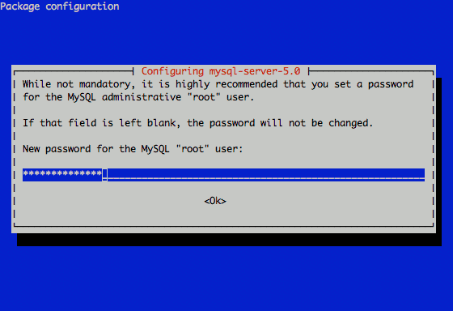

This document describes a compatible alternative to the **LAMP** (Linux, Apache, MySQL, and PHP) stack, known as **LEMP**. The LEMP stack replaces the Apache web server component (which is the "A" in LAMP) with Nginx (pronounced "engine x", providing the "E" in LEMP). LEMP is comprised of a variety of open source software used to build and run web servers.

Prior to beginning this guide, please complete the [Setting Up and Securing a Compute Instance](/docs/guides/set-up-and-secure/). If you are new to Linux server administration, you may be interested in our [introduction to Linux concepts guide](/docs/guides/introduction-to-linux-concepts/), [beginner's guide](/docs/guides/linode-beginners-guide/) and [administration basics guide](/docs/using-linux/administration-basics).

## Set the Hostname

Before you begin installing and configuring the components described in this guide, please make sure you have followed our instructions for [setting your hostname](/docs/getting-started#setting-the-hostname). Issue the following commands to make sure it is set properly:

    hostname
    hostname -f

The first command should show your short hostname, and the second should show your fully qualified domain name (FQDN).

## Installation Prerequisites

Before beginning with the installation of this web application stack, issue the following commands to ensure that your system's package database is up to date and that all installed software is running with the latest version:

    sudo apt-get update
    sudo apt-get upgrade

## Install the Nginx Web Server

There are several viable and popular options for installing the Nginx software. The method used here retrieves packages from the Debian Project's software repository and provides a stable and tested version of the web server. Another option would be to retrieve packages compiled by the Debian Backports project. Backports packages are more up to date than the stable packages provided by the Debian project. However, Backports do not necessarily receive the same updates, support, and maintenance that official packages receive.

For more in-depth installation instructions consider our [guide to Installing Nginx](/docs/guides/getting-started-with-nginx-part-1-installation-and-basic-setup/).

To install Nginx from the Debian repository, issue the following command:

    sudo apt-get install nginx

This will install version 1.2.1-22 of the Nginx server.

## Configure Nginx Virtual Hosting

You will need to configure `server` declarations to specify name-based virtual hosts. Since you are using the packages from the Debian project, create the virtual hosting configuration in the as `/etc/nginx/sites-available/example.com`. Consider the following Nginx virtual host configuration:


server {
    listen   80;
    server_name www.example.com example.com;
    access_log /srv/www/example.com/logs/access.log;
    error_log /srv/www/example.com/logs/error.log;

    location / {
        root   /srv/www/example.com/public_html;
        index  index.html index.htm;
    }
}



Create the `public_html` and `log` directories referenced in this configuration by issuing the following command (make sure to change example.com to your domain name):

    sudo mkdir -p /srv/www/example.com/{public_html,logs}

Then issue the following commands to enable the site and restart the web server.

    sudo ln -s /etc/nginx/sites-available/example.com /etc/nginx/sites-enabled
    sudo /etc/init.d/nginx restart

To deactivate a site, simply delete the symbolic link by issuing the following commands:

    sudo rm /etc/nginx/sites-enabled/example.com
    sudo /etc/init.d/nginx restart

The source file is saved, and the site can be re-enabled at any time.

For more information regarding Nginx configuration options, consider our [Overview of Nginx Configuration](/docs/websites/nginx/basic-nginx-configuration).

## Deploy PHP with FastCGI

In order to deploy PHP applications, you will need to implement the following "PHP-FastCGI" solution to allow Nginx to properly handle and serve pages that contain PHP code. Begin the deployment process by issuing the following command to install the required dependencies:

    sudo apt-get install php5-cli php5-cgi spawn-fcgi php-pear

Issue the following sequence of commands to download a small wrapper script for PHP-FastCGI, configure an init script to control the process, start the process for the first time, and ensure that the process will start following a reboot cycle:

    cd /opt/
    sudo wget -O php-fastcgi-deb.sh http://www.linode.com/docs/assets/1548-php-fastcgi-deb.sh
    sudo mv /opt/php-fastcgi-deb.sh /usr/bin/php-fastcgi
    sudo chmod +x /usr/bin/php-fastcgi
    sudo wget -O init-php-fastcgi-deb.sh http://www.linode.com/docs/assets/1549-init-php-fastcgi-deb.sh
    sudo mv /opt/init-php-fastcgi-deb.sh /etc/init.d/php-fastcgi
    sudo chmod +x /etc/init.d/php-fastcgi
    sudo /etc/init.d/php-fastcgi start
    sudo update-rc.d php-fastcgi defaults

Below is a sample Nginx virtual host configuration file. Modify your configuration to be similar to the one below. Remember to replace example.com with your domain.


server {
    server_name www.example.com example.com;
    access_log /srv/www/example.com/logs/access.log;
    error_log /srv/www/example.com/logs/error.log;
    root /srv/www/example.com/public_html;

    location / {
        index index.html index.htm index.php;
    }



In addition, with in the Nginx virtual host file, ensure the `location ~ \.php$ { }` block resembles the one in this example:


location ~ \.php$ {
    include /etc/nginx/fastcgi_params;
    fastcgi_pass  127.0.0.1:9000;
    fastcgi_index index.php;
    fastcgi_param SCRIPT_FILENAME /srv/www/example.com/public_html$fastcgi_script_name;
}


**Important security note:** If you are planning to run applications that support file uploads (images, for example), the above configuration may expose you to a security risk by allowing arbitrary code execution. The short explanation for this behavior is that a properly crafted URI which ends in ".php", in combination with a malicious image file that actually contains valid PHP, can result in the image being processed as PHP. For more information on the specifics of this behavior, you may wish to review the information provided on [Neal Poole's blog](https://nealpoole.com/blog/2011/04/setting-up-php-fastcgi-and-nginx-dont-trust-the-tutorials-check-your-configuration/).

To mitigate this issue, you may wish to modify your configuration to include a `try_files` directive. Please note that this fix requires Nginx and the php-fcgi workers to reside on the same server.


location ~ \.php$ {
    try_files $uri =404;
    include /etc/nginx/fastcgi_params;
    fastcgi_pass 127.0.0.1:9000;
    fastcgi_index index.php;
    fastcgi_param SCRIPT_FILENAME /srv/www/example.com/public_html$fastcgi_script_name;
}


Additionally, it is a good idea to secure any upload directories your applications may use. The following configuration excerpt demonstrates securing an "/images" directory:


location ~ \.php$ {
    include /etc/nginx/fastcgi_params;
    if ($uri !~ "^/images/") {
        fastcgi_pass 127.0.0.1:9000;
    }
    fastcgi_index index.php;
    fastcgi_param SCRIPT_FILENAME /srv/www/example.com/public_html$fastcgi_script_name;
}


When you have completed the modifications to the configuration, make sure that the virtual host is enabled and issue the following command to restart the web server:

    /etc/init.d/nginx restart

You are now able to deploy PHP scripts with your LEMP stack.

## Install MySQL Database Server

MySQL database engine may be the leading open source relational database engine, and is a popular database solution for web-based applications. The installation is as follows:

1.  Issue the following command to install the MySQL server packages and required PHP support for MySQL.

        sudo apt-get install mysql-server php5-mysql

2.  Set a password for the MySQL root user. Choose a strong password and keep it in a safe place for future reference.

    

3.  Issue the following command to secure the MySQL instance:

        sudo mysql_secure_installation

4.  Answer all questions when prompted during this process.

    
If at any point you need to reset the root password for the *MySQL* server, issue the following command:

     dpkg-reconfigure mysql-server-5.0


5.  Issue the following command to get a root prompt for the MySQL server:

        mysql -u root -p

6.  Enter the root password created in the second step.
7.  Issue the following sequence of commands to create the `new_install` and `new_person` database users, grant the `new_person` user access to the `new_install` database, and exit from the database:

        CREATE DATABASE new_install;
        CREATE USER 'new_person' IDENTIFIED BY '<password>';
        GRANT ALL PRIVILEGES ON new_install.* TO 'new_user';
        exit

    > You may now provide the credentials for the `new_install` database and the `2nd_user` user to your application, which will now be able to use the database for its purposes. To ensure that PHP will be able to access the MySQL connector your just installed, restart the PHP service.

8.  Issue `sudo /etc/init.d/php-fastcgi restart` to restart the PHP service.

You now have a fully functional and fully featured LEMP stack for application deployment.
