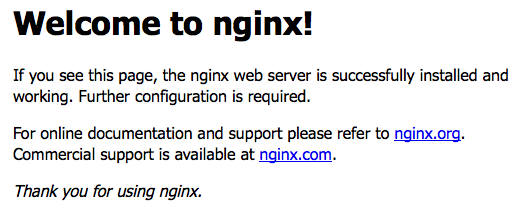

## What is Google PageSpeed?

[PageSpeed](https://www.modpagespeed.com/) is a set of modules for NGINX and Apache which optimize and measure page performance of websites. Optimization is done by minifying static assets such as CSS and JavaScript, which decreases page load time. [PageSpeed Insights](https://developers.google.com/speed/pagespeed/insights/) is a tool that measures your site's performance, and makes recommendations for further modifications based on the results.

There are currently two ways to get PageSpeed and NGINX working together:

-  Compile NGINX with support for PageSpeed, then compile PageSpeed.
-  Compile PageSpeed as a [dynamic module](https://www.nginx.com/blog/compiling-dynamic-modules-nginx-plus/) to use with NGINX, whether NGINX was installed from source or a binary.

    
Installing NGINX from source requires several manual installation steps and will require manual maintenance when performing tasks like version upgrades. To install NGINX using a package manager see the [NGINX](/docs/web-servers/nginx/) section.
    

This guide will show how to compile both NGINX and PageSpeed. If you would prefer to use PageSpeed as a module for NGINX, see [this NGINX blog post](https://www.nginx.com/blog/optimize-website-google-pagespeed-dynamic-module-nginx-plus/) for instructions.

## Before You Begin

-  You should not have a pre-existing installation of NGINX. If you do, back up the configuration files if you want to retain their information, and then purge NGINX.

-  You will need root access to the system, or a user account with `sudo` privileges.

-  Set your system's [hostname](/docs/products/compute/compute-instances/guides/set-up-and-secure/#configure-a-custom-hostname).

-  Update your system's packages.

## Considerations for a Self-Compiled NGINX Installation

**Filesystem Locations**: When you compile NGINX from source, the entire installation, including configuration files, is located at `/usr/local/nginx/nginx/`. This is in contrast to an installation from a package manager, which places its configuration files in `/etc/nginx/`.

**Built-in Modules**: When you compile NGINX from source, no additional modules are included unless explicitly specified, which means that HTTPS is not supported by default. Below you can see the output of `nginx -V` using the PageSpeed automated install command on Ubuntu 18.04 with no additional modules or options specified.


root@localhost:~# /usr/local/nginx/sbin/nginx -V
nginx version: nginx/1.17.3
built by gcc 7.4.0 (Ubuntu 7.4.0-1ubuntu1~18.04.1)
configure arguments: --add-module=/root/incubator-pagespeed-ngx-latest-stable


Contrast this output with the same command run on the same Ubuntu system but with the binary installed from NGINX's repository:


root@localhost:~# nginx -V
nginx version: nginx/1.17.3
built by gcc 7.4.0 (Ubuntu 7.4.0-1ubuntu1~18.04.1)
built with OpenSSL 1.1.1  11 Sep 2018
TLS SNI support enabled
configure arguments: --add-module=/root/incubator-pagespeed-ngx-latest-stable --prefix=/etc/nginx --sbin-path=/usr/sbin/nginx --modules-path=/usr/lib/nginx/modules --conf-path=/etc/nginx/nginx.conf --error-log-path=/var/log/nginx/error.log --http-log-path=/var/log/nginx/access.log --pid-path=/var/run/nginx.pid --lock-path=/var/run/nginx.lock --http-client-body-temp-path=/var/cache/nginx/client_temp --http-proxy-temp-path=/var/cache/nginx/proxy_temp --http-fastcgi-temp-path=/var/cache/nginx/fastcgi_temp --http-uwsgi-temp-path=/var/cache/nginx/uwsgi_temp --http-scgi-temp-path=/var/cache/nginx/scgi_temp --user=nginx --group=nginx --with-http_ssl_module --with-http_v2_module


## Build NGINX and PageSpeed

The official [PageSpeed documentation](https://www.modpagespeed.com/doc/build_ngx_pagespeed_from_source) provides a bash script to automate the installation process.


The automated installation script will install several compilation tools needed to install PageSpeed. If you are using a production environment, ensure you uninstall any packages that are no longer needed after the installation has completed.


1.  If you plan to serve your website using TLS, install the SSL libraries needed to compile the HTTPS module for NGINX:

    **CentOS/Fedora**

        sudo yum install openssl-devel

    **Ubuntu/Debian**

        sudo apt install libssl-dev

2.  Run the [Automated Install](https://www.modpagespeed.com/doc/build_ngx_pagespeed_from_source) bash command to start the installation:

        bash <(curl -f -L -sS https://ngxpagespeed.com/install) \
        --nginx-version latest

3.  During the build process, you'll be asked if you want to build NGINX with any additional modules. The PageSpeed module is already included, so you don't need to add it here.

    The options below are a recommended starting point; you can also add more specialized options for your particular use case. These options retain the directory paths, user and group names of pre-built NGINX binaries, and enable the SSL and HTTP/2 modules for HTTPS connections:

        --prefix=/etc/nginx --sbin-path=/usr/sbin/nginx --modules-path=/usr/lib/nginx/modules --conf-path=/etc/nginx/nginx.conf --error-log-path=/var/log/nginx/error.log --http-log-path=/var/log/nginx/access.log --pid-path=/var/run/nginx.pid --lock-path=/var/run/nginx.lock --http-client-body-temp-path=/var/cache/nginx/client_temp --http-proxy-temp-path=/var/cache/nginx/proxy_temp --http-fastcgi-temp-path=/var/cache/nginx/fastcgi_temp --http-uwsgi-temp-path=/var/cache/nginx/uwsgi_temp --http-scgi-temp-path=/var/cache/nginx/scgi_temp --user=nginx --group=nginx --with-http_ssl_module --with-http_v2_module

4. You'll be asked if you want to configure nginx with the options that you added, answer *Y* to continue.
    
  ./configure --add-module=/home/sudouser/incubator-pagespeed-ngx-latest-stable --prefix=/etc/nginx --sbin-path=/usr/sbin/nginx --modules-path=/usr/lib/nginx/modules --conf-path=/etc/nginx/nginx.conf --error-log-path=/var/log/nginx/error.log --http-log-path=/var/log/nginx/access.log --pid-path=/var/run/nginx.pid --lock-path=/var/run/nginx.lock --http-client-body-temp-path=/var/cache/nginx/client_temp --http-proxy-temp-path=/var/cache/nginx/proxy_temp --http-fastcgi-temp-path=/var/cache/nginx/fastcgi_temp --http-uwsgi-temp-path=/var/cache/nginx/uwsgi_temp --http-scgi-temp-path=/var/cache/nginx/scgi_temp --user=nginx --group=nginx --with-http_ssl_module --with-http_v2_module
Does this look right? [Y/n] y



5. Next you'll be asked if you want to build NGINX. You'll be shown the destination directories for logs, configuration files and binaries. If these look correct, answer *Y* to continue.

    
Configuration summary
  + using system PCRE library
  + using system OpenSSL library
  + using system zlib library

  nginx path prefix: "/etc/nginx"
  nginx binary file: "/usr/sbin/nginx"
  nginx modules path: "/usr/lib/nginx/modules"
  nginx configuration prefix: "/etc/nginx"
  nginx configuration file: "/etc/nginx/nginx.conf"
  nginx pid file: "/var/run/nginx.pid"
  nginx error log file: "/var/log/nginx/error.log"
  nginx http access log file: "/var/log/nginx/access.log"
  nginx http client request body temporary files: "/var/cache/nginx/client_temp"
  nginx http proxy temporary files: "/var/cache/nginx/proxy_temp"
  nginx http fastcgi temporary files: "/var/cache/nginx/fastcgi_temp"
  nginx http uwsgi temporary files: "/var/cache/nginx/uwsgi_temp"
  nginx http scgi temporary files: "/var/cache/nginx/scgi_temp"

Build nginx? [Y/n]



5.  If the build was successful, you'll see the following message:

    
Nginx installed with ngx_pagespeed support compiled-in.

If this is a new installation you probably need an init script to
manage starting and stopping the nginx service.  See:
  http://wiki.nginx.org/InitScripts

You'll also need to configure ngx_pagespeed if you haven't yet:
  https://developers.google.com/speed/pagespeed/module/configuration



6.  When you want to update NGINX, back up your configuration files and repeat steps two through four above to build with the new source version.

## Control NGINX

NGINX can be controlled either by creating a systemd service or by calling the binary directly. Choose one of these methods and do not mix them. If you start NGINX using the binary commands, for example, systemd will not be aware of the process and will try to start another NGINX instance if you run `systemctl start nginx`, which will fail.

**systemd**

1.  In a text editor, create `/lib/systemd/system/nginx.service` and add the following unit file from [the NGINX wiki](https://www.nginx.com/resources/wiki/start/topics/examples/systemd/):

    
[Unit]
Description=The NGINX HTTP and reverse proxy server
After=syslog.target network.target remote-fs.target nss-lookup.target

[Service]
Type=forking
PIDFile=/run/nginx.pid
ExecStartPre=/usr/sbin/nginx -t
ExecStart=/usr/sbin/nginx
ExecReload=/bin/kill -s HUP $MAINPID
ExecStop=/bin/kill -s QUIT $MAINPID
PrivateTmp=true

[Install]
WantedBy=multi-user.target


2.  Enable NGINX to start on boot and start the server:

        systemctl enable nginx
        systemctl start nginx

3.  NGINX can now be controlled as with any other systemd-controlled process:

        systemctl stop nginx
        systemctl restart nginx
        systemctl status nginx

**NGINX binary**

You can use NGINX's binary to control the process directly without making a startup file for your init system.

1.  Start NGINX:

        /usr/sbin/nginx

2.  Reload the configuration:

        /usr/sbin/nginx -s reload

3.  Stop NGINX:

        /usr/sbin/nginx -s stop

## Configuration

### NGINX

1.  Since the compiled options specified above are different than the source's defaults, some additional configuration is necessary. Replace *example.com* in the following commands with your Linode's public IP address or domain name:

        sudo useradd --no-create-home nginx
        sudo mkdir -p /var/cache/nginx/client_temp
        sudo mkdir /etc/nginx/conf.d/
        sudo mkdir /var/www/
        sudo mkdir /var/www/example.com
        sudo chown nginx:nginx /var/www/example.com
        sudo mv /etc/nginx/nginx.conf.default /etc/nginx/nginx.conf.backup-default

2.  In NGINX terminology, a *Server Block* equates to a website (similar to the *Virtual Host* in Apache terminology). Each NGINX site's configuration should be in its own file with the name formatted as `example.com.conf`, located at `/etc/nginx/conf.d/`.

    If you followed this guide or our [Getting Started with NGINX](/docs/guides/getting-started-with-nginx-part-1-installation-and-basic-setup/) series, then your site's configuration will be in a `server` block in a file stored in `/etc/nginx/conf.d/`. If you do not have this setup, then you likely have the `server` block directly in `/etc/nginx/nginx.conf`. See *[Server Block Examples](https://www.nginx.com/resources/wiki/start/topics/examples/server_blocks/)* in the NGINX docs for more info.

    Create a configuration file for your site with a basic server block inside:

    
server {
    listen       80;
    listen       [::]:80;
    server_name  example.com www.example.com;
    access_log   logs/example.access.log main;
    error_log    logs/example.error error;

    root         /var/www/example.com/;

}


3. Ensure that the firewall allows access to the nginx service. If you configured the firewall with `ufw` then do the following:

      a.  Check the application configurations that `ufw` is aware of, by typing:

        sudo ufw app list

      b.   Enable `Nginx HTTP` from the list:

        sudo ufw allow 'Nginx HTTP'

      c.   Verify the change by typing:
        
    Status: active

To                         Action      From
--                         ------      ----
OpenSSH                    ALLOW       Anywhere
Nginx HTTP                 ALLOW       Anywhere
OpenSSH (v6)               ALLOW       Anywhere (v6)
Nginx HTTP (v6)            ALLOW       Anywhere (v6)
    

4.  Start NGINX:

    **systemd**:

        systemctl start nginx

    **Other init systems**:

        /usr/sbin/nginx

5.  Verify NGINX is working by going to your site's domain or IP address in a web browser. You should see the NGINX welcome page:

    

### PageSpeed

1.  Create PageSpeed's cache location and change its ownership to the `nginx` user and group:

        sudo mkdir /var/cache/ngx_pagespeed/
        sudo chown nginx:nginx /var/cache/ngx_pagespeed/

2.  Add the PageSpeed directives to your site configuration's `server` block as shown below.

    
server {

      ...

    pagespeed on;
    pagespeed FileCachePath "/var/cache/ngx_pagespeed/";
    pagespeed RewriteLevel OptimizeForBandwidth;

    location ~ "\.pagespeed\.([a-z]\.)?[a-z]{2}\.[^.]{10}\.[^.]+" {
        add_header "" "";
        }

    location ~ "^/pagespeed_static/" { }
    location ~ "^/ngx_pagespeed_beacon$" { }

    }


    
`RewriteLevel OptimizeForBandwidth` is a [safer choice](https://www.modpagespeed.com/doc/optimize-for-bandwidth) than the default CoreFilters rewrite level.


3.  NGINX supports HTTPS by default, so if your site already is set up with a TLS certificate, add the two directives below to your site's `server` block, pointing to the correct location [depending on your system](https://www.modpagespeed.com/doc/https_support#configuring_ssl_certificates).

        pagespeed SslCertDirectory directory;
        pagespeed SslCertFile file;

4.  Reload your configuration:

        /usr/sbin/nginx/ -s reload

    Or restart nginx:

        systemctl restart nginx

5.  Test PageSpeed is running and NGINX is successfully serving pages. Substitute *example.com* in the cURL command with your Linode's domain name or IP address.

        curl -I -X GET example.com

    The output should be similar to below. If the response contains an HTTP 200 response and *X-Page-Speed* is listed in the header with the PageSpeed version number, everything is working correctly.

    
HTTP/1.1 200 OK
Server: nginx/1.17.3
Content-Type: text/html
Transfer-Encoding: chunked
Connection: keep-alive
Date: Sat, 07 Sep 2019 07:16:44 GMT
X-Page-Speed: 1.13.35.2-0
Cache-Control: max-age=0, no-cache


6.  Use [PageSpeed Insights](https://developers.google.com/speed/pagespeed/insights/) to test your site for additional improvement areas.
