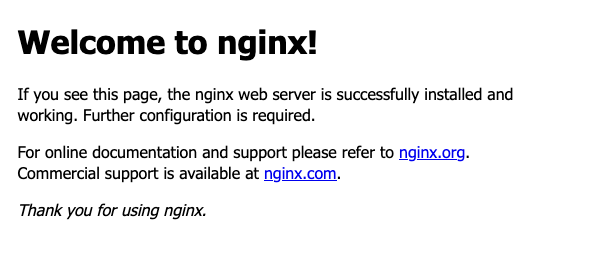

[Nginx](https://www.nginx.com/) remains one of the most widely used and adaptable web servers around, frequently used for its reverse proxy and load balancer capabilities.

With Docker, you can deploy your own Nginx server with a reduced administrative overhead. The portability and self-contained nature of Docker containers can make running and maintaining an Nginx server easier, and lead into scalable options like Kubernetes.

Follow along with this tutorial to learn about the advantages of running Nginx via a Docker container and how exactly you can do that yourself.

## Before You Begin

1. If you have not already done so, create a Linode account and Compute Instance. See our [Getting Started with Linode](/docs/guides/getting-started/) and [Creating a Compute Instance](/docs/guides/creating-a-compute-instance/) guides.

1. Follow our [Setting Up and Securing a Compute Instance](/docs/guides/set-up-and-secure/) guide to update your system. You may also wish to set the timezone, configure your hostname, create a limited user account, and harden SSH access.


This guide is written for a non-root user. Commands that require elevated privileges are prefixed with `sudo`. If you’re not familiar with the `sudo` command, see the [Users and Groups](/docs/guides/linux-users-and-groups/) guide.


## Getting Started with Docker

[Docker](https://www.docker.com/) is an open-source platform for creating standalone, portable application containers. A Docker container operates with its own runtime environment and everything the containerized application needs. It thus provides a self-contained and portable solution that is more efficient than virtual hosting.

Docker containers also have the advantage of container orchestration. Platforms like Kubernetes can leverage the portability and self-contained nature of Docker containers to efficiently deploy applications to clusters.

Learn more about Docker, its advantages, and its use cases in our guide on [When and Why to Use Docker](/docs/guides/when-and-why-to-use-docker/). And learn more about using Docker with Kubernetes container orchestration in our guide on how to [Manage a Docker Cluster with Kubernetes](/docs/guides/manage-a-docker-cluster-with-kubernetes/).

### Why Run Nginx in a Docker Container?

Running Nginx via a Docker container can serve a range of use cases. Most of the advantage lies in running Nginx in an easy-to-manage and self-contained environment. Should you need to update your Nginx instance or to install a new version, the process is simplified down to replacing your existing container. At the same time, using Docker minimizes the clutter of dependency files and software on your host system.

Beyond this, a Dockerized Nginx instance can be a gateway to more complicated setups. It can allow you to test out particular Nginx container configurations before deploying them as part of a wider infrastructure, such as a Kubernetes deployment.

### Installing Docker

To install Docker, follow the instructions in our guide on [Installing and Using Docker](/docs/guides/installing-and-using-docker-on-ubuntu-and-debian/). Use the drop down at the top of the guide to select an appropriate distribution for you.

The present tutorial assumes that you have followed the sections on:

- Installing Docker Engine

- Starting and enabling Docker

- Using Docker with a non-root user

## Deploying Nginx as a Docker Container

With Docker installed, you have all you need to start up an Nginx container. This section of the tutorial walks your through the steps for doing that, getting a basic Nginx server up and running in a Docker container.

Be sure to continue on to the section after to see how to advance your Nginx container instance with custom configurations and content to serve.

### Starting the Nginx Container

The simplest way to deploy Nginx with Docker runs the default configuration immediately, with a single command.

The standard method for deploying simple Nginx server within a Docker container uses Docker's `run` command. This command pulls the latest Nginx Docker image and starts running it immediately within a new container.

```command
docker run --name nginx-docker -p 80:80 -d nginx
```

This example command includes several useful options for effectively leveraging your Nginx container. The options break down as follows:

- `--name` allows you to name the container, here as `nginx-docker`

- `-p` defines a port mapping, with the container's port `80` mapped to the host machine's port `80`

- `-d` runs the container in *detached mode*, meaning that the container continues to run in the background until stopped

### Connecting to the Nginx Server

The Nginx container now runs a working Nginx server on your system. Because the command above mapped the container's Nginx port to your system's port `80`, you can see the Nginx output there.

In a web browser, navigate to your system's public IP address. For example, if you IP address is `192.0.2.0`, navigate to `http://192.0.2.0` in your browser. You should see the Nginx welcome page.




Depending on the system's firewall settings, you may first need to open port `80`/`http`. Refer to the links in the firewall section of our [Setting Up and Securing a Compute Instance](/docs/products/compute/compute-instances/guides/set-up-and-secure/#configure-a-firewall) guide to see how to do this.


Jump ahead to the section on [Applying Custom Nginx Configurations](/docs/guides/deploying-nginx-docker-container/#applying-custom-nginx-configurations) to take the next step in running your own website through the Nginx container.

### Managing the Nginx Container

The Docker command used above to start up Nginx runs the container in the background. When you are ready to stop the container, you can do so with a Docker `stop` command and the container's name.

Using the name in the example above, the command to stop the container would look like what you see here.

```command
docker stop nginx-docker
```

This does not remove the container, and you can start the container again using another Docker command, `start`. Again, here is an example using the container name given above.

```command
docker start nginx-docker
```

Should you want to remove the container altogether, you can use Docker's `rm` command with the containers name, as in the following example. Doing so is useful to free resources when you no longer need the container or when you want to start fresh.

```command
docker rm nginx-docker
```

## Applying Custom Nginx Configurations

The above gets Nginx running within a Docker container, but you need to have a way to have Nginx serve your content. Not only that, but you may want to run a custom Nginx configuration.

Docker gives you a few ways to get the content and configurations you need for your Nginx server. Each of the sections below covers a method, from the easier and ready-to-go to the more complicated and adaptable.

Before taking up either method, you should stop and remove your existing Nginx Docker container if you created one following the steps above.

```command
docker stop nginx-docker
docker rm nginx-docker
```

### Mounting Configuration and Content Files

Docker includes a `-v` option that you can use to mount directories from your host system into the container. This provides the most ready solution for customizing Nginx to your needs.

This example walks you through creating a simple website and Nginx configuration and deploying them to a new Nginx Docker container.

1. Make a directory for your Nginx content and configuration, and change into that directory.

    ```command
    mkdir ~/example-nginx-site
    cd ~/example-nginx-site
    ```

1. Add an `nginx-default.conf` file there, and give it the contents you want for your Nginx configuration. The below is a bare-bones version of a default Nginx static server configuration.

    ```file {title="nginx-default.conf" lang="conf"}
    server {
        listen 80;
        listen [::]:80;
        server_name localhost;

        location / {
            root /usr/share/nginx/html;
            index index.html index.htm;
        }

        error_page 500 502 503 504  /50x.html;
        location = /50x.html {
            root /usr/share/nginx/html;
        }
    }
    ```

1. Make an `html/` subdirectory to use for storing your website content.

    ```command
    mkdir html
    ```

1. Add files for your desired website into the `html/` directory. Following the configuration above, the directory should have an `index.html` file. This example gives just a basic webpage in that file.

    ```file {title="html/index.html" lang="html"}
    <!doctype html>
    <html lang="en">
    <head>
      <meta charset="utf-8">
      <title>Example Nginx Website</title>
    </head>
    <body>
      <h1>An Example Nginx Website</h1>
      <p>Welcome to your own Nginx website!</p>
    </body>
    </html>
    ```

1. Start up an Nginx Docker container with additional options to mount the custom configuration file and website content.

    ```command
    docker run --name nginx-docker -p 80:80 -d -v ~/example-nginx-site/nginx-default.conf:/etc/nginx/conf.d/default.conf -v ~/example-nginx-site/html:/usr/share/nginx/html nginx
    ```

    The `run` command here remains similar to the one demonstrated further above. However, this time two `-v` options are included.

    - The first mounts your custom configuration file (`nginx-default.conf`) to the container's location for the default Nginx configuration file. This overwrites the container's default Nginx configuration file with your own.

    - The second mounts your custom website content (from the `html/` subdirectory) to the directory in the container where Nginx looks for web content — `/usr/share/nginx/html`, following the configuration above.

You can now navigate again to your system's public IP address. There you should find your custom webpage.


### Custom Image Deployment

The method above for including configurations and content with your Nginx container serves well for most use cases. However, you may find yourself needing more control or for one reason or another wanting another solution than mounting.

At this point, you are probably best served creating your own Dockerfile for a custom Nginx image. All of the examples above use the default Nginx image, pulled from the Docker Hub. Using a Dockerfile, you can build around the base Nginx image to create an image customized to your use case.

To begin, this example leverages the custom files created in the previous section. Follow the relevant steps there, and you should have an `example-nginx-site/` directory that has a structure like the one shown here.

```output
example-nginx-site/
  |-html/
  |  |-index.html
  |-nginx-default.conf
```

From there, follow along with the steps below to create a simple Nginx Docker image. Essentially, this image behaves the same as the setup in the previous section. But following that model gives you a relatively easy-to-read example and provides an effective basis for more complicated images.

1. Stop and remove any Docker container you created from the previous sections of the tutorial.

    ```command
    docker stop nginx-docker
    docker rm nginx-docker
    ```

1. Change into the `example-nginx-site` directory if you are not already in it.

    ```command
    cd ~/example-nginx-site
    ```

1. Add a file named `Dockerfile` to the directory. Give that file the contents shown here.

    ```file {title="Dockerfile" lang="docker"}
    FROM nginx:latest
    RUN rm /etc/nginx/conf.d/default.conf
    COPY nginx-default.conf /etc/nginx/conf.d/default.conf
    COPY html /usr/share/nginx/html
    ```

1. Use the Docker `build` command to build an image from the Dockerfile. This example gives the image the name `nginx-docker-image`.

    ```command
    docker build -t nginx-docker-image .
    ```

1. Run the new Docker image. The command for doing so follows almost exactly the command for running the default Nginx image, except here you provide your custom image's name rather than `nginx`.

    ```command
    docker run --name nginx-docker -p 80:80 -d nginx-docker-image
    ```

Just as in the section above, you should be able to navigate to your system's public IP address to see your custom website.

To move ahead with more advanced Dockerfile setups, take a look at our guide on [How to Use a Dockerfile to Build a Docker Image](/docs/guides/how-to-use-dockerfiles/). There, you can find a thorough overview of Dockerfile creation and usage.

## Conclusion

Nginx pairs excellently with Docker's containerization, and now you have your own setup, ready for configuration and deployment to meet your server needs. And you can take a look through the resources linked throughout this tutorial to expand your learning and get even more out of the setup.
