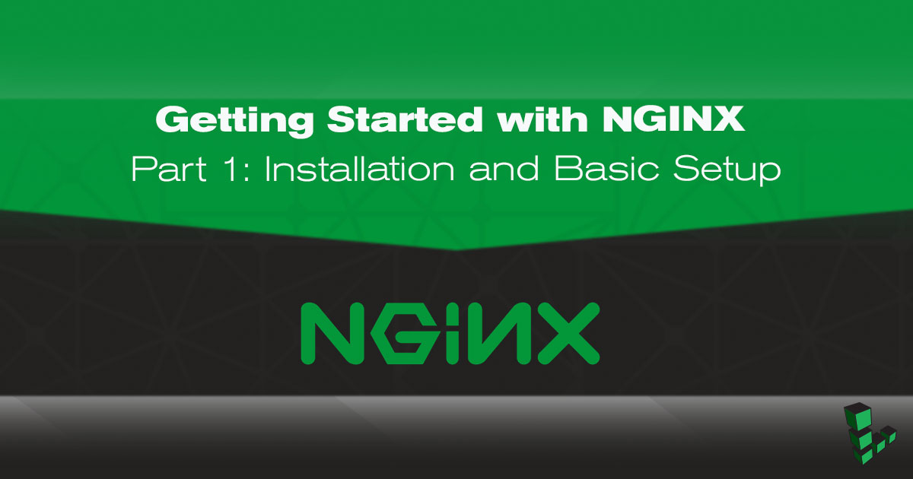

This guide is the first of a four-part series. Parts One and Two will walk you through installing NGINX Open Source from the NGINX repositories and making some configuration changes to increase performance and security. Parts Three and Four set up NGINX to serve your site over HTTPS and harden the TLS connection.

## Before You Begin

* You will need root access to the system, or a user account with `sudo` privilege.
* Set your system's [hostname](/docs/products/compute/compute-instances/guides/set-up-and-secure/#configure-a-custom-hostname).
* Update your system.

## Install NGINX

### Stable Versus Mainline

The first decision to make about your installation is whether you want the *Stable* or *Mainline* version of NGINX Open Source. Stable is recommended, and will be what this series of guides uses. More on NGINX versions [here](https://www.nginx.com/resources/admin-guide/installing-nginx-open-source/#stable_vs_mainline).

### Binary Versus Compiling from Source

There are three primary ways to install NGINX Open Source:

* **A pre-built binary from your Linux distribution's repositories.** This is the easiest installation method because you use your package manager to install the `nginx` package. However, for distributions which provide binaries (as opposed to build scripts), you'll be running an older version of NGINX than the current stable or mainline release. Patches can also be slower to land in distro repositories from upstream.

* **A pre-built binary from NGINX Inc.'s repository.** This is the installation method used in this series. It's still an easy installation process which only requires that you add the repository to your system and then install as normal. This method has the benefit of the most vanilla, upstream configuration by default, with quicker updates and newer releases than a Linux distribution's repository. Compile-time options often differ from those of the NGINX binary in distribution repositories, and you can use `nginx -V` to see which your binary was built with.

* **Compiling from source.** This is the most complicated method of installation but still not impractical when following [NGINX's documentation](https://www.nginx.com/resources/admin-guide/installing-nginx-open-source/). Source code is updated frequently with patches and maintained at the newest stable or mainline releases, and building can be easily automated. This is the most customizable installation method because you can include or omit any compiling options and flags you choose. For example, one common reason people compile their own NGINX build is so they can use the server with a newer version of OpenSSL than what their Linux distribution provides.

### Installation Instructions

The [NGINX admin guide](https://docs.nginx.com/nginx/admin-guide/installing-nginx/installing-nginx-open-source/#installing-a-prebuilt-package) gives clear and accurate instructions for any installation method and NGINX version you choose, so we won't mirror them here. When your installation completes, return here to continue the series.

## Configuration Notes

As use of the NGINX web server has grown, NGINX, Inc. has worked to distance NGINX from configurations and terminology that were used in the past when trying to ease adoption for people already accustomed to Apache.

If you're familiar with Apache, you'll know that multiple site configurations (called *Virtual Hosts* in Apache terminology) are stored at `/etc/apache/sites-available/`, which symlink to files in `/etc/apache/sites-enabled/`. However, many guides and blog posts for NGINX recommend this same configuration. As you could expect, this has led to some confusion, and the assumption that NGINX regularly uses the `../sites-available/` and `../sites-enabled/` directories, and the `www-data` user. It does not.

Sure, it can. The NGINX packages in Debian and Ubuntu repositories have changed their configurations to this for quite a while now, so serving sites whose configuration files are stored in `/sites-available/` and symlinked to `/sites-enabled/` is certainly a working setup. However it is unnecessary, and the Debian Linux family is the only one which does it. Do not force Apache configurations onto NGINX.

Instead, multiple site configuration files should be stored in `/etc/nginx/conf.d/` as `example.com.conf`, or `example.com.disabled`. Do not add `server` blocks directly to `/etc/nginx/nginx.conf` either, even if your configuration is relatively simple. This file is for configuring the server process, not individual websites.

The NGINX process also runs as the username `ngnix` in the `nginx` group, so keep that in mind when adjusting permissions for website directories. For more information, see *[Creating NGNIX Plus Configuration Files](https://www.nginx.com/resources/admin-guide/configuration-files/)* .

Finally, [as the NGINX docs point out](https://www.nginx.com/resources/wiki/start/topics/examples/server_blocks/), the term *Virtual Host* is an Apache term, even though it's used in the `nginx.conf` file supplied from the Debian and Ubuntu repositories, and some of NGINX's old documentation. A *Server Block* is the NGINX equivalent, so that is the phrase you'll see in this series on NGINX.

## NGINX Configuration Best Practices

There is a large variety of customizations you can do to NGINX to fit it better to your needs. Many of those will be exclusive to your use case though; what works great for one person may not work at all for another.

This series will provide configurations that are general enough to be useful in just about any production scenario, but which you can build on for your own specialized setup. Everything in the section below is considered a best practice and none are reliant on each other. They're not essential to the function of your site or server, but they can have unintended and undesirable consequences if disregarded.

Two quick points:

- Before going further, first preserve the default `nginx.conf` file so you have something to restore to if your customizations get so convoluted that NGINX breaks.

        cp /etc/nginx/nginx.conf /etc/nginx/nginx.conf.backup-original

- After implementing a change below, reload your configuration with:

        nginx -s reload

### Use Multiple Worker Processes

Add or edit the following line in `/etc/nginx/nginx.conf`, in the area just before the `http` block. This is called the `main` block, or context, though it's not marked in `nginx.conf` like the `http` block is. The first choice would be to set it to `auto`, or the amount of CPU cores available to your Linode.

    worker_processes auto;

For more information, see the sections on worker processes in [the NGINX docs](https://nginx.org/en/docs/ngx_core_module.html#worker_processes) and [this NGINX blog post](https://www.nginx.com/blog/tuning-nginx/).

### Disable Server Tokens

NGINX's version number is visible by default with any connection made to the server, whether by a successful 201 connection by cURL, or a 404 returned to a browser. Disabling server tokens makes it more difficult to determine NGINX's version, and therefore more difficult for an attacker to execute version-specific attacks.

Server tokens enabled:

Server tokens disabled:

Add the following line to the `http` block of `/etc/nginx/nginx.conf`:

    server_tokens off;

### Set Your Site's Root Directory

The directory NGINX serves sites from differs depending on how you installed it. At the time of this writing, NGINX supplied from NGINX Inc.'s repository uses `/usr/share/nginx/`.

The NGINX docs warn that relying on the default location can result in the loss of site data when upgrading NGINX. You should use `/var/www/`, `/srv/`, or some other location that won't be touched by package or system updates. For more explanation, see *[Using the default document root](
https://www.nginx.com/resources/wiki/start/topics/tutorials/config_pitfalls/#using-the-default-document-root)* and *[Not using standard document root locations](https://www.nginx.com/resources/wiki/start/topics/tutorials/config_pitfalls/#not-using-standard-document-root-locations)*.

This series will use `/var/www/example.com/` in its examples. Replace `example.com` where you see it with the IP address or domain name of your Linode.

1.  The root directory for your site or sites should be added to the corresponding `server` block of `/etc/nginx/conf.d/example.com.conf`:

        root /var/www/example.com;

2.  Then create that directory:

        mkdir -p /var/www/example.com

### Serve Content Over IPv4 and IPv6

Default NGINX configurations listen on port `80` and on all IPv4 addresses. Unless you intend your site to be inaccessible over IPv6 (or are unable to provide it for some reason), you should tell NGINX to also listen for incoming IPv6 traffic.

Add a second `listen` directive for IPv6 to the `server` block of `/etc/nginx/conf.d/example.com.conf`:

    listen [::]:80;

If your site uses SSL/TLS, you would add:

    listen [::]:443 ssl;


You can also specify your Linode's public IP addresses for NGINX to listen on. For example, the line would then be `listen 203.0.113.4:80;`.


### Static Content Compression

You do not want to universally enable gzip compression because, depending on your site's content and whether you set session cookies, you risk vulnerability to the [CRIME](https://en.wikipedia.org/wiki/CRIME) and [BREACH](http://www.breachattack.com/) exploits.

Compression has been disabled by default in NGINX [for years now](http://mailman.nginx.org/pipermail/nginx/2012-September/035600.html), so it's not vulnerable to CRIME out of the box. Modern browsers have also taken steps against these exploits, but web servers can still be configured irresponsibly.

On the other hand, if you leave gzip compression totally disabled, you rule out those vulnerabilities and use fewer CPU cycles, but at the expense of decreasing your site's performance. There are various server-side mitigations possible and the release of TLS 1.3 will further contribute to that. For now, and unless you know what you're doing, the best solution is to compress only static site content such as images, HTML, and CSS.

Below is an example of how to do that, and you can view all available mime types with `cat /etc/nginx/mime.types`. Though `gzip` directives can go in the `http` block if you want it to apply to all sites served by NGINX, it's safer to use it only inside `server` blocks for individual sites and content types.

    gzip          on;
    gzip_types    text/html text/plain text/css image/*;

In cases where NGINX is serving multiple websites, some using SSl/TLS and some not, an example would look like below. The `gzip` directive is added to the HTTP site's `server` block, which ensures it remains disabled for the HTTPS site.


server {
    listen         80;
    server_name    example1.com;
    gzip           on;
    gzip_types text/html text/css image/jpg image/jpeg image/png image/svg;
}



server {
    listen         443 ssl;
    server_name    example2.com;
    gzip           off;
}


There are various other options available to NGINX's gzip module. See the [NGINX docs](https://nginx.org/en/docs/http/ngx_http_gzip_module.html) for more information, and if you prefer to compile your NGINX build, you can include the [*ngx_http_gzip_static_module*](https://nginx.org/en/docs/http/ngx_http_gzip_static_module.html) which further suits static content compression.

## Configuration Recap

To summarize where we are so far:

* The *stable* version of NGINX Open Source was installed from the *nginx.org* repository.

* One basic website is accessible:

    * The root directory is located at `/var/www/example.com/`
    * The configuration file is located at `/etc/nginx/conf.d/example.com.conf`

        
server {
    listen         80 default_server;
    listen         [::]:80 default_server;
    server_name    example.com www.example.com;
    root           /var/www/example.com;
    index          index.html;

    gzip             on;
    gzip_comp_level  3;
    gzip_types       text/plain text/css application/javascript image/*;
}


* Changes we want NGINX to apply universally are in the `http` block of `/etc/nginx/nginx.conf`. Our additions are at the bottom of the block so we know what was added compared to what's provided by default.

    `nginx.conf` now looks like the following example. Note that `nginx.conf` does not contain any `server` blocks:

    
user  nginx;
worker_processes  auto;

error_log  /var/log/nginx/error.log warn;
pid        /var/run/nginx.pid;

events {
    worker_connections  1024;
}

http {
    include       /etc/nginx/mime.types;
    default_type  application/octet-stream;

    log_format  main  '$remote_addr - $remote_user [$time_local] "$request" '
                      '$status $body_bytes_sent "$http_referer" '
                      '"$http_user_agent" "$http_x_forwarded_for"';

    access_log  /var/log/nginx/access.log  main;

    sendfile        on;
    #tcp_nopush     on;

    keepalive_timeout  65;

    #gzip  on;

    include /etc/nginx/conf.d/*.conf;

    server_tokens       off;
}


## Part 2: (Slightly More) Advanced Configurations

By now you should have a basic NGINX installation and a some foundational settings to get you started. For slightly more advanced configurations, yet still applicable to anyone hosting a site on a Linode, see Part 2 of this series: [(Slightly more) Advanced Configurations for NGINX](/docs/guides/getting-started-with-nginx-part-2-advanced-configuration/)
