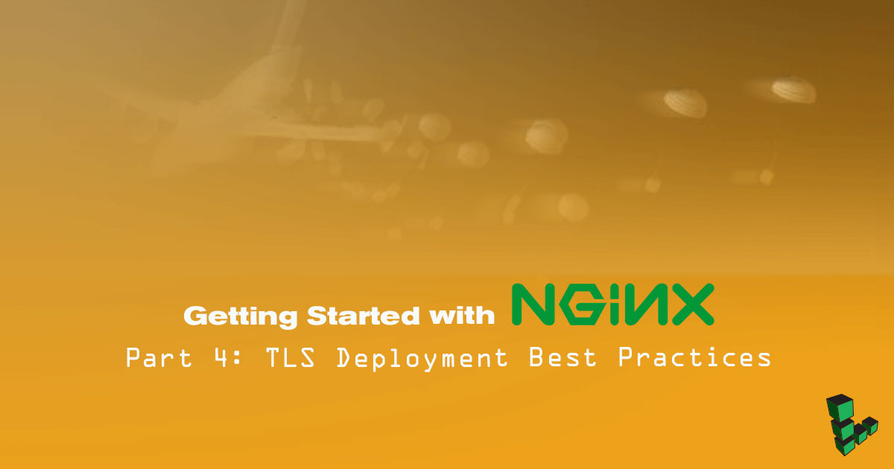

## Before you Begin

- This guide is Part 4 of our *Getting Started with NGINX* series and you will need a working NGINX setup with a website accessible via HTTPS. If do not already have that, then complete at least [Part 1: Basic Installation and Setup](/docs/guides/getting-started-with-nginx-part-1-installation-and-basic-setup/) and [Part 3: Enable TLS on NGINX for HTTPS Connections](/docs/guides/getting-started-with-nginx-part-3-enable-tls-for-https/) before going further.

- You will need root access to the system, or a user account with `sudo` privilege.

- You may want to make another backup of your `nginx.conf` and site configuration files so you have a snapshot of the work you've done up to this point. The copy commands below are intended as quick examples. By now you've likely put a significant amount of work into this setup, so you should decide on a more resilient backup strategy to preserve your configuration and site data.

        cp /etc/nginx/nginx.conf /etc/nginx/nginx.conf.backup-pt4
        cp -r /etc/nginx/conf.d/ /etc/nginx/conf.d-backup-pt4

- To enable any configuration changes you make, you need to run `nginx -s reload` as root.


Most directives in this guide can be added either to NGINX's `http` block, or an individual site's `server` block. The exceptions are `add_header` directives, which are [not inherited](/docs/guides/getting-started-with-nginx-part-2-advanced-configuration/#http-response-header-fields). If you're only hosting one website, or if you want all your hosted sites to have the same NGINX parameters, then adding all your `add_header` directives the `http` block is fine. If you intend to use different header options for different site configurations, [see here](/docs/guides/getting-started-with-nginx-part-2-advanced-configuration/#http-response-header-fields) for a different approach.


## Redirect Incoming HTTP Traffic HTTPS

When someone types your website's domain into a browser, the usual behavior is that the site is loaded over HTTP, unencrypted. Redirecting HTTP requests to HTTPS means that a person can still type your site name into their browser's address bar without specifying `https://`, but NGINX will redirect their browser to your site using an HTTPS connection.

Search engine results rank HTTPS-capable websites higher than sites available only over HTTP, so redirecting HTTP requests to HTTPS is also useful to help increase your page rank.

1.  Assuming you already have a working HTTPS connection with a site configuration file similar to the SSL `server` block below (the second one), add the HTTP `server` block (the first one) above it as shown:

    
server {
    listen         80;
    server_name    example.com www.example.com;
    return         301 https://example.com$request_uri;
    }

server {
    listen         443 ssl default_server;
    listen         [::]:443 ssl default_server ;
    server_name    example.com www.example.com;
    root           /var/www/example.com;
    }


    The [return ](https://nginx.org/en/docs/http/ngx_http_rewrite_module.html#return) directives will be what handles the redirects. Whether to include directives for both `example.com` or `www.example.com`, depends on which domain your certificate was issued for, if not both. (The [NGINX docs](https://www.nginx.com/resources/wiki/start/topics/tutorials/config_pitfalls/#taxing-rewrites) explain why you should use `return 301` instead of `rewrite`).

1.  Reload NGINX:

        nginx -s reload

2.  Go to your site's domain or IP address in a web browser, specifying `http://`. You should be redirected to HTTPS.

## HTTP Strict Transport Security (HSTS)

[HSTS](https://www.owasp.org/index.php/HTTP_Strict_Transport_Security_Cheat_Sheet) is used to force browsers to only connect using HTTPS, but is a different concept from the return redirect method above. Some things to bear in mind if you're considering enabling HSTS:

-  Your site will be inaccessible over HTTP.
-  Your site will inaccessible if using a self-signed certificate certificate, or if your commercially signed certificate expires.
-  Web browsers won't let users bypass any certificate warnings unless your HSTS header expires or their browser cache is cleared.

For more information on HSTS in NGINX, [see NGINX's blog](https://www.nginx.com/blog/http-strict-transport-security-hsts-and-nginx/).

1.  Add the HSTS header directive to the `http` block of `/etc/nginx/nginx.conf`. If you choose to put it elsewhere, remember that HTTP response header fields are [not inherited](/docs/guides/getting-started-with-nginx-part-2-advanced-configuration/#http-response-header-fields) from parent blocks.

    
add_header Strict-Transport-Security "max-age=31536000; includeSubDomains" always;


2.  Reload NGINX:

        nginx -s reload

3.  Test that HSTS is working with:

        curl -s -D- https://example.com | grep Strict

    The output should be:

    
Strict-Transport-Security: max-age=31536000; includeSubDomains


## Create a Larger Diffie-Hellman Prime

A Diffie-Hellman parameter is a set of randomly generated data used when establishing [Perfect Forward Secrecy](https://en.wikipedia.org/wiki/Forward_secrecy) during initiation of an HTTPS connection. The default size is usually 1024 or 2048 bits, depending on the server's OpenSSL version, but a 4096 bit key will provide greater security.

1.  Change directories to where you maintain your site's TLS certificates. [From Part 3](/docs/guides/getting-started-with-nginx-part-3-enable-tls-for-https/), we're maintaining the server's certificates out of `/root/certs/example.com/` so we'll continue with that here.

        cd /root/certs/example.com

2.  Create a 4096 bit Diffie-Hellman prime. Depending on the size of your Linode, this could take about 10 minutes to complete.

        openssl genpkey -genparam -algorithm DH -out /root/certs/example.com/dhparam4096.pem -pkeyopt dh_paramgen_prime_len:4096

    
According to the [OpenSSL manual](https://wiki.openssl.org/index.php/Manual:Openssl(1)#STANDARD_COMMANDS), `genpkey -genparam` supersedes `dhparam`.


3.  Add this to the rest of your *ssl_* directives, be they in the `http` of `/etc/nginx/nginx.conf`, or an HTTPS site's `server` block:

        ssl_dhparam /root/certs/example.com/dhparam4096.pem;

## Enforce Server-Side Cipher Suite Preferences

Web browsers support many OpenSSL cipher suites, some of which are inefficient or weak. NGINX can impose its TLS cipher suite choices over those of a connecting browser, provided the browser supports them.

If you have selected a good cipher suite combination with NGINX's `ssl_ciphers` directive, you are increasing the connection's security because NGINX is telling the browser it only wants to communicate through strong cipher and hashing algorithms.

Add this to the rest of your *ssl_* directives, be they in the `http` of `/etc/nginx/nginx.conf`, or an HTTPS site's `server` block:


ssl_prefer_server_ciphers on;


## Increase Keepalive Duration

SSL/TLS handshakes use a non-negligible amount of CPU power, so minimizing the amount of handshakes which connecting clients need to perform will reduce your system's processor use. One way to do this is by increasing the duration of keepalive connections from 60 to 75 seconds. This is safe for HTTP and HTTPS, so can be added to the `http` block of `/etc/nginx/nginx.conf` or edited if already present.


keepalive_timeout 75;


## Increase TLS Session Duration

Maintain a connected client's SSL/TLS session for 10 minutes before needing to re-negotiate the connection. Add these to the rest of your *ssl_* directives, be they in the `http` or an HTTPS site's `server` block:


ssl_session_cache shared:SSL:10m;
ssl_session_timeout 10m;


## Enable HTTP/2 Support

[HTTP/2](https://http2.github.io/) is the successor to the HTTP/1.1 standard which, among other benefits, reduces page load times and bandwidth used. While the HTTP/2 specification applies to both HTTP and HTTP traffic, web browsers currently [do not support](https://http2.github.io/faq/#does-http2-require-encryption) unencrypted HTTP/2, so it can only be used with TLS.

The [Application-Layer Protocol Negotiation](https://en.wikipedia.org/wiki/Application-Layer_Protocol_Negotiation) (ALPN) standard used with HTTP/2 requires OpenSSL 1.0.2+, so if you intend to enable HTTP/2 on a Linux distribution which uses a prior version of OpenSSL, you will first need to compile and install OpenSSL 1.0.2 or later. Second, you will then need to compile NGINX with that version of OpenSSL.

To check your distribution's version of OpenSSL, run:

    openssl version

1.  Add the `http2` option to the `listen` directive in your site configuration's `server` block for both IPv4 and IPv6. It should look like below:

        listen    443 ssl http2;
        listen    [::]:443 ssl http2;

2.  Reload NGINX:

        nginx -s reload

3.  Verify HTTP/2 is enabled with the [KeyCDN HTTP/2 Test](https://tools.keycdn.com/http2-test). The result should tell you that your site supports HTTP/2.

    

## OCSP Stapling

When enabled, NGINX will make [OCSP](https://en.wikipedia.org/wiki/Online_Certificate_Status_Protocol) requests on behalf of connecting browsers. The response received from the OCSP server is added to NGINX's browser response, which eliminates the need for browsers to verify a certificate's revocation status by connecting directly to an OCSP server.

1.  Add the following directives to your `nginx.conf` file, or to the `server` block of your HTTPS site. If you have been following this series, then your certificates are located at `/root/certs/example.com/`.

    
ssl_stapling on;
ssl_stapling_verify on;
ssl_trusted_certificate /root/certs/example.com/cert.crt;


2.  Reload NGINX:

        nginx -s reload

3.  Verify OCSP stapling is working properly:

        openssl s_client -connect example.org:443 -tls1 -tlsextdebug -status

    The return response should show a field of OCPS response data. If instead the command returns *OCSP response: no response sent*, then recheck your configuration.

## Further Reading and Examples

Above are some of the most significant ways you can harden TLS connections between NGINX and client devices. There is more which can be done, but beware of creating a configuration which goes against your use case. Remember, simplicity and safety is always better than a highly "tweaked", fragile, and untested configuration.

Here are a few sites with more information which you should consider to be recommended reading. Linode does not guarantee their accuracy over time.

-  NGINX Docs, [HTTPS configurations](https://nginx.org/en/docs/http/configuring_https_servers.html)

-  Strong SSL Security on nginx, [raymii.org](https://raymii.org/s/tutorials/Strong_SSL_Security_On_nginx.html)

- OWASP Secure Configuration Guide: [NGINX](https://www.owasp.org/index.php/SCG_WS_nginx)

## Full Configuration Example


user  nginx;
worker_processes  auto;

error_log  /var/log/nginx/error.log warn;
pid        /var/run/nginx.pid;

events {
    worker_connections  1024;
}

http {
    include       /etc/nginx/mime.types;
    default_type  application/octet-stream;

    log_format  main  '$remote_addr - $remote_user [$time_local] "$request" '
                      '$status $body_bytes_sent "$http_referer" '
                      '"$http_user_agent" "$http_x_forwarded_for"';

    access_log  /var/log/nginx/access.log  main;

    sendfile        on;
    #tcp_nopush     on;

    #gzip  on;

    include /etc/nginx/conf.d/*.conf;

    server_tokens       off;
    keepalive_timeout   75;

    add_header          Strict-Transport-Security "max-age=31536000; includeSubDomains" always;
    add_header          X-Content-Type-Options nosniff;
    add_header          X-Frame-Options SAMEORIGIN;
    add_header          X-XSS-Protection "1; mode=block";
    add_header          Referrer-Policy strict-origin-when-cross-origin;
    add_header          Content-Security-Policy "default-src 'self'; upgrade-insecure-requests;";

    ssl_certificate     /root/certs/example.com/example.com.crt;
    ssl_certificate_key /root/certs/example.com/example.com.key;
    ssl_ciphers         EECDH+AESGCM:EDH+AESGCM:AES256+EECDH:AES256+EDH;
    ssl_dhparam         /root/certs/example.com/dhparam4096.pem;
    ssl_prefer_server_ciphers on;
    ssl_protocols       TLSv1 TLSv1.1 TLSv1.2;
    ssl_session_cache   shared:SSL:10m;
    ssl_session_timeout 10m;
    ssl_stapling on;
    ssl_stapling_verify on;
    ssl_trusted_certificate /root/certs/example.com/cert.crt;

    proxy_cache_path /var/www/example.com/cache/ keys_zone=one:10m inactive=60m use_temp_path=off;
}



server {
    listen              80;
    listen              [::]:80;
    server_name         example.com www.example.com;
    return 301          https://example.com$request_uri;
    }

server {
    listen              443 ssl http2 default_server;
    listen              [::]:443 ssl http2 default_server;
    server_name         example.com www.example.com;
    root                /var/www/example.com;
    index               index.html;

    location / {
         proxy_cache    one;
            proxy_pass  http://localhost:8000;
    }

    add_header          Feature-Policy "encrypted-media 'self'; autoplay 'none'";
}


## Verify Full Configuration

1.  Reload your NGINX configuration:

        nginx -s reload

2.  The Qualys [SSL Server Test](https://www.ssllabs.com/ssltest/) is one of the most comprehensive SSL/TLS connection tests available (but doesn't work with self-signed certificates). Enter your domain in the form field and run the test.

    Analyze the results carefully, and compare the NGINX options you changed in this guide with the test results. Is everything showing as enabled or otherwise working properly? If not, check through your configuration again.
