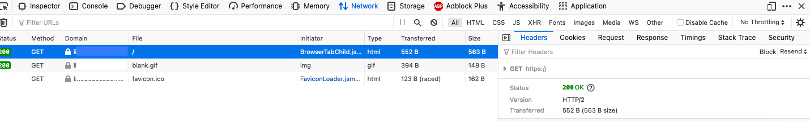

[*HTTP/2*](https://en.wikipedia.org/wiki/HTTP/2) updates the original *Hypertext Transfer Protocol* (HTTP) specification to offer improvements in efficiency and latency. The new version includes several other new features while maintaining compatibility with older browsers. Due to the clear advantages of HTTP/2, web servers should be upgraded to use the new version. This guide explains how to configure, use, and test HTTP/2 with an [*NGINX*](https://www.nginx.com/) server. For a deep-dive into the HTTP/2 protocol see our [An Introduction to HTTP/2](/docs/guides/introducing-http-2/) guide.

## Before You Begin

1.  If you have not already done so, create a Linode account and Compute Instance. See our [Getting Started with Linode](/docs/guides/getting-started/) and [Creating a Compute Instance](/docs/guides/creating-a-compute-instance/) guides.

1.  Follow our [Setting Up and Securing a Compute Instance](/docs/guides/set-up-and-secure/) guide to update your system. You may also wish to set the timezone, configure your hostname, create a limited user account, and harden SSH access.

1. Ensure you possess a Fully Qualified Domain Name (FQDN) for the website. The DNS records for the site must point to the Linode server.


The steps in this guide are written for non-root users. Commands that require elevated privileges are prefixed with `sudo`. If you are not familiar with the `sudo` command, see the [Linux Users and Groups](/docs/guides/linux-users-and-groups/) guide.


## A Summary of the NGINX and HTTP/2 Configuration Process

The following high-level steps are necessary to configure HTTP/2 on NGINX. These instructions are designed for Ubuntu but are generally applicable for all Linux distributions.

1. Install NGINX.
1. Enable HTTPS Using Certbot and Let's Encrypt Certificates.
1. Configure NGINX for HTTP/2 Support.

### Install NGINX

The following instructions install the NGINX environment required to support HTTP/2 and encryption. If NGINX is already installed, skip this section and proceed to the [Enable HTTPS Using Certbot and Let's Encrypt Certificates](/docs/guides/how-to-configure-http-2-on-nginx/#enable-https-using-certbot-and-lets-encrypt-certificates) step. For more information about NGINX, consult the Linode's [How to Configure NGINX](/docs/web-servers/nginx/how-to-configure-nginx) guide.

1. Update the system packages to pick up the newest version of NGINX. Reboot the system if advised to do so.

        sudo apt-get update
        sudo apt-get upgrade
1. Install the basic `nginx` package.

        sudo apt install nginx
1. Use `systemctl` to verify NGINX is `active`.

        systemctl status nginx
    
    nginx.service - A high performance web server and a reverse proxy server
    Loaded: loaded (/lib/systemd/system/nginx.service; enabled; vendor preset: enabled)
    Active: active (running) since Tue 2021-05-04 21:01:15 UTC; 7s ago
    
1. (**Optional**) NGINX is configured to activate whenever the system boots. To change this behavior, disable it in `systemctl`.

        systemctl disable nginx
1. Configure the `ufw` firewall to deny unauthorized access attempts. Allow both `OpenSSH` and `Nginx Full`. This permits access for all versions of HTTP and HTTPS.

        sudo ufw allow OpenSSH
        sudo ufw allow 'Nginx Full'
1. Enable the firewall.

        sudo ufw enable


You should configure a location block for the domain. This structure is mandatory if there is more than one domain on the Linode. See Linode's [How to Configure NGINX](/docs/web-servers/nginx/how-to-configure-nginx) guide for complete instructions.


### Enable HTTPS Using Certbot and Let's Encrypt Certificates

Most clients only support HTTP/2 if encryption is used, so HTTPS must be enabled before HTTP/2 is configured. HTTPS allows authentication and ensures all data is transmitted privately. Your website must possess a public key certificate signed by a trusted certificate authority to accept HTTPS requests. This certificate ensures you actually host and operate the site.

The [*Let's Encrypt*](https://letsencrypt.org/) service grants certificates on demand. The popular [*Certbot*](https://certbot.eff.org/) open-source tool automates and simplifies the process of generating these certificates. It identifies all of the relevant domains, manages the challenge requests, and installs the certificates. It also makes the necessary changes to the NGINX configuration files.

Certbot can be installed using the `snap` utility, which is pre-installed on Ubuntu.

1. Run the following commands to update Snap and verify the current version. If necessary, install it first using the command `sudo apt install snapd`.

        sudo snap install core
        sudo snap refresh core
        snap version
1. Remove any pre-existing Certbot packages to avoid possible conflicts.

        sudo apt-get remove certbot
1. Install Certbot.

        sudo snap install --classic certbot
    
certbot 1.12.0 from Certbot Project (certbot-eff) installed
    
1. Configure a soft link to the Certbot directory.

        sudo ln -s /snap/bin/certbot /usr/bin/certbot
1. Use Certbot to generate certificates for each domain. You can create multiple certificates with one command by specifying the `-d` option in front of each domain. Substitute your own domain name in place of `example.com` throughout the following section.

        sudo certbot --nginx -d example.com -d www.example.com
1. Certbot provides updates about the requests and challenges, and indicates which certificates were installed. You must supply some additional information if you have never used Certbot before. The messages could differ somewhat depending on the configuration.
    
Requesting a certificate for example.com and www.example.com
...
Deploying Certificate to VirtualHost /etc/nginx/sites-enabled/example.com
Deploying Certificate to VirtualHost /etc/nginx/sites-enabled/example.com
Redirecting all traffic on port 80 to ssl in /etc/nginx/sites-enabled/example.com
Redirecting all traffic on port 80 to ssl in /etc/nginx/sites-enabled/example.com

- - - - - - - - - - - - - - - - - - - - - - - - - - - - - - - - - - - - - - - -
Congratulations! You have successfully enabled <https://example.com> and
<https://www.example.com>
- - - - - - - - - - - - - - - - - - - - - - - - - - - - - - - - - - - - - - - -
...
    

### Configure NGINX for HTTP/2 Support

To enable HTTP/2 support on NGINX, edit the `server` block for the domain. This is typically found in the domain's virtual host file, which is located at `/etc/nginx/sites-available/yourdomain.com`. However, if there is only one domain on the Linode, the block might be configured inside the `/etc/nginx/sites-available/default` file.

1. Edit the file containing the server block for the domain. Append the `http2` keyword to the `listen` directives for both Ipv4 (`443`) and Ipv6 (`[::]:443`), and add the line `ssl_protocols TLSv1.2;`. Follow the example shown below.

    
    listen [::]:443 ssl http2 ipv6only=on; # managed by Certbot
    listen 443 ssl http2; # managed by Certbot
    ...
    ssl_protocols TLSv1.2;
    
1. Save the file and validate the NGINX syntax using the following command.

        sudo nginx -t
1. Restart the webserver to apply the changes.

        sudo systemctl restart nginx
1. Verify NGINX is active using `systemctl`.

        sudo systemctl status nginx

## Verify that HTTP/2 Support is Working

To confirm HTTP/2 is operating properly, visit the website and inspect the HTTP data using the browser's web development tools. The following instructions describe how to use the Firefox tools. However, each browser offers a similar tool. Consult the browser documentation for more details.

1. Visit the website using Firefox.
1. Open the Firefox Developer Tools. Select the **Tools** menu, the **Browser Tools** submenu, and the **Web Developer Tools** option. This opens the `tools` panel at the bottom of the browser
1. Select the **Network** tab, and reload the web page.
1. A list of several rows is displayed in the panel. Click on the row corresponding to the base domain. This reveals a new table on the right-hand side of the panel. Within this table, the **Headers** tab is preselected.

    
1. Review the information listed under the **Headers** tab. If HTTP/2 is working, the `Status` indicates `OK` and the `version` is `HTTP/2`. If the version is still `HTTP 1`, review the previous instructions and ensure HTTP/2 is properly configured.
