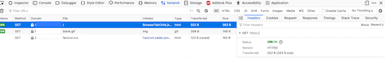

[*HTTP/2*](https://en.wikipedia.org/wiki/HTTP/2) updates the original *Hypertext Transfer Protocol* (HTTP) specification to offer improvements in efficiency and latency. The new version includes several other new features, while maintaining compatibility with older browsers. Due to the clear advantages of HTTP/2, web servers should be upgraded to use the new version. This guide explains how to configure, use, and test HTTP/2 with an [*NGINX*](https://www.nginx.com/) server.

## Understanding HTTP/2

The majority of the most popular web sites have now adopted HTTP/2. It is supported by all major browsers, and is considered to be the current standard. Due to optimizations in how data is transmitted, HTTP/2 significantly improves speed and latency. Its major changes are internal, dealing with transport and framing, so users are not required to make any adjustments. Clients and servers can negotiate whether to use HTTP/2 or fall back to the previous version. HTTP/2 continues to use the same fields, format, and status codes as before, and still works with the *Transport Control Protocol* (TCP). Most clients cannot use HTTP/2 without data encryption, so in practice *Hypertext Transfer Protocol Secure* (HTTPS) is required for all transactions.

HTTP/2 introduces the concept of streams, which are bidirectional data flows. Streams allow messages to be multiplexed, reducing the likelihood of head-of-line blocking problems. This issue arises when a delayed or missing packet blocks the receipt of subsequent packets. A single connection contains multiple streams, which collectively transport the HTTP messages. Each message is transmitted as a series of frames, while each frame maps back to its parent stream.

The other new HTTP/2 features improve speed and reliability. *Data compression of headers* reduces the amount of header metadata by over 80%. The *server push* feature permits the web server to pro-actively send a client resources based on the full contents of the web page. The client does not have to request these elements, and can choose to reject them. This function cuts out several intermediate steps and speeds up the rendering of web pages. *Message prioritization* permits a client to mark pending requests as urgent or indicate dependencies between streams. Devices can implement their own version of a credit-based *flow control* based on infrastructure that HTTP/2 provides.

Upgrading a web server to HTTP/2 allows clients to benefit from the performance improvements, decreased latency, and data compression. Because the number of connections is reduced, web servers running HTTP/2 use less memory and allocate fewer resources. In addition, fewer resource-intensive HTTPS negotiations and handshakes are initiated.

Linode's [Introduction to HTTP/2](/docs/guides/an-introduction-to-http-2) provides additional background information on the protocol.

## Before You Begin

1.  Familiarize yourself with Linode's [Getting Started](/docs/getting-started/) guide and complete the steps for setting your Linode's hostname and timezone.

2.  This guide uses `sudo` wherever possible. Complete the sections of Linode's [Securing Your Server](/docs/security/securing-your-server/) to create a standard user account, harden SSH access and remove unnecessary network services. Do **not** follow the Configure a Firewall section yet--this guide includes firewall rules specifically for an OpenVPN server.

3.  Update your system:

        sudo apt-get update && sudo apt-get upgrade

4.  Ensure you possess a Fully Qualified Domain Name for the website. The DNS records for the site must point to the Linode server.


This guide is written for a non-root user. Commands that require elevated privileges are prefixed with `sudo`. If you are not familiar with the `sudo` command, see the [Users and Groups](/docs/tools-reference/linux-users-and-groups/) guide.


## A Summary of the HTTP/2 on NGINX Configuration Process

The following high-level steps are necessary to configure HTTP/2 on NGINX. These instructions are designed for Ubuntu, but are generally applicable for all Linux distributions.

1.  Installing NGINX.
2.  Enabling HTTPS Using Certbot and Let's Encrypt Certificates.
3.  Configuring NGINX for HTTP/2 Support.

### Installing NGINX

The following instructions install the NGINX environment required to support HTTP/2 and encryption. If NGINX is already installed, skip ahead to the "Enabling HTTPS Using Certbot and Let's Encrypt Certificates" section. For more information about NGINX, consult the Linode [NGINX configuration guide](/docs/web-servers/nginx/how-to-configure-nginx).

1.  Update the system packages to pick up the newest version of NGINX. Reboot the system if advised to do so.

        sudo apt-get update
        sudo apt-get upgrade
2.  Install the basic `nginx` package.

        sudo apt install nginx
3.  Use `systemctl` to verify NGINX is `active`.

        systemctl status nginx
    
    nginx.service - A high performance web server and a reverse proxy server
    Loaded: loaded (/lib/systemd/system/nginx.service; enabled; vendor preset: enabled)
    Active: active (running) since Tue 2021-05-04 21:01:15 UTC; 7s ago
    
4.  **Optional** NGINX is configured to activate whenever the system boots. To change this behavior, disable it in `systemctl`.

        systemctl disable nginx
5.  Configure the `ufw` firewall to deny unauthorized access attempts. Allow both `OpenSSH` and `Nginx Full`. This permits access for all versions of HTTP and HTTPS.

        sudo ufw allow OpenSSH
        sudo ufw allow 'Nginx Full'
6.  Enable the firewall.

        sudo ufw enable


You should configure a location block for the domain. This structure is mandatory if there is more than one domain on the Linode. See Linode's [NGINX guide](/docs/web-servers/nginx/how-to-configure-nginx) for complete instructions.


### Enabling HTTPS Using Certbot and Let's Encrypt Certificates

Most clients only support HTTP/2 if encryption is used, so HTTPS must be enabled before HTTP/2 is configured. HTTPS allows authentication and ensures all data is transmitted privately. Your web site must possess a public key certificate signed by a trusted certificate authority to accept HTTPS requests. This certificate ensures you actually host and operate the site.

The [*Let's Encrypt*](https://letsencrypt.org/) service grants certificates on demand. The popular [*Certbot*](https://certbot.eff.org/) open source tool automates and simplifies the process of generating these certificates. It identifies all of the relevant domains, manages the challenge requests, and installs the certificates. It also makes the necessary changes to the NGINX configuration files.

Certbot can be installed using the `snap` utility, which is pre-installed on Ubuntu.

1.  Run the following commands to update Snap and verify the current version. If necessary, install it first using the command `sudo apt install snapd`.

        sudo snap install core
        sudo snap refresh core
        snap version
2.  Remove any pre-existing Certbot packages to avoid possible conflicts.

        sudo apt-get remove certbot
3.  Install Certbot.

        sudo snap install --classic certbot
    
certbot 1.12.0 from Certbot Project (certbot-eff) installed
    
4.  Configure a soft link to the Certbot directory.

        sudo ln -s /snap/bin/certbot /usr/bin/certbot
5.  Use Certbot to generate certificates for each domain. You can create multiple certificates with one command by specifying the `-d` option in front of each domain. Substitute your own domain name in place of `example.com` throughout the following section.

        sudo certbot --nginx -d example.com -d www.example.com
6.  Certbot provides updates about the requests and challenges, and indicates which certificates were installed. You must supply some additional information if you have never used Certbot before. The messages could differ somewhat depending on the configuration.
    
Requesting a certificate for example.com and www.example.com
...
Deploying Certificate to VirtualHost /etc/nginx/sites-enabled/example.com
Deploying Certificate to VirtualHost /etc/nginx/sites-enabled/example.com
Redirecting all traffic on port 80 to ssl in /etc/nginx/sites-enabled/example.com
Redirecting all traffic on port 80 to ssl in /etc/nginx/sites-enabled/example.com

- - - - - - - - - - - - - - - - - - - - - - - - - - - - - - - - - - - - - - - -
Congratulations! You have successfully enabled https://example.com and
https://www.example.com
- - - - - - - - - - - - - - - - - - - - - - - - - - - - - - - - - - - - - - - -
...
    

### Configuring NGINX for HTTP/2 Support

To enable HTTP/2 support on NGINX, edit the `server` block for the domain. This is typically found in the domain's virtual host file, which is located at `/etc/nginx/sites-available/yourdomain.com`. However, if there is only one domain on the Linode, the block might be configured inside the `/etc/nginx/sites-available/default` file.

1.  Edit the file containing the server block for the domain. Append the `http2` keyword to the `listen` directives for both Ipv4 (`443`) and Ipv6 (`[::]:443`), and add the line `ssl_protocols TLSv1.2;`. Follow the example shown below.

    
    listen [::]:443 ssl http2 ipv6only=on; # managed by Certbot
    listen 443 ssl http2; # managed by Certbot
    ...
    ssl_protocols TLSv1.2;
    
2.  Save the file and validate the NGINX syntax using the following command.

        sudo nginx -t
3.  Restart the web server to apply the changes.

        sudo systemctl restart nginx
4.  Confirm NGINX is `active`.

        sudo systemctl status nginx

## Verifying that HTTP/2 Support is Working.

To confirm HTTP/2 is operating properly, visit the web site and inspect the HTTP data using the browser's web development tools. The following instructions describe how to use the Firefox tools. However, each browser offers a similar tool. Consult the browser documentation for more details.

1.  Visit the web site using Firefox.
2.  Open the Firefox Developer Tools. Select the **Tools** menu, the **Browser Tools** submenu, and the **Web Developer Tools** option. This opens the `tools` panel at the bottom of the browser
3.  Select the **Network** tab, and reload the web page.
4.  A list of several rows is displayed in the panel. Click on the row corresponding to the base domain. This reveals a new table on the right-hand side of the panel. Within this table, the **Headers** tab is preselected.

    
5.  Review the information listed under the **Headers** tab. If HTTP/2 is working, the `Status` indicates `OK` and the `version` is `HTTP/2`. If the version is still `HTTP 1`, review the previous instructions and ensure HTTP/2 is properly configured.

## More Information on HTTP/2

To learn more about the HTTP/2 protocol, consult the following resources.

*   [Linode's Introduction to HTTP/2](/docs/guides/an-introduction-to-http-2).
*   [*The IETF RFC 7540 on HTTP/2*](https://tools.ietf.org/html/rfc7540).
*   [*An HTTP/2 introduction on the google developers site*](https://developers.google.com/web/fundamentals/performance/http2).
*   [*A chapter on HTTP/2 from the O'Reilly guide*](https://hpbn.co/http2/).
*   [*The HTTP/2 Wikipedia page*](https://en.wikipedia.org/wiki/HTTP/2).