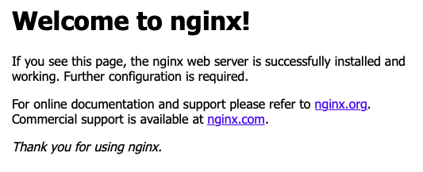
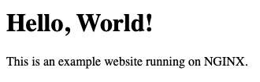

[NGINX](https://nginx.org/) (pronounced "engine-X") is an open-source web server that excels at load balancing, caching, and acting as a reverse proxy. NGINX was developed with efficiency and concurrency in mind, seeking to address the scalability and performance issues in other popular web servers. Its event-driven architecture continues to set it apart as one of the highest-performing web servers available. This guide aims to show you how to install NGINX on your Ubuntu 20.04 server and how to get started using it.

## Before You Begin

1.  If you have not already done so, create a Linode account and Compute Instance. See our [Getting Started with Linode](/docs/guides/getting-started/) and [Creating a Compute Instance](/docs/guides/creating-a-compute-instance/) guides.

1.  Follow our [Setting Up and Securing a Compute Instance](/docs/guides/set-up-and-secure/) guide to update your system. You may also wish to set the timezone, configure your hostname, create a limited user account, and harden SSH access.


This guide is written for non-root users. Commands that require elevated privileges are prefixed with `sudo`. If you are not familiar with the `sudo` command, see the [Linux Users and Groups](/docs/guides/linux-users-and-groups/) guide.


## Install NGINX

1. Install NGINX from the package manager.

        sudo apt install nginx

1. The NGINX service starts running immediately. You can verify its status with the following command:

        sudo systemctl status nginx

    The NGINX service is also enabled by default, meaning that it begins running automatically at system startup.

1. Open port **80** on your system's firewall. UFW is the frontend typically used to manage firewall rules on Ubuntu. You can use the example commands to open port 80 with `ufw` and reload the rules so they take effect.

        sudo ufw allow http
        sudo ufw reload

    Refer to our [How to Configure a Firewall with UFW](/docs/guides/configure-firewall-with-ufw/) guide for more on how to use UFW for managing your firewall.

1. Visit the default NGINX page to see your installation in action. You can find it by navigating to your server's domain name or its IP address.

    For example, if your domain name is `example.com`, navigate to `http://example.com`; if your IP address is `192.0.2.0`, you can instead navigate to  `http://192.0.2.0`.

    

## Manage NGINX

The NGINX service runs on `systemd`, which means you can manage it using `systemctl` commands.

1. View the current status of the NGINX service using the command below:

        sudo systemctl status nginx

1. Stop the NGINX service with the following command:

        sudo systemctl stop nginx

    You can then start the NGINX service back up using the following command:

        sudo systemctl start nginx

1. To disable the NGINX service, preventing it from beginning automatically at system startup, execute the following:

        sudo systemctl disable nginx

    You can enable the NGINX service again using:

        sudo systemctl enable nginx

1. Restart the NGINX service using the command below:

        sudo systemctl restart nginx

1. To reload NGINX's configuration files, you an use the following command:

        sudo systemctl reload nginx

## Use NGINX

This section walks you through setting up your own website using NGINX. In doing so, it also illustrates how to set up an NGINX proxy to serve static content.

### NGINX Configuration

1. Disable the default NGINX configuration file.

        sudo unlink /etc/nginx/sites-enabled/default

1. Create an NGINX configuration file for your site.

    In this example, replace `example.com` with your site's domain, in both the filename, and in the file's contents. Do the same whenever you see `example.com` from here on.

    
server {
    listen 80;
    listen [::]:80;
    server_name  example.com;

    root /var/www/example.com;
    index index.html;

    location / {
        try_files $uri $uri/ =404;
    }
}
    

    This configuration creates a new NGINX server. That server listens for requests on port **80** for the domain name `example.com`. It then defines the server's root directory and index file name. The root directory is where NGINX maps requests to files, and the index file name is the name of the file NGINX serves for a request to the root directory.

    So, for a request to `example.com/`, NGINX attempts to locate an `index.html` file in the `/var/www/example.com` directory and serves the file if it finds it there.

1. Enable your NGINX site.

        sudo ln -s /etc/nginx/sites-available/example.com /etc/nginx/sites-enabled/

1. Run NGINX's configuration test to verify your configuration file.

        sudo nginx -t

1. Restart NGINX for the changes to take effect.

        sudo systemctl restart nginx

### Launch the Site

1. Create a directory for your NGINX site's content.

        sudo mkdir /var/www/example.com

1. Create an `index.html` page in the new NGINX site directory.

    
<!doctype html>
<html>
<body>
    <h1>Hello, World!</h1>
    
This is an example website running on NGINX.

</body>
</html>
    

1. In a browser, visit the domain you set up for your website.

    You should see your website's "Hello, World!" page.

    

## Conclusion

To learn more about NGINX's features and capabilities, check out our [A Comparison of the NGINX and Apache Web Servers](/docs/guides/comparing-nginx-and-apache-web-servers/) guide.

For more advanced configuration options, including security and performance optimizations and TLS setup, see our four-part series on NGINX.

- [Part 1: Installation and Basic Setup](/docs/guides/getting-started-with-nginx-part-1-installation-and-basic-setup/)
- [Part 2: (Slightly More) Advanced Configurations](/docs/web-servers/nginx/slightly-more-advanced-configurations-for-nginx/)
- [Part 3: Enable TLS for HTTPS Connections](/docs/guides/getting-started-with-nginx-part-3-enable-tls-for-https/)
- [Part 4: TLS Deployment Best Practices](/docs/guides/getting-started-with-nginx-part-4-tls-deployment-best-practices/)
