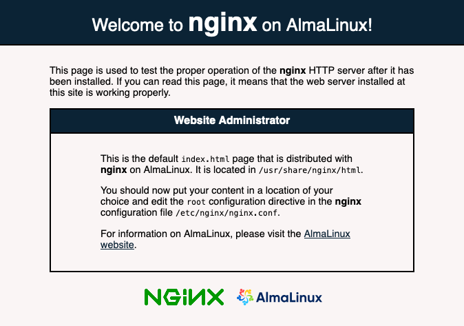

[NGINX](https://nginx.org/) (pronounced "engine-X") is an open-source web server that excels at load balancing, caching, and acting as a reverse proxy. NGINX was created to be a high-performing and scalable alternative to other popular web servers, like Apache. Its event-driven architecture continues to set it apart as one of the fastest and lightest web servers available. This guide shows you how to install NGINX on your AlmaLinux 8 server and how to get started using it.

## Before You Begin

1.  If you have not already done so, create a Linode account and Compute Instance. See our [Getting Started with Linode](/docs/guides/getting-started/) and [Creating a Compute Instance](/docs/guides/creating-a-compute-instance/) guides.

1.  Follow our [Setting Up and Securing a Compute Instance](/docs/guides/set-up-and-secure/) guide to update your system. You may also wish to set the timezone, configure your hostname, create a limited user account, and harden SSH access.


This guide is written for non-root users. Commands that require elevated privileges are prefixed with `sudo`. If you’re not familiar with the `sudo` command, see the [Users and Groups](/docs/guides/linux-users-and-groups/) guide.


## Install NGINX

1. Install NGINX from the package manager.

        sudo yum install nginx

1. Enable and start the NGINX service.

        sudo systemctl enable nginx
        sudo systemctl start nginx

1. Open port **80** — the HTTP port — on your system's firewall. *FirewallD* is the front end typically used to manage firewall rules on AlmaLinux. You can use the following commands to open port **80** and reload the rules so they take effect.

        sudo firewall-cmd --zone=public --add-service=http
        sudo firewall-cmd --zone=public --add-service=http --permanent
        sudo firewall-cmd --reload

    Refer to our [Introduction to FirewallD on CentOS](/docs/guides/introduction-to-firewalld-on-centos/) for more on how to use FirewallD for managing your server's firewall.

1. Visit the default NGINX page to see your installation in action. You can find it by navigating to your server's domain name or its IP address.

    For example, if your domain name is `example.com`, navigate to `http://example.com`; if your IP address is `192.0.2.0`, you can instead navigate to  `http://192.0.2.0`.

    

## Manage NGINX

The NGINX service runs on `systemd`, which means you can manage it using `systemctl` commands.

- View the current status of the NGINX service using the following command:

        sudo systemctl status nginx

- Stop the NGINX service using the following command:

        sudo systemctl stop nginx

    You can then restart the NGINX service using the following command:

        sudo systemctl start nginx

- To disable the NGINX service, preventing it from beginning automatically at system startup, use:

        sudo systemctl disable nginx

    You can enable the NGINX service again using:

        sudo systemctl enable nginx

- Restart the NGINX service using the following command:

        sudo systemctl restart nginx

- To reload NGINX's configuration files, use the following command:

        sudo systemctl reload nginx

## Using NGINX

This section walks you through setting up your own website using NGINX. It also illustrates how to set up an NGINX proxy to serve static content.

### NGINX Configuration

1. Open the main NGINX configuration file — `/etc/nginx/nginx.conf` — and disable the default website by commenting out the `root` line.

    
# [...]

server {
    listen       80 default_server;
    listen       [::]:80 default_server;
    server_name  _;
    # root         /usr/share/nginx/html;

# [...]
    

1. Create an NGINX configuration file for your site.

    - In this example, replace `example.com` with your site's domain, in both the filename and the file's contents. Do the same wherever you see `example.com` throughout this guide.

       
server {
    listen 80;
    listen [::]:80;
    server_name  example.com;

    root /var/www/example.com;
    index index.html;

    location / {
        try_files $uri $uri/ =404;
    }
}
    

    - This configuration creates a new NGINX server. That server listens for requests on port **80** for the domain name `example.com`. It then defines the server's root directory and index file name. The root directory is where NGINX maps requests to files, and the index file name is the name of the file NGINX serves for a request to the root directory.

    - So, for a request to `example.com/`, NGINX attempts to locate an `index.html` file in the `/var/www/example.com` directory, and serves the file if it finds it there.

1. Run NGINX's configuration test to verify your configuration files.

        sudo nginx -t

1. Restart NGINX for the changes to take effect.

        sudo systemctl restart nginx

### Launch the Site

1. Create a directory for your NGINX site's content.

        sudo mkdir -p /var/www/example.com

1. Create an `index.html` page in the new NGINX site directory.

    
<!doctype html>
<html>
<body>
    <h1>Hello, World!</h1>
    
This is an example website running on NGINX.

</body>
</html>
    

1. Give the NGINX user ownership of the directory for your website, and then add executable permissions to its parent directory.

        sudo chown -R nginx:nginx /var/www/example.com
        sudo chmod -R +x /var/www

1. Use the `chcon` command to change the SELinux security context for the website directory to allow web content.

        sudo chcon -t httpd_sys_content_t /var/www/example.com -R
        sudo chcon -t httpd_sys_rw_content_t /var/www/example.com -R

1. In a browser, visit the domain you set up for your website — `example.com` above.

    You should see your website's "Hello, World!" page.

    

## Conclusion

To learn more about NGINX's features and capabilities, check out our [A Comparison of the NGINX and Apache Web Servers](/docs/guides/comparing-nginx-and-apache-web-servers/) guide.

For more advanced configuration options, including security and performance optimizations and TLS setup, see our four-part Getting Started series on NGINX.

- [Part 1: Installation and Basic Setup](/docs/guides/getting-started-with-nginx-part-1-installation-and-basic-setup/)
- [Part 2: (Slightly More) Advanced Configurations](/docs/web-servers/nginx/slightly-more-advanced-configurations-for-nginx/)
- [Part 3: Enable TLS for HTTPS Connections](/docs/guides/getting-started-with-nginx-part-3-enable-tls-for-https/)
- [Part 4: TLS Deployment Best Practices](/docs/guides/getting-started-with-nginx-part-4-tls-deployment-best-practices/)
