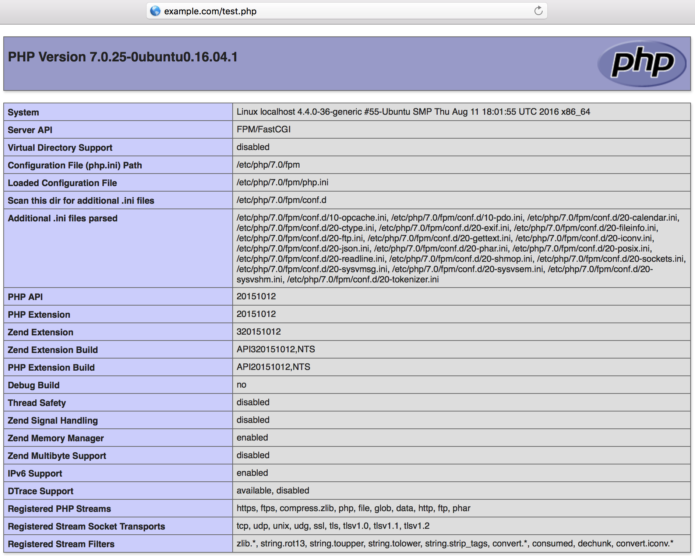

The [PHP Fast Process Manager](https://php-fpm.org/) is a [FastCGI](https://en.wikipedia.org/wiki/FastCGI) handler for [PHP](https://secure.php.net/) scripts and applications. It's commonly paired with web servers to serve applications which require a PHP framework, such as web forums or login gateways, while the web server returns HTML, JavaScript, and other non-PHP content.

## Before You Begin

- **You need a working NGINX setup.** If you do not already have that, complete Part 1 of our Getting Started with NGINX series: [*Basic Installation and Setup*](/docs/guides/getting-started-with-nginx-part-1-installation-and-basic-setup/).

- You will need root access to the system, or a user account with `sudo` privileges.

- Update your system’s packages.

## Install and Configure PHP-FPM

1.  Install the PHP process manager. On CentOS, Debian, and Ubuntu, the package name to install is `php-fpm`.

    You can verify the PHP-FPM service is running with:

        systemctl status php7.0-fpm.service

2.  Depending on your distribution and PHP version, the PHP configuration files will be stored in different locations. This guide is using PHP 7.0 from Ubuntu's repositories on Ubuntu 16.04 as an example, and the `/etc/php/7.0/fpm/pool.d/www.conf` and `/etc/php/7.0/fpm/php.ini` files are what we'll be modifying.

    Find those full file paths using a `find` command:

        find / \( -iname "php.ini" -o -name "www.conf" \)

    The output should look similar to:

        root@localhost:~# find / \( -iname "php.ini" -o -name "www.conf" \)
        /etc/php/7.0/fpm/php.ini
        /etc/php/7.0/fpm/pool.d/www.conf
        /etc/php/7.0/cli/php.ini

3.  The `listen.owner` and `listen.group` directives determines owner for PHP-FPM socket. Those are set to `www-data` by default, but they need to match the user and group NGINX is running as. If you installed NGINX using our [*Getting Started with NGINX*](/docs/web-servers/) series, then your setup will be using the `nginx` user and group. You can verify with:

        ps -aux | grep nginx

    The output should be similar to:

        root@localhost:~# ps -aux | grep nginx
        root      3448  0.0  0.0  32500  3516 ?        Ss   18:21   0:00 nginx: master process /        usr/sbin/nginx -c /etc/nginx/nginx.conf
        nginx     3603  0.0  0.0  32912  2560 ?        S    18:24   0:00 nginx: worker process
        nginx     3604  0.0  0.0  32912  3212 ?        S    18:24   0:00 nginx: worker process

    This shows the NGINX master process is running as `root`, and the worker processes are running as the `nginx` user and group. Change the `listen` directives to that:

        sed -i 's/listen.owner = www-data/listen.owner = nginx/g' /etc/php/7.0/fpm/pool.d/www.conf
        sed -i 's/listen.group = www-data/listen.group = nginx/g' /etc/php/7.0/fpm/pool.d/www.conf

4.  By default, PHP-FPM process is run as the `www-data` user and group. Again, those need to be edited so that those match user and group of running NGINX instance, otherwise permission errors may occur when NGINX passed PHP requests to PHP-FPM.

    Change `user` and `group` directives to NGINX user and group:

        sed -i 's/user = www-data/user = nginx/g' /etc/php/7.0/fpm/pool.d/www.conf
        sed -i 's/group = www-data/group = nginx/g' /etc/php/7.0/fpm/pool.d/www.conf

5.  When pairing NGINX with PHP-FPM, it's possible to return to NGINX a `.php` URI that does not actually exist within the site's directory structure. The PHP processor will process the URI, and execute the `.php` file, because its job is to process anything handed to it by NGINX. This presents a security problem.

    It's important to limit what NGINX passes to PHP-FPM so malicious scripts can't be injected into return streams to the server. Instead, the request is stopped, possibly then resulting in a 404. There are multiple ways to do this ([see the NGINX wiki](https://www.nginx.com/resources/wiki/start/topics/tutorials/config_pitfalls/?highlight=pitfalls#passing-uncontrolled-requests-to-php)) but here we chose to specify the setting in PHP-FPM rather than in NGINX's configuration.

        sed -i 's/;cgi.fix_pathinfo=1/cgi.fix_pathinfo=0/g' /etc/php/7.0/fpm/php.ini

    You'll notice that `;cgi.fix_pathinfo=1` is commented out by default. Setting it to `0` and uncommenting it will enforce the configuration should there be any upstream changes in the default value in the future.

6.  Restart PHP-FPM to apply the changes:

        systemctl restart php7.0-fpm.service

## Configure the NGINX Server Block

1.  Again pulling from [Part 1 of our NGINX series](/docs/guides/getting-started-with-nginx-part-1-installation-and-basic-setup/#configuration-recap), we'll start with a basic Server Block for a static HTTP page being served from `/var/www/example.com`. Replace `example.com` with your site's domain or IP address, and the `root` directive with your site's root directory.

    
server {
    listen         80 default_server;
    listen         [::]:80 default_server;
    server_name    example.com www.example.com;
    root           /var/www/example.com;
    index          index.html;
}


2.  To the Server Block above, add a `location` block containing the PHP directives. You should then have:

    
server {
    listen         80 default_server;
    listen         [::]:80 default_server;
    server_name    example.com www.example.com;
    root           /var/www/example.com;
    index          index.html;

  location ~* \.php$ {
    fastcgi_pass unix:/run/php/php7.0-fpm.sock;
    include         fastcgi_params;
    fastcgi_param   SCRIPT_FILENAME    $document_root$fastcgi_script_name;
    fastcgi_param   SCRIPT_NAME        $fastcgi_script_name;
  }
}


    This is just a bare minimum to get PHP-FPM working and you will want to configure it further for your specific needs. Some further points about the configuration above:

    - The location `~* \.php$` means that NGINX will apply this configuration to all `.php` files (file names are not case sensitive) in your site's root directory, including any subdirectories containing PHP files.
    - The `*` in the `~* \.php$` location directive indicates that PHP file names are not case sensitive. This can be removed if you prefer to enforce letter case.
    - The `fastcgi_pass` location must match the `listen =` value in `/etc/php/7.0/fpm/pool.d/www.conf`. It is preferable for performance reasons for PHP-FPM to listen on a UNIX socket instead of a TCP address. Only change this if you require PHP-FPM use network connections.
    - Using `$document_root` in the `SCRIPT_FILENAME` parameter instead of an absolute path is preferred by [NGINX's documentation](https://www.nginx.com/resources/wiki/start/topics/tutorials/config_pitfalls/?highlight=pitfalls#fastcgi-path-in-script-filename).

    Here's a variation of the `location` block above. This includes an `if` statement which disallows the FPM to process files in the `/uploads/` directory. This is a security measure which prevents people from being able to upload `.php` files to your server or application which the FastCGI process manager would then execute.

    This only applicable if you allow users to upload or submit files to your site. Change the name of the directory from `uploads` to whatever suits your need.

    
  location ~* \.php$ {
    if ($uri !~ "^/uploads/") {
        fastcgi_pass unix:/run/php/php7.0-fpm.sock;
        }
    include         fastcgi_params;
    fastcgi_param   SCRIPT_FILENAME    $document_root$fastcgi_script_name;
    fastcgi_param   SCRIPT_NAME        $fastcgi_script_name;
  }


3.  Reload NGINX:

        nginx -s reload

4.  Create a test PHP file so you can verify FPM is working. In the Server Block above, our site is being served from `/var/www/example.com`, so we'll create a test file there:

        echo "<?php phpinfo(); ?>" >> /var/www/example.com/test.php

5.  Access `test.php` from a web browser, using your site's domain or Linode's IP address. You should see the PHP configuration page:

    
