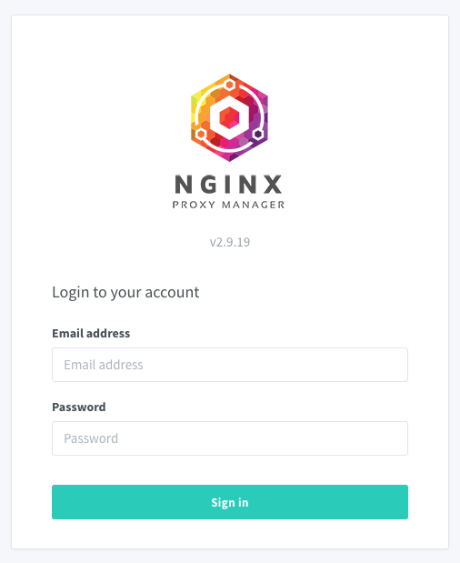
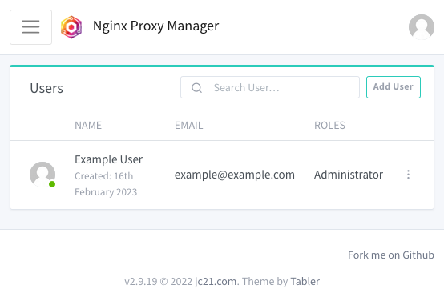
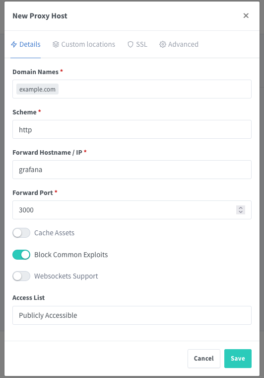
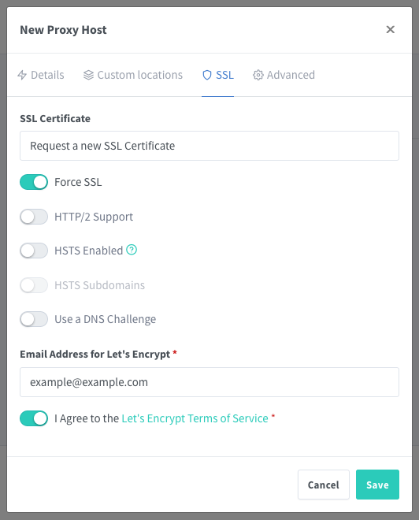
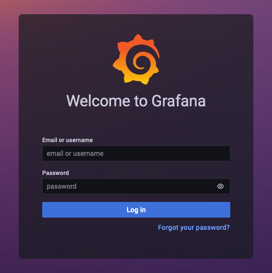

The Nginx Proxy Manager offers a convenient tool for managing proxy hosting. The proxy manager makes it relatively easy to forward traffic to your services, whether running on the cloud or your home network.

This tutorial introduces the Nginx Proxy Manager and illustrates how to start using it. Learn how to install the Nginx Proxy Manager and use it to set up proxy hosts for your own services.

## Before You Begin

1.  If you have not already done so, create a Linode account and Compute Instance. See our [Getting Started with Linode](/docs/guides/getting-started/) and [Creating a Compute Instance](/docs/guides/creating-a-compute-instance/) guides.

1.  Follow our [Setting Up and Securing a Compute Instance](/docs/guides/set-up-and-secure/) guide to update your system. You may also wish to set the timezone, configure your hostname, create a limited user account, and harden SSH access.


This guide is written for a non-root user. Commands that require elevated privileges are prefixed with `sudo`. If you’re not familiar with the `sudo` command, see the [Users and Groups](/docs/guides/linux-users-and-groups/) guide.


## What Is the Nginx Proxy Manager?

The [Nginx Proxy Manager](https://nginxproxymanager.com/) allows you to create and manage proxy hosts.

With a traditional Nginx setup, creating and maintaining proxies can be time consuming, and sometimes more effort than it's worth. The Nginx Proxy Manager takes all of the steps involved and packages them into a convenient web interface. Once your services are running, you can easily create a proxy host within the Nginx Proxy Manager to forward traffic according to your specifications.

However, the Nginx Proxy Manager may not be well-suited to more advanced use cases. For instance, the proxy manager does not have load balancing and other more advanced features of standard Nginx.

Nevertheless, the proxy manager can significantly help with many web service setups. It is especially useful for deploying proxies for services running on premise. The proxy manager can also be beneficial for administrator services, offering server-monitoring tools and website administration interfaces.

For most cases, the Nginx Proxy Manager's convenience and ease of use make it a compelling solution.

## How to Run the Nginx Proxy Manager

The Nginx Proxy Manager provides access to a dashboard for managing proxy services. The setup is relatively straightforward. Once the Nginx Proxy Manager is running, everything else is covered within the manager's web interface.

Follow along to get an Nginx Proxy Manager instance up and running.

### Installing Docker and Docker Compose

Docker Compose is the recommended method for running the Nginx Proxy Manager. To begin, install Docker and the Docker Compose plugin on your system.

This tutorial covers the steps required for Debian and Ubuntu as well as AlmaLinux, CentOS Stream, Fedora, and Rocky Linux systems. For other operating systems and distributions, refer to the [official instructions](https://docs.docker.com/engine/install/#server) for installing Docker Engine.

#### Debian and Ubuntu

1.  Remove any existing Docker installations:

    ```command
    sudo apt remove docker docker-engine docker.io containerd runc
    ```

1.  Install the prerequisite packages for adding the Docker repository to the APT package manager:

    ```command
    sudo apt install ca-certificates curl gnupg lsb-release
    ```

1.  Add the GPG key for the Docker repository for your distribution to the APT package manager:

    ```command {title="Debian"}
    sudo mkdir -m 0755 -p /etc/apt/keyrings
    curl -fsSL https://download.docker.com/linux/debian/gpg | sudo gpg --dearmor -o /etc/apt/keyrings/docker.gpg
    ```

    ```command {title="Ubuntu"}
    sudo mkdir -m 0755 -p /etc/apt/keyrings
    curl -fsSL https://download.docker.com/linux/ubuntu/gpg | sudo gpg --dearmor -o /etc/apt/keyrings/docker.gpg
    ```

1.  Add the Docker repository for your distribution to the APT package manager:

    ```command {title="Debian"}
    echo "deb [arch=$(dpkg --print-architecture) signed-by=/etc/apt/keyrings/docker.gpg] https://download.docker.com/linux/debian $(lsb_release -cs) stable" | sudo tee /etc/apt/sources.list.d/docker.list > /dev/null
    ```

    ```command {title="Ubuntu"}
    echo "deb [arch=$(dpkg --print-architecture) signed-by=/etc/apt/keyrings/docker.gpg] https://download.docker.com/linux/ubuntu $(lsb_release -cs) stable" | sudo tee /etc/apt/sources.list.d/docker.list > /dev/null
    ```

1.  Update the APT indices, then install the Docker Engine along with the Docker Compose plugin:

    ```command
    sudo apt update
    sudo apt install docker-ce docker-ce-cli containerd.io docker-buildx-plugin docker-compose-plugin
    ```

#### AlmaLinux, CentOS Stream, Fedora, and Rocky Linux

1.  Remove any existing Docker installations:

    ```command
    sudo dnf remove docker docker-client docker-client-latest docker-common docker-latest docker-latest-logrotate docker-logrotate docker-selinux docker-engine-selinux docker-engine
    ```

1.  Install the core plugins for the DNF package manager. These provide access to tools for managing DNF repositories.

    ```command
    sudo dnf -y install dnf-plugins-core
    ```

1.  Add the Docker repository for your distribution to the DNF package manager:

    ```command {title="AlmaLinux, CentOS Stream, and Rocky Linux"}
    sudo dnf config-manager --add-repo https://download.docker.com/linux/centos/docker-ce.repo
    ```

    ```command {title="Fedora"}
    sudo dnf config-manager --add-repo https://download.docker.com/linux/fedora/docker-ce.repo
    ```

1.  Install the Docker Engine along with the Docker Compose plugin:

    ```command
    sudo dnf install docker-ce docker-ce-cli containerd.io docker-buildx-plugin docker-compose-plugin
    ```

    If prompted to verify the GPG key, you should see the following key listed:

    ```output
    060A 61C5 1B55 8A7F 742B 77AA C52F EB6B 621E 9F35
    ```

Once installed, ensure that the Docker daemon is running:

```command
sudo systemctl status docker
```

```output
● docker.service - Docker Application Container Engine
   Loaded: loaded (/usr/lib/systemd/system/docker.service; enabled; vendor preset: disabled)
   Active: active (running) since Thu 2023-02-16 20:38:07 UTC; 1s ago
     Docs: https://docs.docker.com
```

If it is not running (`active`), enable and start the Docker daemon with the following commands:

```command
sudo systemctl enable docker
sudo systemctl start docker
```

### Running the Nginx Proxy Manager

With the prerequisites in place, start up the Nginx Proxy Manager. This calls for deploying a Docker Compose configuration, which is provided in the steps below.

1.  First, create a directory for the Nginx Proxy Manager's Docker Compose files, and change into that directory. This tutorial uses the directory `~/nginx-proxy-manager/`, and the remaining steps assume you are working out of this directory.

    ```command
    mkdir ~/nginx-proxy-manager/
    cd ~/nginx-proxy-manager/
    ```

1.  Create a `docker-compose.yml` file within the directory:

    ```command
    nano docker-compose.yml
    ```

1.  Give the file the following contents:

    ```file {title="docker-compose.yml" lang="yaml"}
    version: "3"

    networks:
      proxiable:
        name: proxiable

    services:
      app:
        image: 'jc21/nginx-proxy-manager:latest'
        container_name: nginxproxymanager
        restart: unless-stopped
        volumes:
          - ./data:/data
          - ./letsencrypt:/etc/letsencrypt
        ports:
          - '80:80'
          - '443:443'
          - '81:81'
        networks:
          - proxiable
    ```

    
    The Nginx Proxy Manager additionally supports configurations for working with MySQL/MariaDB. This tutorial does not employ these, but you can see the setup in the [official instructions](https://nginxproxymanager.com/setup/#using-mysql-mariadb-database).
    

    When done, press <kbd>CTRL</kbd>+<kbd>X</kbd>, followed by <kbd>Y</kbd> then <kbd>Enter</kbd> to save the file and exit `nano`.

1.  Start up the Nginx Proxy Manager via Docker Compose:

    ```command
    sudo docker compose up -d
    ```

The Docker Compose configuration above contains an optional feature. The `proxiable` network allows you to run the Nginx Proxy Manager within the same Docker network as other services. This gives you the option of easy and secure communications between the proxy manager and your Docker services.

The example Grafana setup in the [How to Expose a Service through the Nginx Proxy Manager](/docs/guides/using-nginx-proxy-manager/#how-to-expose-a-service-through-the-nginx-proxy-manager) section later in this guide leverages this feature. See the included Docker Compose configuration for how the network is included in the service.

### Accessing the Nginx Proxy Manager Interface

The Nginx Proxy Manager can now accessible. Open a web browser and navigate to port `81` on the public IP address of the system that the proxy manager is running on.

For example, if you are running the Nginx Proxy Manager on a machine with a public IP address of `192.0.2.0`, you would navigate to `192.0.2.0:81`.

The Nginx Proxy Manager login screen should appear:



The setup creates a default administrator user with the following initial credentials, which the system prompts you to change after logging in:

-   Username: `admin@example.com`
-   Password: `changeme`

After logging in and updating the credentials for the administrator user, you are directed to the Nginx Proxy Manager dashboard. You can utilize the proxy manager's features from this interface. The next section of the tutorial shows how to get started.



## How to Expose a Service through the Nginx Proxy Manager

To see what the Nginx Proxy Manager is capable of, set it up as a reverse proxy for a service.

This tutorial structures its example around a [Grafana](https://grafana.com/) monitoring service deployed with Docker Compose. However, if you already have your own service, you can easily use that in place of the Grafana service.

The demonstration here leverages useful features of the Nginx Proxy Manager. First, it uses a shared Docker network between the proxy manager service and the Grafana service to make connections easier and more secure. Second, it sets up a reverse proxy for the proxy manager's own interface, providing more convenient and secure access to it.

### Creating the DNS Records

You must create at least one DNS record for a domain name to proxy your service to. The rest of this tutorial uses `example.com` as the domain, replace that in the example commands with your actual domain name.

While Linode does not provide domain name registration, you can use the Linode DNS manager to manage DNS records for a domain name. Refer to our guide [DNS Manager - Get Started](/docs/products/networking/dns-manager/get-started/) for details on these steps if you are using the Linode DNS Manager.

The rest of this tutorial assumes that you have done the following:

1.  Register a domain name. This can be done through the services listed in the guide linked above or through any other registrar service.

1.  If using the Linode DNS Manager, insert the Linode name servers in your registrar's interface.

1.  Create an A/AAAA DNS record pointing the domain to the public IP address for the instance running your service.

1.  **Optional**: To follow along with setting up a reverse proxy for the Nginx Proxy Manager interface, create a separate A/AAAA record pointing to the same IP address.

    This tutorial uses a subdomain of `proxy-manager` for the additional record. Add this by creating a new A/AAAA record from the **Domains** page and entering `proxy-manager` as the **Hostname** in the Linode DNS Manager.

### Setting Up a Service

The Nginx Proxy Manager can work well with a wide range of services, but it excels with services deployed via Docker.

To demonstrate, this tutorial provides a Docker Compose configuration to deploy the Grafana service. The deployment includes Prometheus and comes ready to monitor the performance of your server.

First, download the archive containing all the configuration files here: [prometheus-grafana-compose.zip](prometheus-grafana-compose.zip). Then, follow along with the following steps to start up the Grafana and accompanying services:

1.  Unzip the archive and change into the resulting directory. This assumes you are in the directory where you downloaded the archive. You may also need to install the `unzip` package to complete this step.

    ```command
    unzip prometheus-grafana-compose.zip
    cd prometheus-grafana-compose
    ```

    The remaining steps assume you are working within the unzipped `prometheus-grafana-compose` directory.

1.  Open the `docker-compose.yml` file:

    ```command
    nano docker-compose.yml
    ```

    The file contains variables for administrator credentials in the `grafana` section: `GF_SECURITY_ADMIN_USER` and `GF_SECURITY_ADMIN_PASSWORD`. Adjust these variable's values to fit your needs.

    
For higher security, you can use environment variables to store the actual credentials.

For instance, give the variables values of `${GRAFANA_ADMIN_USER}` and `${GRAFANA_ADMIN_PASSWORD}`, respectively. Then, set the corresponding environment variables before running the `docker compose up` command below.

```command
GRAFANA_ADMIN_USER=admin
GRAFANA_ADMIN_PASSWORD=adminpass
```
    

    When done, save the file and close `nano`.

1.  **Optional**: You can add the JSON for any Grafana dashboards to the `grafana/provisioning/dashboards/` directory. The [Node Exporter Full](https://grafana.com/grafana/dashboards/1860-node-exporter-full/) provides a good dashboard to start with, and it works with the setup in this tutorial.

1.  Run the Docker Compose setup:

    ```command
    sudo docker compose up -d
    ```

### Configuring the Nginx Proxy Manager

With your service running, return to the Nginx Proxy Manager interface. There, add a proxy host for the service, creating a reverse proxy that forwards traffic from the domain to the service.

1.  Access the Nginx Proxy Manager interface as previously shown in the [Accessing the Nginx Proxy Manager Interface](/docs/guides/using-nginx-proxy-manager/#accessing-the-nginx-proxy-manager-interface) section.

1.  Navigate to the **Proxy Hosts** page. Get there either using the **Proxy Hosts** button from the **Dashboard** or via the **Hosts > Proxy Hosts** option from the top menu bar.

1.  Click the **Add Proxy Host** button. Complete the form that displays as follows:

    -   Enter the domain name to be used for your service in the **Domain Names** field.

    -   Leave the **Scheme** as *http*. This refers to the scheme used by Nginx to access the service, not the scheme used for the proxy itself. A later step adds SSL encryption to the proxy.

    -   Enter the service address in the **Forward Hostname/IP** field.

        Using the configuration provided in this tutorial, the Grafana service runs in the same Docker network as the Nginx Proxy Service. To leverage that, simply enter the Docker container name `grafana` as the hostname.

        Otherwise, you would enter the local or public IP address from which the proxy manager could access the service.

    -   Enter the service port in the **Forward Port** field. Following the configuration for Grafana used in this tutorial, that port is `3000`.

    -   Toggle on the **Block Common Exploits** option as this is generally a nice feature to have.

    -   Leave the remaining fields at their defaults.

    

1.  Before saving the configuration, navigate to the **SSL** tab and complete the form as follows:

    -   Select *Request a new SSL Certificate* from the **SSL Certificate** drop down.

    -   Toggle on the **Force SSL** option to ensure HTTPS is used, encrypting traffic to and from the service.

    -   Enter an email address for the Let's Encrypt certificate process. Let's Encrypt uses this to alert you when the certificate needs to be renewed.

    -   Select the **I Agree** toggle after reading the terms of service for Let's Encrypt.

    -   Leave the remaining fields at their defaults.

    

1.  Select **Save** to complete the proxy host setup.

Your reverse proxy for the Grafana service is now in place. Continue on to the next section to see it in action.

**Optional**: You can also add a reverse proxy for the Nginx Proxy Manager interface itself. To to so, follow nearly the exact same steps outlined above for the Grafana service, with only these differences:

-   Enter the subdomain (or other domain name) you set up for the Nginx Proxy Manager. The example above suggested using the `proxy-manager` subdomain, so if your Grafana domain was `example.com`, you would enter `proxy-manager.example.com`.

-   Enter `nginxproxymanager` as the **Forward Hostname/IP**, assuming you retained the container name in the Nginx Proxy Manager setup above, and enter `81` as the **Forward Port**.

-   Create a new SSL certificate. The Nginx Proxy Manager provides the option of using the same SSL certificate as created for Grafana in the steps above. However, since the domain names are different, some browsers would throw an obstructing warning if you used the same certificate.

### Accessing the Service

You can now access your service through your domain name, leveraging SSL encryption.

In a web browser, navigate to the HTTPS address for your domain. For instance, if your domain name is `example.com`, navigate to `https://example.com/`.

There, you should be greeted with the Grafana login screen. Use the credentials that you configured in the Grafana `docker-compose.yml` file from above to log in.



Similarly, you can now use the subdomain (or other domain) that you configured for navigating to the Nginx Proxy Manager interface. Using the examples given above, this would be located at `https://proxy-manager.example.com`.

## Conclusion

This covers everything needed to start using the Nginx Proxy Manager for your web services. Check out the links below for more information about advanced setups within the proxy manager. However, most use cases for the Nginx Proxy Manager can be covered with the steps in this tutorial. This only showcases how effectively the proxy manager can simplify reverse proxy setups.