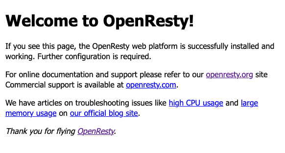

The OpenResty web server gives you an enhanced version of NGINX. OpenResty's NGINX includes a LuaJIT compiler for running Lua script within your server configuration. Additionally, it comes with a collection of selected Lua and NGINX modules designed to help scale your web applications.

Learn in this guide everything you need to know about OpenResty and how to install and start using it on your system.

## Before You Begin

1. If you have not already done so, create a Linode account and Compute Instance. See our [Getting Started with Linode](/docs/guides/getting-started/) and [Creating a Compute Instance](/docs/guides/creating-a-compute-instance/) guides.

1. Follow our [Setting Up and Securing a Compute Instance](/docs/guides/set-up-and-secure/) guide to update your system. You may also wish to set the timezone, configure your hostname, create a limited user account, and harden SSH access.


The steps in this guide are written for non-root users. Commands that require elevated privileges are prefixed with `sudo`. If you’re not familiar with the `sudo` command, see the [Linux Users and Groups](/docs/guides/linux-users-and-groups/) guide.


## What Is OpenResty?

[OpenResty](https://openresty.org/en/) is a web server platform that extends NGINX. OpenResty includes its own enhanced version of NGINX along with an enhanced LuaJIT compiler. And it comes prepackaged with a selection of NGINX modules and Lua libraries for enhanced web application hosting.

OpenResty has been designed and ready-made for scaling web applications. The collection of included features gives you an easier path to scaling your server and adding dynamic services and gateways.

### OpenResty vs NGINX vs Apache: What Are the Differences?

OpenResty competes in a space with popular tools like NGINX and Apache.

OpenResty inherits the NGINX core and adds to it a LuaJIT compiler for running Lua scripts in the server configuration to greatly increase the amount of concurrent connections a single NGINX server can handle. Additionally, OpenResty bundles a collection of useful NGINX components for hosting web applications, including modules for interacting with Redis, Postgres, MySQL, and Memcached in a non-blocking fashion.

OpenResty is meant to allow your entire app within NXINGX. This makes OpenResty ideal for most web application hosting and especially so when you are looking to start scaling up your server.

However, there are some use cases that do not take advantage of the extra features of OpenResty. For instance, your web application may not need the additional NGINX modules, or Lua scripting offered by OpenResty. Such cases do not warrant changing over to OpenResty from NGINX, although they could still operate on OpenResty's NGINX core.

Since OpenResty is essentially an enhanced version of NGINX, comparisons between NGINX and Apache apply to OpenResty vs Apache. Thus, you can learn more about how it would compare with Apache through our guide [A Comparison of the NGINX and Apache Web Servers](/docs/guides/comparing-nginx-and-apache-web-servers/).

## How to Install OpenResty

OpenResty maintains official packages for most major Linux distributions and are usually found using your system's package manager.

In cases where your package manager does not include OpenResty, the next sections show you how to add the OpenResty repository to your existing package manager and install OpenResty. Navigate to the section matching your system's distribution, and follow the steps to complete the installation.

Looking for additional Linux distributions? Likely you can find a relevant distribution covered on OpenResty's [official Linux installation](https://openresty.org/en/linux-packages.html) page.

For all systems, you should stop and disable NGINX before proceeding with the installation if you have NGINX already installed. You can accomplish this with the commands here for the distributions covered in this guide.

```command
sudo systemctl disable nginx
sudo systemctl stop nginx
```

### Debian/Ubuntu

1. Install the prerequisite packages for the OpenResty installation.

    ```command
    sudo apt install --no-install-recommends wget gnupg ca-certificates
    ```

1. Add the GPG key for the OpenResty repository with the following command for **Debian** and **Ubuntu** versions before 22.

    ```command
    wget -O - https://openresty.org/package/pubkey.gpg | sudo apt-key add -
    ```

    If you are running **Ubuntu** 22 or later, use the following command instead.

    ```command
    wget -O - https://openresty.org/package/pubkey.gpg | sudo gpg --dearmor -o /usr/share/keyrings/openresty.gpg
    ```

1. Add the OpenResty repository to the APT package manager. This step varies depending on your system's distribution and its version.

    - For **Debian** systems, use the following command:

        ```command
        codename=`grep -Po 'VERSION="[0-9]+ \(\K[^)]+' /etc/os-release`
        echo "deb http://openresty.org/package/debian $codename openresty" | sudo tee /etc/apt/sources.list.d/openresty.list
        ```

    - For **Ubuntu** versions earlier than 22, use the following command:

        ```command
        echo "deb http://openresty.org/package/ubuntu $(lsb_release -sc) main" | sudo tee /etc/apt/sources.list.d/openresty.list
        ```

    - For **Ubuntu** 22 and later, use the following command:

        ```command
        echo "deb [arch=$(dpkg --print-architecture) signed-by=/usr/share/keyrings/openresty.gpg] http://openresty.org/package/ubuntu $(lsb_release -sc) main" | sudo tee /etc/apt/sources.list.d/openresty.list > /dev/null
        ```

1. Update the package manager's index, then install OpenResty.

    ```command
    sudo apt update
    sudo apt install openresty
    ```

You can verify that the installation was successful by checking that the OpenResty service is running.

```command
sudo systemctl status openresty
```

```output
● openresty.service - The OpenResty Application Platform
     Loaded: loaded (/lib/systemd/system/openresty.service; enabled; vendor preset: enabled)
     Active: active (running) since Mon 2022-12-26 18:00:00 UTC; 25s ago
[...]
```

### CentOS/Fedora


The CentOS instructions here assume you are using CentOS 8 or newer. For CentOS 6 and 7, replace `dnf` in the commands that follow with `yum`.


1. Install the `wget` package if your system does not already have it.

    ```command
    sudo dnf install wget
    ```

1. Add the OpenResty repository. Replace `centos` in the first line below with `fedora` if you are using a Fedora distribution.

    ```command
    wget https://openresty.org/package/centos/openresty.repo
    sudo mv openresty.repo /etc/yum.repos.d/
    ```

1. Update the package manager's index, then install OpenResty:

    ```command
    sudo dnf check-update
    sudo dnf install openresty
    ```

1. Start and enable the OpenResty service.

    ```command
    sudo systemctl start openresty
    sudo systemctl enable openresty
    ```

You can verify that the installation was successful by checking that the OpenResty service is running.

```command
sudo systemctl status openresty
```

```output
● openresty.service - The OpenResty Application Platform
     Loaded: loaded (/usr/lib/systemd/system/openresty.service; enabled; vendor preset: disabled)
     Active: active (running) since Mon 2022-12-26 18:00:25 UTC; 25s ago
[...]
```

## How to Use OpenResty

With an OpenResty instance installed and running, you can now try out a few examples.

This guide uses the standard HTTP port (`80`) for its examples. To follow along, you should open that port on your instance. Visit our guide on [Setting Up and Securing a Compute Instance](/docs/guides/set-up-and-secure/#configure-a-firewall). Identify the firewall manager appropriate for your system in the firewall section, and follow the linked guide to open the HTTP port for your system.

OpenResty serves as a simple welcome page by default, similar to the default NGINX page. You can access the welcome page by navigating to the server's remote IP address in a web browser. For instance, if your server's remote IP address is `192.0.2.0`, navigate in your browser to `http://192.0.2.0`.



One of OpenResty's most compelling features is its ability to run Lua scripts within its server configurations. The example below demonstrates this feature by creating a server with basic Lua scripting.

1. Using your preferred text editor, open the `nginx.conf` file for your OpenResty instance. This file contains the default OpenResty server configuration and should be located at `/usr/local/openresty/nginx/conf/nginx.conf`.

1. Remove the contents of the file, and replace them with the code shown here. (OpenResty typically comes with a duplicate of the default configuration file as `nginx.conf.default`, should you ever want to revert to it).

    ```file {title="/usr/local/openresty/nginx/conf/nginx.conf"}
    worker_processes 1;

    events {
        worker_connections 1024;
    }


    http {
        include mime.types;
        default_type application/octet-stream;
        sendfile on;
        keepalive_timeout 65;

        server {
            listen 80 default_server;
            listen [::]:80 default_server;
            server_name localhost;

            root html;
            index index.html index.htm;

            location / {
                try_files $uri $uri/ =404;
            }

            location /content-test {
                default_type text/html;
                content_by_lua_block {
                    ngx.say('<html><body><p>Hello, world!</p></body></html>')
                }
            }

            location /rest-test {
                charset utf-8;
                charset_types application/json;
                default_type application/json;
                content_by_lua_file scripts/rest.lua;
            }

            error_page 500 502 503 504 /50x.html;
            location = /50x.html {
                root html;
            }
        }
    }
    ```

    This NGINX configuration leaves the default welcome page intact (at the `/` path) and adds two new paths to the server.

    - A `/content-test` path. This path uses a block of Lua code within the configuration file to serve simple HTML content with the `Hello, world!` message. The example, while brief, gives an idea of how Lua script can be woven in with your OpenResty server.

    - A `/rest-test` path. This path starts to demonstrate the broader range of OpenResty's features. It uses a Lua script file, created in the next two steps, and serves JSON. In fact, this path's model could be leveraged to make a simple RESTful API service fully within OpenResty.

1. Create a directory to hold Lua script files for your OpenResty server. This example uses a `scripts` subdirectory within the `nginx` directory for OpenResty.

    ```command
    mkdir /usr/local/openresty/nginx/scripts
    ```

1. Create a new file in that directory with the name `rest.lua`. Give the file the contents shown here. The in-code comments — lines beginning with `--` explain what each part of this script does.

    ```file {title="/usr/local/openresty/nginx/scripts/rest.lua"}
    -- Imports a module for handling JSON; cjson is included with OpenResty
    -- by default.
    local cjson = require("cjson")

    -- Defines an initial status for the request.
    ngx.status = ngx.HTTP_OK

    -- Serves the JSON content, using the cjson module to encode the Lua
    -- object as a JSON one.
    ngx.say(cjson.encode(
        {
            name = "world",
            message = "Hello, ",
            punctuation = "!"
        }
    ))

    -- Exits with the success status.
    return ngx.exit(ngx.HTTP_OK)
    ```

You now have an OpenResty web server with three endpoints. In addition to the welcome page shown above, you have a simple HTML page and a JSON server.

- Navigate to the `/content-test` path in your web browser to see a `Hello, world!` page. For example, the URL would be `http://192.0.2.0/content-test` if your instance's remote IP address was `192.0.2.0`.

    ```output
    Hello, world!
    ```

- Navigate to the `/rest-test` path in your web browser to see the JSON content being served by your OpenResty server. That URL would be `http://192.0.2.0/rest-test` if your server's remote IP address was `192.0.2.0`.

    ```output
    {
      "name": "world",
      "message": "Hello, ",
      "punctuation": "!"
    }
    ```

## Conclusion

With OpenResty now running on your system, you can start to use it for serving your web applications. OpenResty can largely function in place of NGINX, often with little configuration change. And from there, it offers a host of new features and modules to help you add dynamism and scale to your applications.

Be sure to take a look at the official OpenResty documentation, which you can find through the link below. There, you can start to learn more about OpenResty's included capabilities and how you can leverage them for your applications.
