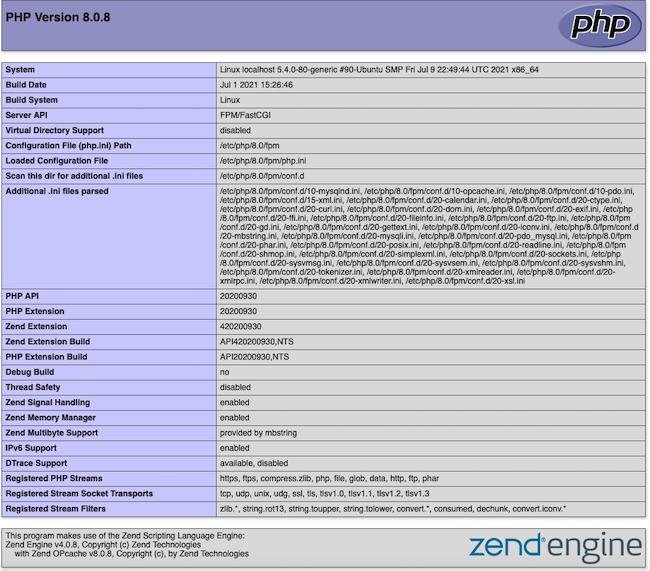

[*PHP*](https://www.php.net/) is one of the building blocks of the modern internet. It is a free, open source scripting language that typically runs on a web server and can be integrated into regular HTML code. PHP is fast and flexible, and can interact with databases, forms, and file systems. This guide provides a brief introduction to PHP and explains how to install, configure, upgrade, and test it.

## What is PHP?

PHP was originally developed in 1994 for the purposes of web development. PHP originally stood for *Personal Home Page*, but it is now a reflexive acronym for *PHP: Hypertext Pre-processor*. It runs on all major operating systems, and all major web servers support it. The *Zend Engine* is typically used to compile PHP into source code. Taken together, the two components are known as "Zend PHP". PHP is available at no cost under the "PHP License".

PHP can efficiently interact with databases and can auto-generate files, PDFs, images, and media clips. It can also interact with many protocols and other programming languages using its extensive library. PHP supports functions, arrays, and object-oriented programming, but does not allow for the use of pointers.

The newest version of PHP is version 8. It was released in November 2020, although version 7.4 is still supported and widely used. PHP 8 includes many new features, including just-in-time compilation, typing changes, and syntax additions. Many changes have also been made to the standard library.

PHP is mainly used for three different purposes:
*   **Server-side scripting:** This is the most common use for PHP. PHP can run as an interpreted programming language on a web server such as Apache or NGINX. The server processes the PHP code, and uses it to generate a web page or HTML response for the client.
*   **Command line scripting:** PHP can run as a stand-alone application using the PHP parser. The resulting scripts can be launched as cron jobs or used for text/file processing.
*   **Application development:** PHP is less-commonly used for stand-alone development. In conjunction with the [*PHP-GTK*](http://gtk.php.net/) extension, it can create desktop or cross-platform applications, complete with a GUI.

PHP functions like most interpreted programming languages. It contains a rich selection of control structures and is easy to learn and use. The following code snippet demonstrates how PHP can be used to embed a "Hello World" fragment inside HTML.


    <body>

        <?php
            echo "Hello World!";
        ?>

    </body>


PHP code is introduced with `<?php`, and terminated with `?>`. PHP code can also be written as a separate file and called from an HTML page. This [*basic tutorial*](https://www.php.net/manual/en/tutorial.php) provides a simple introduction to PHP. More advanced users should consult the [*Official PHP Documentation*](https://www.php.net/manual/en/), which provides information on control structures, classes, and objects.

### Advantages of PHP

PHP has become widely used in web development for the following reasons:

*   It features very good performance compared to other web technologies, especially when used in conjunction with the Apache web server. PHP loads and compiles quickly.
*   PHP is an open source technology and is available at no cost.
*   It can be easily integrated into HTML code.
*   PHP includes many libraries and frameworks, allowing it to work with other languages and technologies.
*   It can interact with all popular databases. When used with the MySQL database, PHP can quickly execute complex queries.
*   PHP is easy to learn and use. In terms of syntax, it is similar to other popular programming languages.
*   It is a mature technology with a large community of users. The PHP documentation is professional and comprehensive.
*   PHP integrates particularly well with WordPress, which is also written in PHP.
*   Because PHP scripts run on the server, they are invisible to the client, who only receives the end result of the transaction. This improves web site and server security.

PHP only has a few disadvantages. Some of these drawbacks include a lack of libraries for new specializations such as machine learning, and some security vulnerabilities. PHP security has been improved in recent versions.

## Before You Begin

1.  Familiarize yourself with our [Getting Started](/docs/getting-started/) guide and complete the steps for setting your Linode's hostname and timezone.

2.  This guide uses `sudo` wherever possible. Complete the sections of our [Securing Your Server](/docs/security/securing-your-server/) to create a standard user account, harden SSH access and remove unnecessary network services. Do **not** follow the Configure a Firewall section yet--this guide includes firewall rules specifically for an OpenVPN server.

3.  Update your system:

        sudo apt-get update && sudo apt-get upgrade

4.  PHP is usually used in conjunction with a web server. An Apache or NGINX web server should already be installed on the Linode. See the Linode guides for [Apache](/docs/web-servers/apache/how-to-install-apache-web-server-ubuntu-18-04/) or [*NGINX*](https://www.linode.com/docs/guides/how-to-install-and-use-nginx-on-ubuntu-20-04/) for more information. Instructions for both servers are included in this guide. If `ufw` is enabled, ensure it allows web server access.


This guide is written for a non-root user. Commands that require elevated privileges are prefixed with `sudo`. If you are not familiar with the `sudo` command, see the [Users and Groups](/docs/tools-reference/linux-users-and-groups/) guide.


## Adding the PHP Repository

The following instructions are geared toward Ubuntu version 20.04, but are generally applicable for most Linux distributions. Before proceeding, ensure all packages are updated with `sudo apt update`.

Most Linux distributions include a PHP module in the default system package. In most cases, however, version 7.4 is still the default. To determine the current version of the default `php` package, run the command `sudo apt list php`. If this displays a reference to version 8.0, the correct packages are already present.

        sudo apt list php

Listing... Done
php/focal 2:7.4+75 all


If version 8 is not yet available, install the `ondrej` *Personal Package Archive* (PPA). This archive, which was developed by Ondřej Surý, provides access to all recent versions of PHP.
1.  Add the `ondrej/php` repository using `apt` and follow all the instructions.

        sudo add-apt-repository ppa:ondrej/php
    
Co-installable PHP versions: PHP 5.6, PHP 7.x and most requested extensions are included. Only Supported Versions of PHP (http://php.net/supported-versions.php) for Supported Ubuntu Releases (https://wiki.ubuntu.com/Releases) are provided.
    
2.  Add the corresponding `ondrej` PPA for either Apache or NGINX.

        sudo add-apt-repository ppa:ondrej/apache2
        sudo add-apt-repository ppa:ondrej/nginx

3.  Upgrade the new packages.

        sudo apt-get update
4.  Run the `sudo apt list php` command to see the default version of PHP. If the default version is now 8.0, use `php` throughout the following instructions. Otherwise, include the version when specifying the package name, for example, `php8.0` or `php8.0-mysql`.

        sudo apt list php

    
php/focal 2:8.0+84+ubuntu20.04.1+deb.sury.org+1 all
    

## How to Install PHP and PHP-FPM with Apache

Throughout this section, use either `php` or `php8.0`, depending on the name of the default PHP package. If several different versions of PHP have been installed, a particular version can be identified by specifying the version number. Consult the "Adding the PHP Repository" section of this guide for more details.

### Install and Configure PHP as an Apache Module

1.  Install the default `php` package.

        sudo apt install php
2.  (**Optional**) Install any other PHP packages that might be required. The `php-mysql` package is required to run WordPress.

        sudo apt install php-common php-mysql php-cgi php-mbstring php-curl php-gd php-xml php-xmlrpc php-pear
3.  Confirm PHP 8.0 is installed.

        php -v
    
PHP 8.0.8 (cli) (built: Jul  1 2021 15:26:46) ( NTS )
Copyright (c) The PHP Group
Zend Engine v4.0.8, Copyright (c) Zend Technologies
    with Zend OPcache v8.0.8, Copyright (c), by Zend Technologies
    

### Install and Configure PHP-FPM

The PHP *FastCGI Process Manager* (FPM) package enhances web server performance. It accelerates page generation, reduces memory consumption, and increases web server capacity. A special Apache module for FastCGI is required to use FPM.

1.  Install the `php-fpm` package.

        sudo apt install php-fpm
2.  Install the associated Apache module.

        sudo apt install libapache2-mod-fcgid
3.  Confirm the `php8.0-fpm` service is running.

        sudo systemctl status php8.0-fpm
    
php8.0-fpm.service - The PHP 8.0 FastCGI Process Manager
     Loaded: loaded (/lib/systemd/system/php8.0-fpm.service; enabled; vendor pr>
     Active: active (running) since Thu 2021-07-29 07:30:09 UTC; 1min 30s ago
       Docs: man:php-fpm8.0(8)

    
4.  Enable the Apache modules required by FPM.

        sudo a2enmod actions fcgid alias proxy_fcgi
5.  If you have configured a virtual host for your domain, add an FPM handler to the site's `.conf` file. Otherwise, add the handler to the default `000-default.conf` file. The `.conf` files can be found in the `/etc/apache2/sites-available` directory. Add the line `SetHandler "proxy:unix:/var/run/php/php8.0-fpm.sock|fcgi://localhost"` to the `VirtualHost` block as shown here.
    
For information on how to add a virtual host, see the Linode guide for [Apache on Ubuntu](/docs/web-servers/apache/how-to-install-apache-web-server-ubuntu-18-04/).
    

    
<VirtualHost *:80>
...
    <FilesMatch \.php$>
        SetHandler "proxy:unix:/var/run/php/php8.0-fpm.sock|fcgi://localhost"
    </FilesMatch>
...
</VirtualHost>
    
6.  Restart the Apache service.

        sudo systemctl restart apache2

## How to Install PHP and PHP-FPM with NGINX

The procedure to install PHP on NGINX is very similar to the procedure for Apache. If Apache is installed on the system, the PHP installation process might try to activate it. If this happens, stop Apache with the command `sudo systemctl disable --now apache2`.
1.  Install the `php-fpm` module.

        sudo apt install php-fpm
    
Install the `php-fpm` module, but do not install `php`. If the `php` module is installed first, it configures the Apache server instead of NGINX. The `php-fpm` package contains all core modules for PHP.
    
2.  (**Optional**) Install any additional PHP packages. The `php-mysql` package is required to run WordPress.

        sudo apt install php-common php-mysql php-cgi php-mbstring php-curl php-gd php-xml php-xmlrpc php-pear
3.  Confirm PHP 8.0 has been installed.

        php -v
    
PHP 8.0.8 (cli) (built: Jul  1 2021 15:26:46) ( NTS )
Copyright (c) The PHP Group
Zend Engine v4.0.8, Copyright (c) Zend Technologies
    with Zend OPcache v8.0.8, Copyright (c), by Zend Technologies
    
4.  Confirm the `php-fpm` service is running.

        sudo systemctl status php8.0-fpm
    
php8.0-fpm.service - The PHP 8.0 FastCGI Process Manager
     Loaded: loaded (/lib/systemd/system/php8.0-fpm.service; enabled; vendor pr>
     Active: active (running) since Thu 2021-07-29 14:16:36 UTC; 1min 18s ago
    
5.  Add the following configuration to the virtual host `.conf` file for your domain. If a virtual host has not been configured, add it to the `default` NGINX file instead. These files are located in the `/etc/nginx/sites-available` directory.
    
For more information on configuring a virtual host on NGINX, consult the [*Linode Guide on Installing NGINX*](https://www.linode.com/docs/guides/how-to-install-and-use-nginx-on-ubuntu-20-04/).
    

    
server {
...
        location ~ \.php$ {
                include snippets/fastcgi-php.conf;
                fastcgi_pass unix:/var/run/php/php8.0-fpm.sock;
        }
...
}
    
6.  Run the NGINX syntax test to verify the new configuration is correct.

        sudo nginx -t
7.  Restart the NGINX service to apply all changes.

        sudo systemctl restart nginx

## Testing PHP

To confirm PHP and Apache are working together, add a PHP file named `phpinfo.php` to the `/var/www/html` directory. The `phpinfo` function allows you to view technical details about the PHP installation.

### Adding and Testing the "PHP Info" Page

To create and display the standard "PHP Info" page, follow these steps:

1.  Create a new file in the `var/www/html` directory named `phpinfo.php`.

        sudo vi /var/www/html/phpinfo.php
2.  Add the following PHP code to this file.

    
<?php phpinfo(); ?>
    
3.  Access the `phpinfo.php` file using a web browser. Use either the IP address of the server or the domain name of the site, for example `<server_ip_address>/phpinfo.php`. The "PHP Info" page should be displayed. This page contains information about the version and installation, as shown here. The list of `.ini` files and other details might vary depending on the nature of the installation.

    
4.  For security reasons, it is a good idea to remove this file when PHP behavior has been verified.

        sudo rm /var/www/html/phpinfo.php

## How to Update an Existing PHP Installation

Earlier versions of PHP can easily be upgraded to version 8. All PHP related packages should be upgraded at the same time. Otherwise, conflicts or crashes might occur. To determine whether the PHP 8.0 packages are present on the system or not, consult the "Adding the PHP Repository" section of this guide. If the 8.0 package is not present, the `ondrej/php` repository must be installed first. The following steps explain how to upgrade PHP and PHP-FPM from version 7.4 to 8.0, using Apache as the web server.


Because PHP version 8 has many changes, it is possible old code might not work after an upgrade. It is a good idea to test any websites and applications in a development environment before putting them into production. A list of non-backward-compatible changes is available at the [*PHP GitHub site*](https://github.com/php/php-src/blob/PHP-8.0/UPGRADING#L20).


1.  If necessary, install the `ondrej/php` module to access PHP version 8.0.

        sudo add-apt-repository ppa:ondrej/php
        sudo add-apt-repository ppa:ondrej/apache2
2.  Generate a list of all currently installed PHP modules. All modules should be upgraded to version 8.0.

        dpkg --get-selections | grep -i php
    
libapache2-mod-php7.4				install
php						install
php-cgi					install
...
php7.4-xmlrpc					install
    
3.  Upgrade the packages.

        sudo apt-get update
4.  Install the new `php` package. This forces an automatic upgrade to version 8.0.

        sudo apt install php
5.  Upgrade all other PHP packages, including `php-fpm`, to version 8. Include the `8.0` identifier when specifying the packages. The exact list depends on the specific PHP modules that are installed.

        sudo apt install php8.0-common php8.0-mysql php8.0-cgi php8.0-mbstring php8.0-curl php8.0-gd php8.0-xml php8.0-xmlrpc php-pear php8.0-fpm
    
The Apache module `libapache2-mod-fcgid` does not have to be upgraded. The `php-pear` module does not require a version number.
    
6.  Verify the version of PHP and confirm version 8.0 is now installed.

        php -v
     
PHP 8.0.8 (cli) (built: Jul  1 2021 15:26:46) ( NTS )
Copyright (c) The PHP Group
Zend Engine v4.0.8, Copyright (c) Zend Technologies
    with Zend OPcache v8.0.8, Copyright (c), by Zend Technologies
    
7.  Ensure all necessary Apache modules are re-enabled and the FPM module is properly configured.

        sudo a2enmod actions fcgid alias proxy_fcgi
        sudo a2enconf php8.0-fpm
8.  Edit either the `.conf` file for the domain, if one exists, or the default Apache `.conf` file. Change the `SetHandler` parameter to `proxy:unix:/var/run/php/php8.0-fpm.sock|fcgi://localhost`.

    
<VirtualHost *:80>
...
    <FilesMatch \.php$>

        SetHandler "proxy:unix:/var/run/php/php8.0-fpm.sock|fcgi://localhost"
    </FilesMatch>
...
</VirtualHost>
    

9.  Restart Apache and the `php8.0-fpm.service` using `systemctl`.

        sudo systemctl restart apache2
        sudo systemctl restart php8.0-fpm.service
10. To confirm a successful upgrade, follow the instructions in the "Adding and Testing the 'PHP Info' Page" section. The page displays information about PHP version 8.0. There should not be any references to version 7.4.