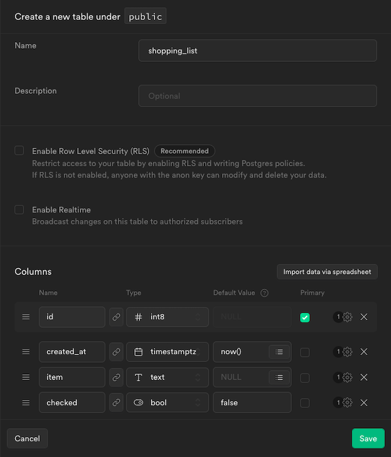
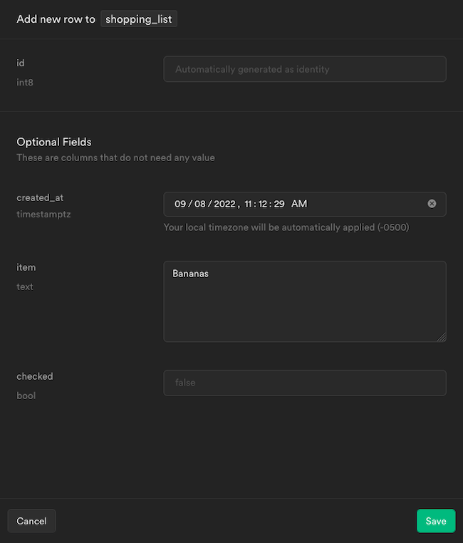
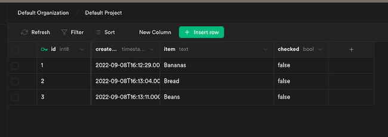
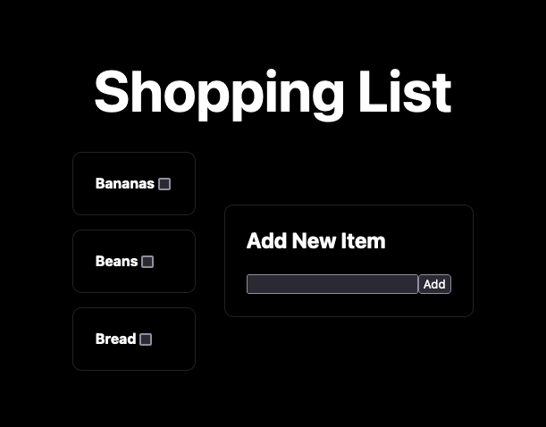

Supabase offers an open source database solution complete with a REST API for accessing data. This makes Supabase more than just an outstanding database. It can function as a complete backend for many applications. Supabase abstracts API development and gives your application's frontend access to the data it needs.

Next.js provides a framework for advanced yet streamlined frontend development. Based on React, Next.js includes an array of its features. However, Next.js also handles server-side rendering and static pre-rendering, giving your frontend applications additional capabilities and advantages.

This tutorial covers everything you need to get started using these two tools together. Learn how to make your Supabase instance provide its REST API services to a simple Next.js frontend. Follow along for a complete demonstration on creating a full-stack application.

## Before You Begin

1.  If you have not already done so, create a Linode account and Compute Instance. See our [Getting Started with Linode](/docs/products/platform/get-started/) and [Creating a Compute Instance](/docs/products/compute/compute-instances/guides/create/) guides.

1.  Follow our [Setting Up and Securing a Compute Instance](/docs/products/compute/compute-instances/guides/set-up-and-secure/) guide to update your system. You may also wish to set the timezone, configure your hostname, create a limited user account, and harden SSH access.

1.  Update your system.

    ```command {title="Debian / Ubuntu"}
    sudo apt update && sudo apt upgrade
    ```

    ```command {title="AlmaLinux / CentOS Stream / Fedora / Rocky Linux"}
    sudo dnf upgrade
    ```


This guide is written for a non-root user. Commands that require elevated privileges are prefixed with `sudo`. If you’re not familiar with the `sudo` command, see the [Users and Groups](/docs/guides/linux-users-and-groups/) guide.


## How to Create a Supabase Backend

With relatively little setup, Supabase can provide you with a capable backend. It uses a PostgreSQL database and includes a REST API to provide data storage and access for your application's frontend.

The next two sections walk you through setting up your Supabase instance and configuring it for use with a frontend application.

### Setting Up Supabase

You have two options when it comes to setting up your Supabase instance:

-   The first is the cloud-hosted option provided by Supabase. To begin, navigate to the [Supabase project creation](https://app.supabase.com/) page and create an account. From there, select **New Project** to get started.

-   The other option is self-hosted. To get started with your own self-hosted Supabase instance follow section two of our guide on [How to Self-host Supabase with Docker](/docs/guides/installing-supabase/). Ensure that your self-hosted instance is up and running by executing the following command from its base directory:

    ```command
    sudo docker compose up -d
    ```

    This tutorial assumes you followed our guide to set up your own self-hosted Supabase instance. This includes using the default ports: port `3000` for the studio interface and port `8000` for the external API.


Before moving on, be sure to locate your Supabase instance's **API URL** and **anon key**. You can find these under **Settings** and **API** on a cloud instance. They are stored in the `.env` file for self-hosted instances.


### Populating the Supabase Database

To set up this tutorial's example, you need to create a table and some initial data in your Supabase database.

1.  Navigate to the Supabase Studio dashboard for your instance, and select the **Default Project** displayed in the page's body.

    Assuming your server address is `192.0.2.0` and the studio is on the default port, reach it by navigating to `http://192.0.2.0:3000` in a browser.

1.  Select the **Table Editor** option from the menu on the left, and click the **Create a new table** button that appears in middle of the page.

1.  In the form that displays, give the table a name and columns.

    This tutorial's example application is a shopping list, therefore the table name used is `shopping_list`. The table has an `item` column with `text` content along with a `checked` column with `bool` content and a default value of `false`. This is in addition to the default columns `id` and `created_at`.

    When your screen looks like the screenshot below, click **Save**.

    [](supabase-create-table.png)

1.  You should now be on the **Table Editor** page for the table, and can input new rows of data using the **+ Insert row** button.

    Create several entries in this table, entering an `item` value for each. All of the other columns populate automatically.

    [](supabase-insert-row.png)

    You can also accomplish this using the **SQL Editor** option in the left menu. From there, you can use the SQL `insert` statement below to add the desired rows:

    ```command
    insert into shopping_list (item)
    values
      ('Bananas'),
      ('Bread'),
      ('Beans')
    ;
    ```

1.  In the **Table Editor**, you should now see the rows of data you entered.

    [](supabase-table-rows.png)

## How to Create a Next.js Frontend

With a Supabase backend prepped and populated, you are ready to start building out a Next.js frontend to interface with it.

The example application is a shopping list, complete with the ability to add new items and mark existing items as "Purchased".

### Setting Up the Next.js Project

The following steps show you how to initialize a Next.js application with NPM and how to add the Supabase client SDK to the project.

This guide uses JavaScript code for the Next.js application. However, you can configure Next.js for TypeScript. With that configuration, all of your Next.js application can be managed using TypeScript code instead of JavaScript. You can learn more about setting up a Next.js project with TypeScript in our guide **Building a Next.js App with TypeScript** .

1.  Follow our tutorial on how to [Install and Use the Node Package Manager (NPM) on Linux](/docs/guides/install-and-use-npm-on-linux/). NPM handles the project's dependencies and runs the Next.js frontend. It also includes `npx`, which the next step uses to bootstrap a template Next.js project.

1.  Create the Next.js project, using `create-next-app` to bootstrap a template application. This example names the new project `example-app`.

    The commands below result in a directory with the new project's name being created, in this case in the current user's home directory.

    ```command
    cd ~/
    npx create-next-app example-app
    ```

    ```output
    Need to install the following packages:
      create-next-app@13.0.6
    Ok to proceed? (y)
    ```

1.  Change into the project's directory. The rest of this tutorial assumes you are still in this directory unless otherwise noted.

    ```command
    cd example-app
    ```

1.  Install the Supabase JavaScript SDK via NPM. The frontend uses this SDK to simplify interfacing with the Supabase API.

    ```command
    npm install @supabase/supabase-js --save
    ```

### Developing the Next.js Frontend

The example Next.js project here is built around three files. It edits the existing `index.js` file, used as an entry point for most Next.js projects. The project adds two new files to this. One is for handling connections to the Supabase instance. The other is for the logic and rendering of the shopping list itself.

The following sections walk you through each of these files. Follow along to see how everything comes together to bring the application to life.

#### Index.js

Typically, Next.js projects use the `pages/index.js` file as an entry point, acting as the center of your application's look and feel. The file may not contain much, but it references other components and brings everything together.

The template created above includes a default `pages/index.js` file. Open that file, and modify its existing contents to those shown below. You can find the full example file [here](/docs/guides/create-next-js-app-supabase/example-app-src/pages/index.js).

Follow along with the in-code comments to get explanations what each part of the Next.js code is doing.

```file {title="pages/index.js" lang="js"}
// Import the head element and the default styles module. Edit this CSS file,
// or use a new one, to define your own application styles.
import Head from 'next/head'
import styles from '../styles/Home.module.css'

// Import a component to handle the shopping list logic and rendering.
import ShoppingList from '../components/ShoppingList.js'

// Define the layout of the page. Most of the actual content for this
// example gets processed in the ShoppingList component.
export default function Home() {
  return (
    <div className={styles.container}>
        <Head>
            <title>Example Next.js App</title>
        </Head>

        <main className={styles.main}>
            <h1 className={styles.title}>Shopping List</h1>
            <ShoppingList />
        </main>
    </div>
  )
}
```

#### SupabaseConnection.js

The next file supplies a simple and reusable interface to the Supabase backend.

Add a new `utils` subdirectory to your Next.js project, and create a file there named `supabaseConnection.js`. Give that file the contents shown here. Make sure to replace `http://192.0.2.0:8000` and `example-supabse-anon-key` with your Supabase instance's **API URL** and **anon key**. You can find the full example file [here](/docs/guides/create-next-js-app-supabase/example-app-src/utils/supabaseConnection.js).

```file {title="utils/supabaseConnection.js" lang="js" hl_lines="7,8"}
// Import the module for client creation from the Supabase SDK.
import { createClient } from '@supabase/supabase-js'

// Set variables for your Supabase connection. Replace supabaseUrl with the
// API address for your instance, and replace supabaseAnonKey with the anon
// key for your instance.
const supabaseUrl = 'http://192.0.2.0:8000';
const supabaseAnonKey = 'example-supabase-anon-key';

// Create and export the Supabase client.
export const supabase = createClient(supabaseUrl, supabaseAnonKey)
```

#### ShoppingList.js

To handle the logic for processing and rendering the shopping list, you can create a `ShoppingList` component. Recall that the `index.js` file includes a tag for this component. The component itself handles all of the logic for the shopping list, making your application much more adaptable and expandable.

Add another subdirectory to the project, `components`, and add a file to it named `ShoppingList.js`. Give that file the contents shown in each of the following code blocks. Because this file is more extensive and complicated than the other two, this section breaks it down into parts. However, you can see the whole file [here](/docs/guides/create-next-js-app-supabase/example-app-src/components/ShoppingList.js).

-   The component first needs to import the necessary modules and set up its state variables. The component also uses the `useEffect` function to call for a fresh shopping list when the component loads.

    ```file {title="components/ShoppingList.js" lang="js"}
    // Import the React modules for using state and effect.
    import { useState, useEffect } from 'react'

    // Import the default styles module. Edit this CSS file, or use a new one, to
    // define your own application styles.
    import styles from '../styles/Home.module.css'

    // Import the Supabase client from utils.
    import { supabase } from '../utils/supabaseConnection';

    export default function ShoppingList() {
        // Establish the state variables.
        const [newShoppingItem, setNewShoppingItem] = useState('');
        const [shoppingListItems, setShoppingListItems] = useState([]);

        // Have the app fetch the shopping list on load.
        useEffect(() => {
            fetchShoppingList()
        }, [])
    ```

-   The component needs three actions: fetching the shopping list, marking an item on the list "Purchased," and adding an item to the list. For each, the component gets a function.

    ```file {title="components/ShoppingList.js" lang="js"}
    // Retrieve the shopping list items.
    const fetchShoppingList = async () => {
        // Clear the shopping list first.
        setShoppingListItems([]);

        // Execute a Supabase query to fetch the shopping list.
        try {
            // Select all items that have not been marked purchased.
            let { data, error } = await supabase
                .from('shopping_list')
                .select('*')
                .eq('checked', 'false');

            // Handle any errors.
            if (error) { throw error }

            // Upon a successful response, update the shopping list.
            if (data) {
                setShoppingListItems(data);
            }
        } catch (error) {
            alert(error.message);
        }
    }

    // Mark an item as purchased.
    const markItemPurchased = async (itemId, doMarkPurchased) => {
        try {
            // Update the record with the appropriate item ID.
            let { data, error } = await supabase
                .from('shopping_list')
                .update({ checked: doMarkPurchased })
                .match({ id: itemId });

            // Handle any errors.
            if (error) { throw error }

            if (data) {
                console.log(data);
            }
        } catch (error) {
            alert(error.message);
        }
    }

    // Add a new item to the shopping list.
    const addNewShoppingItem = async () => {
        try {
            // Insert the new item, providing the item name. The rest gets
            // filled in automatically.
            let { data, error } = await supabase
                .from('shopping_list')
                .insert({ item: newShoppingItem });

            // Handle any errors.
            if (error) { throw error }

            // Upon success, update the shopping list.
            if (data) {
                console.log(data);

                fetchShoppingList();
            }
        } catch (error) {
            alert(error.message);
        }
    }
    ```

-   Finally, the component needs logic to render the shopping list. It first parses each list item to give it an HTML display, and it then defines the entire display for the component itself.

    ```file {title="components/ShoppingList.js" lang="js"}
        // Process the shopping list and render the HTML for each item.
        const renderShoppingList = (shoppingList) => {
            if (shoppingList.length > 0) {
                return (shoppingList.map((item) => {
                    const itemStatusCheckbox = <input type="checkbox" onChange={ (e) => markItemPurchased(item.id, e.target.checked) } />
                    return (
                        <div key={"item-" + item.id} className={styles.card}>
                            <strong>{item.item}</strong>
                            {itemStatusCheckbox}
                        </div>
                    );
                }))
            } else {
                return (
                    <div className={styles.card}>
                        <strong>No items!</strong>
                    </div>
                );
            }
        }

        // Render the ShoppingList component display.
        return (
            <div className={styles.grid}>
                <div>
                    {renderShoppingList(shoppingListItems)}
                </div>
                <div>
                    <div className={styles.card}>
                        <h2>Add New Item</h2>
                        <p>
                            <input type="text" onChange={ (e) => { setNewShoppingItem(e.target.value) } } />
                            <button onClick={addNewShoppingItem}>Add</button>
                        </p>
                    </div>
                </div>
            </div>
        )
    }
    ```

### Deploying the Next.js Application

To start up your Next.js frontend, you should first specify what port you want it to run on. By default, Next.js runs on port `3000`, but that may be where your Supabase Studio interface is already running.

-   Open the `package.json` file for your Next.js project, and locate the `scripts` portion.

-   Modify the `dev` and `start` items with the `-p` option followed by the port you want your application to run on. For this example, the application is set up to run on port `8080`.

    ```file {title="package.json" lang="json"}
    // [...]
      "scripts": {
        "dev": "next dev -p 8080",
        "build": "next build",
        "start": "next start -p 8080",
        "lint": "next lint"
      },
    // [...]
    ```

-   Open the chosen port on your system's firewall to access the application remotely.

    -   For Debian and Ubuntu, refer to our guide on [How to Configure a Firewall with UFW](/docs/guides/configure-firewall-with-ufw/).

    -   For AlmaLinux, CentOS Stream, Fedora, and Rocky Linux refer to our guide on [Enabling and Configuring FirewallD on CentOS](/docs/guides/introduction-to-firewalld-on-centos/).

Once you have the port set up, start the Next.js development server with the following command:

```command
npm run dev
```

## How to Run Next.js and Supabase

Both Supabase and Next.js should now be running. Your functioning shopping list application can be seen by navigating to the Next.js application address. Using an example IP address and the port configured above, this would mean navigating to `http://192.0.2.0:3000`.



## Conclusion

Congratulations on putting together a Next.js application fully equipped with a Supabase backend. While this is just the start of what these rich tools have to offer, you should have what you need to put them into practice.