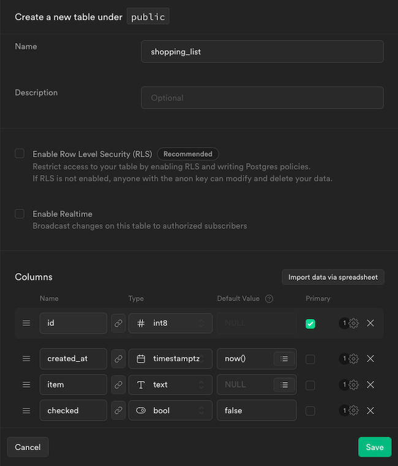

Supabase provides a powerful open-source database that comes built-in with features like user authentication and a REST API. This makes Supabase a ready-made solution for backend services, simplifying database operations and connecting application frontends to a ready API.

React offers one of the most popular frontend web development frameworks around. React's model is approachable and enables quick development of effective frontend applications.

In this tutorial, learn how you can put these two remarkable tools together. Follow along to set up a Supabase backend and create a simple React application to connect to it. This tutorial gives you what you need to get started building your own React application backed by Supabase, whatever your application may be.

## Before You Begin

1. Familiarize yourself with our [Getting Started with Linode](/docs/products/platform/get-started/) guide, and complete the steps for setting your Linode's hostname and timezone.

1. This guide uses `sudo` wherever possible. Complete the sections of our [How to Secure Your Server](/docs/products/compute/compute-instances/guides/set-up-and-secure/) guide to create a standard user account, harden SSH access, and remove unnecessary network services.

1. Update your system.

    - On Debian and Ubuntu, you can do this with:

            sudo apt update && sudo apt upgrade

    - On AlmaLinux, CentOS (8 or later), or Fedora, use:

            sudo dnf upgrade


This guide is written for a non-root user. Commands that require elevated privileges are prefixed with `sudo`. If you’re not familiar with the `sudo` command, see the [Users and Groups](/docs/guides/linux-users-and-groups/) guide.


## How to Create a Supabase Backend

With relatively little setup, Supabase can provide you with a capable backend. It uses a PostgreSQL database and includes a full REST API to connect application frontend to the data it needs.

These next sections guide your toward getting your own Supabase instance up and running and configuring it for use with an example React application.

### Setting Up Supabase

You have two options when it comes to setting up your Supabase instance. The first is the cloud-hosted option provided by Supabase itself. You can navigate to the [project creation](https://app.supabase.com/) page and create an account or sign in. From there, you can select **New Project** to get started.

The other option is self-hosted. You can learn how to get started with your own self-hosted Supabase instance by following along with our guide on **How to Self-host Supabase with Docker**. Ensure that your self-hosted instance is up and running by executing the following command from its base directory:

    sudo docker compose up -d

This tutorial assumes that you have followed the guide above to stand up your own self-hosted Supabase instance. The only difference is that this tutorial assumes you have used the default ports for your instance. That means port `3000` for the studio interface and port `8000` for the external API.

Before moving on, be sure to locate your instance's API URL and anon key. You can find these under **Settings** and **API** on a cloud instance. They are stored in the `.env` file for self-hosted instances.

### Populating the Supabase Database

The example application needs a table to hold its data, and it is helpful to have some initial data there for testing. These next steps show you how to create the table in Supabase and add some initial data.

1. Navigate to the Supabase Studio dashboard for your instance, and select the **Default Project** displayed in the page's body.

1. Select the **Table Editor** option from the menu on the left, and click the **Create a new table** button that appears in middle of the page.

1. In the form that displays, give the table a name and columns.

    This tutorial's example application is a shopping list. Thus, here and following the table name used is `shopping_list`, and the table has an `item` column with `text` content and a `checked` column with `bool` content. The `checked` column also has a default value of `false`. This is in addition to the default columns, `id` and `created_at`.

    

1. You should now be on the page for the table, and can input new rows of data using the **+ Insert row** button.

    Create several entries in this table, entering an `item` value for each. All of the other columns populate automatically.

    

    You can also accomplish this using the **SQL Editor** option on the left menu. There, you can use a SQL `insert` statement to add the desired rows, like this:

        insert into shopping_list (item)
        values
          ('Bananas'),
          ('Bread'),
          ('Beans')
        ;

1. In the **Table Editor**, you should now see the rows of data you have entered.

    

## How to Create a React Frontend

With Supabase prepped and populated, you are ready to start building out a React frontend to interface with it.

The React frontend developed here displays a shopping list. It gives the user the option of marking items "Purchased" and allows the user to add additional items to the list.

### Setting Up the React Project

These next steps show you how to initialize a React application with NPM and how to add the Supabase client SDK to the project.

1. Follow our tutorial on how to [Install and Use the Node Package Manager (NPM) on Linux](/docs/guides/install-and-use-npm-on-linux/). The present guide uses NPM to create a base React project, to install the Supabase client, and to run the React frontend.

1. Create the base React project. This example uses `create-react-app` to bootstrap a new React project and names the new project `example-app`. The command results in a directory with that name being created in the current directory.

    For this guide, the new React application's directory is created in the current user's home directory:

        cd ~/
        npx create-react-app example-app

    
Need to install the following packages:
  create-react-app@5.0.1
Ok to proceed? (y)
    

1. Change into the new React application directory. The rest of this tutorial assumes you are still in this directory unless otherwise noted:

        cd example-app

1. Install the Supabase JavaScript SDK via NPM. The React application uses this SDK to simplify interfacing with the Supabase API:

        npm install @supabase/supabase-js --save

### Developing the React Frontend

This tutorial's React frontend primarily consists of three JSX files, all stored in the `src` subdirectory in the React project directory. Each of these files is dealt with in its own section below to help break down how the application comes together.

#### App.js

The new React project comes with an `App.js` file. This file acts as the entry point for your React application, giving the containing structure and importing more specific components.

Remove the existing contents of the file, and give the file the contents shown below. You can also find the full example file [here](example-app-src/App.js).

You can follow along with the in-code comments to see what each part of the code is doing.


// Import React and the stylesheet.
import React from 'react';
import './App.css';

// Import the component to be used for fetching, updating,
// and displaying the shopping list.
import ShoppingList from './ShoppingList';

// Initialize the application display, giving a
// placeholder for the ShoppingList component.
function App() {
  return (
    

      <ShoppingList />
    

  );
}

export default App;


#### Utils.js

Before diving into the `ShoppingList` component, this application should have a tool ready for making connections to the Supabase backend.

For this purpose, create a new file in the `src` subdirectory, naming the file `utils.js`. Then, give the file the contents you see below. You can find the full example file [here](example-app-src/utils.js).

Replace `http://192.0.2.0:8000` with your Supabase instance's API address, and replace `example-supabase-anon-key` with your instance's anon key.


// Import the module for client creation from the Supabase SDK.
import { createClient } from '@supabase/supabase-js'

// Set variables for your Supabase connection. Replace supabaseUrl with the
// API address for your instance, and replace supabaseAnonKey with the anon
// key for your instance.
const supabaseUrl = 'http://192.0.2.0:8000';
const supabaseAnonKey = 'example-supabase-anon-key';

console.log(supabaseUrl);
console.log(supabaseAnonKey);

// Create the Supabase client.
export const supabase = createClient(supabaseUrl, supabaseAnonKey)


#### ShoppingList.js

Now everything is ready for the `ShoppingList` component. This is where the central logic for this application lives. The component uses the client connection given by `utils.js` to fetch data from the Supabase instance and then determines how to display that data.

This section walks through the file in parts to make it easier to digest. If you want to see the whole example file, you can find it [here](example-app-src/ShoppingList.js).

- First, you need to import the React modules the application needs and `utils.js` for the client connection. Then you can start off the `ShoppingList` class with a declaration of the base state and a call to fetch the shopping list when the application loads.

    
// Import the React modules for building the component.
import React, { Component } from 'react';

// Import the Supabase client from utils.
import { supabase } from './utils'

class ShoppingList extends Component {
    // Establish the components state variables.
    state = {
        newShoppingItem: '',
        shoppingListItems: []
    }

    // Have the component fetch a fresh shopping list on load.
    componentDidMount() {
        this.fetchShoppingList();
    }
    

- The component needs a method to fetch the shopping list from Supabase. Notice that the query calls on the Supabase client are modeled on SQL. That can make working with them more intuitive for those already familiar with SQL queries.

    
    // Retrieve the shopping list items.
    fetchShoppingList = async () => {
        // Clear the list as represented in the state.
        this.setState({
            ...this.state,
            shoppingListItems: []
        });

        // Execute a query via the Supabase client to fetch the shopping list.
        // For this example, the list excludes any items already marked
        // "purchased" (checked = true).
        try {
            let { data, error } = await supabase
                .from('shopping_list')
                .select('*')
                .eq('checked', 'false');

            if (error) { throw error }

            if (data) {
                this.setState({
                    ...this.state,
                    shoppingListItems: data
                });
            }
        } catch (error) {
            alert(error.message);
        }
    }
    

- This application provides two means of interacting with the shopping list. First, the user can mark an item "Purchased" and, second, the user can add a new item to the list. These next two functions accomplish these tasks.

    
    // Mark an item as purchased.
    markItemPurchased = async (itemId, doMarkPurchased) => {
        // Call to the backend to update the item record.
        try {
            let { data, error } = await supabase
                .from('shopping_list')
                .update({ checked: doMarkPurchased })
                .match({ id: itemId });

            if (error) { throw error }

            if (data) {
                console.log(data);
            }
        } catch (error) {
            alert(error.message);
        }
    }

    // Add a new item to the shopping list.
    addNewItem = async () => {
        // Have the backend insert a new record with the given item name.
        try {
            let { data, error } = await supabase
                .from('shopping_list')
                .insert({ item: this.state.newItemName });

            if (error) { throw error }

            if (data) {
                console.log(data);

                // Create an updated version of the shopping list, adding the
                // new item to it.
                const updatedShoppingList = this.state.shoppingListItems;
                updatedShoppingList.push(data[0])

                // Update the application state with the updated list.
                this.setState({
                    ...this.state,
                    shoppingListItems: updatedShoppingList
                });
            }
        } catch (error) {
            alert(error.message);
        }
    }
    

- Finally, the application needs logic to determine how the shopping list displays. This is handled in two functions. The first, `renderShoppingList`, parses the list and provides HTML for each item. The next, `render`, is a method for React's `Component` module that handles the rendering overall.

    
    // Process a shopping and render it to HTML.
    renderShoppingList = (shoppingList) => {
        if (shoppingList.length > 0) {
            return (shoppingList.map((item) => {
                const itemStatusCheckbox = <input type="checkbox" onChange={ (e) => this.markItemPurchased(item.id, e.target.checked) } />
                return (
                    

                        <strong>{item.item}</strong>
                        {itemStatusCheckbox}
                    

                );
            }))
        } else {
            return (
<strong>No items!</strong>
)
        }
    }

    // Render the ShoppingList component display.
    render () {
        return (
            

                

                    

                        <h2>Shopping List</h2>
                        
{ this.renderShoppingList(this.state.shoppingListItems) }

                    

                

                

                    <h2>Add New Item</h2>
                    

                        <input type="text" onChange={ (e) => { this.setState({ ...this.state, newItemName: e.target.value }) } } />
                        <button onClick={this.addNewItem}>Add</button>
                    

                

            

        )
    }
}

// Have the class exported. The export then gets used in App.js.
export default ShoppingList;
    

### Deploying the React Application

You are just about ready to run the React application. But first, you need to open a port for it on your server's firewall. The default port for the React development server is `3000`, so further steps in this tutorial assume you are using that port.

However, the Supabase Studio interface also runs on port `3000` by default. This can create a conflict if both are running on the same server. Fortunately in that case, NPM prompts you to run React on a different port, which defaults to `3001`. In that case, open `3001` in your firewall instead.

You can also configure your application to automatically start on port `3001`, or another port. Open your React project's `package.json` file, and add a `PORT` variable within the `start` script line:


// [...]
  "scripts": {
    "start": "PORT=3001 react-scripts start",
// [...]


To open the required port in your system's firewall, follow the appropriate guide of linked below.

- For Debian and Ubuntu, refer to our guide on [How to Configure a Firewall with UFW](/docs/guides/configure-firewall-with-ufw/).

- For AlmaLinux, CentOS, and Fedora, refer to our guide on [Enabling and Configuring FirewallD on CentOS](/docs/guides/introduction-to-firewalld-on-centos/)

Once you have done that, you can start up the React server with the following command:

    npm start

## How to Run React and Supabase

With both Supabase and the React application running, you should be able to see your shopping list. Navigating to port `3000` — or any other port you configured for React — on your server's address. Using the example IP address from above and the default port, this would mean navigating to `http://192.0.2.0:3000`.

## Conclusion

You have now taken your Supabase instance to the next level. You have started to make use of its rich set of features as a powerful database and backend server for your applications. This tutorial gets you started and ready to take on the many other possibilities available with Supabase and React.

Have more questions or want some help getting started? Feel free to reach out to our [Support](https://www.linode.com/support/) team.