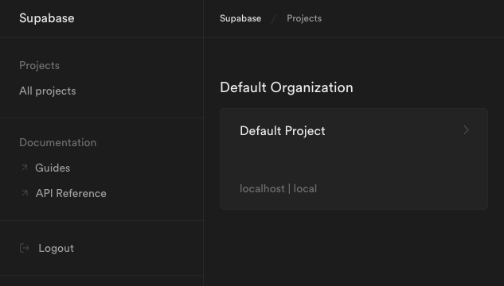

Supabase is an open-source alternative Firebase alternative based on PostgreSQL. Along with a Postgres database, Supabase comes with user authentication and REST API capabilities. Supabase offers a robust framework for creating the backend to Angular, React, Next.js, and other frontend applications.

This tutorial, the first in our series on Supabase, introduces you to Supabase. It covers installing your own self-hosted Supabase instance with Docker and setting up an initial configuration for securing your instance.

## Before You Begin

1. Familiarize yourself with our [Getting Started with Linode](/docs/getting-started/) guide, and complete the steps for setting your Linode's hostname and timezone.

1. This guide uses `sudo` wherever possible. Complete the sections of our [How to Secure Your Server](/docs/security/securing-your-server/) guide to create a standard user account, harden SSH access, and remove unnecessary network services.

1. Update your system.

    - On Debian and Ubuntu, you can do this with:

            sudo apt update && sudo apt upgrade

    - On AlmaLinux, CentOS (8 or later), or Fedora, use:

            sudo dnf upgrade


This guide is written for a non-root user. Commands that require elevated privileges are prefixed with `sudo`. If you’re not familiar with the `sudo` command, see the [Users and Groups](/docs/tools-reference/linux-users-and-groups/) guide.


## How to Install Supabase with Docker

Docker is the recommended solution for self-hosting Supabase. Moreover, Docker's containerization can also make setting up and managing a platform like Supabase more convenient.

These next few sections show you how to use Docker and Docker Compose to get your own Supabase instance up and running. This includes steps for installing Docker and downloading the necessary Supabase files.

Afterward, keep reading to see how you can then start configuring your instance to fit your security needs.

### Installing Docker and Docker Compose

The first step is to install Docker and Docker Compose. Docker runs your Supabase instance while Docker Compose organizes and coordinates the instance's parts.

1. Install Docker using the steps outlined in one of the following guides, depending on your Linux distribution.

    - On Debian and Ubuntu, use our guide on [How to Install and Use Docker on Ubuntu and Debian](/docs/guides/installing-and-using-docker-on-ubuntu-and-debian/).

    - On AlmaLinux, CentOS, and Fedora, use our guide on [How to Install and Use Docker on CentOS and Fedora](/docs/guides/installing-and-using-docker-on-centos-and-fedora/).

1. Install the Docker Compose plugin using your distribution's package manager.

    - On Debian and Ubuntu, use the command:

            sudo apt install docker-compose-plugin

    - On AlmaLinux, CentOS, and Fedora, use the command:

            sudo dnf install docker-compose-plugin

1. Verify your Docker Compose installation. Your version may be the same as the one shown below, but you just want to make sure that you get a version response:

        docker -v

    
Docker version 20.10.17, build 100c701
    

### Download the Supabase Repository

Supabase operates its Docker Compose setup out of its Git repository. Thus, you need to download your own copy of repository to run your Supabase instance. Once you have it, the cloned repository houses your Supabase files and configuration.

1. Clone the Supabase repository from GitHub. This creates a `supabase` subdirectory to your current directory:

        git clone --depth 1 https://github.com/supabase/supabase

    You may first need to install Git. Typically, you can do so through your system's package manager. For instance, on Debian and Ubuntu: `sudo apt install git`. And, on CentOS and Fedora: `sudo dnf install git`.

1. Change into the repository's Docker subdirectory:

        cd supabase/docker

1. Make a copy of the included configuration file, `.env.example`. For now, you can leave the contents of the file as is, but this file is where most of your instance's configuration resides. Later, you can get some ideas for how to customize it for your security needs:

        cp .env.example .env

### Run Supabase

You are now ready to start running your Supabase instance. You can start it up by running the appropriate Docker Compose command within the `docker` subdirectory:

    sudo docker compose up

Navigate to `localhost:3000` in your web browser to see the Supabase interface.

However, if you are wanting to access Supabase remotely, you need to open the port in your system's firewall. You can learn about how to do so through our guide on [securing your server](/docs/guides/set-up-and-secure/#configure-a-firewall).

After opening the port, you can access the Supabase interface remotely by navigating to port `3000` on your server's remote IP address. For instance, if your server's remote IP address is `192.0.2.0`, navigate in a web browser to `192.0.2.0:3000`.

## How to Configure Supabase

With your Supabase instance up and running, you can now adjust its configuration to fit your needs.

Much of the Supabase configuration is controlled via the `.env` file created in the steps above. Open that file with your preferred text editor, make the desired changes, and save then file. For the changes to take effect, you then need to stop your Supabase services and start them back up, like so:

    sudo docker compose down
    sudo docker compose up

### Securing Supabase

The next several sections of this tutorial show you specific configurations you can use to make your Supabase instance more secure. This includes applying API keys and secrets as well as using a reverse proxy with SSL.

#### Generating API Keys and Secrets

Setting keys and secrets for your Supabase instance help to keep it secure. Doing so is actually part of the basic setup steps in Supabase's documentation. These should certainly be set before running the instance in any production context.

1. Generate two passwords, without special characters and consisting of at least 32 characters. You can generate random passwords for this purpose using Bitwarden's [password generator](https://bitwarden.com/password-generator/).

    The examples in the next steps use `examplePassword1` and `examplePassword2` in place of the actual passwords you generate.

1. Open the `.env` file in your Supabase directory. Replace the value for `POSTGRES_PASSWORD` with the first password you generated, and replace the `JWT_SECRET` value with the second password:

    
# [...]
POSTGRES_PASSWORD=examplePassword1
# [...]
JWT_SECRET=examplePassword2
# [...]
    

1. In a web browser, navigate to Supabase's [API-key generator](https://supabase.com/docs/guides/hosting/overview#api-keys). This tool takes the password used above for the `JWT_SECRET` and creates two specific JavaScript Web Tokens (JWTs) from it.

    Input your JWT secret in the corresponding field, and make sure `ANON_KEY` is selected as the **Preconfigured Payload**. Then, click the **Generate JWT** button.

    Using the example password above, the result could look like:

        eyJhbGciOiJIUzI1NiIsInR5cCI6IkpXVCJ9.eyAgCiAgICAicm9sZSI6ICJhbm9uIiwKICAgICJpc3MiOiAic3VwYWJhc2UiLAogICAgImlhdCI6IDE2NjE3NDkyMDAsCiAgICAiZXhwIjogMTgxOTUxNTYwMAp9.uUxRvehMuKsaDDvaQlm-phfgB58NjkiH7dg05kpnO8s

1. Open the `.env` file again, and input the above JWT for the `ANON_KEY` field.

1. Repeat the above two steps, but this time for the `SERVICE_ROLE_KEY` field.

    Open the Supabase API-key generator linked above, enter your `JWT_SECRET`, and this time select `SERVICE_KEY` as the **Preconfigured Payload**.

    Using the same example password, the result may resemble:

        eyJhbGciOiJIUzI1NiIsInR5cCI6IkpXVCJ9.eyAgCiAgICAicm9sZSI6ICJzZXJ2aWNlX3JvbGUiLAogICAgImlzcyI6ICJzdXBhYmFzZSIsCiAgICAiaWF0IjogMTY2MTc0OTIwMCwKICAgICJleHAiOiAxODE5NTE1NjAwCn0.93ec0gljiKlnrPUGEBqGOukXoNymz6EBgtHK33zkYpI

    Open the `.env` file again, and input this JWT value for the `SERVICE_ROLE_KEY` field.

1. Open the Kong configuration file, which is located at `volumes/api/kong.yml` in the base Supabase directory. Find the `consumers` section of the file, and replace the `key` values under the `anon` and `service_role` usernames with the `ANON_KEY` and `SERVICE_ROLE_KEY`, respectively, you generated in the steps above:

    
consumers:
- username: anon
  keyauth_credentials:
  - key: eyJhbGciOiJIUzI1NiIsInR5cCI6IkpXVCJ9.eyAgCiAgICAicm9sZSI6ICJhbm9uIiwKICAgICJpc3MiOiAic3VwYWJhc2UiLAogICAgImlhdCI6IDE2NjE3NDkyMDAsCiAgICAiZXhwIjogMTgxOTUxNTYwMAp9.uUxRvehMuKsaDDvaQlm-phfgB58NjkiH7dg05kpnO8s
- username: service_role
  keyauth_credentials:
  - key: eyJhbGciOiJIUzI1NiIsInR5cCI6IkpXVCJ9.eyAgCiAgICAicm9sZSI6ICJzZXJ2aWNlX3JvbGUiLAogICAgImlzcyI6ICJzdXBhYmFzZSIsCiAgICAiaWF0IjogMTY2MTc0OTIwMCwKICAgICJleHAiOiAxODE5NTE1NjAwCn0.93ec0gljiKlnrPUGEBqGOukXoNymz6EBgtHK33zkYpI
    

1. Restart your Supabase instance for the changes to take effect:

        sudo docker compose down
        sudo docker compose up

#### Using a Reverse Proxy

NGINX provides an excellent proxy. It routes traffic between the various Supabase endpoints, giving you control over what gets exposed and how.

Moreover, using NGINX gives a solution for applying SSL certification to your endpoints. Doing so, which is outlined in the next section, provides a vast improvement to your server's security.

1. Install NGINX. You can find the steps to do so in our guide on [How to Install and Use NGINX](/docs/guides/how-to-install-and-use-nginx-on-ubuntu-20-04/). Use the drop down at the top of the guide to select your Linux distribution and get the steps matched to it.

    Additionally, follow any directions in the above guide related to locating and preparing the NGINX default configuration. On Debian and Ubuntu, for instance, this just means finding the configuration file at `/etc/nginx/sites-available/default`. On AlmaLinux, by contrast, you need first to comment out a section in the `/etc/nginx/nginx.conf` file and create a `/etc/nginx/conf.d/example.com.conf` file (replacing `example.com` with your domain).

1. Open the NGINX configuration file that you located/created as part of the above step. For this and following examples, the location is presumed to be `/etc/nginx/sites-available/default`, but know that your location may be different. Remove the configuration file's default contents, and replace them with the following contents.

    
map $http_upgrade $connection_upgrade {
    default upgrade;
    '' close;
}

upstream supabase {
    server localhost:3000;
}

upstream kong {
    server localhost:8000;
}

server {
    listen 80;
    server_name localhost 192.0.2.0 example.com;

    # REST
    location ~ ^/rest/v1/(.*)$ {
        proxy_set_header Host $host;
        proxy_pass http://kong;
        proxy_redirect off;
    }

    # AUTH
    location ~ ^/auth/v1/(.*)$ {
        proxy_set_header Host $host;
        proxy_pass http://kong;
        proxy_redirect off;
    }

    # REALTIME
    location ~ ^/realtime/v1/(.*)$ {
        proxy_redirect off;
        proxy_pass http://kong;
        proxy_http_version 1.1;
        proxy_set_header Upgrade $http_upgrade;
        proxy_set_header Connection $connection_upgrade;
        proxy_set_header Host $host;
    }

    # STUDIO
    location / {
        proxy_set_header Host $host;
        proxy_pass http://supabase;
        proxy_redirect off;
        proxy_set_header Upgrade $http_upgrade;
    }
}
    

1. Restart the NGINX service, which you can typically do with:

        sudo systemctl restart nginx

Afterward, you should be able to access the Supabase dashboard without having to specify port `3000`.


Should you encounter a "bad gateway" error, your system may be denying NGINX due to SELinux rules. You can verify this by checking the NGINX logs at `/var/log/nginx/error.log` and looking for "Permission denied".

[According to Stack Overflow](https://stackoverflow.com/a/24830777), the issue can typically be resolved with the following command. This allows NGINX to make network connection on your system:

    sudo setsebool -P httpd_can_network_connect 1



#### Adding an SSL Certificate

The following steps show you how to apply an SSL certificate to Supabase using [Certbot](https://certbot.eff.org). Certbot allows you to easily request and download free certificates from [Let's Encrypt](https://letsencrypt.org).

With an SSL certificate, your instance's traffic gets encrypted and secured over HTTPS.

1. Follow along with our guide on [Enabling HTTPS Using Certbot with NGINX](/docs/guides/enabling-https-using-certbot-with-nginx-on-ubuntu/) up to the step for executing the `certbot` command. Be sure to select the appropriate Linux distribution from the dropdown at the top of that guide.

1. This guide uses a variant of the `certbot` command to retrieve the certificate only and to use a standalone verification method. Doing so gives more control over how the certificate is applied.

    You can achieve this with the command:

        sudo certbot certonly --standalone

    Follow along with the prompts, entering an email address for renewal notifications, accepting the terms of service, and entering your server's domain name.

    Take note of the locations of your certificate files. Certbot outputs these locations upon success, and you need these locations for the next step. Typically, the locations resemble the following, replacing `example.com` with your actual domain name:

        /etc/letsencrypt/live/example.com/fullchain.pem;
        /etc/letsencrypt/live/example.com/privkey.pem;

1. Open your NGINX configuration file again (typically located at `/etc/nginx/sites-available/default`. Make the following changes to the beginning of the `server` section.

    Be sure to replace the `ssl_certificate` and `ssl_certificate_key` values here with the locations of the `fullchain.pem` and `privkey.pem` files created by Certbot. And replace the `example.com` in the `server_name` with your domain name:

    
# [...]
server {
    listen      80;
    server_name localhost;
    access_log  off;
    rewrite ^ https://$host$request_uri? permanent;
}

server {
    listen 443 ssl;
    server_name example.com;

    ssl_certificate /etc/letsencrypt/live/example.com/fullchain.pem;
    ssl_certificate_key /etc/letsencrypt/live/example.com/privkey.pem;
# [...]
    

Now, when navigating to your Supabase instance in a web browser, you should be automatically redirected to the HTTPS URL. And you can be assured that your Supabase instance is secured using SSL certification.


You can optionally also add your server's remote IP address to the NGINX configuration above and use that as well. However, you may receive a certificate warning in your browser. This is because the certificate was issued for your server's domain name, not its IP address.


## Conclusion

Now you have your Supabase instance running and configured for your security needs. Take advantage of your instance by reading the [Supabase documentation](https://supabase.com/docs/). There, you can find guides on getting started with the wide range of features Supabase has to offer.

And continue learning with us in our upcoming series of guides on Supabase. These cover from setting up your instance to linking your instance to Linode Object Storage to building JavaScript applications with Supabase.

Have more questions or want some help getting started? Feel free to reach out to our [Support](https://www.linode.com/support/) team.
