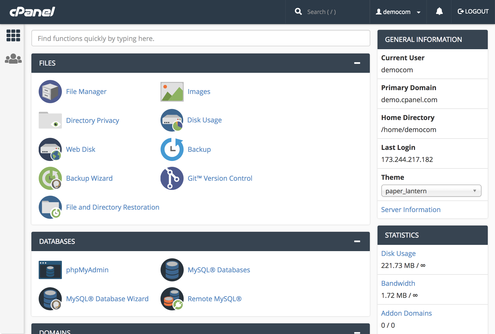
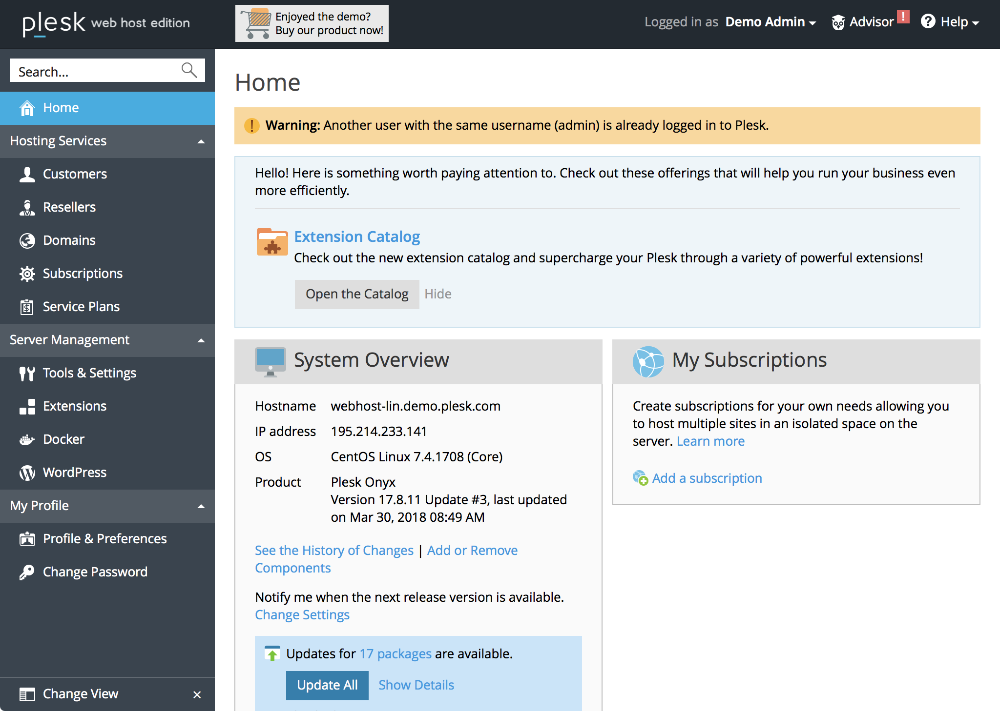
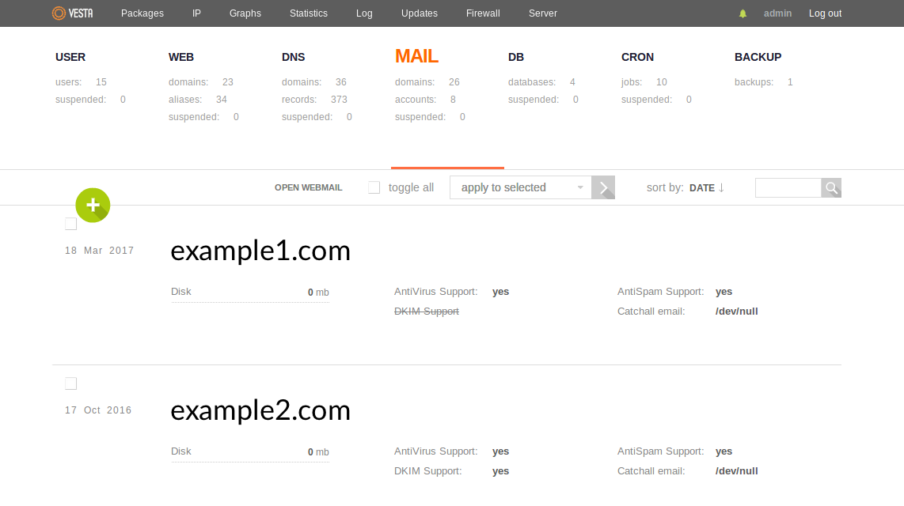
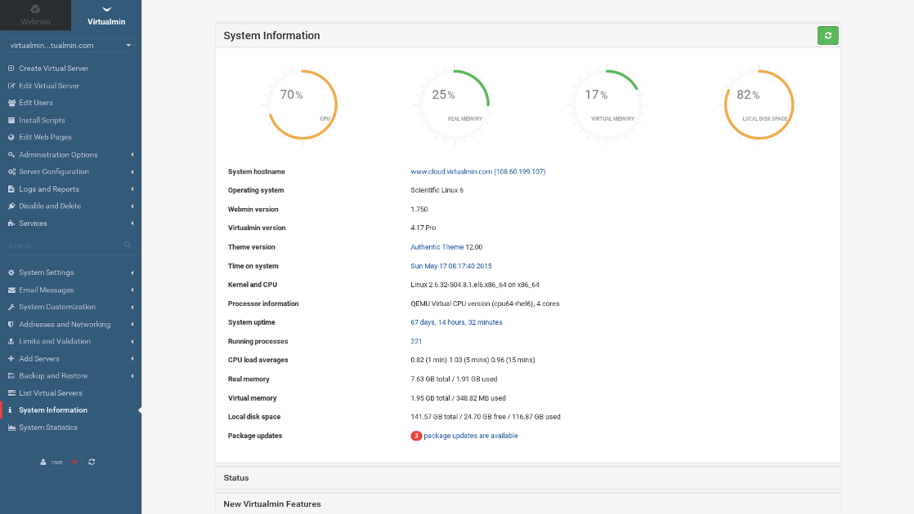

## What is a Control Panel?

On Linux systems, a control panel is a graphical user interface (GUI) that displays a simplified set of controls for your system. Control panels are capable of installing, configuring, and updating common software packages and performing Linux system administration tasks. Common features are:

-   File management

-   Web servers

-   Databases

-   Nameservers

-   Email

-   Firewalls

-   Logging, monitoring, and analytics

## Why Use a Control Panel?

The GUI provided by a control panel helps beginner Linux users run a server without needing expertise with the command line interface. These GUIs hide much of the complexity inherent in Linux administration, and they often provide marketplace interfaces for processes that would otherwise involve a number of steps.

Some control panels also offer a command-line interface (CLI) which perform equivalent functions to those exposed by the GUI. These tools provide a compromise between the convenience of the control panel's higher-level functionality and the automation capabilities of the command line.

Control panels often come with robust community support networks. In some cases, the organizations that author the control panel software also provide optional paid support packages.

### Caveats when Using a Control Panel

-   Control panels often enforce a specific style of directory structure and configuration syntax across your server. Any changes you make to your server should be via the interfaces provided by the control panel. Any changes you may make outside of those interfaces are likely to be overwritten or ignored by the control panel.

-   Control panels generally should not be installed on existing servers with software and services already installed. Instead, install control panels on new deployments.

-   Control panels are generally simple to use, but they can also have their own amount of complexity that needs to be accounted for.

-   Some control panels require a paid subscription to use.

-   Some control panels are only compatible with specific Linux distributions.

## How to Choose a Control Panel

When considering which control panel to use, review the following factors:

-   **Cost** to use the control panel, if any.

-   **User interface**: Does the control panel's UI appeal to you, and is it easy to understand?

-   **Features** available in the control panel.

-   **Community support**: Is there is a community forum, and do the members seem friendly/helpful?

-   **Documentation**: Is it easy to understand, and are there articles for most/all of the features?

-   **Paid support** (if desired): Is it available, and what is the cost?

-   **Frequency of updates**: Is the control panel actively maintained, and are security updates promptly issued?

-   **Distributions supported**: Can you install the control panel on your preferred Linux distribution?

## Control Panel Comparison

There are a large number of control panels that have been published over time, but some do not meet the criteria listed above. Here are a few popular options to consider:

|Control Panel|Cost|Supported Linux Distributions|
|---|---|---|
|[CPanel](#cpanel)|From $20/month|CentOS/RHEL, CloudLinux|
|[Plesk](#plesk)|From $10/month|CentOS/RHEL, CloudLinux, Debian, Ubuntu|
|[VestaCP](#vestacp)|Free, paid support available|CentOS/RHEL, Debian, Ubuntu|
|[Virtualmin](#virtualmin)|Free, Virtualmin Pro available from $6/month|CentOS/RHEL, Debian, Ubuntu, SuSE|

### CPanel

[CPanel](https://cpanel.com) is a proprietary, closed-source, privately-owned control panel first released in 1996.

CPanel is actually composed of two products:

-   CPanel itself, which is an interface for managing software, files, services and so on (e.g. a web server, email server, etc).
-   WHM (short for Web Host Manager), which provisions separate CPanel accounts. Multiple CPanel accounts can be present on one server, and WHM is the administrative interface for higher-level functions for managing those accounts.

Each CPanel account is correlated with a primary domain that its services are assigned to. Additional secondary domains can be assigned to a CPanel account via [*addon domains*](https://blog.cpanel.com/managing-multiple-domains-from-a-single-cpanel-account/).

WHM is often used by web hosting resellers. In this capacity, you use WHM to create CPanel accounts on your Linode and sell access to them to clients. WHM allows you to create custom visual branding for the account so that you can represent your reselling business to your clients in their CPanel interface.

CPanel's subscription cost starts at $20/month. When buying a subscription for use on a Linode, choose the [*VPS* license type](https://cpanel.com/pricing/). A free CPanel subscription is also included for each of your Linodes if you are a [Linode Managed](https://www.linode.com/products/managed/) subscriber.

CPanel offers a [community forum](https://forums.cpanel.net), [documentation library](https://documentation.cpanel.net), and [technical support](https://cpanel.com/support/) as part of your subscription.

A full list of CPanel's features is available on the [documentation site](https://documentation.cpanel.net/display/68Docs/cPanel+Features+List). [Demo sites](https://cpanel.com/demo/) are available for you test out the interfaces of CPanel and WHM.

### Plesk

[Plesk](https://plesk.com) is a proprietary, closed-source, privately-owned control panel first released in 2001.

Like CPanel, Plesk provides the ability to create [individual customer accounts](https://docs.plesk.com/en-US/onyx/administrator-guide/about-plesk/plesk-users.70561/), and these customer accounts can configure web services, email services, and other applications. Beyond this core functionality, Plesk can also orchestrate [multi-server deployments](https://docs.plesk.com/en-US/onyx/multi-server-guide/about-plesk-multi-server.77093/). In this configuration, a Plesk management node coordinates with individual service nodes.

Plesk's subscription cost starts at $10/month. When buying a subscription for use on a Linode, choose a [*VPS* license type](https://www.plesk.com/pricing/). Plesk tiers its features across [three different editions](https://www.plesk.com/editions/).

Plesk offers a [community forum](https://talk.plesk.com), [documentation library](https://docs.plesk.com/en-US/onyx/), [paid technical support](https://www.plesk.com/professional-services/), and [paid professional services](https://www.plesk.com/professional-services/). A full list of features is available on the [Plesk marketing site](https://www.plesk.com).

### VestaCP

[VestaCP](https://vestacp.com) (also referred to as just *Vesta*) is an [open-source](https://github.com/serghey-rodin/vesta) control panel released under the GNU General Public License (GPL) Version 3.

Vesta is a free alternative that offers a [similar feature set](https://vestacp.com/features/) to paid options like CPanel and Plesk. Vesta provides [easy install scripts](https://vestacp.com/install/) for specific combinations of services.

While the core of Vesta is free, [paid commercial plugins](https://vestacp.com/pricing/) for two functions can be purchased: a web file manager and SFTP chroot restricted access. [Paid support](https://vestacp.com/new/support/) is available starting at $60/hour.

Vesta offers a [community forum](https://forum.vestacp.com) and [documentation library](https://vestacp.com/docs/). [A demo site](https://vestacp.com/demo/) is available for you test out Vesta's interfaces.

### Virtualmin

[Virtualmin](https://www.virtualmin.com/) is a free, [open-source](https://github.com/virtualmin) control panel licensed under the GPL. A paid Virtualmin Pro edition is also available.

Virtualmin is [related to](https://www.virtualmin.com/webmin-and-virtualmin) and built on top of [Webmin](http://www.webmin.com/), and the relationship between the two is similar to WHM and CPanel. Webmin is an interface for common control panel functions, and Virtualmin is used to manage multiple Webmin users.

[Virtualmin Pro](https://www.virtualmin.com/buy/virtualmin) starts from $6/month for 10 domains, and tiers with higher numbers of domains can be purchased. Virtualmin Pro includes more installable applications, a WYSIWYG website editor, and premium support. A full comparison of features between Virtualmin, Virtualmin Pro, and other control panels is listed on the [Virtualmin marketing site](https://www.virtualmin.com/vs)

Virtualmin offers a [community forum](https://www.virtualmin.com/forum) and [documentation library](https://www.virtualmin.com/documentation).

## Next Steps

Once you've decided on a control panel, deploy a Linode and follow the appropriate installation instructions:

-   [CPanel](https://documentation.cpanel.net/display/68Docs/Installation+Guide)

-   [Plesk](https://docs.plesk.com/en-US/onyx/deployment-guide/plesk-installation-and-upgrade-on-single-server/1click-plesk-installation/installing-plesk-for-linux-in-marketplace.76444/)

-   [VestaCP](https://vestacp.com/install/)

-   [Virtualmin](https://www.virtualmin.com/download.html)

As a reminder, this guide only presents a few options from the many different control panels that are available, so you may wish to continue researching other products.
