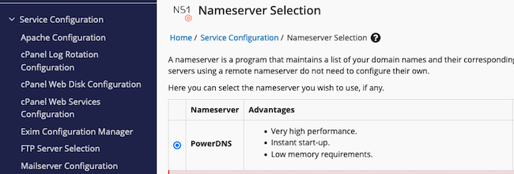

[cPanel](https://www.cpanel.net/) allows administrators to host their own name servers and *Domain Name System* (DNS) records locally. Entries for new domains and websites can be added to the local name server using the *WebHost Manager* (WHM) interface. This is especially handy for servers hosting a large number of domains, especially when the DNS records change frequently. This guide explains how to configure a local DNS service using WHM and cPanel, including an overview of the various DNS redundancy options.

cPanel is a web hosting application that simplifies common web and domain management tasks. It features a handy *graphical user interface* (GUI) along with other server tools. For more information on cPanel, including an overview of its features and advantages, see the [introduction to cPanel guide](/docs/guides/install-configure-cpanel-akamai/).

## Reasons for Self-Hosting a DNS Service

The DNS service is responsible for providing the IP address associated with a domain name. When someone wants to visit `google.com`, a DNS lookup is made to convert the name of the site into the actual IP address for Google. The client uses this IP address as the destination address for the request. The DNS ecosystem is vast and depends on a large number of name servers that collectively host the DNS records for all domains. The Linode [DNS Overview guide](/docs/guides/dns-overview/) provides additional information about the DNS service, including an explantion of how DNS addresses are resolved. Additional technical information is available from the [Wikipedia DNS entry](https://en.wikipedia.org/wiki/Domain_Name_System).

Domain owners have several alternatives for hosting their DNS records. In most cases, domain owners host their DNS records on external DNS services. These services, from domain registrars and third-party servers, are resilient, reliable, and secure. Most DNS providers maintain a fleet of name servers. If one becomes isolated, another can take over and respond. This option is the best choice for servers with only a few sites and domains, especially when the environment is stable. It is not worth the extra effort for these organizations to maintain their own name servers.

Large organizations and web hosting services often want to have more flexibility. These organizations can self-host their own DNS server and records. There are several advantages to this approach:

-   **Convenience**: It allows administrators to quickly add records for a new domain. This is usually faster than using an external DNS provider.
-   **Automation/Integration**: Some web hosting and management applications incorporate built-in name servers. This permits easy provisioning of new domains using a web interface. APIs allow them to automate an end-to-end pipeline for provisioning new domains.
-   **Autonomy**: Administrators who host their own name servers have complete control over how and when they provision their records. For instance, they can provision the appropriate DNS records before creating a domain so it instantly resolves. They can also quickly port their domain records to another server or DNS service.
-   **Branding**: Organizations can brand their name servers with their corporate or domain name. This provides the impression of being a larger and more professional organization.

Users should account for the time and complexity involved with managing their own DNS server. A self-hosted name server is easy to misconfigure and it is very possible to omit an important step. Additionally, a self-hosted name server might be less secure than a third-party solution.

## DNS Configuration Options for cPanel

All domains hosted on the cPanel server require DNS records before users can access them. These records can be hosted in several different ways.

-   **Third-Party DNS Servers**: The easiest approach is to use an external DNS service. This could be the DNS servers for the domain registrar or the [Linode DNS Manager](/docs/products/networking/dns-manager/get-started/). The cPanel/WHM server can be configured to use the external service for its name servers. All new domain records must be added to the external name servers.
-   **Custom Self-Hosted Name Servers**: Server administrators can also define a custom fully qualified domain name for their web servers. The domain `example.com` might define the custom name servers `ns1.example.com` and `ns2.example.com`. The name servers are self-hosted on cPanel using the built-in DNS server. The self-hosted approach involves adding *glue records* at the registrar to point to the self-hosted service. The DNS *A Records* for the domain are added to the self-hosted name servers, not an external service. One drawback to this architecture is there is no redundancy, so it is not recommended for production web sites. Larger organizations typically manage their DNS records on cPanel but use dedicated DNS servers for better throughput and resiliency. The [Linode guide to custom DNS servers](/docs/guides/custom-name-servers/) provides more background about this option.
-   **Self-Hosted DNS Cluster**: Most DNS software applications, including the built-in cPanel DNS service, allow users to build a multi-server DNS architecture. This permits redundancy and enhances reliability, availability, and throughput. To use the cPanel solution, two or more [cPanel DNSOnly devices](https://docs.cpanel.net/installation-guide/cpanel-dnsonly-installation/) are required. The main server operates as a control module for the fleet of DNS servers.
-   **Secondary Read-Only DNS Service**: An external secondary DNS service can be added as a backup to any self-hosted solution. This read-only service is available through third-party DNS providers or from the domain registrar. DNS records, including any changes, are transmitted from the self-hosted DNS server to the secondary. If the self-hosted DNS service fails or becomes inaccessible, the secondary service can respond to incoming DNS queries. It is not even necessary to specify the self-hosted name servers as authoritative servers. In this configuration, the secondary service handles all DNS requests.

## DNS Services on cPanel

cPanel users can take advantage of the built-in PowerDNS DNS server. They can add DNS records using the WHM interface and view, edit, or delete existing records using the [DNS Zone Manager](https://docs.cpanel.net/whm/dns-functions/dns-zone-manager/). In many cases, WHM can invoke PowerDNS to automatically provision DNS records after certain triggers, such as a change to the host name. For additional instructions on using the cPanel and WHM interfaces, see the [Installing and Configuring cPanel guide](/docs/guides/install-configure-cpanel-akamai/).

Although all domain records can be provisioned using WHM, glue records must be added at the domain registrar. These glue records specify the IP addresses for the custom name servers and prevent an unresolvable loop from forming. After all components are configured, the name servers for the domain are set to reference the self-hosted DNS service.

## Before You Begin

1.  If you have not already done so, create a Linode account and Compute Instance. See our [Getting Started with Linode](/docs/guides/getting-started/) and [Creating a Compute Instance](/docs/guides/creating-a-compute-instance/) guides.

1.  Follow our [Setting Up and Securing a Compute Instance](/docs/guides/set-up-and-secure/) guide to update your system. You may also wish to set the timezone, configure your hostname, create a limited user account, and harden SSH access.

1.  The cPanel/WHM application must already be installed on the host. For information on how to install and configure cPanel on Akamai, consult the [Linode cPanel guide](/docs/guides/install-configure-cpanel-akamai/).


The steps in this guide require root privileges. Be sure to run the steps below as `root` or with the `sudo` prefix. For more information on privileges, see our [Users and Groups](/docs/tools-reference/linux-users-and-groups/) guide.


## How to Set Up a Custom Domain for the cPanel Name Servers

Do not configure the name servers at installation time. When adding an email address after registering the cPanel license, leave the name servers blank.

To configure the custom self-hosted name servers, follow these steps.

1.  Ensure the PowerDNS name server software is configured on WHM/cPanel. Using WHM, select **Service Configuration** then **Nameserver Selection**. Ensure **PowerDNS** is selected.

    

1.  Ensure a custom domain for the subdomain and name servers have been created at your registrar.

1.  Log in to the registrar and create glue records for the custom name servers. These instructions differ between registrars. Choose meaningful names for the name servers. By convention, name servers begin with `ns`, followed by a number, the dot symbol `.`, and the domain name. For the domain `example.com`, the first name server could be `ns1.example.com`. Create at least two name servers for the domain. To get started, both name servers can point to the same system. Although this approach lacks redundancy, it is acceptable during the set-up stage.

    The basic process always involves selecting the domain, creating name servers for the domain, and providing an IP address for each name server. To use the built-in cPanel DNS server, specify the IP address of the system hosting cPanel.

    For more information about how to create glue records, see the [Linode guide to setting up custom name servers](/docs/guides/custom-name-servers/#configure-glue-records). The guide contains links to the relevant instructions for some popular domain providers, including [Namecheap](https://www.namecheap.com/) and [Go Daddy](https://www.godaddy.com/).

    
    It might take a day or more to propagate the new name server records to all the top-level name servers serving the internet. However, in most cases, it only takes a few hours.
    

1.  Return to the WHM interface to select the default name servers. Locate the **Server Configuration** section and select the **Basic WebHost Manager Setup** icon.

    

1.  Scroll to the bottom of the interface screen to the **Nameservers** section. Enter the names of the name servers. These names must match those given to the name servers on the registrar. In this example, the name servers are `ns1.example.com` and `ns2.example.com`. Click the **Save Changes** button to apply the configuration.

    

1.  Create an *A record* for each name server. This allows the DNS system to return the correct IP address for each name server. Return to the **Basic WebHost Manager Setup** interface and scroll down to the **Nameservers** section. For each name server, click the **Configure Address Records** button.

    

1.  In the **Configure Address Records** pop-up window, enter the IPv4 address for the name server. Because the name servers are hosted on the built-in cPanel DNS server, this is the same as the IP address of the local server. Click the **Configure Address Records** button to complete the task.

    

1.  Configure an address record for the remaining name servers using the same steps.

1.  If a proper hostname has not been configured for the cPanel server yet, configure one now. This prompts cPanel to issue a SSL certificate for the domain name, thereby increasing security. In the left-hand menu, expand **Networking Setup** and select the **Change Hostname** option.

    

1.  The **Change Hostname** interface includes some instructions and a text box to use for entering the new host name. Set the host name to the subdomain associated with the cPanel server. This subdomain must not be used anywhere else. Click **Change** to continue.

    

1.  At the end of the configuration script, WHM provides an option to add a DNS entry for the host server's domain. An `A` record for the domain can be added here or through an external DNS service. To allow the local DNS server to manage the host name domain, click the button labeled **Add an A entry for your hostname**.

    

1.  **Optional**: To host the DNS records for the host name, add an `A` entry. This step is not required if an external DNS service is used to host the `A` record. Within the **Add an A Entry for Your Hostname** interface, cPanel already displays the local IP address. Confirm the IP address is correct and click the **Add Entry** button. WHM indicates whether or not the change has succeeded.

    

1.  To ensure proper behavior, reboot the WHM/cPanel host after the hostname change.

### How to Add a DNS Record for a New Subdomain

To be reachable across the wider internet, a new subdomain requires an `A` type DNS record. To add a new DNS record to the self-hosted name servers, use the **DNS Zone Manager**. Follow these steps to create the record.

1.  Select the **DNS Zone Manager** from the **DNS Functions** section.

    

1.  Locate the correct domain to add a record to. Click the **Manage** button on the right side of the entry.

    

1.  Select the **Add Record** button on the right of the interface.

    

1.  Fill out the details for the new record as follows:

    -   Add the **Name** of the subdomain. cPanel automatically prepends the parent domain to the end. For example, to add a record for `newdomain.example.com`, enter `newdomain` for the name.
    -   Enter the **TTL**. This value specifies the number of seconds for the time-to-live value.
    -   Enter `A` under **Type**.
    -   Enter the IP address under **Record**. This is the IP address of the cPanel host.

    Click **Save Record** to add the DNS entry. After the domain resolves, the subdomain should be reachable using the fully qualified domain name. The domain only resolves properly if the authoritative name servers are configured, as described in the next section.

    

## How to Update the Authoritative Name Server for the Domain

Currently, the domain is still configured to use the registrar's default name servers for domain look-ups. To switch to the custom self-hosted name servers, update the domain records on the registrar. After this change propagates, the cPanel DNS service can handle all lookups for the domain. The change typically takes a few hours to propagate, but might take up to a day in the worst case.

The procedure for updating the official name servers for the domain varies between registrars. The basic procedure involves selecting the domain record on the registrar and editing the name server settings. Consult the [Linode guide to registering custom DNS name servers](/docs/guides/custom-name-servers/#change-the-name-servers-for-your-domains) for a more detailed explanation. This guide contains links to the relevant instructions for popular domain name providers.

After a propagation is complete, verify the changes. First use the `dig` command to retrieve the DNS records for the domain from a *top-level domain* (TLD) server. For instance, for a domain ending in `.com`, use the following command:

```command
dig +short com NS
```

More information on verifying the changes can be found in the [Verify DNS Records section of the Linode custom DNS name servers guide](/docs/guides/custom-name-servers/#verify-dns-changes). In all cases, the following information should be validated. In each case, the IP address must be correct:

-   **Glue Records**: There should be an `A` record for each name server, pointing to the IP address.
-   **Domain Name Servers**: The `AUTHORITY` section of the record should confirm the domain uses the self-hosted cPanel name servers.
-   **Domain A Record**: Retrieve the corresponding record from the name server and ensure it contains the IP address of the cPanel server.

## Configuring a Multi-Server DNS Cluster for cPanel

One drawback of setting up a custom self-hosted domain on cPanel is the lack of redundancy. This could cause downtime or lower reliability for any sites on the domain. This might not matter for a single server hosting a handful of sites. If the DNS server is down, the cPanel server itself is likely also down, so redundancy is not too important. However, if the domain is spread across multiple servers, some sites might become inaccessible when the DNS server is unavailable.

There are two main strategies to combat this. The most common solution is to configure a secondary DNS service using an external provider. However, cPanel also allows for the configuration of a [multi-server DNS cluster](https://docs.cpanel.net/knowledge-base/dnsonly/guide-to-dns-cluster-configurations/). In this configuration, multiple DNS servers co-host the records. Several possible architectures are available, including an efficient option where all DNS servers have a direct link to the main server for the domain. More complex architectures might introduce an extra amount of delay.

The configuration process for this solution is very complex, involving many steps and multiple devices. Most solutions require multiple [cPanel DNSOnly devices](https://docs.cpanel.net/installation-guide/cpanel-dnsonly-installation/), which each require a no-cost license. Each DNSOnly device must be directly reachable from the main server. See the [DNS cluster configuration guide](https://docs.cpanel.net/whm/clusters/dns-cluster/) for a more detailed explanation. The instructions vary depending on the cluster architecture.

## How to Use an External DNS Provider as a Secondary Read-Only DNS Service

A more straightforward way of adding redundancy to the cPanel DNS service is to provision a read-only secondary service. Users can choose an external DNS service from either the domain registrar or a cloud computing service such as Linode.

In this approach, the primary DNS service handles all updates and manages any changes. All DNS records are added to the primary name servers. However, the primary name servers transmit all records, including any changes, to an off-site secondary DNS server. This backup service can respond to DNS queries in the event the main cPanel DNS server becomes unavailable. It can also be the sole name server for the domain. In this case, the secondary name server handles all DNS requests.

The secondary server only operates in read-only mode. DNS changes cannot be made on the secondary server and it does not send any updates back to the primary DNS service. Before it can respond to DNS requests, the secondary name server must be configured as an authoritative name server for the domain at the registrar.

The procedure for adding a secondary DNS service involves more configuration to the cPanel server and provisioning the secondary service at another provider. The DNS records are transferred to the secondary using `AXFR` queries. cPanel must be configured to allow the transfers and requests.

### How to Configure cPanel/WHM to Support a Secondary DNS Server

Before proceeding with this section, ensure the custom domain is already configured in cPanel. Follow the steps in the [How to Set Up a Custom Domain for the cPanel Name Servers](/docs/guides/configure-name-server-dns-cpanel/#how-to-set-up-a-custom-domain-for-the-cpanel-name-servers) section to complete the configuration.

At the registrar level, the list of authoritative name servers only has to include the secondary servers. The self-hosted name servers are not required and do not have to be listed. However, both the self-hosted and secondary name servers can be configured as authoritative name servers without any negative side effects. If the self-hosted name servers are not included, the glue records are technically also optional. However, they are still useful for troubleshooting and testing purposes.

To configure a secondary DNS server, follow these steps.

1.  Log in to the server hosting the cPanel/WHM installation.

1.  Edit the file named `/etc/pdns/pdns.conf`:

    ```command
    nano /etc/pdns/pdns.conf
    ```

1.  Ensure the value of `disable-axfr` is uncommented and set to `no`. This directive appears in two places and must be changed in both cases. The `allow-axfr-ips` and `also-notify` variables must be set to the list of IP addresses for the secondary name servers. The following example demonstrates how to configure PowerDNS to use the Linode DNS servers as a secondary server. To use other third-party or registrar DNS servers, consult their documentation to determine the correct IP addresses.

    ```file {title="/etc/pdns/pdns.conf"}
    allow-axfr-ips=104.237.137.10,45.79.109.10,74.207.225.10,207.192.70.10,109.74.194.10,2600:3c00::a,2600:3c01::a,2600:3c02::a,2600:3c03::a,2a01:7e00::a
    ...
    also-notify=104.237.137.10,45.79.109.10,74.207.225.10,207.192.70.10,109.74.194.10,2600:3c00::a,2600:3c01::a,2600:3c02::a,2600:3c03::a,2a01:7e00::a
    ...
    disable-axfr=no
    ```

    When done, press <kbd>CTRL</kbd>+<kbd>X</kbd>, followed by <kbd>Y</kbd> then <kbd>Enter</kbd> to save the file and exit `nano`.

1.  Run internal scripts on the server to rebuild and restart the DNS server:

    ```command
    /scripts/rebuilddnsconfig
    /scripts/restartsrv_named
    ```

### How to Configure a Secondary Read-Only DNS Service

The secondary DNS service must be configured on the external DNS provider. This procedure varies between the different providers. The following steps demonstrate how to configure this service using the Linode DNS Manager. For additional information, consult the [Linode guide to operating a secondary DNS service](/docs/products/networking/dns-manager/guides/incoming-dns-zone-transfers/#operate-as-a-secondary-read-only-dns-service). That guide includes the current IP addresses for the Linode name servers.

1.  Log in to the [Linode Cloud Manager](https://cloud.linode.com/).

1.  Select **Domains** from the left navigation menu.

    

1.  Click the **Create Domain** button.

    

1.  Click the **Secondary** button at the top of the form. This refreshes the form with new fields:

    -   For **Domain**, enter the name of the domain.
    -   In **Primary Nameserver IP address**, enter the address of the cPanel server hosting the DNS server.
    -   To add a second primary name server, click **Add an IP** and add the IP address of the other cPanel server host.

    Click **Create Domain** to continue.

    

1.  It might take some time to transfer the domain details to the secondary server. To ensure the details have been transferred to the Linode DNS servers, run the following command from any console. The output should display the IP address of the cPanel server hosting the domain. Substitute the name of the actual domain for `example.com`. For other DNS services, use the name of their name servers instead.

    ```command
    dig example.com +short @ns1.linode.com.
    ```

1.  Add the new secondary name servers as additional name servers on the registrar. The secondary name servers can be specified either in addition to or instead of the self-hosted primary name servers on cPanel.

## Conclusion

cPanel provides a built-in DNS server for hosting custom name servers for a domain. The PowerDNS service allows users to quickly add and change DNS records on the local name server. These name servers can be used instead of third-party DNS services. Redundancy can be added by using a DNS cluster or an external secondary DNS server. Additional configuration must be added to the registrar records for the domain. For more information, see the [cPanel documentation](https://www.cpanel.net/support/).