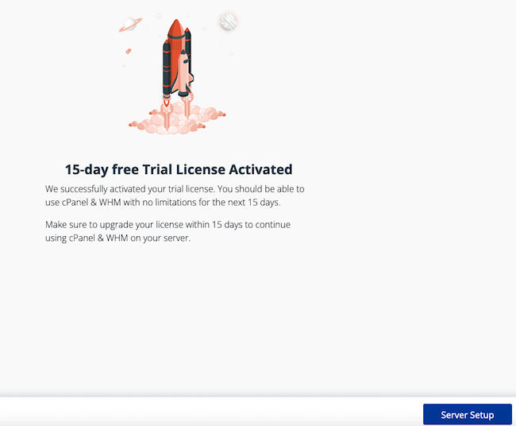
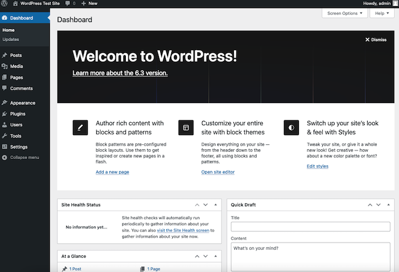

[cPanel](https://www.cpanel.net/) is a control panel-based application for managing and simplifying common web hosting tasks. It includes a *graphical user interface* (GUI) for creating and administering web sites, along with other related tools. This guide provides an introduction to cPanel and the integrated *WebHost Manager* (WHM) service, along with instructions on how to install and configure it. It also explains how to perform common web hosting tasks.

## What are cPanel and WHM?

cPanel is currently maintained by the private company cPanel, L.L.C.. It simplifies the process of hosting and deploying websites. Web service providers use cPanel to administer web sites for their customers. But companies and individuals also use it to oversee their own sites, especially when many sites reside on the same server. cPanel is a commercial application and is not available in a free or open-source version. Users require a cPanel license to use the software. [cPanel Licenses](https://store.cpanel.net/) are available in several tiers, with a [15-day free trial](https://cpanel.net/products/trial/) available.

cPanel includes a powerful web-based GUI containing tools for common web administration tasks. Users can add accounts, create sites, set up email, and upload files. Access to cPanel is also available through the command line or the cPanel API. The cPanel API allows administrators to integrate automated processes into their workflow. Several third-party add-ons are available for added functionality.

The cPanel package also includes the *WebHost Manager* (WHM) server administration tool. WHM is used to create accounts and perform server-wide configuration tasks, including setting DNS records or downloading software. It runs in `root` and `non-root` modes. The more powerful `root` mode permits full access to all features, including server and software package management. Non-root WHM permits users to create and administer cPanel accounts. WHM also manages SSL certificates, DNS settings, authentication, and various server services such as FTP.

In contrast, the cPanel interface is only used to manage individual accounts and subdomains, including websites, files, and email services. Each server typically hosts multiple cPanel accounts. Somewhat confusingly, cPanel also refers to the combined software package including WHM and to the product as a whole.

### The Main Features and Use Cases of cPanel

cPanel makes it easier to create server accounts and subdomains and to administer these domains. Some of the main cPanel features include the following:

- It includes an intuitive and useful user interface for accomplishing almost all site administration activities.
- It allows administrators to create and manage domains, including subdomains.
- It is integrated with WordPress and the WP Toolkit. This toolkit simplifies installing and administering a WordPress site.
- Web hosting companies can provide an individual cPanel account to their users. This allows them to create, host, and manage their web sites.
- It can create user accounts, email accounts, and shared calendars.
- The cPanel file manager allows users to transfer, view, and manage files, sites, and folders.
- It includes an FTP server for uploading and downloading files.
- It features a built-in DNS manager and sophisticated networking tools.
- It includes a large number of tools, such as the MySQL database, the PHP programming language, and a web server. It contains all the components required to perform many common tasks.
- It can migrate sites from other servers.
- It provides a full range of statistical, monitoring, and server management tools.
- It prioritizes security with SSL certificates, encryption, safe lists, and optional multi-factor authentication.

### The Advantages and Downsides of cPanel

cPanel boasts many advantages and is widely deployed due to its large number of features. However, there are also some drawbacks to the application.

Here are some of the advantages of cPanel and WHM:

- It is easy to install and widely-used.
- It is optimized for web site hosting and management and includes many advanced tools. cPanel reduces management overhead and administrative complexity.
- The user interface is thoughtfully laid out and easy to use.
- cPanel is fast and responsive.
- It contains many important and commonly-used web server components, such as a database and the PHP programming language.
- It includes monitoring and maintenance tools.
- The disc space and memory requirements are relatively small and reasonable in comparison to similar-complex programs.
- It includes anti-virus protection.
- It is compatible with all popular web browsers.
- It supports third-party tools and WordPress add-ons and extensions.
- It features an auto-restart mechanism.
- It is based on Linux and considered quite stable.

Some of the main drawbacks to cPanel are as follows:

- It is a paid commercial service and is not open source. It is considered quite expensive, especially for the premium packages.
- It has been the target of several hacker attacks and exploits. cPanel must be vigilantly kept up-to-date to be considered secure. Third party tools can expose additional vulnerabilities.
- The application is very complex and contains a large number of options and tools that most casual users do not require.
- It lacks redundancy for high-availability, horizontal scaling, and load balancing. The absence of redundancy increases the chance of downtime.
- Users are locked into the cPanel environment.
- The interactions and division of tasks between WHM and cPanel are not always clear. For certain configuration tasks, users might have to skip back and forth between the two tools. The two interfaces are laid out differently and do not appear to be part of a common product.
- It is prone to data corruption and loss.
- It does not support many popular Linux distributions. It is only officially supported on Ubuntu, AlmaLinux, Rocky Linux, and Cloud Linux. It can be unofficially installed with varying degrees of success on other platforms.

For more information on cPanel and WHM, see the [official documentation](https://www.cpanel.net/support/).

## Before You Begin

1.  If you have not already done so, create a Linode account and Compute Instance. See our [Getting Started with Linode](/docs/guides/getting-started/) and [Creating a Compute Instance](/docs/guides/creating-a-compute-instance/) guides.

1.  Follow our [Setting Up and Securing a Compute Instance](/docs/guides/set-up-and-secure/) guide to update your system. You may also wish to set the timezone, configure your hostname, create a limited user account, and harden SSH access.

1.  A fully-qualified domain name is required for the system. This name matches the hostname and can be used to access cPanel and WHM.


The steps in this guide require root privileges. Be sure to run the steps below as `root` or with the `sudo` prefix. For more information on privileges, see our [Users and Groups](/docs/tools-reference/linux-users-and-groups/) guide.


## Methods of Deploying cPanel to an Akamai Server

There are two main methods of downloading and installing cPanel to an Akamai server.

1.  The Linode/Akamai Marketplace permits one-click deployment from the Akamai Dashboard. See the [Linode guide to deploying cPanel through the Marketplace](/docs/products/tools/marketplace/guides/cpanel/) for more information.

1.  It can be downloaded and installed manually. This method requires users to change and confirm a few system settings before using cPanel.

Most users prefer to install cPanel manually because this allows for complete control over configuration, updates, and upgrades. This guide focuses on the manual installation option, including licensing requirements.

## How to Install cPanel Manually

Before proceeding, create an account on the [cPanel store](https://store.cpanel.net/). To use cPanel, either purchase a license or request a free trial.

The system must have a minimum of 1GB of RAM, with 4GB recommended. For single-domain usage, it must also have at least 20 GB of disc space, with additional space required for more accounts. Before starting, review the [cPanel system requirements guide](https://docs.cpanel.net/installation-guide/system-requirements/) for more information.

cPanel must be installed on a clean and previously-unused operating system with no other applications present. Throughout the installation process, log in and run all commands as the `root` user.

This guide is designed for Ubuntu 20.04 LTS users. However, these instructions are generally applicable for other supported Linux distributions. To install cPanel, follow these steps.

1.  Log in to the system as the `root` user. Do not use a different account with `sudo` privileges.

1.  Ensure the system and all packages are up to date.

    ```command
    apt-get update -y && apt-get upgrade -y
    ```

1.  Ensure the `perl` utility is installed.

    ```command
    apt install perl perl-base -y
    ```

1.  Deactivate the `ufw` firewall.

    ```command
    iptables-save > ~/firewall.rules
    systemctl stop ufw.service
    systemctl disable ufw.service
    ```

1.  **Optional** Increase the available swap space for better performance.

    ```command
    fallocate -l 2G /swapfile
    chmod 600 /swapfile
    mkswap /swapfile
    swapon /swapfile
    echo "/swapfile swap swap defaults 0 0" | tee -a /etc/fstab
    ```

1.  Download and install cPanel and WHM.

    
    The installation might take five to ten minutes, depending on the platform.
    

    ```command
    cd /home && curl -o latest -L https://securedownloads.cpanel.net/latest && sh latest
    ```

1.  At the end of the installation script, cPanel displays information about the application and what to do next. These instructions are explained in more detail in the next section. However, it is a good idea to copy these details to another file.

    ```command
    (INFO): cPanel install finished in 8 minutes and 26 seconds!
    (INFO): Congratulations! Your installation of cPanel & WHM 11.112 is now complete. The next step is to configure your server.
    (INFO): Before you configure your server, ensure that your firewall allows access on port 2087.
    (INFO): After ensuring that your firewall allows access on port 2087, you can configure your server.
    (INFO): 1. Open your preferred browser
    (INFO): 2. Navigate to the following url using the address bar and enter this one-time autologin url:
    (INFO): https://localhost:2087/cpsess2827715401/login/?session=root%3aryV1nI0e9INWGB0t%3acreate_user_session%2cc74b5256a0e21db5e79340e1896dd12d
    (INFO): After the login url expires you generate a new one using the 'whmlogin' command or manually login at:
    (INFO): https://192.0.2.192:2087
    (INFO): Visit https://go.cpanel.net/whminit for more information about first-time configuration of your server.
    (INFO): Visit http://support.cpanel.net or https://go.cpanel.net/allfaq for additional support
    (INFO): Thank you for installing cPanel & WHM 11.112!
    ```

## How to Access the WHM Interface

Before proceeding further, users must use WHM to register their account. Navigate to WHM remotely using the IP address and port `2087`. To access the WHM interface, follow these steps.


These steps explain how to start with a free cPanel/WHM trial, but the steps to activate a prepaid license are very similar.


1.  Use a web browser to connect to port `2087` of the system hosting WHM/cPanel. Enter the address in the format `https://<SYSTEM-IP-ADDRESS>:2087`, replacing `<SYSTEM-IP-ADDRESS>` with the actual IP address. Ignore any security warnings and proceed to the site. On Firefox, click the **Advanced...** button then select **Accept the Risk and Continue**.

    
    Upon installation, cPanel temporarily issues a SSL certificate for an auto-generated subdomain on the `cprapid.com` domain in the format. Ignore this temporary name for now and access the node using its IP address. A later step in the configuration process changes the hostname, resulting in the generation of a permanent SSL certificate for the actual domain name.
    

    ```command
    https://<SYSTEM-IP-ADDRESS>:2087
    ```

1.  The browser displays the WHM login page. Enter `root` for the `Username`. For `Password`, enter the password for the server `root` account.

    

### How to Register a License and Access WHM

1.  Accept the `cPanel & WebHost Manager End User License Agreement`. Click on the button stating `I have read and agree to all the legal documents listed above`. Scroll to read the rest of the document. Click **Continue** to proceed.

    

1. The next window prompts users to either get started with a free trial or activate a paid license. Select the **Log in to cPanel Store** button to access the store and enter the credentials.

    

1.  Use the credentials for the cPanel store to access the account. Enter the `Email address` and `Password` associated with the account. If you do not have an account, create one before proceeding. Select the **Sign In** button to continue.

    

1.  cPanel typically activates the license automatically. In some cases, it might be necessary to manually activate it. Select **Server Setup** to proceed to the next step.

    

1.  Enter an email address for any status updates and critical alerts. Leave the nameservers blank for now. If necessary, the built-in cPanel DNS service can be configured later. Click **Finish** to proceed.

    

1.  If the activation is successful, the browser displays the main WHM dashboard.

    

## How to Configure the Hostname on cPanel

For proper access, the hostname should be changed to a meaningful domain name. cPanel proceeds to issue a SSL certificate based on the domain name for increased security. To change the hostname, follow these steps.

1.  In the left-hand menu, expand **Networking Setup** and select the **Change Hostname** option.

    

1.  This presents the user interface for the `Change Hostname` option. It consists of a series of instructions along with a text box for the new host name. The host name should be set to the subdomain associated with the server. This subdomain must not be used anywhere else. Click **Change** to continue.

    

1.  WHM runs a script indicating how the change is progressing. At the end, it provides an option to add a DNS entry for the new subdomain. The entry can be either added here or through a third-party DNS server.

    
    Adding the DNS A record through an external DNS service or on the domain registrar is recommended for most users.
    

1.  **Optional** To add an entry using WHM, click the **Add an A entry for your hostname** button.

    

    This redirects the user interface to the **Add an A Entry for Your Hostname**. Confirm the IP address and select the **Add Entry** button.

    

1.  To ensure proper behavior, reboot the WHM/cPanel host after the hostname change.

## How to Add a cPanel Account

Users can only access the cPanel interface if they have a cPanel account. This means an administrator must create the account in WHM first. To create a cPanel account, follow these steps. A knowledge of basic DNS principles is very helpful here. An introduction can be found in the [DNS Overview guide](/docs/guides/dns-overview/).

1.  To create an account as the `root` user, provide the names of at least two nameservers. To use the Linode DNS manager to manage the DNS record, enter the names of two or more Linode nameservers. To configure the name servers, first select **Basic WebHost Manager Setup** under **Server Configuration** in the left hand menu.

    

1.  In the `Nameservers` section, add the names of the Linode nameservers, for example `ns1.linode.com`. DNS entries for all new cPanel accounts on the server must be added to the authoritative name server for the domain. For instance, if the domain uses the Linode nameservers, add the DNS entry for a new cPanel account using the Linode DNS manager. Select **Save Changes** to apply the changes.

    
    For any new domain name, update the authoritative name servers for the domain. These DNS servers might be associated with an external DNS provider or with the registrar of the domain. It could also be the name of a self-hosted name server, if one has already been configured.

    In some cases, the new domain might be a subdomain of the host name domain. In this situation, the authoritative name servers were already configured when the root domain was created.
    

    

1.  In the main WHM user interface, find the button labeled **Create a New Account**. This is located within the `Favorites` section of the main panel. The same option is available through the left hand panel, under **Account Functions**.

    

1.  Enter information about the new account using the interface. Specify the following details.

    - Enter the name of the domain in the `Domain` field. This would typically be a subdomain of the core domain, for instance, `testuser.example.com`.
    - Specify a unique `username` for the account. The first eight characters must be unique within the accounts. The entire user name must be sixteen characters or less. It can only include lower case letters and numbers, and must begin with a letter. A user name beginning with `test` is not allowed.
    - Enter a unique secure password for the `Password` field, then retype it under `Re-Type Password`. The strength indicator displays how strong the password is. It should ideally be green in color, which means it passes the basic strength threshold.
    - For `email`, specify a contact email for the account.
    - Choose a package for the user. A package indicates the system quotas for the user. The `default` package provides unrestricted limits. It is also possible to `Select Options Manually`.
    - **Optional** Select, deselect, or change any remaining account privileges, for example, `CGI Access`.

    

1.  Click the **Create** button at the bottom of the interface.

    

## How to Access the cPanel Interface

After the account has been created, access and administer it using the cPanel interface. To access cPanel follow these steps.


Immediately after it creates the account, WHM provides a shortcut button labeled **Go to cPanel**. This allows the `root` user to immediately access the cPanel interface for the new account and confirm it has been initialized correctly.


1.  Use a web browser to access port `2083` of the subdomain associated with the new account. In the following address, replace `example.com` with the name of the domain.

    
    cPanel uses port `2083` while WHM uses port `2087`. Both ports are on the same server.
    

    ```command
    https://testuser.example.com:2083
    ```

1.  Enter the `Username` and `Password` for the account. Then select **Log in**.

    

1.  cPanel displays the default dashboard, containing a series of icons associated with common tasks. Scroll down to locate more options. On the right side of the screen, the dashboard displays information about the account, including account statistics.

    

## How to Configure Email on cPanel

cPanel allows users to configure one or more email accounts using the main cPanel dashboard. Users can access their email account using the cPanel webmail interface on the same system. To add and use an email account, follow these steps.

1.  Click the **Email Accounts** icon on the cPanel dashboard. This is one of the more prominent links, located at the top left of the dashboard.

    

1. cPanel displays the `Email Accounts` interface. A system account for the domain, with the name of the administrative user, already exists.

    

1.  Click the **Create** button on the right side of the interface to add a new account.

    

1.  On the next screen, add the account information. The following information is required.

    - Add a `Username` for the account. The full email address of the account consists of the user name, the `@` symbol, and the name of the subdomain associated with the cPanel account. For instance, for an email user named `mailuser` within the subdomain `testuser.example.com`, the email address is `mailuser@testuser.example.com`.
    - Include the `Password` information. Two options are available. The administrator can define the password when creating the account using the `Set password now` option. They must then either enter the password in the subsequent text box. They can also use the `Generate` option to create a system-generated password. Alternatively, they can choose `Send login link to alternate email address`. With this option, the user receives a link and then sets their own password when logging in.
    - To remain on the current page after creating the account, select the `Stay on this page after I click Create` check box.
    - Click the **Create** button when finished.

    cPanel confirms the account has been successfully created.

    

1.  To read and send emails, use the cPanel email interface. The Webmail service is available on port `2096` of the server. For example, for the domain `testuser.example.com`, the address is https://testuser.example.com:2096. Connect to the port to display the Webmail login page.

    Enter the user name for the account along with the password and click the **Log In** button. This displays the webmail interface for the account.

    
    If `Send login link to alternate email address` was selected at account creation time, the email user must click and follow the link to set up an account. They must immediately choose a password and follow the subsequent instructions to access their account.
    

    

1.  From the Webmail interface, users can manage their account, set up email on their personal computers, and edit settings. Users can click the **Open** button to access their inbox. Clicking the box `Open my inbox when I log in` automatically launches the inbox on subsequent logins.

1.  From the inbox, users can read and send emails. Click the title of an email to read it. Select the `Compose` button to write and send an email. For more information about the Webmail settings, see the [cPanel Webmail documentation](https://docs.cpanel.net/knowledge-base/email/how-to-create-and-connect-to-an-email-account/).

    

## How to Upload Files Using sFTP

Users can upload files to their domain using the SSH File Transfer Protocol (SFTP) protocol. SFTP is a more secure version of FTP that uses SSH keys to encrypt the content. This guide uses [FileZilla](/docs/guides/filezilla/) to demonstrate this task, but other SFTP clients, such as [sFTP](/docs/guides/sftp-linux/), can also be used.

The SFTP client requires the following information to connect to the cPanel account. Consult the [cPanel SFTP documentation](https://docs.cpanel.net/knowledge-base/ftp/how-to-configure-your-sftp-client/) for more information.

- `Hostname`: The subdomain name associated with the cPanel account, for example, `testuser.example.com`.
- `SSH port number`: The port number for the connection. For SFTP connections, choose port `22`.
- `Security`: Whether to use FTP or SFTP for the transfer. SFTP is recommended for transferring files.
- `Username`: The user name associated with the cPanel account.
- `Password`: The password for the `Username` account.
- `Private Key`: The location of the SSH private key. cPanel requires this key to accept the connection. This key must be generated inside the cPanel interface and downloaded to another location.

Before proceeding with the transfer, it is important to understand the [cPanel File Manager](https://docs.cpanel.net/cpanel/files/file-manager/). Each cPanel account has a home directory located at `/home/exampleuser`. Clicking on the **File Manager** icon opens the file manager to the user home directory. From within this location, users can browse the other directories. Of particular note is the `public_html` folder. This is the root directory for all website files. The `public_ftp` directory is a good staging point for uploading and downloading files.

To upload files using SFTP, follow these steps.

### How to Generate a SSH Key

1.  Review the directory structure for the cPanel account. Click the **File Manager** icon on the cPanel dashboard.

    

1.  The `cPanel File Manager` displays the directory structure for the user on the left side of the screen. Click on a folder to see the folder contents. Determine where to place any files. It is common to upload any new files to the `public_ftp` directory, then move them to their final location.

    

1.  Return to the cPanel dashboard. Find and click on the `SSH Access` icon under the `Security` heading.

    

1.  cPanel displays the SSH Access interface. Click on **Manage SSH Keys** to access the key management infrastructure.

    

1.  The `SSH Access` page displays a list of all public and private keys. These lists are likely blank because no keys have been created or imported yet. To generate an SSH Key for cPanel access, click the **Generate a New Key** button. Alternatively, users can import a pre-existing key to cPanel.

    

1.  In the subsequent form, leave the value of `Key Name` unchanged at `id_rsa`. Provide a `Key Password` meeting the strength criteria, as shown in the `Strength` bar, then enter it again. Leave the rest of the fields at the default values. Click **Generate Key** to generate the SSH Key.

    

1.  The key is saved to `/home/exampleuser/.ssh/id_rsa.pub`, but it is easier to download it from the `Manage SSH Keys` page. Click **Go Back** at the bottom of the page. The key now appears under both the `Public Keys`and `Private_Keys` header with the name `id_rsa`. However, it must be authorized first. Click the **Manage** button beside the public key to authorize the key.

    

1.  To confirm the authorization, click **Authorize**.

    

1.  Click **Go Back** to return to the last screen. cPanel confirms the public key is authorized.

1.  Download the *private* key. Click the `View_Download` button beside the **private key** to view the key and download it to another workstation. Do *not* download the public key.

    

1.  The next page displays the value of key along with the **Download Key** button. First convert the key to the PPK format. Enter the password and then select **Convert**.

    
    For interoperability reasons, it is better to convert the key to the PPK format in cPanel rather than using an SFTP client.
    

    

1.  cPanel displays the new key in PPK format. Click the **Download Key** option to download it.

### How to Use SFTP to Upload a File

cPanel is now properly configured for SFTP. To connect to the cPanel FTP server using an SFTP client, follow these steps.

1.  To FTP a file to the cPanel domain, first launch an FTP client on the remote system containing the SSH Key and file to upload. This guide uses the FileZilla client to connect to cPanel.

1.  From the menu, select **FileZilla->Settings**. Click the **SFTP** option from the menu, then select **Add key file ...** at the bottom of the window.

    

1.  Select the `id_rsa.ppk` file, corresponding to the SSH key.

    

1.  Click `OK` on the window to confirm the configuration changes.

    

1.  Now enter the connection credentials. Add the `Host`, `Username`, `Password`, and `Port` as described earlier. Click **Quickconnect** to connect.

    

1.  Enter the password for the SSH Key.

    

1.  FileZilla confirms the connection is successful. Search for the phrase `Status: Connected to testuser.example.com` in the status panel to confirm it is using SFTP. The SFTP client displays the account directory tree on the right of the window. Select the folder to place the file in. Double click a file on the local host to upload it.

    
    Confirm the cPanel server is not rejecting the key and defaulting to password credentials. This might be the case if the phrase `Server refused our key` is observed in the logs. The usual cause for a rejected key is either an unauthorized public key or using the wrong private key on the local host.
    

    

1.  To confirm the file has been transferred, return to the cPanel File Manager. Navigate to the `public_ftp` directory and verify the new file is present. Right click on the filename to view the contents.

    

## How to Create a WordPress Site using cPanel

cPanel is a popular choice for hosting and managing a [*WordPress*](https://wordpress.org/) blog. WordPress is one of the most popular free web publishing tools. cPanel allows users to quickly install WordPress using the [WP Toolkit](https://docs.cpanel.net/knowledge-base/cpanel-developed-plugins/wp-toolkit/). To install WordPress, follow these instructions.


WP Toolkit offers similar functionality to the original [Plesk WP Toolkit](https://docs.plesk.com/en-US/obsidian/administrator-guide/website-management/wp-toolkit.73391/#).


### Configuring the WordPress Prerequisites

The WP Toolkit has a long list of prerequisites, but most of these are satisfied by the default settings. For more background information, review the [WHM Configuration for the WP Toolkit documentation](https://docs.cpanel.net/knowledge-base/cpanel-developed-plugins/wp-toolkit/#whm-configuration) and confirm all prerequisites.

1.  Log in to the WHM interface for the server. Confirm cPanel is using release `5.7` or later of MySQL. In WHM, click **SQL Services** followed by **MySQL/MariaDB Upgrade** to verify this.

    

1.  The WP Toolkit is pre-installed on cPanel. To confirm the tool is available, search for the **WP Toolkit** button under the `Domains` heading of the cPanel interface. Click the icon to continue.

    

1.  It is also important to confirm some PHP settings for the domain. Select the `MultiPHP Manager` using the icon under the `Software` section.

    

1.  Confirm there is a checkmark under the `PHP-FPM` column. It is also possible to view and change the PHP release using this interface. PHP release `8.1` is suitable for the WordPress installation.

    

1.  **Optional** Certain WordPress themes and extensions might require additional PHP modules to operate properly. To install additional options, return to WHM and select **EasyApache4** under **Software**. To install additional optional modules, click the `Provision` link for the `All PHP Options + OpCache` profile. The default `cPanel Default` profile is adequate for most instances.

    

1.  Use the WHM **MultiPHP INI Editor**, located under the `Software` heading, to verify the value of `memory_limit`. Choose `Basic Mode`, then select PHP release `ea-php81`. A list of settings is displayed.

    

1.  Ensure the value of `memory_limit` is at least `128MB`. This is the default value for a new installation. If it is less than this, change it to `128MB` and click the **Apply** button.

    

### Installing WordPress Using the WP Toolkit

Although there are many WordPress options, the main installation process is straightforward. For information about plug-ins, themes, security, updates, and other features, see the [Plesk WP Toolkit documentation](https://docs.plesk.com/en-US/obsidian/administrator-guide/website-management/wp-toolkit.73391/#).

To install WordPress, follow these steps.

1.  Return to the cPanel interface and select **WP Toolkit** from the left side menu.

    

1.  cPanel displays the `WP Toolkit` page. It indicates there are no WordPress sites associated with the domain. Click either the **Install** button from the top menu or **Install WordPress** near the bottom to continue.

    

1.  The WP Toolkit displays a list of settings for the new installation.

    - In the `General` section, choose a `Website Title`, a `Plugin/Theme Set`, and the `Website Language`.
    - The `Version` should be the current release, which is the default value. The `Installation Path` should also remain at the default value.
    - For the `WordPress Administrator`, enter the `Username` for the administrator along with their `Email`. The WP Toolkit generates a default password for the account. Click the "eye" icon to view and copy the password.
    - New WordPress users should leave the `Database` and `Automatic Update Settings` at the current settings. Experienced WordPress users might want to review and potentially adjust these values.

    Click **Install** to begin the installation.

    

1.  The WP Toolkit updates the progress of the installation. When the installation is finished, it provides an `Installation Complete` pop-up. Install themes and plug-ins for the site using the `Install Plugins` button, or perform this task later.

    

1.  The WP Toolkit provides a summary of the installation. It might suggest some patches to apply or settings to configure for greater security. Click the `Fix vulnerabilities` link to resolve the issues.

    

1.  Click the `Open` link to review the site. Because the site is new, it only displays the default content and layout format. Ensure the URL in the menu bar begins with `HTTPS` and includes the name of the cPanel subdomain.

1.  Select `Log in` to connect to the WordPress dashboard. The dashboard allows users to administer or add content to the WordPress site.

    

## How to Configure DNS on cPanel

cPanel includes built-in *Domain Name System* (DNS) software. This allows cPanel users to self-host their own name servers and directly manage DNS records for their domains.

Most users who only intend to manage a few domains and sites should use external DNS nameservers. These can be the default name servers from the domain registrar or DNS servers hosted through a third-party service. For example, Akamai users can use the Linode DNS manager to add and manage their DNS records. This approach has the advantage of being highly-reliable and resilient, with fast propagation.

Server administrators can also use the built-in cPanel DNS service to add, delete, or change domain records. This option is much more complicated and requires more expertise and planning. Any self-hosted name servers must be given a fully-qualified domain name. Additionally, users must configure glue records for their name servers at the domain registrar. This record includes the IP address of the cPanel system hosting the name servers and helps to avoid circular requests.

Unfortunately, a self-hosted DNS system lacks resiliency and is vulnerable to failures. However, two options to add redundancy are available. A backup secondary name server can be configured using an external DNS provider. The secondary server receives updates from the primary name servers and operates in read-only mode. Alternatively, multiple cPanel DNSOnly servers can be joined into a multi-server cluster. Any one of the name servers can handle an incoming request. For more information about DNS services on cPanel, consult the [cPanel DNS guide](/docs/guides/configure-name-server-dns-cpanel/).

## Conclusion

cPanel is a powerful and fully-featured commercial application for creating, administering, and hosting web sites. It is pre-packaged with many useful tools including a DNS manager, a MySQL database, and the WHM server management tool. cPanel allows users to upload files and create email accounts. It also includes the WP Toolkit for installing, updating, and managing WordPress sites. cPanel can be installed manually or through the Akamai Marketplace. For more information on cPanel/WHM, see the [official documentation](https://www.cpanel.net/support/).