[cPanel](http://cpanel.com) is a commercial web-based control panel for server systems. It can help ease the burden of common system administration tasks such as website creation, database deployment and management, and more. This guide will help you get up and running with cPanel on your CentOS Linode.



**Linode does not sell cPanel licenses**

You'll need to [obtain a VPS license directly from cPanel](https://store.cpanel.net/view/cpanel/license-options) or an authorized distributor. Additionally, Linode does not provide cPanel support, although you may contact [cPanel support](https://www.cpanel.com/support/) directly once you've purchased a license. This product **must** be installed on a freshly deployed CentOS Linode. These instructions should be performed as the `root` user via SSH.


## DNS Prerequisites

cPanel includes options for hosting your own DNS services. We generally recommend using [Linode DNS services](/docs/dns-guides/configuring-dns-with-the-linode-manager) because it provides a stable, redundant, and easily managed DNS platform. If you elect to run your own DNS services on a single Linode using cPanel, please be aware that such a setup provides no redundancy.

Should you wish to provide DNS services, you'll need to add *A records* for your nameservers in your WHM as described in the [DNS on cPanel guide](/docs/websites/cms/set-up-dns-services-on-cpanel/#nameserver-selection).

If you plan to use a domain name for nameservers for which you will also be hosting DNS services, you'll need to ask your domain name registrar to create [DNS glue records](http://en.wikipedia.org/wiki/Domain_Name_System#Circular_dependencies_and_glue_records) based on your Linode's IP addresses before proceeding.

## Kernel Prerequisites

CPanel requires the distribution-supplied/*upstream* CentOS kernel, as opposed to the Linode-provided kernel. Run `uname -r` on your Linode to check which kernel you are booted with. If you are booted under the Linode kernel, follow the [How to Change your Linode's Kernel](/docs/guides/managing-the-kernel-on-a-linode/) guide for instructions on switching to the upstream kernel.

## Install cPanel


The steps in this guide require root privileges. Be sure to run the steps below as `root` or with the **sudo** prefix. For more information on privileges, see our [Users and Groups](/docs/tools-reference/linux-users-and-groups) guide.


Before proceeding, make sure you've purchased a cPanel license. You may obtain a license from the [cPanel Store](https://store.cpanel.net/). Next, log into your Linode as the `root` user via SSH to its IP address (found on the **Networking** tab in the Linode Cloud Manager).

1. Disable NetworkManager before running the install script:

        systemctl stop NetworkManager.service
        systemctl disable NetworkManager.service
        systemctl enable network.service
        systemctl start network.service

2. Issue the following command to download and install cPanel. Note that the installation process may take a long time to complete:

        cd /home && curl -o latest -L https://securedownloads.cpanel.net/latest && sh latest

3. Verify the cPanel license:

        /usr/local/cpanel/cpkeyclt

## Configure cPanel

1. Access cPanel at `https://198.51.100.0:2087` (replace `198.51.100.0` with your Linode's IP address or domain name). If your browser displays an SSL warning message like the one below, you can ignore and continue for now. In Google Chrome, click **ADVANCED**, then the **Proceed** link as shown:

    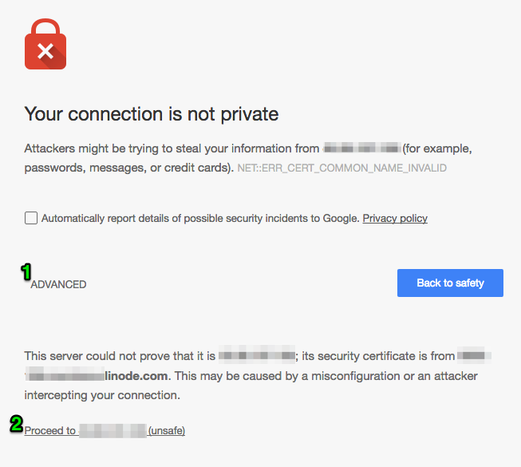

2. Log in with the username `root` and your root password.

3. Read and accept the license agreement to continue:

    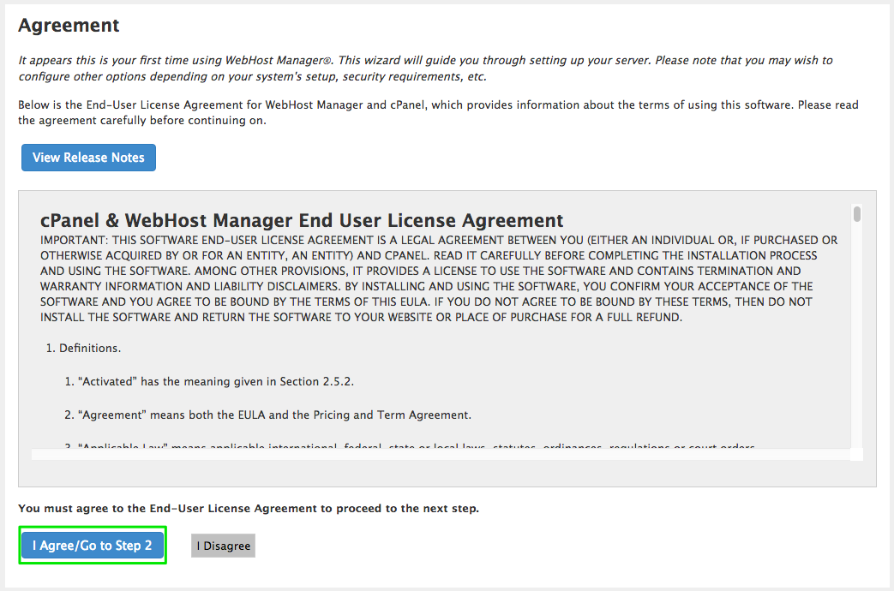

4. Provide an appropriate contact email address. Optionally, you may also enter an SMS address, AIM name, or ICQ number as well:

    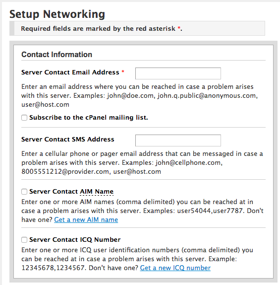

5. Enter the fully qualified domain name (FQDN) for your server:

    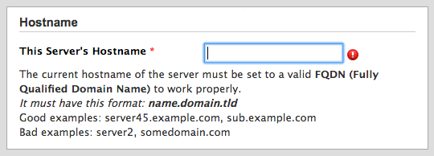

6. Appropriate DNS resolvers should be automatically filled in for you, but you may wish to check the values listed against the **Networking** tab in the Linode Cloud Manager:

    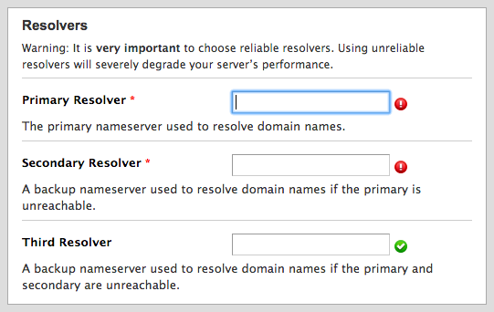

7. Make sure the main network device is set to `eth0`:

    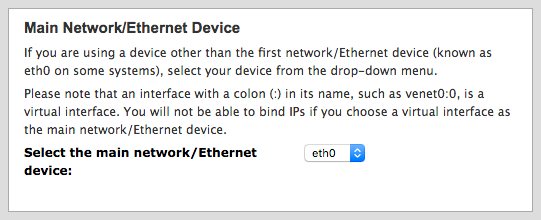

8. Once you have ensured that the information above is correct, press **Save & Go to Step 3**.

9. When presented with the *Setup IP Addresses* section, click **Skip This Step and Use Default Settings** to continue:

    

### DNS Configuration

Step 4 of the cPanel installation provides options for DNS configuration.

#### Using Linode Nameservers

If you intend to use Linode's nameservers (or those provided by a third party) for authoritative DNS services, make sure you select *Disabled* in the *Name Server* column:

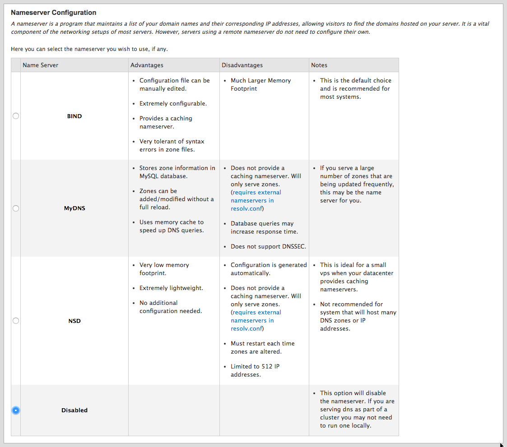

List your desired nameservers in the fields provided:

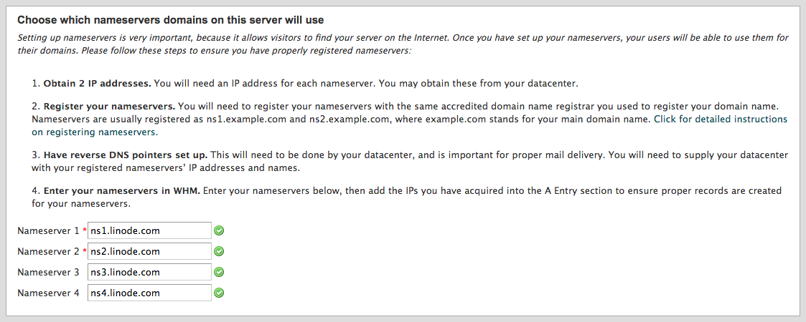

When you've finished, click on **Save & Go to Step 5**.

#### Using Self-Managed DNS

If you wish to operate your own DNS servers on your Linode, select either **BIND** or **NSD** under the *Name Server* column. You must list the nameservers you set up in the "DNS Prerequisites" section of this document. Consult Linode's guide on setting up your own nameservers in WHM using a single IP address, available in our [Set up DNS Services on cPanel](/docs/websites/cms/set-up-dns-services-on-cpanel) guide.

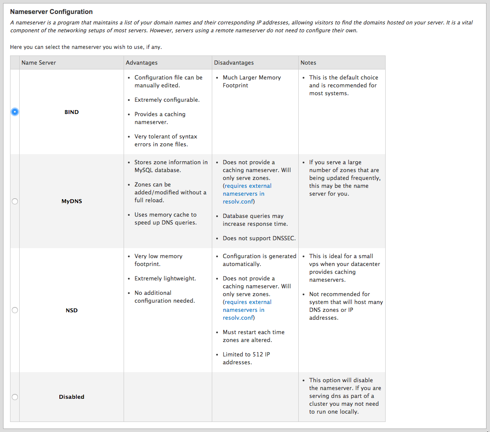

When you've finished, click on **Save & Go to Step 5**.

### Services

Step 5 of the cPanel installation covers configuration options for additional cPanel services.

1. We recommend against installing an FTP server on your Linode, as FTP is an outdated and insecure protocol. Instead, we recommend using [SFTP](/docs/platform/linode-beginners-guide/#how-do-i-upload-files-to-my-linode) to upload and download files. However, you may install an FTP server if you wish. SFTP is available by default for any main cPanel username. If you need to add file access for multiple users, you may want to install Pure-FTPd during the configuration phase.

    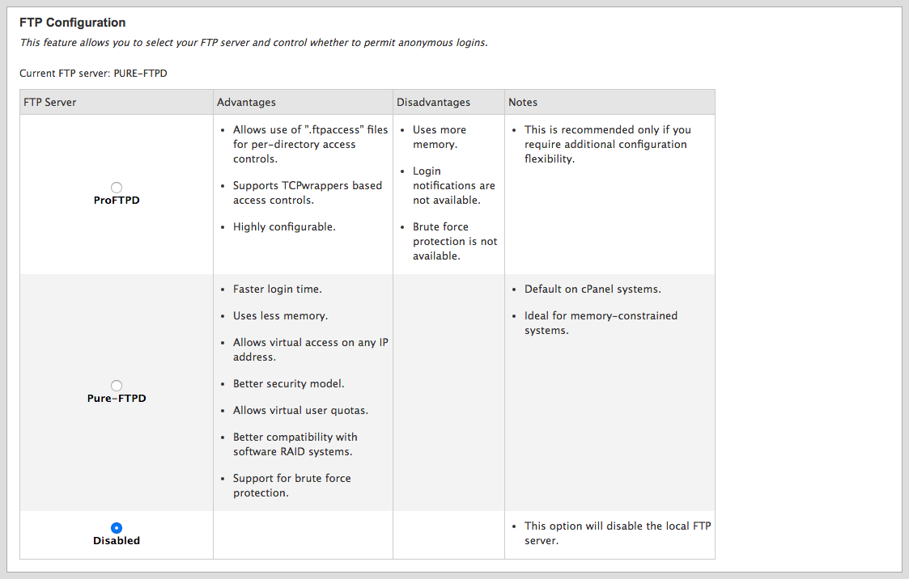

2. Choose whether or not to enable cPHulk. Please note, if you are locked out of cPanel due to multiple failed login attempts, you can release the lockout by following the instructions in cPanel's [cPHulk Brute Force Protection](https://documentation.cpanel.net/display/ALD/cPHulk+Brute+Force+Protection) documentation:

    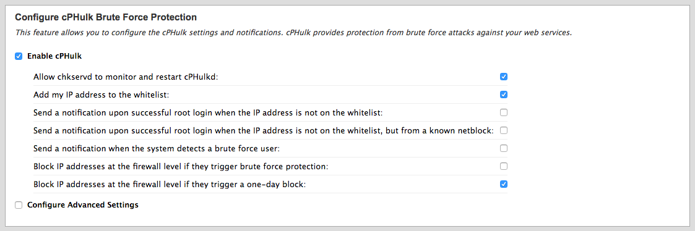

3. After reviewing all options on this page, click on **Save & Go to Step 6**

4. You may choose to enable or disable support for filesystem quotas. Unless you actually need to track disk usage on a per-user basis, it's best to leave this disabled:

    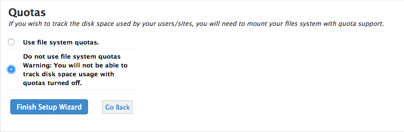

5. Click on **Finish Setup Wizard**. You will be brought to the *Feature Showcase* page, where you can enable additional features offered by cPanel. After reviewing these options, you can click on **Save Settings** to enable extra features, or **Exit to WHM**.

That's it! cPanel should now be properly configured on your Linode. For product support, please be sure to contact [cPanel support](http://cpanel.net/support.html) with any further questions you may have.

