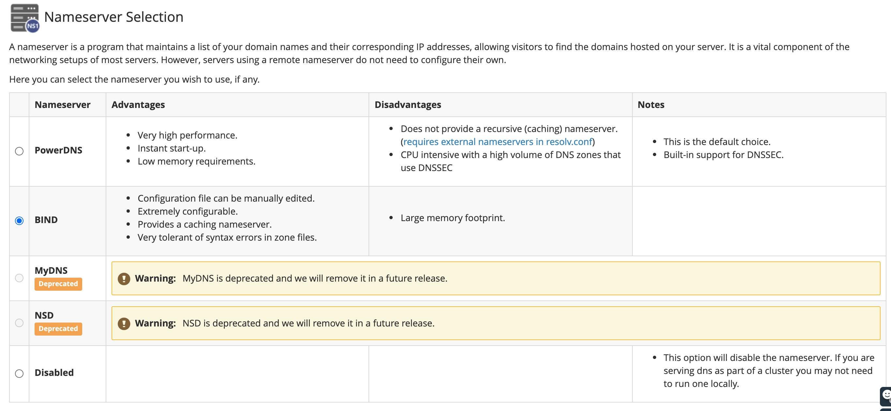
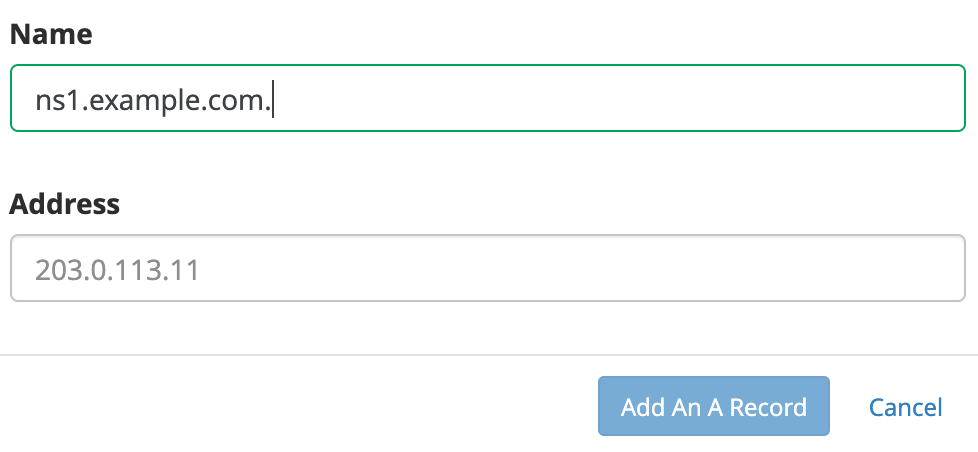
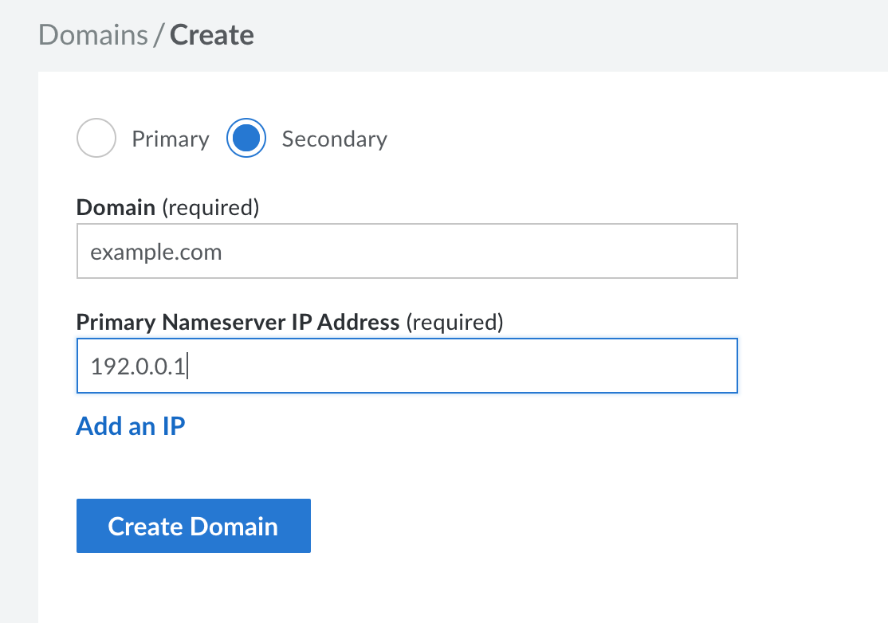

[cPanel](https://www.cpanel.com/) is a commercial web-based control panel for server systems. It can help ease the burden of common system administration tasks such as website creation, database deployment and management, and more. This guide shows you how to set up your cPanel server to serve DNS records. These instructions should be done through your root WHM interface.

## Nameserver Selection

In the root WHM, under the **Service Configuration** section, click **Nameserver Selection**. The following page appears:

You can choose from BIND, MyDNS or NSD; the advantages and disadvantages for each are displayed. If you are unfamiliar with any of them, select BIND, which is the easiest to work with.

## Nameserver Records

To use your own nameservers, for example `ns1.example.com`, `ns2.example.com`, create those entries at your registrar first. The process for adding nameservers can vary based on which registrar you are using. If you are unsure how to set up these entries, you should contact your registrar's support and ask them how to do so. You also need to add A records for your nameservers on your Linode through WHM. To do that, you need to log into your WHM as root, then navigate to the **DNS Functions** section, click **Nameserver Record Report**, click **Edit Zones**.

Click the domain you used when you set up your nameservers at your registrar and click the **+ A Record** button to add A records for your nameservers. Add the name and IP address:

Just make sure you use Linode's IP address. You can add more than two nameservers if you like.

## Using Linode's DNS Manager as a Secondary Server

When using BIND installed on cPanel as primary nameserver and the Linode DNS Servers as a secondary, set all of the nameservers at your registrar. You should have a list like this:

-   `ns1.example.com`
-   `ns2.example.com`
-   `ns1.linode.com`
-   `ns2.linode.com`
-   `ns3.linode.com`
-   `ns4.linode.com`
-   `ns5.linode.com`

The DNS changes can take up to 48 hours to propagate.

To get your cPanel Linode ready as your primary DNS server, you need to make a few additions/edits to the `/etc/named.conf` file.

The transfer of DNS records from Primary DNS server to the Linode DNS servers is done through AXFR queries. By default these are not allowed. Add these sections to `options`:


allow-transfer {
     104.237.137.10;
     65.19.178.10;
     74.207.225.10;
     207.192.70.10;
     109.74.194.10;
     2600:3c00::a;
     2600:3c01::a;
     2600:3c02::a;
     2600:3c03::a;
     2a01:7e00::a;
 };
 also-notify {
     104.237.137.10;
     65.19.178.10;
     74.207.225.10;
     207.192.70.10;
     109.74.194.10;
     2600:3c00::a;
     2600:3c01::a;
     2600:3c02::a;
     2600:3c03::a;
     2a01:7e00::a;
 };



After your updates are complete, save and close the `named.conf` file.

Check that the configuration file is usable by issuing the command:

    named-checkconf /etc/named.conf

If everything was done correctly, you should see no output. No output means everything is OK. If you get any errors, open the file and fix the reported issue. The errors are self-explanatory and point to the exact issue.

After the check is OK, the BIND service needs to be restarted in order for the changes to be picked up.

Complete the following steps while you are logged in a `root` user in the WHM interface.

1. On the left side in WHM under **Restart Services**, click DNS Server.

1. Click **Yes** to restart the service. Allow a few minutes for the service to restart.

You then want to begin adding your domains to the Linode DNS Manager as secondary zones.

Complete the following steps using Linode Cloud Manager:


Creating a domain also creates its corresponding domain zone.


1.  From the **Domains** section, click **Add a Domain**. The **Create a Domain** panel appears where you can fill out the form fields with your domain's information.
    

1. To add a *secondary zone*, click the **Secondary** radio button.

1.  Click the **Create Domain** button.

