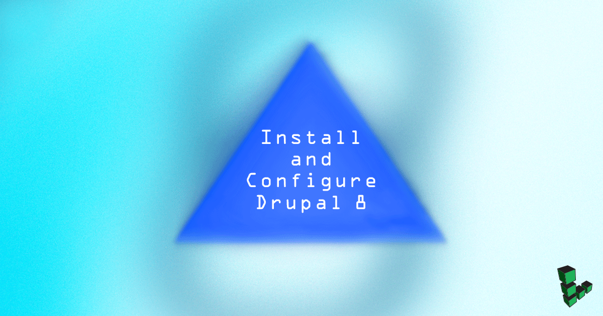
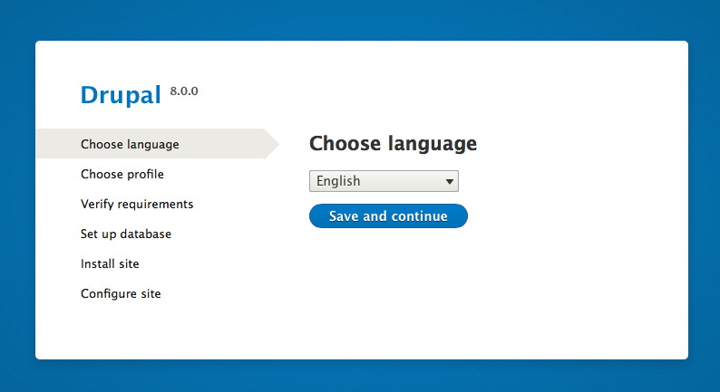
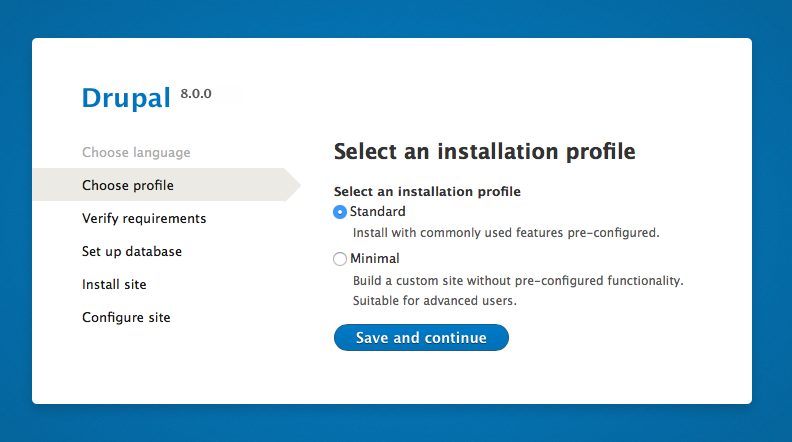
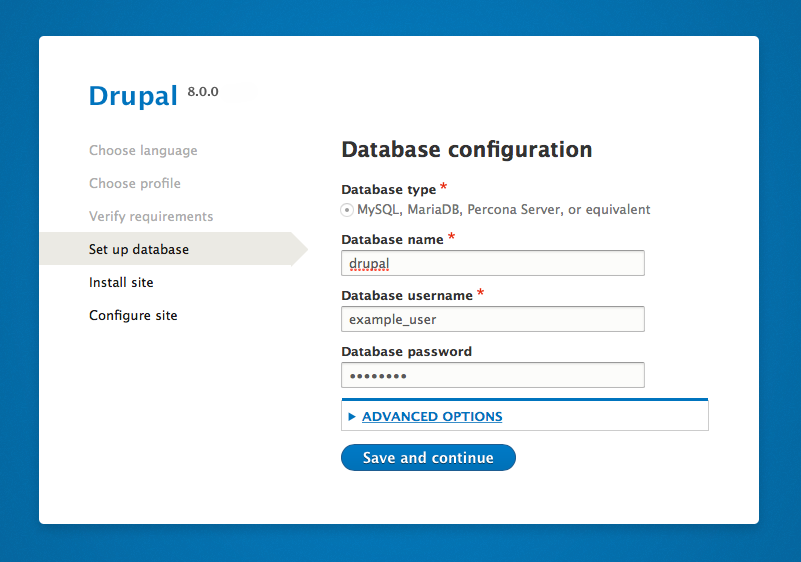
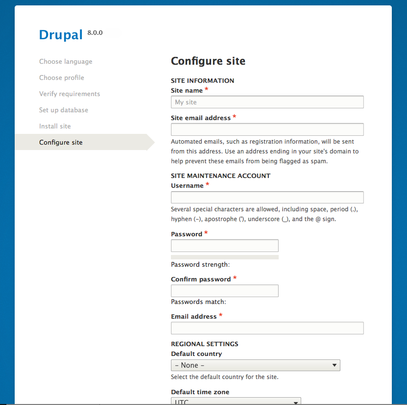
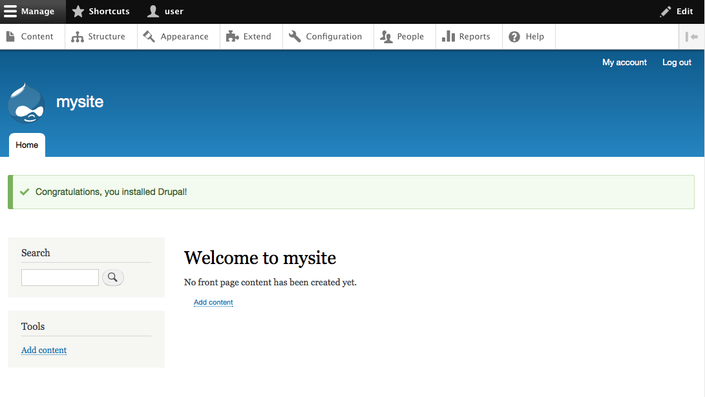

Drupal 8 is the latest version of the popular [Drupal](https://www.drupal.org/) content management system. This guide demonstrates how to install Drupal 8 on your Linode running Debian or Ubuntu.

## Before You Begin

1.  Familiarize yourself with our [Getting Started](/docs/products/platform/get-started/) guide and complete the steps for setting your Linode's hostname and timezone.

2.  This guide will use `sudo` wherever possible. Complete the sections of our [Securing Your Server](/docs/products/compute/compute-instances/guides/set-up-and-secure/) guide to create a standard user account, harden SSH access, remove unnecessary network services and create firewall rules for your web server; you may need to make additional firewall exceptions for your specific application.

3.  Update your system:

        sudo apt-get update && sudo apt-get upgrade

4.  Install and configure a LAMP stack. You can do this in one of two ways:

    *  See our [Hosting a Website](/docs/guides/hosting-a-website-ubuntu-18-04/) guide to configure each component manually.

    *  Deploy using our LAMP [StackScript](/docs/products/tools/stackscripts/).

## Download and Prepare Drupal 8

1.  See Drupal's [download page](https://www.drupal.org/project/drupal) for the exact URL of Drupal 8's core tarball.

    If you installed and configured your Apache server using one of the methods above, the publicly accessible DocumentRoot should be located at `/var/www/html/example.com/public_html/`. Change to that directory and download Drupal 8 with wget:

        cd /var/www/html/example.com
        sudo wget http://ftp.drupal.org/files/projects/drupal-8.0.5.tar.gz

    
Ensure that the version number matches the Drupal 8 version you wish to download.


2.  Extract the downloaded tarball's contents into Apache's DocumentRoot:

        sudo tar -zxvf drupal-8.*.tar.gz --strip-components=1 -C public_html

3.  Drupal depends on a PHP graphics library called GD. Install GD with:

        sudo apt-get install php5-gd

4.  Drupal 8's `settings.php` and `services.yml` files are configured when the first start configuration is run. The files must be created from the default templates and their permissions changed so that Drupal can write to them.

        cd /var/www/html/example.com/public_html/sites/default
        sudo cp default.settings.php settings.php && sudo cp default.services.yml services.yml
        sudo chmod 666 {services.yml,settings.php}

5.  Enforce [trusted hostnames](https://www.drupal.org/node/2410395) with those that users will access your site by.

    
$settings['trusted_host_patterns'] = array(
  '^www\.example\.com$',
  '^example\.com$',
  );



    
*trusted_host_patterns* also accepts IP addresses or localhost.


## Configure Apache 2.4

1.  Drupal 8 enables [Clean URLs](https://www.drupal.org/getting-started/clean-urls) by default so Apache's rewrite module must also be enabled:

        sudo a2enmod rewrite

2.  Then specify the rewrite conditions for DocumentRoot in Apache's configuration file.

    
<Directory /var/www/>
Options Indexes FollowSymLinks
AllowOverride All
Require all granted
  RewriteEngine on
    RewriteBase /
    RewriteCond %{REQUEST_FILENAME} !-f
    RewriteCond %{REQUEST_FILENAME} !-d
    RewriteCond %{REQUEST_URI} !=/favicon.ico
    RewriteRule ^ index.php [L]
</Directory>



3.  Change ownership of Apache's DocumentRoot from the system's root user to Apache. This allows you to install modules and themes, and to update Drupal, all without being prompted for FTP credentials.

        sudo chown -R www-data /var/www/html/example.com

4.  Restart Apache so all changes are applied. If you’re using a Linux distribution which uses systemd (CentOS 7, Debian 8, Fedora, Ubuntu 15.10+):

        sudo systemctl restart apache2

    If your init system is SystemV or Upstart (CentOS 6, Debian 7, Ubuntu 14.04):

        sudo service apache2 restart

## Drupal First Start

1.  Go to your Linode's domain or IP address in a web browser. This will show you the first step of Drupal 8's web configuration. Choose your language and proceed to the next page.

    

2.  Choose whether you want a Standard or Minimal installation profile.

    

3.  Complete the database configuration using the DB name, username and password you created when [setting up your LAMP stack](/docs/guides/hosting-a-website-ubuntu-18-04/#create-a-database) with a MySQL or MariaDB database.

    

    
If you forgot the name of your database, log back in to MySQL with: `mysql -u root -p` and enter: `show databases;`.


4.  After Drupal 8 installs your site, you'll be shown a site configuration page where you must create the admin user for your website. Do not use the same password that you used for your database.

    

    Next, you'll be taken to the administrative dashboard which will say that Drupal 8 was installed successfully.

    

5.  Now that Drupal 8 is finished writing to `settings.php` and `services.yaml`, you can restore their default permissions:

        sudo chmod 644 /var/www/html/example.com/public_html/sites/default/{settings.php,services.yml}

## Where to Go From Here

Drupal has a significant amount of documentation for [security best practices](https://www.drupal.org/security/secure-configuration) to consider when hardening any Drupal server. There is also extensive [community documentation](https://www.drupal.org/documentation) and there are multiple ways of [participating in the Drupal community](https://www.drupal.org/community).
