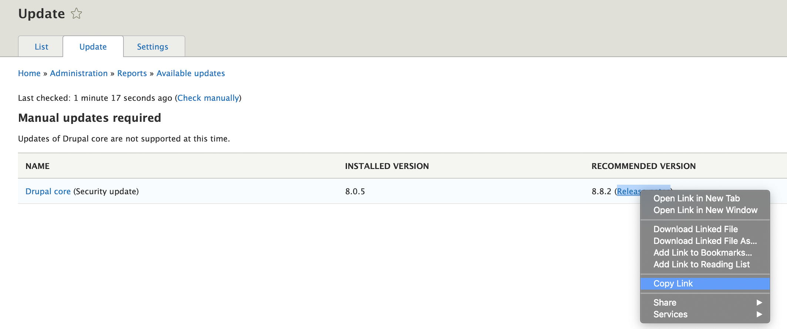
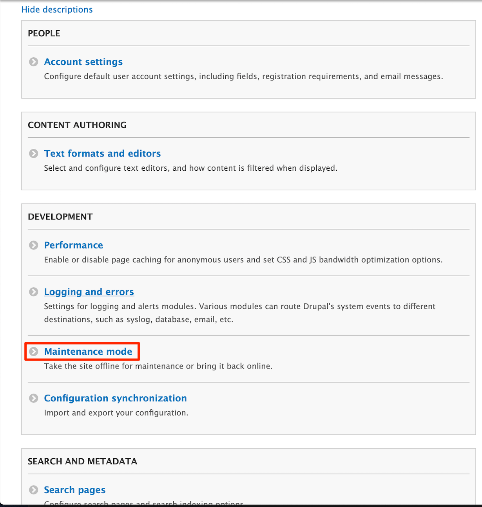
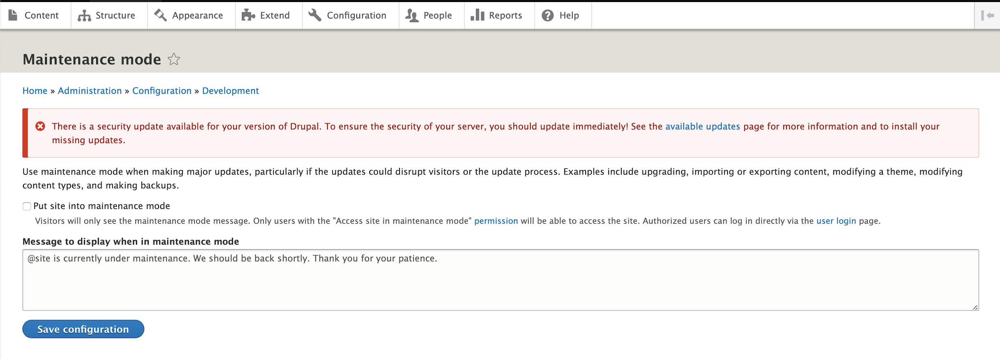

Drupal 8 is the latest version of the popular [Drupal](https://www.drupal.org/) content management system. While Drupal 8.1 includes a simple feature for incremental updates, you must preform manual Drupal core updates for any preceding versions. This guide demonstrates how to manually install an incremental Drupal 8 update on your Linode. The examples in this guide assume you have a functional [Drupal 8 installation](/docs/guides/how-to-install-and-configure-drupal-on-centos-8/) running a [LAMP stack](/docs/guides/how-to-install-a-lamp-stack-on-centos-8/) on CentOS 8.

## Before You Begin

1. Complete all the steps in the [Install and Configure Drupal 8 on CentOS 8](/docs/guides/how-to-install-and-configure-drupal-on-centos-8/) guide.

1. If you followed the [Install and Configure Drupal 8 on CentOS 8](/docs/guides/how-to-install-and-configure-drupal-on-centos-8/) guide, your site's document root should be in the `/var/www/html/example.com/` directory, where `example.com` is your own site's domain name. You can list all your directories in `/var/www/html` to verify the location of your site's document root.

        ls /var/wwww/html/

1. Update your CentOS 8 system if you did not complete that step while installing Drupal 8.

        sudo yum update

    

## Create Backups

In this section, you will create an archive of your Drupal site's files and store the archive in a `backups` directory. If needed, you could extract the compressed files in your backup archive to restore the state of your site prior to updating it.

1. Create a `backups` directory in your site's document root to store any backups you make of your Drupal site.

        sudo mkdir /var/www/html/example.com/backups

1. Create an archive of your existing site files and move it into the `backups` directory. Ensure you replace `example.com` with your own site's domain name.

        cd /var/www/html/example.com/public_html
        sudo tar -cvzf example.com-BCKP-$(date +%Y%m%d).tar.gz ./
        sudo mv -v example.com-BCKP-*.tar.gz ../backups

    
This process can also be scripted and run on a regular basis using [cron](/docs/guides/schedule-tasks-with-cron/).
    

## Download Updates

You are now ready to check your Drupal system for available updates. Once you have identified the necessary updates, you will download them as an archive to your Linode.

1.  Log in to your Drupal site and navigate to the [Admin Toolbar](https://www.drupal.org/project/admin_toolbar). Click on **Reports** and then on **Available updates**.

    
If **Available updates** is not listed, enable the [Update Manager](https://www.drupal.org/docs/8/core/modules/update-manager) module by navigating to the **Extend** menu item in the Admin Toolbar. See [Drupal's documentation](https://www.drupal.org/docs/8/extending-drupal-8/installing-drupal-8-modules#s-step-2-enable-the-module) for more details on enabling modules.


1.  Right click the link under the **RECOMMENDED VERSION** heading and copy the link address and paste it somewhere you can access later.

    

    
If you receive an error when your Drupal 8 installation checks for available updates, it may be having issues communicating with the Drupal website to see if there are updates. You can check your site's recent log messages, by navigating to **Reports** and selecting **Recent log messages** to further investigate the issue.

If your CentOS installation is running in enforcing mode, ensure you are allowing httpd to make network connections. One way to do this is to set the corresponding SELinux boolean to `true`:

    sudo setsebool httpd_can_network_connect true

Also, ensure that firewalld is allowing `https` traffic:

    sudo firewall-cmd --zone=public --add-service=https
    

1.  Connect to your Linode over SSH:

        ssh user@192.0.2.0

1.  Navigate to your site's directory. Download the Drupal core archive using `wget` and pasting the link address you copied from Step 2. Ensure you replace `example.com` with your own site's directory name.

        cd /var/www/html/example.com
        sudo wget https://ftp.drupal.org/files/projects/drupal-8.8.2.tar.gz

## Upgrade Your Site

Now that the Drupal core archive is saved to your Linode, you are ready to proceed with the version upgrade of your site.

###  Enable Maintenance Mode

Drupal's *maintenance mode* allows users with the right permissions to use your site while everyone else will be presented with a message that the site is under maintenance.

1.  While logged into your Drupal site, navigate to **Configuration**. Under the **Development** heading, click on **Maintenance mode**.

    

1.  Check the box next to "Put site into maintenance mode." Enter a message if desired, and click **Save Configuration**.

    

### Replace System Files

1. Toggle back to your terminal window and ensure you are connected to your Linode over SSH.

        ssh user@192.0.2.0

1.  Navigate to your site's `/var/www/html/example.com/public_html` directory and remove existing files and folders **except** `sites` and `profiles`. Ensure you replace `example.com` with your own site's directory name.

        cd /var/www/html/example.com/public_html
        sudo rm -ifr autoload.php composer.* example.gitignore index.php LICENSE.txt README.txt robots.txt update.php web.config && sudo rm -ifr core/ modules/ vendor/ themes/

1.  Go up one directory to `/var/www/html/example.com/` and expand the Drupal core archive that you downloaded in the [Download Updates](#download-updates) section into your `public_html` folder. Replace `drupal-8.8.2.tar.gz` with the name of the archive you downloaded:

        cd ..
        sudo tar -zxvf drupal-8.8.2.tar.gz --strip-components=1 -C public_html

1.  From a browser on your local machine, navigate to the following URL on your Drupal site `www.example.com/update.php`.  Ensure you replace `example.com` with your own site's domain name. Follow the prompts to continue the update.

    
If `update.php` does not load or returns a 403 Forbidden error, you may need to update the ownership and permissions of the newly expanded files. For best practices on Drupal site directory and file permissions, see their [documentation](https://www.drupal.org/node/244924).


1.  If you are [installing additional modules](https://www.drupal.org/docs/user_guide/en/extend-module-install.html) or configuring additional [security settings](https://www.drupal.org/security/secure-configuration), complete those updates now and continue on to the next step in this section when you are done.

    
The [Next Steps](#next-steps) section includes a list of Drupal security modules you may consider installing.
    

1. Rebuild the site's cache by navigating to the Admin Toolbar and click on **Configuration**. Under the **Development** heading, click on **Performance**. Finally, click on the **Clear all caches** button.

1.  Verify your site's status by viewing its status report. In the Admin Toolbar, click on **Reports**, then click on **Status report**.

1.  If the update was successful and your status report does not display any unexpected information, take the site out of maintenance mode by following step 2 in the [Enable Maintenance Mode](#enable-maintenance-mode) section. Ensure you uncheck the box next to the "Put site into maintenance mode" setting.

## Next Steps

As a next step, consider installing additional security modules from the [Drupal Project Module](https://www.drupal.org/project/project_module):

* [Secure Login](https://www.drupal.org/project/securelogin) enforces secure authenticated session cookies
* [Password Policy](https://www.drupal.org/project/password_policy) defines a user password policy
* [Security Review](https://www.drupal.org/project/security_review) automates security testing
