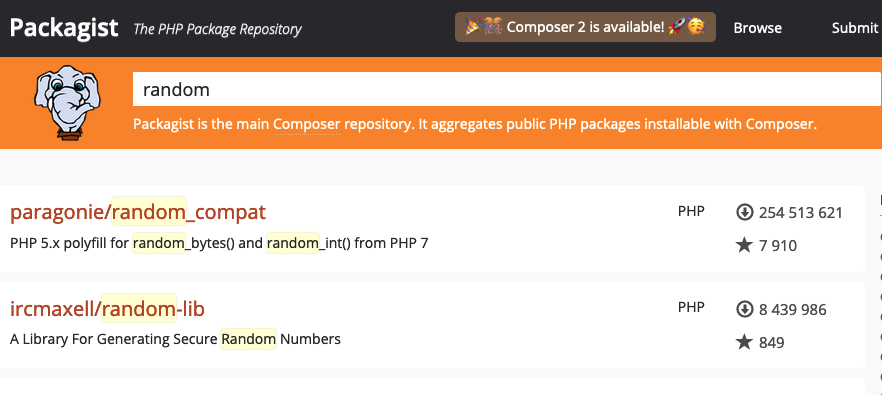

[*PHP*](https://www.php.net/) is one of the most popular programming languages for web and internet-based applications. Due to the increasing complexity of these applications, third-party PHP packages have become increasingly popular. However, it can become difficult to manage the minimum version and dependencies for each package. [*Composer*](https://getcomposer.org/), which is a free open source package and dependency manager for PHP, can help oversee this situation. This guide explains how to install and update Composer and how to use it to install and update packages.

## An Introduction to PHP Composer

Composer is inspired by programs such as `npm`, which is used to manage different versions of Node. Users declare the PHP libraries they are using and Composer either installs or updates them as needed. While doing so, it determines what other systems or PHP packages are required.

Composer manages packages and libraries on a per-project basis, so it is more accurately termed a dependency manager. All libraries are installed in a designated directory inside the project directory. Composer does not install any packages globally. However, it does support a "global" project for individuals or small groups who are only working on a single project.

Users declare the libraries they want using the `require` command that adds a corresponding entry to the `composer.json` file. Composer determines the package version that should be installed. It then installs the relevant version of the package into the project directory. Some of these packages might depend on other packages. Composer manages all of these secondary dependencies so all packages and libraries are upgraded at once. This helps avoid instability and compatibility issues.

Composer works in conjunction with [Packagist](https://packagist.org/). Packagist offers a large number of free, ready-to-use PHP packages. Users typically extend these packages or join multiple packages together to form the backbone of their PHP project. However, it is also possible to build packages from scratch from original PHP files and functions. Packagist provides a mechanism for users to publish their packages for others to use.

Composer only works on PHP version 5.3.2 or above, although PHP 5.3.4 or higher is recommended. As of writing this guide, the latest version of Composer is 2.1.6.

## Before You Begin

1.  If you have not already done so, create a Linode account and Compute Instance. See our [Getting Started with Linode](/docs/guides/getting-started/) and [Creating a Compute Instance](/docs/guides/creating-a-compute-instance/) guides.

1.  Follow our [Setting Up and Securing a Compute Instance](/docs/guides/set-up-and-secure/) guide to update your system. You may also wish to set the timezone, configure your hostname, create a limited user account, and harden SSH access. **Do not** follow the *Configure a Firewall* section yet. This guide includes firewall rules specifically for an OpenVPN server.

1. Ensure PHP is already installed on the Linode. PHP 5.3.4 or above is required, but the latest version is recommended. Use the command `php -v` to determine the version of PHP that is installed.


The steps in this guide are written for a non-root user. Commands that require elevated privileges are prefixed with `sudo`. If you’re not familiar with the `sudo` command, see the [Linux Users and Groups](/docs/guides/linux-users-and-groups/) guide.


## How to Install and Update PHP Composer

The most common way of installing Composer is by using the installation program. However, it can also be installed from the source using Git or a similar system. The steps in this section explain how to download and install the latest version of Composer. The following instructions are geared towards Ubuntu users but are generally applicable towards most Linux distributions.


For information on the various installation options and how to install an earlier version of Composer, see the [Composer Download page](https://getcomposer.org/download/).


### How to Install PHP Composer

To download and install the latest version of Composer, follow the steps below:

1. If the `php-cli` component is not already installed, install it using `apt`.

        sudo apt install php-cli

1. Navigate to the directory where you want to install Composer. If necessary, create a new directory for this purpose.

1. Download the Composer installation program from their website using PHP.

        php -r "copy('https://getcomposer.org/installer', 'composer-setup.php');"

1. Verify the installation file against the SHA-384 checksum to ensure it was downloaded correctly. The checksum for the current version can be found at the [Composer Public Key Site](https://composer.github.io/pubkeys.html). Substitute `installer-checksum` in the command below with the SHA-384 checksum. Ensure the checksum is enclosed in single quotes.

        php -r "if (hash_file('sha384', 'composer-setup.php') === 'installer-checksum') { echo 'Installer verified'; } else { echo 'Installer corrupt'; unlink('composer-setup.php'); } echo PHP_EOL;"

    You should see a similar output:

    
Installer verified
    

1. Run the installation program. The program verifies some settings and downloads the main composer program to the current directory.

    
A directory for the program can be specified using the `--install-dir` option. The filename of the Composer program can be set using the `--filename` option.
    

        php composer-setup.php

    
All settings correct for using Composer
Downloading...
Composer (version 2.1.6) successfully installed to: /home/jeffn/phpcomposer/composer.phar
Use it: php composer.phar
    

1. Remove the installation program.

        php -r "unlink('composer-setup.php');"

1. To allow Composer to be called globally, move the executable to a directory in `/usr/local/bin`. This is an optional but a recommended setting.

        sudo mv composer.phar /usr/local/bin/composer

1. Verify Composer has been installed correctly. If Composer is installed in a local directory, use the `php` command and the name of the executable.

        php composer.phar

    If Composer is installed globally, run the `composer` command without any other parameters.

        composer

    
The instructions in the remaining sections are valid for a global installation. For a local directory installation, substitute `php composer.phar` in place of `composer` for the remainder of the guide.
    

    

   ______
  / ____/___  _______  _____________________
/ /   /__ \/ __`__ \/ __\/__ \/ ___/ _ \/ ___/
/ /___/ /_/ / / / / / / /_/ / /_/ (__  )  __/ /
\____/\____/_/ /_/ /_/ .___/\____/____/\___/_/
                    /_/
Composer version 2.1.6 2021-08-19 17:11:08
    

### How to Update PHP Composer

1. Verify the version of Composer that is running.

        composer -V

    
Composer version 2.1.6 2021-08-19 17:11:08
    

1. Update Composer to the latest version using `composer self-update`. If you are still running Composer version 1 and want to upgrade to version 2, add the `--2` flag to the end of the command.

        composer self-update

    
You are already using the latest available Composer version 2.1.6 (stable channel).
    

## How to Install and Update Packages with PHP Composer

To use Composer with PHP, it is first necessary to define the required packages using the `require` command. This command also installs the package. The composer relies on the `composer.json` files to orchestrate the dependencies. This file describes the required version for each package and lists all of the dependencies. The `require` command automatically creates and updates `composer.json`, although it is possible to manually create and edit it.

The steps in the following section illustrate how to create a small PHP project that generates a random number using a package chosen from Packagist. It also explains how to search Packagist for an appropriate package and how to add it to the project using Composer.


These instructions are designed to explain how to keep track of PHP dependencies for use in your own project. If you intend to publish a package to Packagist, you must manually edit the `composer.json` file and add some information. For information on how to publish a PHP package through Packagist, see the "Publishing Packages" section of the [Packagist official documentation](https://packagist.org/).


### How to Install Packages

1. Create a new directory for the project and change to that directory.

        mkdir random_num
        cd random_num

1. Using a web browser, visit the Packagist site to identify a suitable package for inclusion in the project. In the address bar of the browser, enter the following URL:

        https://packagist.org/

1. Enter an appropriate search term for the utility in the search bar on the top of the page and review the results. Each package is identified by the name of the vendor, with the package name taking the format `vendor/package`. Clicking on the package name provides additional information about the package along with API documentation. It is best to select a package that has a high star rating and is well documented. Take note of the full name of the package.

    

1. In the project name, add the package to the project using `composer require`. Composer retrieves information about the package and adds it to the `composer.lock` file. The lock file tracks the currently installed versions of the various packages. If `composer.json` does not already exist, Composer creates it. Otherwise, it appends the new package information to this file. Composer also creates a `vendor` sub-directory. If a version control system (VCS) is used for the project, ensure both `composer.lock` and `composer.json` are added to the VCS.

    
Many PHP packages require other system-level packages. When adding a new package, Composer ensures all prerequisite packages are already installed. If any are missing, it displays an error and provides details about the outstanding packages. Locate these packages using `apt search` and install them using `apt install`. Then run the `composer require` command again.
    

        composer require ircmaxell/random-lib

    
Using version ^1.2 for ircmaxell/random-lib
./composer.json has been created
Running composer update ircmaxell/random-lib
Loading composer repositories with package information
Updating dependencies
Lock file operations: 2 installs, 0 updates, 0 removals

- Locking ircmaxell/random-lib (v1.2.0)
- Locking ircmaxell/security-lib (v1.1.0)
Writing lock file
Installing dependencies from lock file (including require-dev)
Package operations: 2 installs, 0 updates, 0 removals
- Downloading ircmaxell/security-lib (v1.1.0)
- Downloading ircmaxell/random-lib (v1.2.0)
- Installing ircmaxell/security-lib (v1.1.0): Extracting archive
- Installing ircmaxell/random-lib (v1.2.0): Extracting archive
Generating autoload files
    

1. Review the `composer.json` file to ensure it is correct. In certain circumstances, you might have to edit this information.

    
The `^` symbol in front of the version number for the package tells Composer what versions are allowed. It means version `1.2` is the minimum version but any `1.x` version is allowed. This setting provides maximum flexibility. Other symbols might tighten or loosen the allowable range. If no symbol is present, only version `1.2` is allowed, with no further updates permitted. For more information on versioning, see the [Composer Version Documentation](https://getcomposer.org/doc/articles/versions.md).
    

        cat composer.json

    
{
    "require": {
        "ircmaxell/random-lib": "^1.2"
    }
}
    

1. To integrate the new classes into a project, use the `autoload.php` script that Composer automatically generated. It can be included in any PHP file using the instruction `require __DIR__ . '/vendor/autoload.php';`. Below is a sample `random.php` file that uses the auto-loader and the new package.

    
<?php
require __DIR__ . '/vendor/autoload.php';

$factory = new RandomLib\Factory;

$generator = $factory->getLowStrengthGenerator();

print $generator->generateString(32);
print "\n ";
    

1.  To verify that the new `random.php` program is working correctly, run it from the command line. This program uses the `getLowStrengthGenerator` function to generate a 32-character string. This is suitable for a one-time token but is not strong enough for a cryptographic key.

        php random.php

    
1bhf1Icu4IhHq4Xzto98PfC2tYCjaVcV
    


If a `composer.json` file is already present, but the packages have not yet been installed, run `composer install` instead of `require`. If you are intending to publish the package on Packagist, create a detailed `composer.json` file before installing any packages. To generate this template, run `composer init`. For more information about the structure of the `composer.json` file, see the [Schema Documentation](https://getcomposer.org/doc/04-schema.md). Complete documentation can be found on the [Composer Website](https://getcomposer.org/doc/).


### How to Update a Single Package

The `composer update` command can be used to update one or more packages to a more recent version. Composer determines if a new version exists and if it meets the constraints defined in the `composer.json` file. It then performs all necessary upgrades and updates the information in the `composer.lock` file.

To update a specific package, run the `composer update package` command. Substitute the name of the specific vendor and package you want to upgrade.

    composer update ircmaxell/random-lib


Loading composer repositories with package information
Updating dependencies
Nothing to modify in lock file
Installing dependencies from lock file (including require-dev)
Nothing to install, update or remove
Generating autoload files


### How to Update All Packages

Composer also makes it easy to update all packages at the same time. For a project-wide update, run the following command:

    composer update
