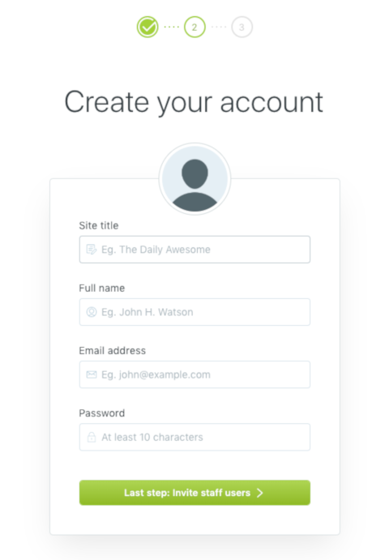

[Ghost](https://ghost.org/developers/) is an open source blogging platform that helps you easily create a professional-looking online blog. Ghost is a robust content management system (CMS) with a Markdown editor, an easy-to-use user interface, and beautiful themes. It is easy to install and update with [Ghost-CLI](https://github.com/TryGhost/Ghost-CLI).

## In This Guide

In this guide, you'll set up, deploy, and secure a Ghost v3.5.1 blog on a Linode running Debian 10, using NGINX, MySQL, Node.js, NPM, Ghost-CLI, and Let's Encrypt. For installation instructions for other distributions, click [here](/docs/websites/cms/ghost).


This guide is written for a non-root user. Commands that require elevated privileges are prefixed with `sudo`. If you're not familiar with the `sudo` command, consult our [Users and Groups](/docs/guides/linux-users-and-groups/) guide.

Replace each instance of `example.com` in this guide with your site’s domain name.


## Before you Begin

1. This guide assumes that you've followed the steps in our [Getting Started](/docs/products/platform/get-started/) and [Securing Your Server](/docs/products/compute/compute-instances/guides/set-up-and-secure/) guides and have created a new user for Ghost with elevated `sudo` privileges. The example username used in this guide is `ghostexample`.

1. Ensure that you have a valid domain name and [properly configured DNS records](/docs/products/networking/dns-manager/) for your domain.

1. Ensure that your system is up to date:

        sudo apt update && sudo apt upgrade

1. Install `build-essential`:

        sudo apt install build-essential

## Install Prerequisites

### Install NGINX

NGINX will be used as a reverse proxy for your Ghost application:

    sudo apt install nginx

### Install MariaDB Server

1. Download and install MariaDB Server:

        sudo apt install mariadb-server

1. Log into MariaDB Server:

        sudo mysql

    
MariaDB is a fork of the popular MySQL database software, and is meant to be functionally alike, meaning that it can be accessed with the 'mysql' command.


1.  Set a password for the root user with this command, replacing `password` with a strong password:

        SET old_passwords=0;
        ALTER USER root@localhost IDENTIFIED BY 'password';

1.  Exit MariaDB:

        quit

### Install Node.js and NPM

Ghost is built on Node.js and follows Node's Long Term Support (LTS) plan. Ghost only supports [LTS versions of Node.js](https://github.com/nodejs/LTS).

Download and install Node.js:

    curl -sL https://deb.nodesource.com/setup_10.x | sudo -E bash -
    sudo apt install nodejs

## Install and Configure Ghost

### Install Ghost-CLI

Ghost-CLI is a command line interface (CLI) tool that makes installing and updating Ghost easy. It sets up the database, configures NGINX as a reverse proxy, enables TLS/SSL security using Let's Encrypt CA, automatically renews your SSL, and initializes Ghost as a systemd service.

Install Ghost-CLI:

    sudo npm install -g ghost-cli@latest

### Install Ghost

Install Ghost using the Ghost-CLI tool.

1. Create the document root directory:

        sudo mkdir -p /var/www/ghost

    
Installing Ghost in the `/root` or `/home/{user}` folder won’t work and results in a broken setup. Only use `/var/www/{folder}` because it has the correct permissions.


1. Change ownership of the `/var/www/ghost` directory to the non-root user with `sudo` privileges that you created. In this example, `ghostexample` is our username:

        sudo chown ghostexample:ghostexample /var/www/ghost
        sudo chmod 775 /var/www/ghost

1. Navigate to the Ghost root directory:

        cd /var/www/ghost

1.  Ensure that the directory is empty to avoid file conflicts:

        ls -a

1. Install Ghost in production mode:

        ghost install

    
By default Ghost looks for Ubuntu and will display this warning if it detects a different operating system.


System checks failed with message: 'Linux version is not Ubuntu 16 or 18'
Some features of Ghost-CLI may not work without additional configuration.
For local installs we recommend using `ghost install local` instead.


It will ask you if you would like to continue anyway, answer yes.


1. Answer each question as prompted. For more information about each question, visit the [Ghost documentation](https://ghost.org/docs/install/ubuntu/#install-questions):

    
? Enter your blog URL: https://example.com
? Enter your MySQL hostname: localhost
? Enter your MySQL username: root
? Enter your MySQL password: thePasswordYouEnteredForRoot
? Enter your Ghost database name: exampleGhost
Configuring Ghost
Setting up instance

Setting up "ghost" system user
? Do you wish to set up "ghost" mysql user? yes
? Do you wish to set up Nginx? yes
? Do you wish to set up SSL? yes
? Enter your email (used for Let's Encrypt notifications) user@example.com
? Do you wish to set up Systemd? yes
? Do you want to start Ghost? yes


1. After installation is complete, run `ghost ls` to view running Ghost processes:

        ghost ls

In the future when a newer version of Ghost is released, run `ghost update` from the `/var/www/ghost` directory to update to the newest version.

### Complete the Setup

To complete the setup process, navigate to the Ghost configuration page by appending `/ghost` to the end of your blog’s URL or IP. This example uses `https://example.com/ghost`.

1. On the welcome screen, click **Create your account**:

    

1. Enter your email, create a user, password, and blog title:

    

1. Invite additional members to your team. If you’d prefer to skip this step, click **I’ll do this later, take me to my blog!** at the bottom of the page.

    

1. Navigate the Ghost admin area to create your first post, change your site's theme, or configure additional settings:

    

## Troubleshooting

1. Troubleshoot the system for any potential issues when installing or updating Ghost:

        ghost doctor

1. Get help about Ghost:

        ghost --help
