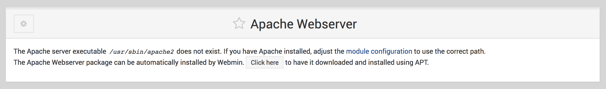
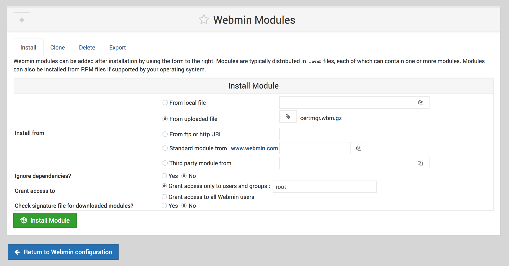

## Install the Webmin Control Panel & Manage Files without SSH

Webmin is a web interface that allows you to manage configuration files and reload programs through a browser, without needing to SSH into your Linode. It is a popular alternative to administration panels such as cPanel or Plesk, and contains many of the features that make them popular. Many third-party modules exist for different use cases, which contribute to the flexibility of the Webmin control panel.

## Before You Begin

The commands in this guide work with either Debian 8 or Ubuntu 16.04.

1.  Familiarize yourself with our [Getting Started](/docs/getting-started) guide and complete the steps for setting your Linode's hostname and timezone.

2.  This guide will use `sudo` wherever possible. Complete the sections of our [Securing Your Server](/docs/security/securing-your-server) guide to create a standard user account, harden SSH access and remove unnecessary network services. You do not have to complete the Configure a Firewall section. If you choose to set up a firewall, ensure that incoming connections are allowed on port `10000`.

3.  Update your system:

        sudo apt-get update && sudo apt-get upgrade

### Check the Hostname

Before you begin installing and configuring the components described in this guide, please make sure you've followed our instructions for [setting your hostname](/docs/getting-started#ubuntu--debian). Issue the following commands to make sure it is set properly:

    hostname
    hostname -f

The first command shows your short hostname, and the second shows your fully qualified domain name (FQDN).

## Install and Log in to Webmin

Once you have satisfied all dependencies, you will need to download the Webmin package to your Linode.

1. Add the Webmin repository to your known repositories list by creating the file below:

    
deb http://download.webmin.com/download/repository sarge contrib
deb http://webmin.mirror.somersettechsolutions.co.uk/repository sarge contrib


2. Download and install the GPG key for the repository:

        cd /tmp
        wget http://www.webmin.com/jcameron-key.asc
        apt-key add jcameron-key.asc

3. Update apt:

        apt-get update

4. Install Webmin:

        apt-get install webmin

5. After the installation completes, Webmin will give you a URL to visit to access the web panel. This URL will be in the form of `https://hostname:10000`, where `hostname` is the host name of your Linode. If your Linode does not have a FQDN, use your Linode's IP or a domain pointed at your Linode to access Webmin.

6. For security reasons, Webmin generates a self-signed SSL certificate for itself when you install it. If your browser shows a warning about the SSL certificate, verify the details of the certificate and accept it.

7. At the login screen, enter your root user credentials, or the credentials for any user able to execute commands using `sudo`.

## Configure Webmin

For added security through obfuscation, change the port Webmin runs on to something other than `10000`.

1.  Select the **Webmin** tab from the menu on the left and click **Webmin Configuration** from the submenu.

2.  Select **Ports and Addresses** from the control panel and change the **Listen on Port** to a port that you will remember.

3.  When you click **Save**, Webmin will change the port it runs on and redirect you to the new page.

You are now free to configure the rest of your services with Webmin.

## Install Webmin Modules

### Standard Webmin Modules

Installing any of Webmin's [standard modules](http://www.webmin.com/standard.html) is easy.

To install the Apache module:

1.  Open your Webmin web panel and click the **Un-used Modules** tab in the menu on the left.

2.  Click on the Apache module. If it has not already been installed automatically, you will see the following:

    

3.  Click the **Click Here** button to have Webmin install the module for you.

### Third-Party Webmin Modules

There are many [third-party modules](http://www.webmin.com/cgi-bin/search_third.cgi?modules=1) that can be added to Webmin. Installing these often requires a few extra steps. This section demonstrates how to install these modules using the [Certificate Manager](http://www.webmin.com/virtualmin.html) as an example. This module allows you to generate or import SSL certificates.

1.  Execute the following command from your local machine (or paste the url into a browser window) to download the zip:

        wget http://www.webmin.com/download/modules/certmgr.wbm.gz

2.  From your Webmin web panel, select the **Webmin** tab from the menu on the left and choose **Webmin Configuration** from the submenu.

3.  Click the **Webmin Modules** menu icon, and you will see a menu similar to:

    

4.  Choose **From uploaded file** and navigate to the file you just downloaded to your local machine.

5.  Click **Install Module**. You may need to sign out of the web panel and sign in again before you can use the newly installed module.

