Strapi is a headless content management system that features a high degree of customization. With customizable APIs and a database-agnostic design, Strapi can be deployed and implemented tailored to your needs. And it is a headless CMS, so you are not tied down to a particular interface for your content.

This guide gives you everything you need to get started self-hosting a Strapi instance of your own to manage your content. Follow along to install Strapi and see how it loads and structures content. You can also see a full working example to familiarize yourself with integrating Strapi with your frontend.

## Before You Begin

1. If you have not already done so, create a Linode account and Compute Instance. See our [Getting Started with Linode](/docs/products/platform/get-started/) and [Creating a Compute Instance](/docs/products/compute/compute-instances/guides/create/) guides.

1. Follow our [Setting Up and Securing a Compute Instance](/docs/guides/set-up-and-secure/) guide to update your system. You may also wish to set the timezone, configure your hostname, create a limited user account, and harden SSH access.


This guide is written for a non-root user. Commands that require elevated privileges are prefixed with `sudo`. If you’re not familiar with the `sudo` command, see the [Linux Users and Groups](/docs/guides/linux-users-and-groups/) guide.


## What Is Strapi?

[Strapi](https://strapi.io/) is an open-source headless content management system (CMS). Strapi boasts remarkable levels of customization, letting you adapt the CMS to your needs. With Strapi, you can access content through REST and GraphQL APIs, and content can be managed from a sleek and accessible user interface.

Strapi also works exceptionally well with a Jamstack architecture. Your frontend, using whatever framework you choose, can readily access your content from Strapi APIs, allowing your content to be rendered from markup. And Strapi's APIs can be customized in myriad ways to meet your applications' needs.

To learn more about the Jamstack architecture and what it offers, take a look at our [Getting Started with the Jamstack](/docs/guides/what-is-jamstack/) guide.

### Why Strapi?

Already CMS solutions abound, so you may wonder why you should choose Strapi, especially over solutions like WordPress and Contentful. What advantages does Strapi offer over these CMS platforms?

Strapi's advantages mostly come down to control and customization. Strapi is self-hosted, and with Strapi practically every aspect of your CMS can be customized to meet your needs. This also makes Strapi a much better fit for modern frontend solutions.

Here is a breakdown of some of the key features that distinguish Strapi.

- Strapi is a *headless CMS*, unlike the popular WordPress solution. This means that Strapi provides content management without being tied to a particular frontend. You can adopt your best fit out of the array of modern frontend frameworks — and freely switch frameworks when you need. Strapi focuses on managing your content and making it available for what meets your needs.

- Strapi is open-source and self-hosted, as opposed to a managed cloud solution like Contentful. You have control of your Strapi instance, whether for more customization or for meeting your security needs. And to help you get what you want out of Strapi, you have its large and [active community](https://strapi.io/community) with a host of tips, tutorials, and answered questions.

- Strapi is fully customizable. From API to data structures, you can readily adapt Strapi to your needs. Most customization can be conducted right from Strapi's API. And beyond that, Strapi is purely open-source JavaScript, meaning that it can all be customized in familiar code should you want to go even deeper.

## Getting Started with Strapi

Strapi is a self-hosted CMS solution, so you need to install and start running it on your own server. You Strapi instance can be run with Docker, as outlined in the official documentation on [running Strapi in Docker](https://docs.strapi.io/dev-docs/installation/docker).

This guide follows Strapi's Node.js setup process, Strapi's preferred installation path and a relatively straightforward one that gives you even more control. Follow along through this section to get Strapi up and running on your server, log into its administrator interface, and start working with content management.

### Creating a Strapi Project

Strapi runs as a Node.js project, which this guide sets up using the Node Package Manager (NPM). Once you run the Strapi project-setup script, you can start running your instance and create your administrator user.

1.  Install the appropriate version of Node using NVM. Follow along with our [Installing and Using NVM](/docs/guides/how-to-install-use-node-version-manager-nvm/#installing-and-configuring-nvm) guide, and then use the following command to install Node:

    ```command
    nvm install node
    ```

    The command above installs the latest version of Node, which should be compatible with Strapi. However, Strapi recommends Node version `18`, and you can specify that version more precisely using the following command:

    ```command
    nvm install 18
    ```

1.  Install Python if you intend to use SQLite for Strapi's database. This is the default behavior with Strapi, and the database used in this guide's example. But Strapi also supports other databases, from MySQL to PostgreSQL.

    Refer to our [Install Python 3](/docs/guides/how-to-install-python-on-ubuntu-20-04/) guide for steps to install Python on your system. Use the dropdown at the top of the guide to select the appropriate distribution for you.

1.  Run the Strapi installation script. This uses NPM to run the script, creating the base Strapi project.

    ```command
    npx create-strapi-app@latest example-strapi --quickstart --no-run
    ```

    The `--quickstart` option has the Strapi project use the default database type, SQLite. Remove this option, and the script prompts you to select a supported database type. In that case, you need to be sure to have the appropriate database installed with its initial setup.

1.  Start up Strapi using NPM.

    ```command
    npm run develop
    ```

    ```output
    [...]

     Project information

    ┌────────────────────┬──────────────────────────────────────────────────┐
    │ Time               │ Mon May 01 2023 18:00:58 GMT+0000 (Coordinated … │
    │ Launched in        │ 2118 ms                                          │
    │ Environment        │ development                                      │
    │ Process PID        │ 21163                                            │
    │ Version            │ 4.10.1 (node v18.16.0)                           │
    │ Edition            │ Community                                        │
    │ Database           │ sqlite                                           │
    └────────────────────┴──────────────────────────────────────────────────┘

     Actions available

    Welcome back!
    To manage your project, go to the administration panel at:
    http://localhost:1337/admin

    To access the server, go to:
    http://localhost:1337
    ```

The Strapi API server and administrator panel are ready for access. As shown in the output, the services are running on `localhost:1337`. You need to either access your server over an SSH tunnel or follow the steps in the next section to access the Strapi interfaces.

To use an SSH tunnel, you can see the steps in our guide on [accessing Futon over SSH](/docs/guides/access-futon-over-ssh-using-putty-on-windows/#establish-an-ssh-connection). Replace the port number in that guide (`5984`) with Strapi's port number — `1337`.

Whichever way you use to access Strapi, start by navigating to its administrator panel. There you are prompted to create an initial administrator user.

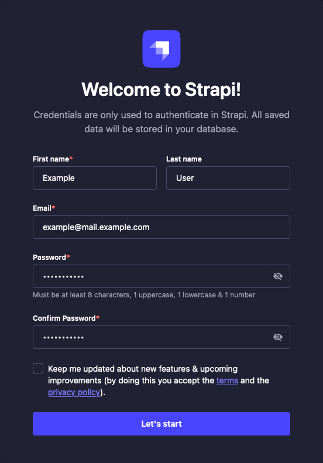

From there, you are taken into the administrator panel for your new Strapi instance. Continue on in the guide to see how you can start leveraging the administrator interface to manage your content.

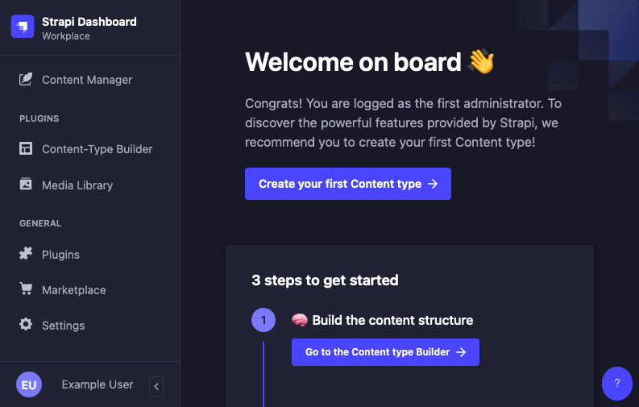


Subsequent sections of this guide assume you have followed the [Setting Up for Remote Access](/docs/guides/using-strapi-cms/#setting-up-for-remote-access) section below to configure Strapi for remote access.


#### Setting Up for Remote Access

By default, Strapi runs its server and administrator panel on `localhost`. Preferably, you would then use a reverse proxy like [NGINX](/docs/guides/use-nginx-reverse-proxy/) to provide access to the API server endpoints.

However, Strapi's administrator interface requires some additional configuration if you want to be able to access it remotely. The steps in this section show you how to make the necessary changes.

These steps use `example.com` as the access point, so replace this with your server's actual domain name or public IP address. The steps also keep the default Strapi port, `1337`, and you need to replace that as well according to your needs.

1.  Stop your Strapi instance. You can do so with the <kbd>Ctrl</kbd> + <kbd>C</kbd> key combination.

1.  Open the `config/server.js` file, and add a `url` line like the one shown below. This example has Strapi refer to the `PUBLIC_URL` environment variable or use as `localhost` address if the variable is not present.

    ```file {title="config/server.js" lang="js"}
    module.exports = ({ env }) => ({
      host: env('HOST', '0.0.0.0'),
      port: env.int('PORT', 1337),
      url: env('PUBLIC_URL', 'http://localhost:1337'),
      [...]
    ```

1.  Open the `.env` file for the Strapi project, and add the line shown here to the file's end. Strapi loads its environment variables from this file at start up.

    ```file {title=".env" lang=""}
    [...]
    PUBLIC_URL=http://example.com:1337
    ```

    Should you be using a reverse proxy, you need to replace the `1337` with the port you are proxying Strapi to. For instance, if you are using port `8080` and have enabled HTTPS encryption, you would have something like this.

    ```file {title=".env" lang=""}
    [...]
    PUBLIC_URL=https://example.com:8080
    ```

    However, for convenience, the rest of this guide assumes you are using the default port `1337`.

1.  Open the port you are using to access Strapi in your system's firewall.

    - On **Debian** and **Ubuntu**, manage firewall rules using UFW. Learn more about UFW in our guide [How to Configure a Firewall with UFW](/docs/guides/configure-firewall-with-ufw/). With UFW configured and running, you should be able to open the necessary port using the following command:

        ```command
        sudo ufw allow 1337/tcp
        ```

    - On **CentOS** and similar distributions, manage the firewall rules using Firewalld. Learn more in our guide [Configure a Firewall with Firewalld](/docs/guides/introduction-to-firewalld-on-centos/). With Firewalld configured and running, you should be able to open the necessary port using the following commands:

        ```command
        sudo firewall-cmd --zone=public --add-port=1337/tcp --permanent
        sudo firewall-cmd --reload
        ```

1.  Rebuild the Strapi administrator panel using its `build` NPM command. Rebuilding is necessary for the modifications to Strapi's public URL.

    ```command
    npm run build
    ```

1.  Start up Strapi again using the following command:

    ```command
    npm run develop
    ```

    ```output
    [...]

     Project information

    ┌────────────────────┬──────────────────────────────────────────────────┐
    │ Time               │ Mon May 01 2023 21:00:01 GMT+0000 (Coordinated … │
    │ Launched in        │ 2121 ms                                          │
    │ Environment        │ development                                      │
    │ Process PID        │ 21164                                            │
    │ Version            │ 4.10.1 (node v18.16.0)                           │
    │ Edition            │ Community                                        │
    │ Database           │ sqlite                                           │
    └────────────────────┴──────────────────────────────────────────────────┘

     Actions available

    Welcome back!
    To manage your project, go to the administration panel at:
    http://example.com:1337/admin

    To access the server, go to:
    http://example.com:1337
    ```

As discussed above, you can now navigate to the administrator interface for your Strapi instance, where you are prompted to create an initial administrator user. Doing so takes you into the administrator panel.

### Adding Content to Strapi

With Strapi running, you are ready to start adding content. Further on, the guide shows you how to put this content to use in an example application. For now, you can see how to structure and manage your content effectively within Strapi's administrator interface.

Make sure you have Strapi running as above, using the `npm run develop` command. Here, it is also assumed that you have Strapi running for remote access on `http://example.com:1337`.

Strapi's content structures and entries are managed by two tools: the *Content-type Builder* and the *Content Manager*. To help demonstrate the distinct roles these tools play, each tool is covered separately below.

The content implemented here follows a simple blog format. This allows for an illustration of different content types while also providing a setup simple enough to adapt to a wide range of use cases.

#### Content-type Builder

The Content-type Builder is only accessible while running Strapi in `develop` mode, and it allows administrator users to create and manage definitions for:

- *Collections*, which can manage multiple entries

- *Singles*, which manage only one entry each

- *Components*, which can be used by collections and singles

For applications that need content in sets — like blogs — you should at least have a collection type. The example later on also uses Strapi for its homepage content, so these steps also set up a single type for that.

1.  Create a `Post` collection type. Navigate to **Content-type Builder**, and select the **Create new collection type** option from the inner left menu. Enter `Post` for the **Display name** field, and the API-related fields should populate on their own. Click **Continue**.

    [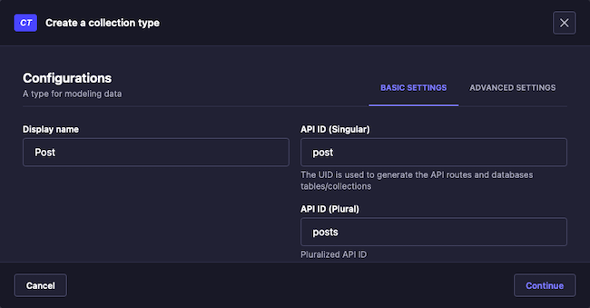](strapi-builder-post-1.png)

    In the form for adding a field to the new collection, select **Text**. Then on the next form enter `name` for the **Name** field, and click **Finish**.

    [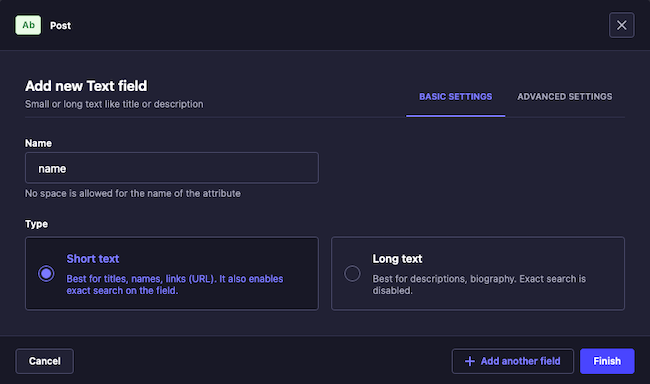](strapi-builder-post-2.png)

    From the *Post* page, select the **Add another field to this collection type** option. On the resulting form for this field, select **Rich Text**, and then enter `body` for the **Name** field.

    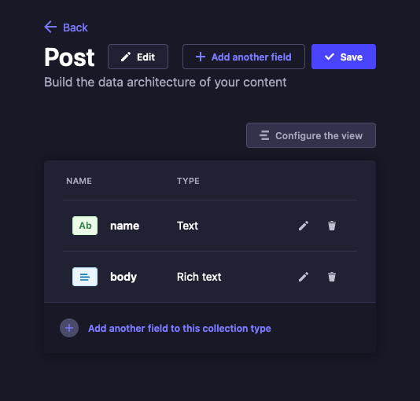

    Click **Save** from the upper right. Strapi restarts to apply the changes you have made.

1.  Create a `Homepage` single type. Navigate to **Content-type Builder**, and select the **Create new single type** option from the inner left menu. Enter `Homepage` for the **Display name** field, and as before the API-related fields should automatically populate. Click **Continue**.

    [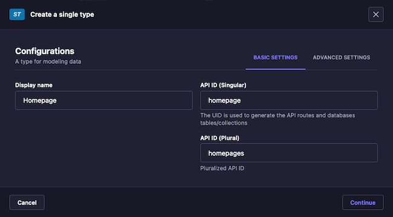](strapi-builder-home.png)

    Just as with the collection type above, select **Text** for the field, and name it `name`. Then, from the *Homepage* page, select the **Add another field to this single type** option. This time, select the **Text** option, and on the next form give the name `description` and select the **Long text** option before clicking **Finish**.

    As before, complete the new type by clicking the **Save** button from the upper right and waiting for Strapi to restart and apply the changes.

    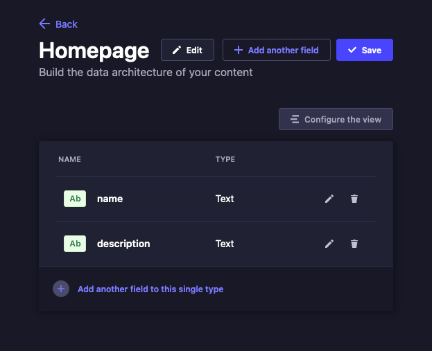

#### Content Manager

The Content Manager is where you can work with content in any of the given content-types you have created. Unlike the Content-type Builder, the Content Manager can be run in production (`start`) mode. Saving changes here does not require restarting/rebuilding your Strapi instance.

For the example here, you should provide some content for the *Homepage* single type and at least one entry for the *Post* collection type. This way, the example website to leverage the Strapi content later has some illustrative content to display.

1.  Add content for the *Homepage* single type. Navigate to the **Content Manager**, and select **Homepage** from the **Single Types** section of the inner left menu.

    Recall from above that this single type has two fields: **name** and **description**. For **name** field, this guide uses `Example Site` and for **description** field, it uses `Welcome to your example website, featuring content from Strapi!`.

    [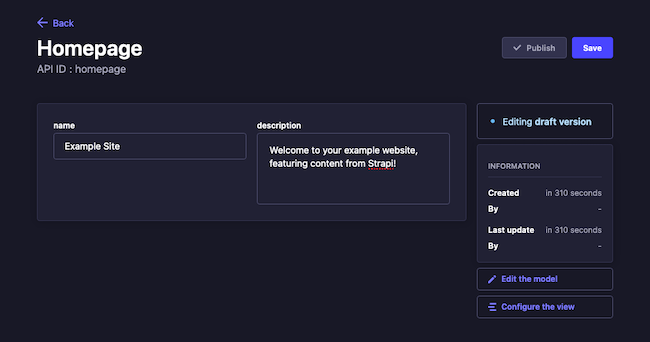](strapi-home-entry.png)

    Click **Save** from the upper right to save the changes you have made. Then, click **Publish** from the upper right to move the entry from *Draft* to *Published* status.

1.  Add content entries for the *Post* collection type. Navigate to the **Content Manager**, and select **Post** from the **Collection Types** section of the inner left menu. Click **Create new entry**, and complete the form to add a new *post* item.

    [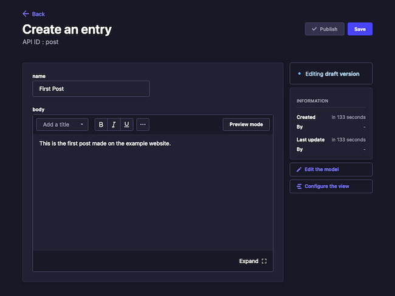](strapi-post-entry.png)

    This guide's example creates three entries using the steps above. Each entry in this collection type has **name** and **body** fields, and these fields are filled out as follows for the example content.

    - **name**: `First Post`; **body**: `This is the first post made on the example website.`

    - **name**: `Another Post`; **body**: `The example website has even more posts!`

    - **name**: `Post the Third`; **body**: `For the example website, this is the last post`

    After completing the form for each entry, click **Save** from the upper right to save the new entry. Then, click the **Publish** option from the upper right, which moves the entry from *Draft* to *Published* status.

### Granting Access

Strapi has a full and robust access control system. Within the Strapi administrator panel, you can configure users and roles with granular access and restrictions.

You could explore the examples in this guide by creating a *Public* role with read access to the content types created above. And you can see how that works in the official [quick-start documentation](https://docs.strapi.io/dev-docs/quick-start#step-3-set-roles--permissions).

However, a more illustrative example for this guide has Strapi generate an API token with the specific permissions the example application needs — and no more.

1.  From the Strapi administrator panel, navigate to **Settings** > **API Tokens**, and select **Create new API token** from the upper right.

1.  Complete the resulting form to create an API token to be used in the example application further on.

    The guide's examples assume the following settings, leaving everything else at default values.

    - **Name**: `example-app-token`

    - **Token duration**: *30 days*

    - **Token type**: *Read-only*

    - **Permissions**:

        - **Homepage**: *find*

        - **Post**: *find*

        - **Content-type-builder**: `getComponents`, `getComponent`, `getContentTypes`, `getContentType`

1.  Click **Save**, and Strapi displays your new token. Be sure to copy this token, as Strapi does not allow you to look it up later.

You can test your token and access to the Strapi REST API using cURL. Here is an example cURL command that uses the API token to fetch all posts. Replace `http://example.com:1337` with your actual Strapi address and `<STRAPI_API_TOKEN>` with you actual API token.

```command
curl http://example.com:1337/api/posts -H "Authorization: bearer <STRAPI_API_TOKEN>"
```

```output
{
  "data": [
    {
      "id": 1,
      "attributes": {
        "name": "First Post",
        "body": "This is the first post made on the example website.",
        "createdAt": "2023-05-03T15:01:01.201Z",
        "updatedAt": "2023-05-03T15:02:02.302Z",
        "publishedAt": "2023-05-03T15:03:03.403Z"
      }
    },
    {
      "id": 2,
      "attributes": {
        "name": "Another Post",
        "body": "The example website has even more posts!",
        "createdAt": "2023-05-03T15:04:04.504Z",
        "updatedAt": "2023-05-03T15:05:05.605Z",
        "publishedAt": "2023-05-03T15:06:06.706Z"
      }
    },
    {
      "id": 3,
      "attributes": {
        "name": "Post the Third",
        "body": "For the example website, this is the last post",
        "createdAt": "2023-05-03T15:07:07.807Z",
        "updatedAt": "2023-05-03T15:08:08.908Z",
        "publishedAt": "2023-05-03T15:09:09.109Z"
      }
    }
  ],
  "meta": {
    "pagination": {
      "page": 1,
      "pageSize": 25,
      "pageCount": 1,
      "total": 3
    }
  }
}
```

## How to Use Strapi in Your Projects

You have your own Strapi CMS operating now. With Strapi, you have a range of ways you can use the managed content in your applications — from REST and GraphQL APIs to specialized libraries. The rest of this guide gives you a sound working example for using your Strapi CMS for website content using a modern frontend framework.

The example uses [Next.js](https://nextjs.org/) to build a website. You can learn more about Next.js in our [Getting Started with Next.js](/docs/guides/getting-started-next-js/) guide. But the example uses straightforward HTTP calls and concepts that should make everything readily adaptable to most any other framework.

### Setting Up an Example Project

For the example website, you need to use NPM to create a new Next.js project. Then, after installing some additional dependencies to the project, you can use the code provided here to create a Strapi-based blog.

1.  Create a new Next.js project, then change into its directory. This example names the project `example-nextjs` and stores the project in the current user's home directory.

    ```command
    cd ~/
    npx create-next-app example-nextjs
    cd example-nextjsy/
    ```

    The setup script presents you with a series of prompts for how you want to initially configure the project. For this example, choose the default option for each prompt, which you can do by pressing <kbd>Enter</kbd>.

    
    You may need to install Git for the script to run. You should be able to do so from your system's package manager: `sudo apt install git` on **Debian** and **Ubuntu** and `sudo dnf install git` on **CentOS** and similar systems.
    

1.  Install the Axios and React Markdown packages to the project. Axios facilitates HTTP calls, and React Markdown can convert Markdown content from Strapi to webpage content.

    ```command
    npm install --save axios react-markdown
    ```

1.  Create a `.env.local` file in the base of the project directory. This file just needs two variables, as shown in the example below. Replace the `STRAPI_ADDRESS` value with your actual Strapi address, and replace the `STRAPI_AUTH_HEADER` value with your actual Strapi API token.

    ```file {title=".env.local"}
    STRAPI_ADDRESS='http://example.com:1337'
    STRAPI_AUTH_HEADER='bearer <STRAPI_API_TOKEN>'
    ```

1.  Download the [zip file](example-nextjs-pages.zip) containing the page-related code for the example application. Below you can find a breakdown of some representative files from this code.

1.  Make sure the zip file is in your project's base directory. Then remove the default `app/` directory, and extract the `pages/` directory from the zip file.

    ```command
    rm -r app/
    unzip example-nextjs-pages.zip
    ```

At this point, the example project is ready. You can look at the content of the files within the `pages/` directory to get a sense of how the application works. The following breaks down some representative files from the project to show how it integrates with your Strapi CMS API.

-   The Next.js application employs API routes to connect to the Strapi REST API. Each of the endpoints operates almost identically to the others in this case, simply varying the Strapi endpoints they point to. For illustration, here is the `/api/home` route, which fetches information for the website homepage.

    ```file {title="pages/api/home.js" lang="js"}
    // Import Axios for handling HTTP requests.
    import axios from 'axios';

    // Reference the environmental variables for Strapi connection.
    const requestAddress = process.env.STRAPI_ADDRESS
    const requestHeaders = {
      headers: { Authorization: process.env.STRAPI_AUTH_HEADER }
    }

    // Make the request, and return the result in the response.
    export default function handler(req, res) {
      axios.get(
          `${requestAddress}/api/homepage`,
          requestHeaders)
        .then(response => {
          res.status(200).json(response.data.data.attributes);
        });
    }
    ```

    The endpoint for fetching a particular post — `pages/api/[postId]` — varies slightly, adding a path variable for indicating the requested post ID.

-   The Next.js pages themselves call to the Next.js API endpoints while loading. The pages each store the response data within state variables, which they then use to display the content.

    The below is the more complicated of these pages, as it fetches website information and uses a variable from the path to fetch post content. This page also leverages the React Markdown module for rendering Markdown content, a convenient format and one frequently used with CMSs.

    ```file {title="pages/posts/[postId].js" lang="js"}
    // Import the Next Head element for supplying metadata, etc.
    import Head from 'next/head'

    // Import the React modules for state variables and effects.
    import {useState, useEffect} from 'react'

    // Import the Next router module for fetching path variables.
    import { useRouter } from 'next/router'

    // Import the React Markdown module to render markdown content.
    import ReactMarkdown from 'react-markdown';

    // Define the post page function, which loads and displays a
    // single post.
    export default function Post() {
      // Initialize the React state variable for the website data
      // and the post.
      const [homeData, setHomeData] = useState([]);
      const [postData, setPostData] = useState([]);

      // Use the router to fetch the requested post ID from the
      // path variable.
      const router = useRouter()
      const { postId } = router.query
      const requestedPostId = postId;

      // Load the home page data from the Next API endpoint.
      useEffect(() => {
        fetch('/api/home')
          .then((res) => res.json())
          .then((data) => setHomeData(data))
      }, [])

      // Load the post data from the Next API endpoint. The
      // function ensures that the requestedPostId is loaded before
      // attempting the request.
      useEffect(() => {
        if(!requestedPostId) {
          return;
        }
        fetch(`/api/posts/${requestedPostId}`)
          .then((res) => res.json())
          .then((data) => setPostData(data.attributes))
      }, [requestedPostId])

      // Render the page template.
      return (
        <div>
          <Head>
            <title>{homeData.name} | Blog</title>
            <meta name='description' content='Generated by create next app' />
            <link rel='icon' href='/favicon.ico' />
          </Head>

          <div className="text-center align-middle">
            <h1 className="text-xl">
              {homeData.name}
            </h1>
          </div>

          <div className="text-center align-middle">
            <h2 className="text-lg italic">
              {postData.name}
            </h2>
          </div>

          <div>
            <div className="m-2">
              <ReactMarkdown children={postData.body} />
            </div>
          </div>
        </div>
      )
    }
    ```

### Running the Scrapi-backed Project

Now you can start running everything together. The steps below have you start running Strapi again (assuming you have stopped running it) and start running the example Next.js application.

From there, you can navigate the example website to see how it renders your Strapi content.

1.  Start up your Strapi instance. Above used development mode, but for demonstration this example can use the production mode for Strapi.

    ```command
    cd ~/example-strapi
    npm run start
    ```

1.  Start up the Next.js application.

    ```command
    cd ~/example-nextjs
    npm start dev
    ```

    ```output
    > example-nextjs@0.1.0 dev
    > next dev

    ready - started server on 0.0.0.0:3000, url: http://localhost:3000
    info  - Loaded env from /home/example-user/example-nextjs/.env.local
    ```

1.  Access the Next.js website via a web browser. To access the website remotely, there are two ready options.

    - Using an SSH tunnel. Follow steps in our guide on [accessing Futon over SSH](/docs/guides/access-futon-over-ssh-using-putty-on-windows/#establish-an-ssh-connection), being sure to replace the port number in that guide (`5984`) with the website port, `3000`.

    - Using the server's public IP address. This requires you to open port `3000` in your system's firewall. You can derive the steps from the [Setting Up for Remote Access](/docs/guides/using-strapi-cms/#setting-up-for-remote-access) section above.

From the main page for the example website, you should see content reflecting the *Homepage* entry you added to Strapi.

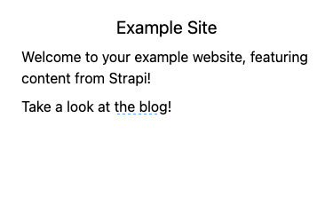

Follow the blog link to see a listing of the *Post* entries you made within Strapi.

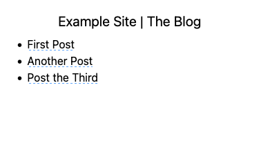

And finally, selecting one of the post titles on the listing leads you to a page with the content for that particular *Post* entry.

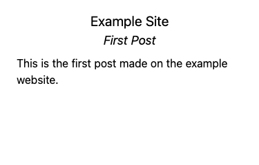

## Conclusion

With that you have everything in place to start leveraging Strapi for your CMS needs. The example application above covers one popular modern framework for rendering content. But there are many more, and Strapi's flexibility makes it an exceptional match for any of them.

And Strapi's high customization rewards digging deeper. Follow the links below to keep learning, and start making the most of your new Strapi instance. From here, you can start molding the Strapi content structures and APIs precisely to your needs, while taking advantage of fine-grained access control.