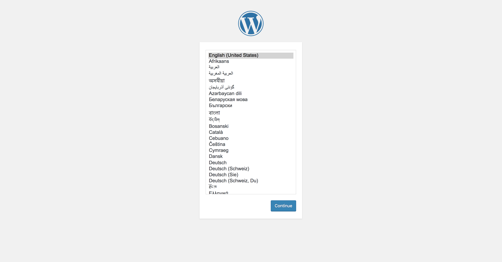

## What is WordPress?

WordPress is a popular, dynamic, content management system that makes it easy to build anything from blogs to complete websites and online stores. This guide shows you how to configure your system to run multiple WordPress sites on a single Linode running Ubuntu 18.04.

## Before You Begin

1. Familiarize yourself with our [Getting Started](/docs/products/platform/get-started/) guide and complete the steps for setting your Linode’s hostname and timezone.

1. This guide will use sudo wherever possible. Complete the sections of our [Securing Your Server](/docs/products/compute/compute-instances/guides/set-up-and-secure/) guide to create a standard user account, harden SSH access and remove unnecessary network services.

1. If you have not already, [assign Linode's name servers](/docs/products/networking/dns-manager/guides/authoritative-name-servers/) to your domain at your domain name's registrar.

1. Update your system:

        apt-get update && apt-get upgrade

## Install a LAMP Stack

WordPress can be deployed on a LAMP stack. A LAMP (Linux, Apache, MySQL, PHP) stack is a common, free, and open source web stack used for hosting web content in a Linux environment.

Install the LAMP stack using the Tasksel tool:

    sudo tasksel install lamp-server

## Create Your Site Databases and Users

You will need a MySQL database for *each instance* of WordPress you intend to run. An example of a two-WordPress setup is shown below. Replace `example1` and `example2` with your respective website names.

| Domain | Database | Username | Password |
| ---------| ---------| ---------| -------- |
| example1.com | example1_wordpress | example1_wpuser | password1 |
| example2.com | example2_wordpress | example2_wpuser | password2 |

1.  Log in to the MySQL command line as the root user:

        sudo mysql -u root

1.  Create the WordPress databases:

        CREATE DATABASE example1_wordpress;
        CREATE DATABASE example2_wordpress;

1.  Create the database users, replacing `example1_wpuser` and `password` with a username and password of your own:

        CREATE USER 'example1_wpuser' IDENTIFIED BY 'password1';
        CREATE USER 'example2_wpuser' IDENTIFIED BY 'password2';

1.  Grant the users privileges for their respective database:

        GRANT ALL PRIVILEGES ON example1_wordpress.* TO 'example1_wpuser';
        GRANT ALL PRIVILEGES ON example1_wordpress.* TO 'example2_wpuser';

1.  Exit MySQL:

        quit

## Install Multiple WordPress Instances

1.  Create the directories that will host your websites and WordPress source files. In this guide, the home directories `/var/www/html/example1.com/` and `/var/www/html/example2.com/` are used as examples.

        sudo mkdir -p /var/www/html/{example1.com,example2.com}/public_html

1.  Create a `src` directory to hold the WordPress tarball and files:

        sudo mkdir /var/www/html/src/

1.  Download and extract the latest version of WordPress to the `src` folder:

        cd /var/www/html/src/
        sudo wget http://wordpress.org/latest.tar.gz

1.  Extract the tarball. To store a backup of the original source files, rename `latest.tar.gz` to `wordpress` followed by the date. This will be useful if you install new versions in the future and need to revert back to a previous release.

        sudo tar -zxvf latest.tar.gz
        sudo mv latest.tar.gz wordpress-`date "+%Y-%m-%d"`.tar.gz

1.  Copy the WordPress files to your site's `public_html` folders:

        sudo cp -R /var/www/html/src/wordpress/* /var/www/html/example1.com/public_html/
        sudo cp -R /var/www/html/src/wordpress/* /var/www/html/example2.com/public_html/

1.  Give Apache ownership of your WordPress sites' home directories:

        sudo chown -R www-data:www-data /var/www/html/{example1.com,example2.com}/

## Configure Apache Virtual Hosts

In this section, you will configure the Apache virtual hosts file so that a visitor to `example1.com` will be served the content in `/var/www/html/example1.com/public_html` and the MySQL database `example1_wordpress`. Visitors to `example2.com` will be served content in `/var/www/html/example2.com/public_html/` and its corresponding MySQL database.

1.  Create a virtual hosts configuration file for `example1.com` and add the example virtual host block into `/etc/apache2/sites-available/example1.com`. Be sure to replace all instances of `example1.com` with your own domain.

    
<VirtualHost *:80>
    # The primary domain for this host
    ServerName example1.com
    # Optionally have other subdomains also managed by this Virtual Host
    ServerAlias example1.com *.example1.com
    DocumentRoot /var/www/html/example1.com/public_html
    <Directory /var/www/html/example1.com/public_html>
        Require all granted
        # Allow local .htaccess to override Apache configuration settings
        AllowOverride all
    </Directory>
    # Enable RewriteEngine
    RewriteEngine on
    RewriteOptions inherit

    # Block .svn, .git
    RewriteRule \.(svn|git)(/)?$ - [F]

    # Catchall redirect to www.example1.com
    RewriteCond %{HTTP_HOST}   !^www.example1\.com [NC]
    RewriteCond %{HTTP_HOST}   !^$
    RewriteRule ^/(.*)         https://www.example1.com/$1 [L,R]

    # Recommended: XSS protection
    <IfModule mod_headers.c>
        Header set X-XSS-Protection "1; mode=block"
        Header always append X-Frame-Options SAMEORIGIN
    </IfModule>
</VirtualHost>

    

1.  Enable the site. This will create a symlink to the `example1.com` Apache conf file in `/etc/apache2/sites-enabled/`:

        sudo a2ensite example1.conf

1. Create a virtual hosts configuration file for your second WordPress site, `example2.com`. Be sure to replace all instances of `example2.com` with your own domain.

    
<VirtualHost *:80>
  # The primary domain for this host
  ServerName example2.com
  # Optionally have other subdomains also managed by this Virtual Host
  ServerAlias example2.com *.example2.com
  DocumentRoot /var/www/html/example2.com/public_html
  <Directory /var/www/html/example2.com/public_html>
      Require all granted
      # Allow local .htaccess to override Apache configuration settings
      AllowOverride all
  </Directory>
  # Enable RewriteEngine
  RewriteEngine on
  RewriteOptions inherit

  # Block .svn, .git
  RewriteRule \.(svn|git)(/)?$ - [F]

  # Catchall redirect to www.example2.com
  RewriteCond %{HTTP_HOST}   !^www.example2\.com [NC]
  RewriteCond %{HTTP_HOST}   !^$
  RewriteRule ^/(.*)         https://www.example2.com/$1 [L,R]

  # Recommended: XSS protection
  <IfModule mod_headers.c>
      Header set X-XSS-Protection "1; mode=block"
      Header always append X-Frame-Options SAMEORIGIN
  </IfModule>
</VirtualHost>
    

1. Enable the site:

        sudo a2ensite example2.conf

    You can repeat Steps 1 and 2 for each WordPress site that you want to host on your Linode.

1. If the `rewrite_module` module is not enabled, you will need to enable it before reloading Apache to have your configurations take effect. To check which Apache modules are enabled, run the following command:

        sudo apache2ctl -M

    Verify that you see `rewrite_module` in the list. If you do not see the module, enable it with the following command:

        sudo a2enmod rewrite

1. For the new configurations to take effect, reload Apache:

        sudo systemctl reload apache2

## Configure WordPress

Follow the [Configure WordPress](/docs/guides/install-wordpress-ubuntu-18-04/#configure-wordpress) section of our Install WordPress on Ubuntu 18.04 guide.

If you do not yet have registered domains to use, you can still perform the WordPress installation using your Linode's IP address. For example:

1. Verify your WordPress installation by using your Linode's IP address to load the WordPress installations in your browser:

        http://203.0.113.15/example1.com/public_html
        http://203.0.113.15/example2.com/public_html

    You should see WordPress' set up page:

    

1. You can begin configuring your WordPress sites. Follow the [Configure WordPress](/docs/guides/install-wordpress-ubuntu-18-04/#configure-wordpress) section of our Install WordPress on Ubuntu 18.04 guide.

1. If you have not yet added DNS records for your Domains, follow Linode's [DNS Manager](/docs/products/networking/dns-manager/) guide.

