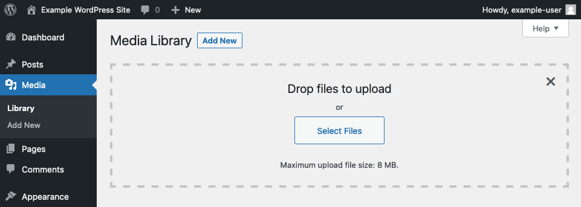
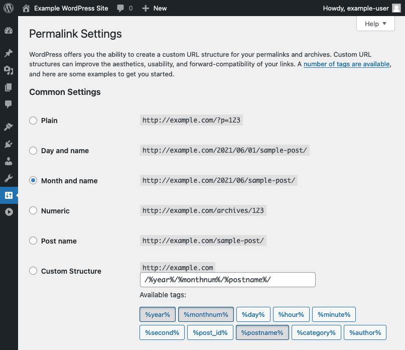

WordPress is one of the most popular Content Management Systems (CMSs) around. It is open source and is an outstanding tool for creating your own blog or any content-centered website. This guide walks you through several ways that you can fine-tune your WordPress configuration beyond the basic installation. The steps in this guide should work for most Linux distributions.

If you have not already installed WordPress on your server, you can follow one of our guides below to do so:

- [How to Install WordPress on Debian 10](/docs/guides/how-to-install-wordpress-debian-10/)
- [How to Install WordPress on Ubuntu 20.04](/docs/guides/how-to-install-wordpress-ubuntu-2004/)
- [How to Install WordPress Using WP-CLI on CentOS 8](/docs/guides/how-to-install-wordpress-using-wp-cli-on-centos-8/)
- [How to Install WordPress on AlmaLinux 8](/docs/guides/how-to-install-wordpress-almalinux-8/)

## Before You Begin

1.  If you have not already done so, create a Linode account and Compute Instance. See our [Getting Started with Linode](/docs/guides/getting-started/) and [Creating a Compute Instance](/docs/guides/creating-a-compute-instance/) guides.

1.  Follow our [Setting Up and Securing a Compute Instance](/docs/guides/set-up-and-secure/) guide to update your system. You may also wish to set the timezone, configure your hostname, create a limited user account, and harden SSH access.
            sudo yum update

1. Replace all instances of `example.com` in this guide with your domain name.

1. This guide uses PHP version **7.4**, the minimum version required by the current WordPress release. Throughout this guide, replace the numbering in `php7.4` and `php74-php` with the numbering appropriate to your PHP version.

   If you are on CentOS and did not use the Remi repository to install PHP, you may have to replace `php74-php` with `php` throughout this guide.


This guide is written for non-root users. Commands that require elevated privileges are prefixed with `sudo`. If you’re not familiar with the `sudo` command, see the [Linux Users and Groups](/docs/guides/linux-users-and-groups/) guide.


## Install Optional PHP Extensions

WordPress has several features that only become available when you have certain PHP extensions installed. These are not required but can add some useful features to your WordPress site.

Each step below shows a PHP extension that can enable functionality for your WordPress site. There are many more PHP extensions, however, and many WordPress plugins require these extensions to function. Be sure to review the documentation for any WordPress plugins you want to use and install the appropriate PHP extensions as needed.

1. Install the `php-gd` extension if you want to be able to modify images within WordPress.

    - On Debian and Ubuntu, use the following command:

            sudo apt install php7.4-gd

    - On CentOS, use the following command:

            sudo yum install php74-php-gd

    This extension allows you to do things like crop uploaded images from within WordPress.

1. Install the `php-mbstring` extension to add support for languages other than English and to fix certain character-encoding issues.

    - On Debian and Ubuntu, use the command below:

            sudo apt install php7.4-mbstring

    - On CentOS, use the following command:

            sudo yum install php74-php-mbstring

1. Install the `php-xmlrpc` extension to be able to use your WordPress site with the WordPress mobile application or to use Jetpack with WordPress.

    - On Debian and Ubuntu, use the following command:

            sudo apt install php7.4-xmlrpc

    - On CentOS, use the command below:

            sudo yum install php74-php-xmlrpc

    For more information on XML-RPC, review the WordPress [XML-RPC guide](https://codex.wordpress.org/XML-RPC_Support). For more information on Jetpack, take a look at [Jetpack for Wordpress](https://jetpack.com/).

## Configure WordPress's Maximum File Size

By default, PHP restricts web uploads to two megabytes. But you can configure PHP to allow larger file uploads.

1. Locate the `php.ini` file for your web server, then open it with your preferred text editor.

    - If you are using Apache, you should be able to find the `php.ini` file at `/etc/php/7.4/apache2/php.ini`.

    - If you are using NGINX, you should be able to find the `php.ini` file at `/etc/php/7.4/fpm/php.ini`.

    - However, if you are using CentOS and installed PHP from the Remi repository, the `php.ini` file should be located at `/etc/opt/remi/php74/php.ini`. If you did not use the Remi repository, the `php.ini` file should be located at `/etc/php.ini`.

1. Find the `upload_max_filesize` variable in the file and modify its value as needed. If you cannot find the variable, you can add it.

    
; Maximum allowed size for uploaded files.
; http://php.net/upload-max-filesize
upload_max_filesize = 8M
    

1. Do the same for the `post_max_size` variable. Its default value may be different than the default for `upload_max_filesize`, but you can make both variables the same value when adjusting them.

    
; Maximum size of POST data that PHP will accept.
; Its value may be 0 to disable the limit. It is ignored if POST data reading
; is disabled through enable_post_data_reading.
; http://php.net/post-max-size
post_max_size = 8M
    

1. Restart PHP.

    - If you are using Apache, use the command below:

            sudo systemctl restart php7.4

    - If you are using NGINX, use the following command:

            sudo systemctl restart php7.4-fpm

    In the above commands, replace `php7.4` with `php74-php` if you are using CentOS.

1. You can verify that the maximum file size for uploads has increased by navigating to your WordPress site's administrator dashboard (`example.com/wp-admin`) and selecting **Media** from the menu on the left. Click **Add New**, and you should see an indication of the current upload limit.

    

## Configure WordPress's Permalinks

Permalinks — a combination of "permanent" and "hyperlink" — provide your pages with persistent URLs, making it easier for users to link to specific pages. By default, WordPress uses a number system for permalinks. For example, a page might have the URL `example.com/?p=42`. However, you may want your WordPress site to have "prettier" — more readable — permalinks. Thankfully, you can achieve this easily with a setting on your WordPress dashboard and some changes in your web server's configuration. You can find more information on WordPress's permalinks in the WordPress [Permalinks guide](https://codex.wordpress.org/Using_Permalinks).

### Select a Permalink Style in WordPress

1. Log into WordPress, and navigate to the administrator dashboard, via `example.com/wp-admin`.

1. Select **Permalinks** from the **Settings** menu on the left.

    

1. Either select a permalink style from the existing options or create your own style using the **Custom Structure** option. Click **Save Changes** once you have made your selection.

1. To enable permalink styling change, follow the appropriate section for your web server, below.

### Enable Permalink Styling in Apache

1. Open the Apache site configuration file — `/etc/apache2/sites-available/example.com.conf` — using your preferred text editor.

1. Find the `Directory` section that identifies your website's root directory, and modify it as follows:

    

# [...]

<Directory /var/www/html/example.com/public_html>
    Options Indexes FollowSymLinks
    AllowOverride All
    Require all granted
</Directory>

# [...]
    

1. Restart Apache to have the changes take effect.

        sudo systemctl restart apache2

### Enable Permalink Styling in NGINX

1. Open the NGINX site configuration file — `/etc/nginx/sites-available/example.com.conf` — using your preferred text editor.

1. Find the `location /` block, and modify it as follows:

    
location / {
    index index.php index.html index.htm;
    try_files $uri $uri/ /index.php?$args;
}
    

1. Restart NGINX to have the changes take effect.

        sudo systemctl restart nginx
