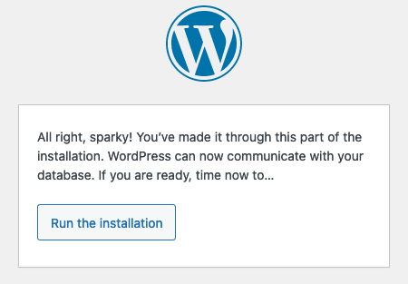
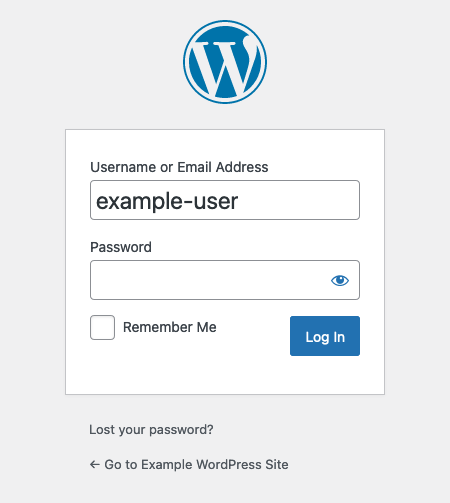
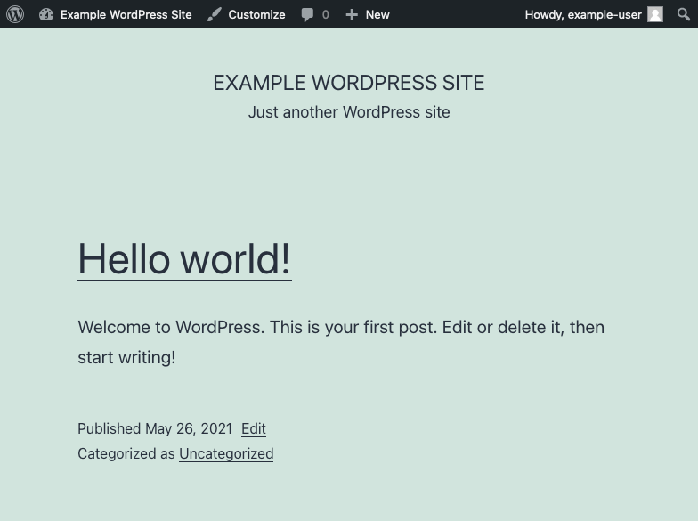

WordPress is an open-source content management system (CMS). WordPress remains perhaps the most popular CMS for blogging, which was its original use case. Its effectiveness as a CMS has also made it useful for an array of websites where strong content management is crucial. WordPress also boasts an extensive library of themes, plug-ins, and widgets to meet your website's needs and make it your own. In this guide, you learn how to install WordPress on your AlmaLinux 8 server.

## Before You Begin

1.  If you have not already done so, create a Linode account and Compute Instance. See our [Getting Started with Linode](/docs/guides/getting-started/) and [Creating a Compute Instance](/docs/guides/creating-a-compute-instance/) guides.

1.  Follow our [Setting Up and Securing a Compute Instance](/docs/guides/set-up-and-secure/) guide to update your system. You may also wish to set the timezone, configure your hostname, create a limited user account, and harden SSH access.

1. Replace all instances of `example.com` in this guide with your domain name.


This guide is written for non-root users. Commands that require elevated privileges are prefixed with `sudo`. If you’re not familiar with the `sudo` command, see the [Linux Users and Groups](/docs/guides/linux-users-and-groups/) guide.


## Set Up the Prerequisites

WordPress runs on PHP and uses MySQL/MariaDB for storing data. You also need a webserver to serve the content from WordPress.

To satisfy these requirements, you can set up a LAMP (Linux, Apache, MySQL, and PHP) or a LEMP (Linux, NGINX, MySQL, and PHP) stack. Then, you need to create a database that WordPress can use.

### Install a LAMP or LEMP Stack

1. Install PHP. The default version of PHP on AlmaLinux 8 is **7.2**, but WordPress requires version **7.4**. So, these steps use the Remi package repository to get the required version.

    - Add Extra Packages for Enterprise Linux (EPEL), then add the Remi repository.

            sudo yum install https://dl.fedoraproject.org/pub/epel/epel-release-latest-8.noarch.rpm
            sudo yum install https://rpms.remirepo.net/enterprise/remi-release-8.rpm

    - Use YUM's configuration manager to enable the Remi repository, and update YUM.

            sudo yum config-manager --enable remi
            sudo yum update

    - Install PHP 7.4. In the following command, replace `php74-php` with `php74-php-fpm` if you are setting up a LEMP stack.

            sudo yum install php74-php php74-php-mysqlnd

    - Enable and start the `php-fpm` service.

            sudo systemctl enable php74-php-fpm
            sudo systemctl start php74-php-fpm

1. Complete the installation of a LAMP or LEMP stack by following the appropriate guide linked below. For each guide, skip the step on installing PHP/PHP-FPM, since you did that above. Additionally, replace `php` in any commands with `php74-php`. For example, change `php-fpm` and `php-mysqlnd` to `php74-php-fpm` and `php74-php-mysqlnd`, respectively.

    
Both of the guides linked below are for CentOS 8 rather than AlmaLinux 8. However, the steps in these guides have been tested and verified to work on AlmaLinux without requiring any changes.
    

    - To create a LAMP stack, follow the [How to Install a LAMP Stack on CentOS 8](/docs/guides/how-to-install-a-lamp-stack-on-centos-8/) guide. The `php.ini` file referred to in the guide can be found at the following location: `/etc/opt/remi/php74/php.ini`.

    - To create a LEMP stack, follow the [How to Install the LEMP Stack on CentOS 8](/docs/guides/how-to-install-the-lemp-stack-on-centos-8/) guide. The `www.conf` file referred to in the guide can be found at `/etc/opt/remi/php74/php-fpm.d/www.conf`, and the `php.ini` file can be found at `/etc/opt/remi/php74/php.ini`.

        In addition to the steps in the guide, take the following steps to prepare your NGINX configuration for WordPress.

        - Modify the following lines in the PHP-FPM configuration file to have PHP listen for the NGINX user.

            

# [...]

listen.owner = nginx
listen.group = nginx
listen.mode = 0660

# [...]

listen.acl_users = nginx
            

        - Add `index.php` to the `location /` block of your site's configuration file.

            
location / {
    index index.php index.html index.htm;
    try_files $uri $uri/ =404;
}
            

        - Restart both PHP and NGINX to reload their configurations.

                sudo systemctl restart php74-php-fpm
                sudo systemctl restart nginx

### Create a WordPress Database

1. Log into MySQL as the root user, entering the password you configured for the user when prompted.

        sudo mysql -u root -p

1. Create a MySQL database for WordPress using the following command:

        CREATE DATABASE wordpress;

1. While still logged into MySQL, create a MySQL user for WordPress, and give that user privileges for the WordPress database. In the commands below, replace `wpuser` and `password` with the username and password that you want for your WordPress MySQL user.

        CREATE USER 'wpuser'@'localhost' IDENTIFIED BY 'password';
        GRANT ALL PRIVILEGES ON wordpress.* TO 'wpuser'@'localhost';
        FLUSH PRIVILEGES;

1. You can then use the `quit;` command to exit MySQL.

## Install WordPress

1. Create a `src` directory in your website's directory, then change into that new directory. In this section and the following sections, the website directory used is `/var/www/example.com`. This is the same website directory created in the LAMP and LEMP guides linked in the section above.

        sudo mkdir -p /var/www/html/example.com/src
        cd /var/www/html/example.com/src

1. Download the latest version of the WordPress package.

        sudo curl -L -O http://wordpress.org/latest.tar.gz

1. Install `tar`, and use it to extract the WordPress files.

        sudo yum install tar
        sudo tar -xvf latest.tar.gz

1. Rename the `tar.gz` package in a way that makes it easy to distinguish, such as including the date in the filename. Here is an example:

        sudo mv latest.tar.gz wordpress-`date "+%Y-%m-%d"`.tar.gz

    Doing this, while not required, can be helpful. For instance, if you install a newer version of WordPress but subsequently need to roll it back, you have a past version stored, and labeled here.

1. Move the contents of the `src/wordpress` directory into the root directory defined in your website's configuration file. For the guides linked above, this is the `public_html` directory.

        sudo mv wordpress/* ../public_html/

1. Give the web server user and its associated user group ownership of the website directory.

    - If you are using Apache, use the command below:

            sudo chown -R apache:apache /var/www/html/example.com

    - If you are using NGINX, use the command below:

            sudo chown -R nginx:nginx /var/www/html/example.com

## Configure WordPress

1. In a web browser, visit the domain name for your website (i.e. `example.com`). Follow the prompts to enter information related to your WordPress website. When prompted, enter the database credentials you created when setting up the MySQL database in the steps above. Click on the **Run the installation** button to proceed.

    

1. Enter information for your WordPress administrator user, then choose **Install WordPress**. After the installation has finished, log in using the credentials you entered for the administrator user.

    

1. By default, WordPress attempts to use FTP credentials to install themes and plug-ins. Bypass this by adding the following lines to the `public/wp-config.php` file.

    
/** Bypass FTP */
define('FS_METHOD', 'direct');
    

    

## Conclusion

Your WordPress site is up and running. You can reach the site's dashboard, where you can manage its settings, by appending `/wp-admin` to the domain name. For instance, using the `example.com` domain name above, your URL looks as follows: `example.com/wp-admin`.

To get the most out of your WordPress site, check out WordPress's [First Steps with WordPress](https://wordpress.org/support/article/first-steps-with-wordpress/)guide. It helps you figure out how to start using and customizing your WordPress site.

To go beyond the basic configuration on your WordPress site, take a look at our [Configuring WordPress](/docs/guides/configuring-wordpress/) guide. It walks you through more advanced configuration options that open up new features for your WordPress installation.
