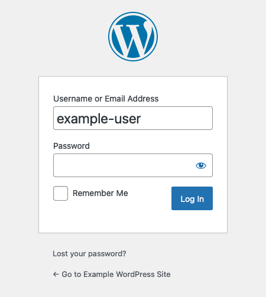

WordPress is an open-source content management system (CMS), one of the most popular around. WordPress was originally designed for blogging, and it is still one of the most commonly used platforms for that. But its effectiveness as a CMS has also made it useful for an array of websites where strong content management is crucial. WordPress also boasts an extensive library of themes, plug-ins, and widgets to meet your website's needs and make it your own.

In this guide, learn how to install WordPress on your Debian 10 server.

## Before You Begin

1.  If you have not already done so, create a Linode account and Compute Instance. See our [Getting Started with Linode](/docs/guides/getting-started/) and [Creating a Compute Instance](/docs/guides/creating-a-compute-instance/) guides.

1.  Follow our [Setting Up and Securing a Compute Instance](/docs/guides/set-up-and-secure/) guide to update your system. You may also wish to set the timezone, configure your hostname, create a limited user account, and harden SSH access.

1. Replace all instances of `example.com` in this guide with your domain name.


This guide is written for non-root users. Commands that require elevated privileges are prefixed with `sudo`. If you’re not familiar with the `sudo` command, see the [Linux Users and Groups](/docs/guides/linux-users-and-groups/) guide.


## Set Up the Prerequisites

WordPress runs on PHP and uses MySQL/MariaDB for storing data. You also need a webserver to serve the content from WordPress.

To satisfy these requirements, you can set up a LAMP (Linux, Apache, MySQL, and PHP) or a LEMP (Linux, NGINX, MySQL, and PHP) stack. Then, you need to create a database that WordPress can use.

### Install a LAMP or LEMP Stack

1. Install PHP. The default version of PHP on Debian 10 is **7.3**, but WordPress requires version **7.4**. So, these steps use the Sury package repository to get the required version.

    - Add the packages needed to add the Sury repository.

            sudo apt install apt-transport-https lsb-release ca-certificates curl

    - Add the repository's GPG key, then add the repository to the package manager.

            sudo wget -O /etc/apt/trusted.gpg.d/php.gpg https://packages.sury.org/php/apt.gpg
            sudo sh -c 'echo "deb https://packages.sury.org/php/ $(lsb_release -sc) main" > /etc/apt/sources.list.d/php.list'

    - Update the package manager.

            sudo apt update

    - Install PHP **7.4** and its extension for MySQL.

        - For a LAMP stack, you also need to install the associated Apache module.

                    sudo apt install php7.4 php7.4-mysql libapache2-mod-php7.4

        - For a LEMP stack, install `php-fpm` instead of `php`.

                    sudo apt install php7.4-fpm php7.4-mysql

1. Complete the installation of a LAMP or LEMP stack by following the appropriate guide linked below. Ignore the sections on installing PHP, and otherwise replace any mention of the PHP version number with **7.4**.

    - To create a LAMP stack, follow the [Install a LAMP Stack on Debian 10 ](/docs/guides/how-to-install-a-lamp-stack-on-debian-10/) guide. Additionally, you need to ensure that the `rewrite` Apache module is enabled, which you can do with the following steps:

        - See what modules are enabled using the below command:

                sudo a2enmod status

        - Enable the `rewrite` module if it is not already enabled, then restart Apache.

                sudo a2enmod rewrite
                sudo systemctl restart apache2

    - To create a LEMP stack, follow the [How to Install the LEMP Stack on Debian 10](/docs/guides/how-to-install-the-lemp-stack-on-debian-10/) guide. Additionally, take the following steps to prepare your NGINX configuration for WordPress.

        - Add `index.php` to the `location /` block of your site's configuration file.

            
location / {
    index index.php index.html index.htm;
    try_files $uri $uri/ =404;
}
            

        - Unlink the default configuration file.

                sudo unlink /etc/nginx/sites-enabled/default

        - Use the following command to reload NGINX's configuration.

                sudo systemctl restart nginx

### Create a WordPress Database

1. Log into MySQL as the root user.

        sudo mysql -u root

1. Create a MySQL database for WordPress using the following command:

    
CREATE DATABASE wordpress;
    

1. While still logged into MySQL, create a MySQL user for WordPress, and give that user privileges for the WordPress database. In the commands below, replace `wpuser` and `password` with the username and password, respectively, that you want for your WordPress MySQL user.

    
CREATE USER 'wpuser'@'localhost' IDENTIFIED BY 'password';
GRANT ALL PRIVILEGES ON wordpress.* TO 'wpuser'@'localhost';
FLUSH PRIVILEGES;
    

1. You can then use the `quit;` command to exit MySQL.

## Install WordPress

1. Create a `src` directory in your website's directory, then change into that new directory. Here and following, the website directory created in the LAMP and LEMP guides linked above is used, which is `/var/www/example.com`.

        sudo mkdir -p /var/www/html/example.com/src
        cd /var/www/html/example.com/src

1. Download and extract the latest version of the WordPress package.

        sudo wget http://wordpress.org/latest.tar.gz
        sudo tar -xvf latest.tar.gz

1. Rename the `tar.gz` package in a way that makes it easy to distinguish, such as including the date in the filename. Here is an example.

        sudo mv latest.tar.gz wordpress-`date "+%Y-%m-%d"`.tar.gz

    Doing this, while not required, can be helpful. If, for instance, you later install a newer version but subsequently need to roll it back, you have a past version stored, and labeled here.

1. Move the contents of the `src/wordpress` directory into the root directory defined in your website's configuration file. For the guides linked above, this is the `public_html` directory.

        sudo mv wordpress/* ../public_html/

1. Give the webserver user (`www-data`) and its associated user group ownership of the website directory.

        sudo chown -R www-data:www-data /var/www/html/example.com

## Configure WordPress

1. In a web browser, visit the domain name for your website — `example.com` above. Follow the prompts to enter information related to your WordPress website. When prompted, enter the database credentials you created when setting up the MySQL database in the steps above. Choose to **Run the installation**.

    

1. Enter information for your WordPress administrator user, then click **Install WordPress**. After the installation has finished, log in using the credentials you entered for the administrator user.

    

1. By default, WordPress attempts to use FTP credentials to install themes and plug-ins. Bypass this by adding the following lines to the `public/wp-config.php` file.

    
/** Bypass FTP */
define('FS_METHOD', 'direct');
    

    

## Conclusion

Congratulations! Your WordPress site is up and running. You can reach the site's dashboard, where you can manage its settings, by appending `/wp-admin` to the domain name. For instance, using the `example.com` domain name above: `example.com/wp-admin`.

To start learning more about getting the most out of your WordPress site, check out WordPress's [First Steps with WordPress](https://wordpress.org/support/article/first-steps-with-wordpress/). It helps you figure out how to start using and making your WordPress site your own.

To go beyond the basic configuration on your WordPress site, take a look at our [Configuring WordPress](/docs/guides/configuring-wordpress/) guide. It walks you through more advanced configuration options that open up new features for your WordPress installation.
