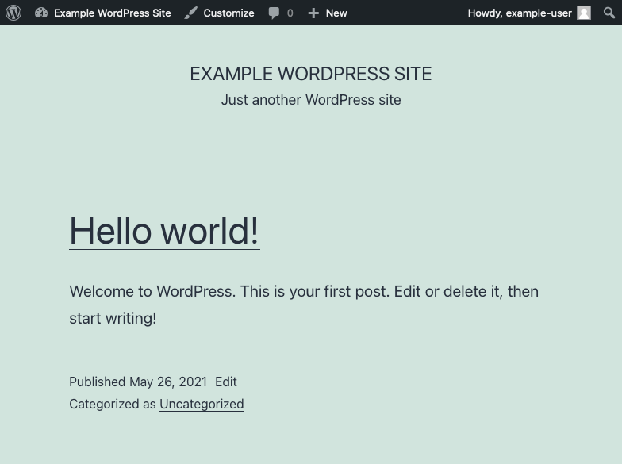

WordPress is an open-source content management system (CMS), one of the most popular around. You can frequently find WordPress powering blogs and other websites where effective content management is central. WordPress also comes with access to a wide array of themes, plug-ins, and widgets to meet your website's needs and make it your own.

In this guide, learn how to install WordPress on your Ubuntu 20.04 server.

## Before You Begin

1.  If you have not already done so, create a Linode account and Compute Instance. See our [Getting Started with Linode](/docs/guides/getting-started/) and [Creating a Compute Instance](/docs/guides/creating-a-compute-instance/) guides.

1.  Follow our [Setting Up and Securing a Compute Instance](/docs/guides/set-up-and-secure/) guide to update your system. You may also wish to set the timezone, configure your hostname, create a limited user account, and harden SSH access.

1. Replace all instances of `example.com` in this guide with your domain name.


This guide is written for non-root users. Commands that require elevated privileges are prefixed with `sudo`. If you’re not familiar with the `sudo` command, see the [Linux Users and Groups](/docs/guides/linux-users-and-groups/) guide.


## Set Up the Prerequisites

WordPress runs on PHP and uses MySQL/MariaDB for storing data. You also need a webserver to serve the content from WordPress.

To satisfy these requirements, you can set up a LAMP (Linux, Apache, MySQL, and PHP) or a LEMP (Linux, NGINX, MySQL, and PHP) stack. Then, you need to create a database that WordPress can use.

### Install a LAMP or LEMP Stack

1. Install and configure a LAMP or LEMP stack. For either stack, make sure that you are installing at least PHP version **7.4**. This is the default on Ubuntu 20.04. Additionally, make sure to replace all version numbers in the below guides with the number of the version you are installing.

    - To create a LAMP stack, follow the [How to Install a LAMP Stack on Ubuntu 20.04](/docs/guides/how-to-install-a-lamp-stack-on-ubuntu-20-04/) guide.

    - To create a LEMP stack, follow the [How to Install the LEMP Stack on Ubuntu 18.04](/docs/guides/how-to-install-the-lemp-stack-on-ubuntu-18-04/) guide.

1. If you are using a LAMP stack, make sure the `rewrite` module is enabled.

    - See what modules are enabled using the below command:

            sudo a2enmod status

    - Enable the `rewrite` module if it is not already enabled, then restart Apache:

            sudo a2enmod rewrite
            sudo systemctl restart apache2

1. If you are using a LEMP stack use the below steps:

    - Add `index.php` to the `location /` block of your site's configuration file.

        
location / {
    index index.php index.html index.htm;
    try_files $uri $uri/ =404;
}
        

    - Unlink the default configuration file.

            sudo unlink /etc/nginx/sites-enabled/default

    - Use the following command to reload NGINX's configuration.

            sudo systemctl restart nginx

### Create a WordPress Database

1. Log into MySQL as the root user.

        sudo mysql -u root

1. Create a MySQL database for WordPress using the following command:

    
CREATE DATABASE wordpress;
    

1. While still logged into MySQL, create a MySQL user for WordPress, and give that user privileges for the WordPress database. In the commands below, replace `wpuser` and `password` with the username and password, respectively, that you want for your WordPress MySQL user.

    
CREATE USER 'wpuser'@'localhost' IDENTIFIED BY 'password';
GRANT ALL PRIVILEGES ON wordpress.* TO 'wpuser'@'localhost';
FLUSH PRIVILEGES;
    

1. You can then use the `quit;` command to exit MySQL.

## Install WordPress

1. Create a `src` directory in your website's directory, then change into that new directory. Here and following, the website directory created in the LAMP and LEMP guides linked above is used, which is `/var/www/example.com`.

        sudo mkdir -p /var/www/html/example.com/src
        cd /var/www/html/example.com/src

1. Download and extract the latest version of the WordPress package.

        sudo wget http://wordpress.org/latest.tar.gz
        sudo tar -xvf latest.tar.gz

1. Rename the `tar.gz` package in a way that makes it easy to distinguish, such as including the date in the filename. Here is an example:

        sudo mv latest.tar.gz wordpress-`date "+%Y-%m-%d"`.tar.gz

    Doing this, while not required, can be helpful. If, for instance, you later install a newer version but subsequently need to roll it back, you have a past version stored, and labeled here.

1. Move the contents of the `src/wordpress` directory into the root directory defined in your website's configuration file. For the guides linked above, this is the `public_html` directory.

        sudo mv wordpress/* ../public_html/

1. Give the webserver user (`www-data`) and its associated user group ownership of the website directory.

        sudo chown -R www-data:www-data /var/www/html/example.com

## Configure WordPress

1. In a web browser, visit the domain name for your website — `example.com` above. Follow the prompts to enter information related to your WordPress website. When prompted, enter the database credentials you created when setting up the MySQL database in the steps above. Choose to **Run the installation**.

    

1. Enter information for your WordPress administrator user, then click **Install WordPress**. After the installation has finished, log in using the credentials you entered for the administrator user.

    

1. By default, WordPress attempts to use FTP credentials to install themes and plug-ins. Bypass this by adding the following lines to the `public/wp-config.php` file.

    
/** Bypass FTP */
define('FS_METHOD', 'direct');
    

    

## Conclusion

Congratulations! Your WordPress site is up and running. You can reach the site's dashboard, where you can manage its settings, by appending `/wp-admin` to the domain name. For instance, using the `example.com` domain name above—`example.com/wp-admin`.

To start learning more about getting the most out of your WordPress site, check out WordPress's [First Steps with WordPress](https://wordpress.org/support/article/first-steps-with-wordpress/). It helps you figure out how to start using and making your WordPress site your own.

To go beyond the basic configuration on your WordPress site, take a look at our [Configuring WordPress](/docs/guides/configuring-wordpress/) guide. It walks you through more advanced configuration options that open up new features for your WordPress installation.
