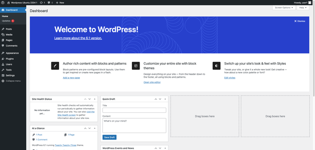
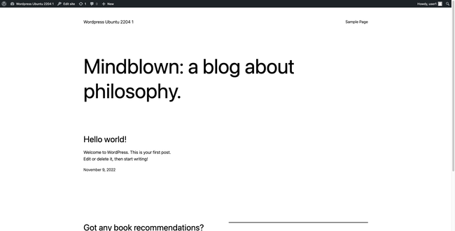

[WordPress](https://wordpress.org/) is one of the most common *content management systems* (CMS) in use today. WordPress allows [Ubuntu](https://ubuntu.com/server) and other Linux users to design a website and add content using its intuitive GUI. WordPress also allows site owners to install a diverse selection of themes and plug-ins to further customize their site. This guide explains how to install WordPress on Ubuntu 22.04 LTS. It also describes how to configure and start using WordPress after installation.

## What is WordPress?

WordPress is a long-time foundation for personal websites and blogs. It is available for free and considered easy to install, configure, and use. It allows site owners to design an attractive site and add information without knowing anything about HTML or CSS. It also features additional modules for further customization along with a large, knowledgeable, and passionate user base. WordPress is available for all major operating systems, although it is most commonly used with Linux.

WordPress can be downloaded to an Ubuntu server using `wget`. It only requires minor pre-installation configuration changes to other applications. However WordPress relies on several other applications to function. It uses the [PHP programming language](https://www.php.net/), so PHP must already be installed. In addition, WordPress requires a web server and a *relational database management system* (RDBMS).

## WordPress Prerequisites

A Ubuntu LAMP or LEMP stack satisfies all these prerequisites. A LAMP stack includes the Linux operating system, the [Apache web server](https://httpd.apache.org/docs/2.4/), the [MySQL RDBMS](https://dev.mysql.com/), and the PHP programming language. A LEMP stack substitutes [NGINX](https://www.nginx.com/) (pronounced "engine-x") in place of Apache and sometimes uses the MariaDB database instead of MySQL. Either stack can be installed using the standard Ubuntu library. For information on [installing a LAMP stack on Ubuntu 22.04](/docs/guides/how-to-install-a-lamp-stack-on-ubuntu-22-04/), see the Linode guide. There is also a Linode guide to [installing a LEMP stack on Ubuntu 22.04](/docs/guides/how-to-install-a-lemp-stack-on-ubuntu-22-04/).

For greater security, WordPress highly recommends HTTPS. However, these instructions work whether HTTPS is configured on the server or not. For information about enabling HTTPS on Ubuntu, see the [Linode guide on enabling HTTPS on Apache](/docs/guides/enabling-https-using-certbot-with-apache-on-ubuntu/). An alternate guide for [NGINX](/docs/guides/enabling-https-using-certbot-with-nginx-on-ubuntu/) is also available.


WordPress sites are almost always accessed using a domain name. For more information on domains and how to create a DNS record, see the [Linode DNS Manager guide](/docs/products/networking/dns-manager/).


## Before You Begin

1.  If you have not already done so, create a Linode account and Compute Instance. See our [Getting Started with Linode](/docs/products/platform/get-started/) and [Creating a Compute Instance](/docs/products/compute/compute-instances/guides/create/) guides.

1.  Follow our [Setting Up and Securing a Compute Instance](/docs/products/compute/compute-instances/guides/set-up-and-secure/) guide to update your system. You may also wish to set the timezone, configure your hostname, create a limited user account, and harden SSH access.

1.  Fully configure a LAMP or LEMP stack on the Linode and confirm it is working properly.


This guide is written for a non-root user. Commands that require elevated privileges are prefixed with `sudo`. If you are not familiar with the `sudo` command, see the [Users and Groups](/docs/guides/linux-users-and-groups/) guide.


## How to Prepare the LAMP or LEMP Stack for WordPress

To properly configure and use WordPress on Ubuntu, a LAMP or LEMP stack must already be installed and working. However, WordPress requires a few additional modifications to the various LAMP/LEMP Stack components. In the following examples, replace `example.com` with the actual domain name wherever it appears.


These instructions are designed for Ubuntu 22.04 LTS, but are generally valid for all recent Ubuntu releases.


### How to Configure Apache for WordPress

If you are using a LAMP stack, enable an additional Apache module and restart the server. Follow these steps to configure Apache to support WordPress.

1.  Enable the rewrite module. This allows for more readable links within the site.

    ```command
    sudo a2enmod rewrite
    ```

    
Enabling module rewrite.
    

2.  **(Optional)** To allow WordPress plug-ins and extensions to use `.htaccess` files, set the `AllowOverride` directive to enable them. Add the following configuration to the `VirtualHost` block within the site configuration file. This file is normally located at `/etc/apache2/sites-available/example.com.conf`. For the `Directory` name, use the actual domain name instead of `example.com`.

    
If you are not using a site configuration file, skip this step.
    

    ```file {title="/etc/apache2/sites-available/example.com.conf" lang="aconf"}
    <VirtualHost *:80>
    ...
        <Directory /var/www/html/your_domain/public_html/>
            AllowOverride All
        </Directory>
    ...
    </VirtualHost>
    ```

3.  Run the Apache `configtest` utility to test the changes. It might display some warnings, but if `Syntax OK` appears in the output, the syntax is valid.

    ```command
    sudo apache2ctl configtest
    ```

    
Syntax OK
    

4.  Restart Apache.

    ```command
    sudo systemctl restart apache2
    ```

### How to Configure NGINX for WordPress

If you are using a LEMP stack, make the following configuration changes.

1.  Edit the site configuration file at `/etc/nginx/sites-available/example.com`. Make the following change to the `location /` block. Add `index.php` to the start of the `index` field. This tells NGINX to search for this file first.

    ```file {title="/etc/nginx/sites-available/example.com.conf" lang="nginx"}
    ...
    location / {
        index index.php index.html index.htm;
        try_files $uri $uri/ =404;
    }
    ...
    ```

2.  Use `unlink` to disable the default NGINX configuration file.

    ```command
    sudo unlink /etc/nginx/sites-enabled/default
    ```

3.  Restart NGINX to reload the configuration.

    ```command
    sudo systemctl restart nginx
    ```

### How to Configure MySQL for WordPress

WordPress uses a separate SQL database to store the site's contents and configuration. Use the following commands to create a database and a database user. These steps apply to both MySQL and MariaDB.

1.  Log in to MySQL as `root`.

    ```command
    sudo mysql -u root
    ```

    
If you followed all the instructions in our prerequisite guide for LAMP, use `sudo mysql -u root -p` instead, and enter your password when prompted.
    

2.  Create a database named `wordpress`.

    ```command
    CREATE DATABASE wordpress;
    ```

3.  Create a new user for the `wordpress` database and grant the user all rights. Flush all privileges at the end. In the following commands, replace `wpuser` with a unique user name and `password` with a more secure password.

    ```command
    CREATE USER 'wpuser'@'localhost' IDENTIFIED BY 'password';
    GRANT ALL PRIVILEGES ON wordpress.* TO 'wpuser'@'localhost';
    FLUSH PRIVILEGES;
    ```

4.  Exit the database.

    ```command
    exit
    ```

### How to Configure PHP for WordPress

Although WordPress can be installed using the default PHP packages, many plug-ins and themes require additional modules. Follow these instructions to upgrade PHP.

1.  For greater flexibility, install the following PHP components.

    ```command
    sudo apt install php-curl php-gd php-mbstring php-xml php-xmlrpc php-soap
    ```

2.  Reload Apache or NGINX to apply the changes.

    ```command
    sudo systemctl restart apache2
    ```

    ```command
    sudo systemctl restart nginx
    ```

## Downloading WordPress for Ubuntu 22.04

The Ubuntu LAMP or LEMP stack is now fully configured and ready for WordPress. Follow these steps to download and install WordPress.

1.  Create a new `src` directory inside the root directory for the website. The root directory is normally located at `var/www/html/`. Replace `example.com` with the name of the domain.

    ```command
    sudo mkdir -p /var/www/html/example.com/src
    ```

2.  Enter the new directory.

    ```command
    cd /var/www/html/example.com/src
    ```

3.  Download the WordPress package using `wget`.

    ```command
    sudo wget http://wordpress.org/latest.tar.gz
    ```

4.  Extract the WordPress files from the `tar` file.

    ```command
    sudo tar -xvf latest.tar.gz
    ```

5.  **(Optional)** Rename the archive using the current date. This makes it easier to restore the files in the future.

    ```command
    sudo mv latest.tar.gz wordpress-`date "+%Y-%m-%d"`.tar.gz
    ```

6.  Move the extracted files to the root directory for the domain. In a typical configuration, this is the `public_html` directory.

    ```command
    sudo mv wordpress/* ../public_html/
    ```

7.  Ensure the webserver user is given ownership over the entire root directory for the domain.

    ```command
    sudo chown -R www-data:www-data /var/www/html/example.com
    ```

## Configuring WordPress on Ubuntu 22.04

1.  Visit the domain using a web browser. The default language selection page first appears. Choose your language and select **Continue**.

    ```command
    http://example.com
    ```

    

2.  WordPress then displays an informational page explaining the configuration process and required information. Have the database and user details readily available. Click the **Let's Go** button to continue.

    

3. On the next form, enter the name, user name, password, and host for the database. Use `localhost` for the `Database Host` field. If this is the first WordPress installation on the Ubuntu server, leave the `Table Prefix` field set to `wp_`. Click the **Submit** button after entering all the information.

    

4.  If the information is correct, WordPress confirms the database connection is successful. If there is a connection error, WordPress prompts you to correct the errors. Most failures are due to an incorrect user name or password. Click the **Run the installation** button to continue.

    

5.  The next form prompts for a username, password, and email for the site administrator. It also prompts for a site name and asks whether search engines should index the site. Enter all information and then select **Install WordPress** to continue.

    

6.  WordPress confirms the account has been successfully created. Click the **Log In** button to continue to the login screen.

    

7.  At the login page, enter the user name and password for the WordPress account and click **Log In**.

    

8.  The browser displays the WordPress dashboard. Use the dashboard to configure and administer the site, or to add new content. Bookmark the dashboard for future reference. You can also visit it by appending `/wp-admin` to the domain name, for example `http://www.example.com/wp-admin/`.

    

9.  **(Optional)** WordPress typically uses FTP credentials to install new themes and plug-ins. Add the following lines to the `wp_config.php` file to remove this restriction. This file is located in the root directory for the domain inside the `public_html` subdirectory.

    ```file {title="/var/www/html/example.com/public_html/wp-config.php" lang="php"}
    /** Bypass FTP */
    define('FS_METHOD', 'direct');
    ```

0.  At this point, the WordPress site is ready to use. To see how the site appears to other users, enter the name of the domain in the address bar of the browser. While logged in, you can also add new content directly from this page.

    

## Learning More about WordPress

The WordPress Dashboard is fairly self-explanatory. From the left-menu of the Dashboard, users can access pages allowing them to change settings, select themes, and install new plug-ins. Users can select the **Posts** option to add new pages or modify existing content.

Before proceeding, it is worthwhile to spend more time learning about WordPress. The [First Steps with WordPress guide](https://wordpress.org/support/article/first-steps-with-wordpress/) is very useful. It walks users through the WordPress interface and explains how to perform basic tasks. In addition, [How to Configure WordPress](/docs/guides/configuring-wordpress/) summarizes how to configure some of the more common WordPress settings.

For complete information about WordPress, including all advanced settings, see the [WordPress documentation site](https://wordpress.org/support/).

## A Summary about Installing WordPress on Ubuntu 22.04

WordPress is one of the most popular CMS applications for personal websites and blogs. It allows site owners to easily manage and customize their sites and quickly add new content. No knowledge of HTML, CSS, or PHP is required.

It is easy to install WordPress on Ubuntu. WordPress requires a Ubuntu LAMP or LEMP stack, including a web server, RDBMS, and the PHP programming language. Download the WordPress files using `wget` and unzip the archive. A few further adjustments to the LAMP/LEMP stack are also required. After installation, set up WordPress using its intuitive web interface. For more information on WordPress, see the [WordPress website](https://wordpress.org/).