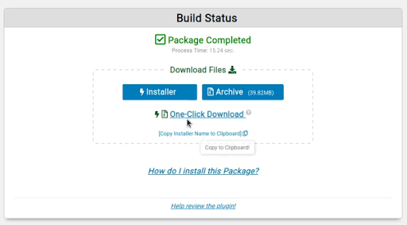

WordPress is a popular content management and website creation software system used by millions of users today. It's easy to use and offers thousands of plugins making it simple for non-developers to create beautiful websites without having to write a single line of code. This guide helps you keep your WordPress site secure with suggestions like installing SSL certificates, installing a firewall, enabling two-factor authentication, and more.

## Securing Your Website Through HTTPS

The first step in securing your WordPress installation is to ensure that you have a [TLS/SSL certificate](/docs/guides/what-is-a-tls-certificate/) configured using the TLS v1.2 (or later) protocol. This allows your website to be accessed securely on all major browsers, including Chrome, Firefox, Safari, and Edge (all of which require TLS v1.2 or later as of 2020). You can quickly analyze your site's current connection by navigating to your domain in a web browser. Look for the lock icon to the left of the URL in the address bar. Clicking on this lock should show a message similar to "Connection secure" if your site meets the browser's TLS requirements. You can also check a domain's certificate by using the [SSL Server Test](https://www.ssllabs.com/ssltest/) by Qualys SSL Labs.

### Installing a TLS Certificate using Certbot

If your site does not yet have a certificate, you can easily generate one directly on your Linux server by using the [certbot](https://certbot.eff.org/) utility. Certbot is a free and highly regarded command-line tool for generating and renewing [Let's Encrypt](https://letsencrypt.org/) certificates.

Install certbot and configure your TLS certificate by using one of the following guides:

- [How to Use Certbot to Install SSL/TLS Certificates for NGINX on Ubuntu 20.04](/docs/guides/enabling-https-using-certbot-with-nginx-on-ubuntu/)
- [How to Use Certbot to Install SSL/TLS Certificates for Apache on Ubuntu 20.04](/docs/guides/enabling-https-using-certbot-with-apache-on-ubuntu/)

You can also follow the [installation instructions](https://certbot.eff.org/instructions) on certbot's website. This should prompt you to select your web server software as well as the operating system of your server and will output the specific instructions that should work for you.

If you prefer to use a Certificate Authority other then Let's Encrypt, see the [Obtain a Commercially Signed TLS Certificate](/docs/guides/obtain-a-commercially-signed-tls-certificate/) guide for further instructions.

### Configuring the Web Server

Next, you'll want to verify that your web server is properly configured to handle HTTPS connections using your TLS certificate. If you just created your certificate through certbot, certbot likely automatically configured your web server. Otherwise, you'll need to configure your web server manually. Since these instructions are highly dependent on the software you are using, select from one of the following guides that corresponds with your web server:

- **Nginx**
  - **Nginx documentation:** [Configuring HTTPS servers](http://nginx.org/en/docs/http/configuring_https_servers.html)
  - **Linode guide:** [Getting Started with NGINX - Part 3: Enable TLS for HTTPS Connections](/docs/guides/getting-started-with-nginx-part-3-enable-tls-for-https/)
- **Apache**
  - **Apache documentation:** [SSL/TLS Strong Encryption: How-To
](https://httpd.apache.org/docs/2.4/ssl/ssl_howto.html)
  - **Linode guide:** [SSL Certificates with Apache on Debian & Ubuntu](/docs/guides/ssl-apache2-debian-ubuntu/)

## Enforcing a Strong Password Policy

Passwords and authentication security is an extremely important aspect of the security posture of your website. A weak password can undo all the work and security configurations you have made to secure your WordPress site. It is therefore vital to ensure that all user and administrator accounts use strong and complex passwords to prevent unauthorized logins.

A strong password policy encourages users to utilize a password generator and a password manager to keep all their passwords safe and secure.

### Password Generators

You can find various password generators for your browser of choice. This example uses the plugin [Secure Password Generator](https://addons.mozilla.org/en-US/firefox/addon/secure-password-generator/) from the Mozilla add-ons site. This allows you to generate strong and complex passwords.

This plugin allows you to set multiple options for your generated password such as:
  - How many letters to use
  - How many digits to use
  - How many and which other characters to use
  - Which characters to exclude
  - And the total length of the password

Additionally, many password managers have password generators built in. [Bitwarden](https://bitwarden.com/) is a free and open source password manager that offers both password management and generation. It's available on all platforms including browsers and mobile devices.

### Change Passwords Regularly

Another good policy to implement, is to ensure that all users on the site, including `admin`, change their passwords regularly. Setup reminders to have everyone change their passwords monthly or every 90 days.

## Change the “admin” username

By default, most WordPress installations automatically recommend the username **admin** for the administrator account. This poses an immediate threat, as most brute-force attacks on the WordPress login page use the username **admin** as it is always associated with the administrator account that has elevated privileges.

It is recommended that the username for the administrative account be something as clandestine as possible, avoid using common names or personal information. This reduces the attack surface greatly.

Most WordPress installers prompt you to specify your administrator account username before the installation. If not, you can use a plugin to change the account username after WordPress has been installed. One such plugin is [Username Changer](https://wordpress.org/plugins/username-changer/).

### Enable Two-factor Authentication

An additional layer of security that can be added to the default WordPress username and password authentication system is the use of two-factor authentication (2FA). 2FA adds an additional step to authentication. The first step involves entering your username and password and the next step entails entering an authentication code generated by your authenticator application.

To set up 2FA, you need to install a 2FA plugin for WordPress. There are plenty of options that exist; this example uses the plugin [Two-Factor](https://wordpress.org/plugins/two-factor/).

1.  Download and install the plugin into your WordPress installation. For detailed instructions, see [installing plugins](https://wordpress.org/support/article/managing-plugins/#installing-plugins).

1.  After installing the plugin, all you need to do is scan the QR code with an authenticator app on your mobile device, a popular option is Google Authenticator.

    

1.  After scanning the QR code, you now have an additional layer of security when you login. Now you need to provide your authentication token in addition to your username and password combinations. This is extremely effective at preventing intruders from accessing your account if they have been able to obtain your username and password either through phishing or a password leak.

    

## Setting Up Backups

Backups are an essential pillar of security as they offer a way to roll back changes or recover from an attack or hack. This is one of the most important security steps as it ensures that you can restore your website to its original state at any time without consequence. It is also useful if you are migrating to a different host or server as you can easily migrate from one hosting environment to another with virtually no changes to your WordPress installation.

There are many plugins available that offer backup solutions. However, most of these plugins only make a backup of your site data like images and posts. This is useful but not reliable. A much more reliable solution is to take entire backups, or snapshots, that encompass all data on your server including the database, posts, and preferences.

A great plugin that offers this snapshot functionality is called [Duplicator](https://wordpress.org/plugins/duplicator/).

1.  Download and install the Duplicator backup plugin. For detailed instructions, see [installing plugins](https://wordpress.org/support/article/managing-plugins/#installing-plugins).

1.  After installing the plugin you can create a new backup by clicking on packages and new package.

1.  This brings up the configuration page where backup options can be specified and customized depending on your requirements. It is recommended that you leave them on their default settings.

    

1.  After the backup process has been completed, you can download the backup package and store it in an offsite location.

    

    It is a good practice to ensure that your backups are stored on another server or in another location as attackers can potentially delete backups if they are stored on the same server.

## Web Application Firewall (WAF)

It is recommended to run a WAF to protect your site from web application attacks like SQL injection and cross site scripting which can be a cumbersome task to manage given the variety and quantity of potential attacks. A WAF automatically monitors, analyzes, and blocks potential threats or attacks on your site.

A recommended WAF is [Wordfence](https://wordpress.org/plugins/wordfence/). Wordfence includes an endpoint firewall and malware scanner that were built from the ground up to protect WordPress.

Wordfence automatically prevents attacks, provides you with the ability to scan your website for potential security issues, and offers advice and instructions on how they can be fixed.

## Disable PHP File Execution

File execution in web applications is a potentially dangerous vulnerability that can give attackers direct access to your server and content. Attackers typically try uploading executable PHP files in the default WordPress upload directory that is typically located in `/var/www/wordpress/wp-content/uploads/`.

You can disable file execution by typing in the following code and saving it in an `.htaccess` file in the `/var/www/wordpress/wp-content/uploads/` directory:


<Files *.php>
deny from all
</Files>


## Disabling Directory Browsing

Directory browsing is a common security misconfiguration that, if left unfixed, can be used by attackers to browse through your uploaded files and images, and reveal important information like your directory structure.

To disable directory browsing, create an `.htaccess` file in your site’s root directory.


If an `.htaccess` file already exists you do not need to create a new one, simply add the following line to the file.



Options -Indexes


After you have created or edited the `.htaccess` file, save the file and restart your web server.
