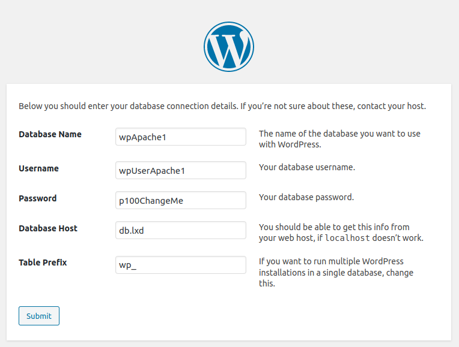

## Introduction

[*LXD*](https://linuxcontainers.org/lxd/) (pronounced "Lex-Dee") is a system container manager built on top of [Linux Containers (LXC)](https://linuxcontainers.org/), and is supported by [Canonical](https://canonical.com). The goal of LXD is to provide an experience similar to a virtual machine but through containerization rather than hardware virtualization.

[*WordPress*](https://wordpress.org/) is the most popular content management system and is used by over 35% of all websites. It is common to install WordPress in a virtual machine (VM) as a way to separate multiple installations from each other. For example, you could create several [Linode shared instances](https://www.linode.com/products/shared/) if you wanted to host multiple sites, one on each Linode.

However, within a VM we can further install multiple WordPress instances, each in its own LXD system container. By doing this, you achieve greater density of websites for a VM's resources. You can also maintain good isolation between each WordPress installation.

## In this Guide

This guide explains how to set up WordPress in LXD system containers. This demonstration shows how to host multiple and separate WordPress websites on a single server.


A 2GB Linode shared instance running Ubuntu 20.04 was used to test the instructions in this guide. A different server running a different operating system can be used, but you may need to adjust some instructions. In particular, the instructions for installing LXD may be different.


- Two WordPress sites are created. Each WordPress site is installed in its own LXD system container. Each container runs a web server. These containers do not directly accept connections from the public internet. Two different web servers are used for these containers to demonstrate their different configuration methods:

    - One WordPress site is installed in a container running the NGINX web server.

    - The other WordPress site is installed in a container running the Apache web server.

- Another NGINX container receives traffic from the public internet. This container serves as a reverse proxy to the two WordPress installations. This container also maintains SSL certificates for both WordPress sites, and it accepts HTTPS connections.

- A SQL database is configured in a final system container. Both WordPress sites connect to this database.

The guide is ordered as follows:

1. First, you configure LXD and create containers for an NGINX web server, an Apache web server, and for the NGINX reverse proxy. This is accomplished by following two other guides that are listed in the [Before You Begin](#before-you-begin) section.

1. Next, you [create and set up the database container](#create-and-set-up-the-database-container). This includes [configuring the database for each WordPress installation](#configure-the-database-for-each-wordpress-installation).

1. After the database container is set up, [you log in to the Apache and NGINX web servers and install WordPress in each of them](#install-wordpress-in-the-web-server-containers).

1. Finally, you [complete the setup using the WordPress installation wizard](#complete-the-wordpress-installation-wizard).

1. At the end, the guide presents how to [troubleshoot some common errors that you may run into during set up](#troubleshooting).


For simplicity, the term *container* is used throughout this guide to describe the LXD system containers.


## Before You Begin

1.  Follow the [A Beginner's Guide to LXD: Setting Up an Apache Web Server In a Container](/docs/guides/beginners-guide-to-lxd/) guide. Specifically, you only need to follow these sections: the [Before You Begin](/docs/guides/beginners-guide-to-lxd/#before-you-begin) section, and the [Initialize LXD](/docs/guides/beginners-guide-to-lxd/#initialize-lxd) section. The guide instructs you to use Ubuntu 19.04 for your server, but you should select Ubuntu 20.04 instead (unless you prefer a different distribution). LXD 4.0.5 is installed by default on Ubuntu 20.04.

    
For this guide LXD version 3.3 or later is needed. Check the version with the following command:

    lxd --version

If the version is not 3.3 or later, or if your preferred distribution does not have LXD installed by default, update to the latest version. Install the snap package as instructed in [A Beginner's Guide to LXD: Setting Up an Apache Webserver In a Container](/docs/guides/beginners-guide-to-lxd/). Then use the following command:

    sudo lxd.migrate


1. This guide requires you to own a domain name. This guide uses the hostnames `apache1.example.com` and `nginx1.example.com` for the two example WordPress websites. Throughout this guide, replace these names with subdomains under the domain that you own. Be sure to set up their DNS entries to point them to the IP address of your server. Specifically, create [A records](/docs/guides/dns-records-an-introduction/#a-and-aaaa) for your subdomains.

    If you're not familiar with DNS, review our [DNS Records: An Introduction](/docs/guides/dns-records-an-introduction/) guide. After you have registered a domain name, you can choose to use Linode's [DNS Manager](https://www.linode.com/products/dns-manager/) to manage your DNS records. For help with this service, see our [DNS Manager guide](/docs/guides/dns-manager/). Your server's IP address can be found in the Cloud Manager; see our [Find Your Linode's IP Address](/docs/guides/find-your-linodes-ip-address/) guide for help. If you prefer to use a different DNS management service, follow their instructions for creating A records.

1. Complete the [Set Up a Reverse Proxy in an LXD Container to Host Multiple Websites](/docs/guides/beginners-guide-to-lxd-reverse-proxy/) guide. The guide instructs you to create a reverse proxy in a `proxy` container, and two web server containers, `apache1` and `nginx1`. These containers run the Apache 2 and NGINX web servers respectively. Then, the guide sets up Let's Encrypt TLS certificates for both websites.

    After completion of the linked guide, keep all of the containers that were created. Later in the current guide, WordPress is installed in the two web server containers.

## Create and Set Up the Database Container

WordPress requires a SQL database server such as _MySQL_ or _MariaDB_. In this section, we create a container called `db` and install the SQL server inside it. This SQL server installation is used by all the WordPress installations in this guide. [In the next section](#configure-the-database-for-each-wordpress-installation), each WordPress installation is configured to have its own SQL database on the SQL server. As well, each installation has separate account credentials for their corresponding databases.

1.  Create a container called `db`:

        lxc launch ubuntu:18.04 db

1.  Start a shell in the `db` container:

        lxc exec db -- sudo --user ubuntu --login

1.  Update the package list in the `db` container:

        sudo apt update

1.  Install the package `mysql-server` in the container:

        sudo apt install -y mysql-server

    
If you prefer to use _MariaDB_, replace `mysql-server` with `mariadb-server`.


1.  By default, the `mysql-server` service is listening to the _loopback_ network interface. We change the settings so that it listens to all network interfaces. After making this change, the database is accessible by other containers. Edit the file `/etc/mysql/mysql.conf.d/mysqld.cnf` and change the `bind-address` field to the value `0.0.0.0`. To edit this file, you need to invoke `sudo` privileges with your text editor (e.g. `sudo nano /etc/mysql/mysql.conf.d/mysqld.cnf`).

    
# Instead of skip-networking the default is now to listen only on
# localhost which is more compatible and is not less secure.
bind-address            = 0.0.0.0


    
The containers reside on a NAT network inside the VM. They do not get public IP addresses and they are not accessible from the Internet. The SQL server is only accessible to other containers and to the host server.


1.  Restart the database in order to enable the new configuration:

        sudo systemctl restart mysql.service

1.  Log out from the container:

        logout

You have created and set up the database container. In the next section, you configure the database for each WordPress installation.

### Configure the Database For Each WordPress Installation

For each new WordPress installation, we create an empty database and assign an account to access this database. We also specify which container IP address is allowed to connect to the corresponding database.

To keep track of the details, a table is shown below for each database and corresponding WordPress installation. Refer to this information when you create the database, and also when you configure WordPress for the first time [later in the guide](#complete-the-wordpress-installation-wizard). After setup is complete, this information is also listed inside your containers'  `/var/www/html/wp-config.php` files.

| Database Name | WordPress container | Username      | Password     |
|---------------|---------------------|---------------|--------------|
| wpApache1     | apache1.lxd         | wpUserApache1 | Create a complex and unique password |
| wpNginx1      | nginx1.lxd          | wpUserNginx1  | Create a complex and unique password |


You may also use arbitrary names for the database name and the username. Make sure you have listed the correct container name. Finally, change the password.


1.  Start a shell in the `db` container:

        lxc exec db -- sudo --user ubuntu --login

1.  Run the `mysql` client as root:

        sudo mysql

1.  Create the database for the Apache Webserver, then create the account and grant access at the same time:

        CREATE DATABASE wpApache1;
        GRANT ALL PRIVILEGES ON wpApache1.* to "wpUserApache1"@"apache1.lxd" IDENTIFIED BY "Create a complex and unique password";

1.  Create the database for the NGINX web server, then create the account and grant access at the same time:

        CREATE DATABASE wpNginx1;
        GRANT ALL PRIVILEGES ON wpNginx1.* to "wpUserNginx1"@"nginx1.lxd" IDENTIFIED BY "Create a complex and unique password";

1.  Finally, flush the privileges in order to reload the privileges from the grant tables in the *mysql* system database:

        FLUSH PRIVILEGES;
        EXIT

1. Log out back to the host:

        logout

You have created the databases for the two WordPress installations. [Later in the guide](#complete-the-wordpress-installation-wizard), the WordPress setup wizard is able to use them to complete the WordPress installation.

## Install WordPress in the Web Server Containers

Follow the setup tasks for each web server:

### Install WordPress in the Apache Web Server Container

This section shows how to install WordPress inside the container `apache1`. First, the latest version of WordPress is downloaded and extracted to your web server's document root folder (`/var/www/html/`). Then, PHP support is enabled for the Apache web server.

1.  Start a shell in the `apache1` container:

        lxc exec apache1 -- sudo --user ubuntu --login

1.  Download and extract the latest version of WordPress. Set up the file permissions so that WordPress can perform updates:

        wget https://wordpress.org/latest.tar.gz --directory-prefix=/tmp/
        sudo tar xvfa /tmp/latest.tar.gz -C /var/www/html/ --strip-components=1

1.  Set up the file permissions so that WordPress can perform updates:

        sudo chown -R www-data:www-data /var/www/html/

1.  Remove the old Apache sample `index.html` file:

        sudo rm /var/www/html/index.html

1.  Install the PHP module for the Apache web server:

        sudo apt install -y libapache2-mod-php php-mysql

1.  Install PHP modules that are recommended or required by WordPress:

        sudo apt install -y php-mbstring php-gd php-imagick php-xml php-curl php-zip

    
WordPress has a built-in _Site Health_ feature that checks for a small list of required and optional PHP modules. After the above PHP modules are installed, your WordPress installation passes the check for required and optional modules.


1.  Restart the Apache web server in order to refresh the list of PHP modules:

        sudo systemctl restart apache2.service

1.  Edit the source code of WordPress in file `/var/www/html/wp-admin/setup-config.php`. Add the following line **before** line 20:

    
$_SERVER['HTTPS']='on';


    This change ensures that the WordPress setup wizard will work behind the TLS termination proxy in the `proxy` container.

1.  Edit the source code of WordPress in file `/var/www/html/wp-config-sample.php`. Add the following line **before** line 82:

    
$_SERVER['HTTPS']='on';


    This change ensures that the WordPress admin page will work behind the TLS termination proxy in the `proxy` container.

    
If the lines in the previous two steps are not added, then _mixed content_ errors appear in your browser when the site is loaded. Without them, WordPress serves some content (images, stylesheets, and other assets) with HTTP URLs instead of HTTPS URLs. Modern web browsers refuse to display such content if the website has an HTTPS URL. WordPress does not automatically detect if it is running behind a TLS termination proxy and cannot avoid the case of mixed content by default. The inserted line tells WordPress to serve the content over HTTPS.

Once the WordPress setup wizard completes the configuration, it combines the content of the sample file with the new user configuration. By adding the code in the sample file, we are certain that the handover from the wizard page to the WordPress administration page is uninterrupted.


1.  Log out from the container:

         logout

You have installed WordPress inside the Apache 2 web server container. It is now accessible from the public internet through the `proxy` container. The WordPress installation wizard is visited [later in the guide](#complete-the-wordpress-installation-wizard) to complete your website's setup.

### Install WordPress in the NGINX Web Server Container

This section shows how to install WordPress inside the container `nginx1`. First, the latest version of WordPress is downloaded and extracted to your web server's document root folder (`/var/www/html/`). Then, PHP support is enabled for the NGINX web server.

1.  Start a shell in the `nginx1` container:

        lxc exec nginx1 -- sudo --user ubuntu --login

1.  Download and extract the latest version of WordPress. Place in the appropriate location at `/var/www/html/`:

        wget https://wordpress.org/latest.tar.gz --directory-prefix=/tmp/
        sudo tar xvfa /tmp/latest.tar.gz -C /var/www/html/ --strip-components=1

1.  Set up the file permissions so that WordPress can perform updates:

        sudo chown -R www-data:www-data /var/www/html/

1.  Remove the sample `/var/www/html/index.nginx-debian.html` file that comes from the `nginx` package:

        sudo rm /var/www/html/index.nginx-debian.html

1.  Install the necessary PHP support for the NGINX web server:

        sudo apt install -y php-fpm php-mysql

1.  Install PHP modules that are recommended by WordPress:

        sudo apt install -y php-curl php-dom php-mbstring php-gd php-imagick php-xml php-zip

    
WordPress has a built-in _Site Health_ feature that checks for a small list of required and optional PHP modules. After the above PHP modules are installed, your WordPress installation passes the check for required and optional modules.


1.  Enable PHP in the web server configuration. Replace the content of the `/etc/nginx/sites-enabled/default` file with the content below. To edit this file, you need to invoke `sudo` privileges with your text editor (e.g. `sudo nano /etc/nginx/sites-enabled/default`).

    
# Default server configuration
#
server {
        listen 80 default_server;
        listen [::]:80 default_server;

        root /var/www/html;

        # Add index.php to the list if you are using PHP
        index index.php;

        server_name _;

        location / {
                # First attempt to serve request as file, then
                # as directory, then fall back to displaying a 404.
                try_files $uri $uri/ =404;
        }

        # pass PHP scripts to FastCGI server
        #
        location ~ \.php$ {
                include snippets/fastcgi-php.conf;
                #
                # With php-fpm (or other unix sockets):
                fastcgi_pass unix:/var/run/php/php7.2-fpm.sock;
        }
}


    These changes have been made to the default configuration:

    - We have removed some comments for legibility.

    - The `index` keyword was set to accept `index.php`.

    - The `location ~ .\php$` section was uncommented, which enables PHP in NGINX.

1.  Restart the NGINX web server in order to refresh your configured PHP support:

        sudo systemctl restart nginx.service

1.  Edit the source code of WordPress in file `/var/www/html/wp-admin/setup-config.php`. Add the following line **before** line 20:

    
$_SERVER['HTTPS']='on';


    This change ensures that the WordPress setup wizard will work behind the TLS termination proxy in the `proxy` container.

1.  Edit the source code of WordPress in file `/var/www/html/wp-config-sample.php`. Add the following line **before** line 82:

    
$_SERVER['HTTPS']='on';


    This change ensures that the WordPress admin page will work behind the TLS termination proxy in the `proxy` container.

    
If the lines in the previous two steps are not added, then _mixed content_ errors appear in your browser when the site is loaded. Without them, WordPress serves some content (images, stylesheets, and other assets) with HTTP URLs instead of HTTPS URLs. Modern web browsers refuse to display such content if the website has an HTTPS URL. WordPress does not automatically detect if it is running behind a TLS termination proxy and cannot avoid the case of mixed content by default. The inserted line tells WordPress to serve the content over HTTPS.

Once the WordPress setup wizard completes the configuration, it combines the content of the sample file with the new user configuration. By adding the code in the sample file, we are certain that the handover from the wizard page to the WordPress administration page is uninterrupted.


1.  Log out from the container:

         logout

You have installed WordPress inside the NGINX web server container. It is now accessible from the public internet through the `proxy` container. The WordPress installation wizard is visited [later in the guide](#complete-the-wordpress-installation-wizard) to complete your website's setup.

## Complete the WordPress Installation Wizard

To finish the setup for your WordPress sites, complete the WordPress installation wizard for each site. The wizard asks for information about your database during setup. A table is shown below with the relevant database information for each WordPress site:

| Website | Database Name | Username      | Password     | Database Host | Table Prefix |
|---------|---------------|---------------|--------------|---------------|--------------|
| https://apache1.example.com | wpApache1     | wpUserApache1 | Create a complex and unique password | db.lxd        | wp_          |
| https://nginx1.example.com  | wpNginx1      | wpUserNginx1  | Create a complex and unique password | db.lxd        | wp_          |


The passwords that you choose during the installation wizard should be unique and different from the passwords used in the earlier [database setup section](#configure-the-database-for-each-wordpress-installation).


Visit the URL of each WordPress website (e.g. https://apache1.example.com and https://nginx1.example.com) in order to run the WordPress installation wizard:

1. WordPress asks us to select the language of the interface. Select your language and click **Continue**.

    

2. WordPress advises us how to add the database information. Click on **Let's go!**.

    

3. WordPress asks us for the database connection details. Consult the table above and fill in the information. Then, click on **Submit**.

    

1.  Click the button **Run the installation**.

    

1. Finally, you are presented with the main WordPress configuration, including the creation of your WordPress administrative account. You are asked for a Site Title, which can be changed later. Then, you are asked for the username and password details of your first account, an administrative account, on your WordPress website. Make sure you keep a note of this information. Subsequently, add your email address and select whether you want to make your WordPress website immediately accessible to search engines. Finally, click on **Install WordPress**.

   
At this point, your WordPress installation likely isn't able to send emails, such as an email to reset your forgotten password. You would need to use an appropriate plugin in WordPress before you are able to receive emails to reset your password and general email notifications. Therefore, make sure you keep a copy of the username and password that you are putting here.


   
If you prefer, you may choose to discourage the search engines from indexing your new site until you add more content. You can then allow search engines to index your site from within the WordPress administrative page, at **Settings**, then **Reading**.


    

At the end of this series of steps, you are asked to log in into your WordPress instance. Use the username and password that you set during the wizard.

## Troubleshooting

### The Website is Missing Images

When you setup WordPress, you may notice that the images and other content like stylesheets are not loading. This may happen because the WordPress websites are behind a TLS termination proxy. Between the TLS termination proxy and your website, the protocol is HTTP instead of HTTPS. Currently, the WordPress software does not pick up the hint that it is running behind a TLS termination proxy.

As a result, it serves back resources such as images, stylesheets, JavaScript files using HTTP. From the point of view of a web browser, this is _mixed content_: an HTTPS URL and resources through HTTP URLs). It does not load those HTTP URLs. If you are encountering this issue, then make sure that you followed the instructions in this guide to edit the files `wp-config-sample.php` and `setup-config.php`. These instructions appeared in the [Install WordPress in the Web Server Containers](#install-wordpress-in-the-web-server-containers) section.

### A WordPress Plugin Requires an Additional PHP Module

You may encounter a plugin that requires an additional PHP module. We have already installed the set of required and recommended PHP modules. You may repeat the process if there is a need to install a specific new plugin.

### The WordPress Site Health Reports That We are Running an Old Version of PHP

In this series of guides we have installed Ubuntu 18.04 LTS in the containers. This version of Ubuntu has PHP 7.2, which is nevertheless still supported and will be supported until at least the year 2023. By default, each container, as well as the host, automatically receive any security updates through the `unattended-upgrades` package. Therefore, this warning may be ignored.

### How Much Memory Does My Container Use?

If your container is `nginx1`, then run the following command to view the current memory usage and also the peak memory usage:

       lxc info nginx1

The output should be similar the following. The current memory use in this example is 164MB while the peak memory use was a bit over 300MB.


Resources:
  Processes: 30
  Disk usage:
    root: 219.76MB
  CPU usage:
    CPU usage (in seconds): 245
  Memory usage:
    Memory (current): 164.38MB
    Memory (peak): 305.23MB


## Next Steps

You have installed WordPress in both an Apache 2 web server container and an NGINX web server container. You can repeat this process to add more WordPress instances. You can use Apache 2, NGINX, or other web servers (such as lighttpd and Caddy) for these new instances.

The default network configuration allows for about 250 WordPress websites. The first limit that you may encounter, though, is that of the host's memory. Each Ubuntu web server container consumes about 160MB RAM when idle, and 300MB at peak. Therefore, in a server of 2GB RAM you may fit up to ten low-traffic WordPress installations.

Apart from WordPress installations, you can additionally install many other services, such as a mail service.
