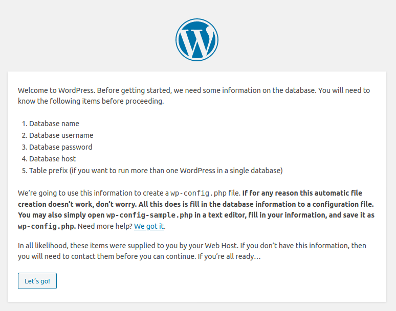
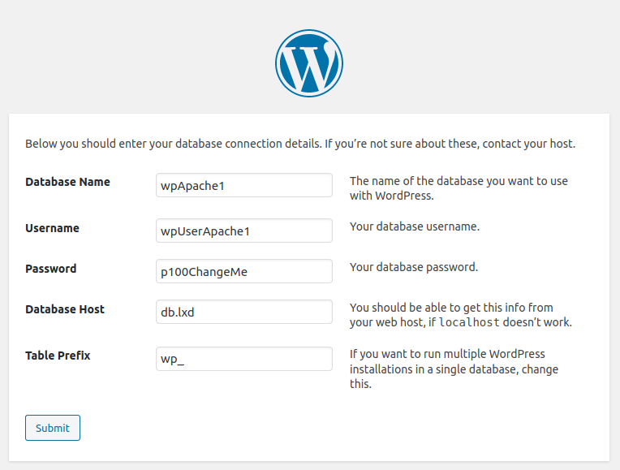
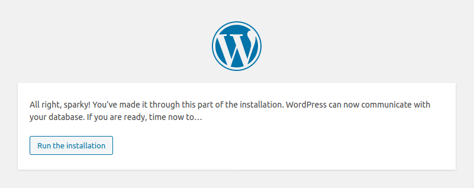
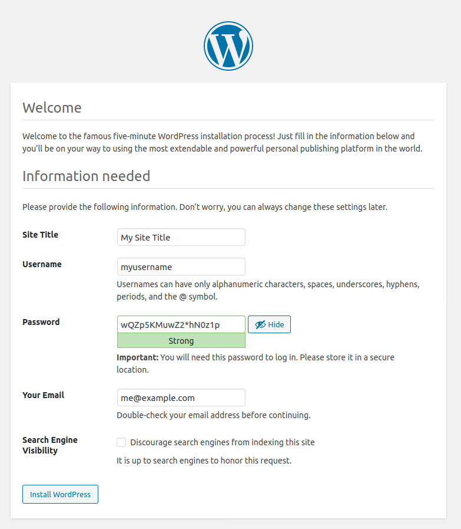

---
author:
  name: Linode
  email: docs@linode.com
description: 'This guide explains how to add many WordPress websites to a LXD setup that already has configured a reverse proxy. In doing so, it adds a container with MySQL as the database for WordPress.'
keywords: ["container", "lxd", "lxc", "apache", "nginx", "reverse proxy", "virtual machine", "virtualization", "letsencrypt", "nginx", "apache2"]
license: '[CC BY-ND 4.0](https://creativecommons.org/licenses/by-nd/4.0)'
published: 2020-06-30
modified_by:
  name: Linode
title: "Set Up WordPress in an LXD Container"
contributor:
  name: Simos Xenitellis
  link: https://blog.simos.info/
external_resources:
  - '[LXD Introduction](https://linuxcontainers.org/lxd/)'
  - '[LXD support community](https://discuss.linuxcontainers.org/)'
  - '[Try LXD Online](https://linuxcontainers.org/lxd/try-it/)'
  - '[NGINX Web Server](https://docs.nginx.com/nginx/admin-guide/web-server/)'
  - '[NGINX Reverse Proxy Settings](https://docs.nginx.com/nginx/admin-guide/web-server/reverse-proxy/)'
  - '[Proxy Protocol](https://www.haproxy.com/blog/haproxy/proxy-protocol/)'
  - '[WordPress](https://wordpress.org/)'
  - '[WordPress Administration Over SSL](https://wordpress.org/support/article/administration-over-ssl/)'
---

## Introduction

[LXD](https://linuxcontainers.org/lxd/) (pronounced "Lex-Dee") is a system container manager build on top of Linux Containers (LXC), and is supported by [Canonical](https://canonical.com). The goal of LXD is to provide an experience similar to a virtual machine but through containerization rather than hardware virtualization.

WordPress is the most popular content management system and is used by over 35% of all websites. It is common to install WordPress in a virtual machine (VM) as a way to separate multiple installations from each other. However, within a VM we can further install multiple WordPress instances, each in its own LXD system container. In this guide, we install WordPress in LXD system containers, thus achieving greater density and maintaining good isolation between each WordPress installation.

This guide explains how to setup WordPress in LXD system containers in order to host multiple and separate WordPress websites, each in their own system container. We demonstrate the WordPress installation on both NGINX and Apache web servers, relying on NGINX as the reverse proxy. A SQL database is configured in a separate system container.

Please refer to the following diagram to understand the WordPress setup created in this guide. TODO-ADD-DIAGRAM

In this guide you will:

- [Create and set up the database container](/docs/applications/containers/beginners-guide-to-lxd-wordpress/#creating-and-setting-up-the-database-container).

- [Configure the database for each new WordPress installation](/docs/applications/containers/beginners-guide-to-lxd-wordpress/#configuring-the-database-for-a-new-wordpress-installation).

- [Set up WordPress in its web server container, for both Apache and NGINX](/docs/applications/containers/beginners-guide-to-lxd-wordpress/#setting-up-wordpress-in-the-web-server).

- [Complete the setup using the WordPress installation wizard](/docs/applications/containers/beginners-guide-to-lxd-wordpress/#completing-the-setup-using-the-wordpress-installation-wizard).

- [Troubleshooting common errors](/docs/applications/containers/beginners-guide-to-lxd-wordpress/#troubleshooting).


For simplicity, the term *container* is used throughout this guide to describe the LXD system containers.


### Before You Begin

1.  Complete [A Beginner's Guide to LXD: Setting Up an Apache Web Server In a Container](/docs/applications/containers/beginners-guide-to-lxd/). The guide instructs you to create a container called `web` with the Apache web server for testing purposes. Remove this container by running the following commands.

        lxc stop web
        lxc delete web

    
For this guide LXD version 3.3 or later is needed. Check the version with the following command:

    lxd --version

If the version is not 3.3 or later, update to the latest version by installing the snap package as instructed in [A Beginner's Guide to LXD: Setting Up an Apache Webserver In a Container](/docs/applications/containers/beginners-guide-to-lxd/) and use the following command:

    sudo lxd.migrate


1. This guide will use the hostnames `apache1.example.com` and `nginx1.example.com` for the two example WordPress websites. Replace these names with hostnames you own and setup their DNS entries to point them to the IP address of the server you created. For help with DNS see our [DNS Manager Guide](/docs/platform/manager/dns-manager/).

1. Complete [Set Up a Reverse Proxy in an LXD Container to Host Multiple Websites](/docs/applications/containers/beginners-guide-to-lxd-reverse-proxy/). The guide instructs you to create a reverse proxy in a `proxy` container, and two websites, `apache1` and `nginx1` running the Apache2 Web server and NGINX respectively. Then, it sets up Let's Encrypt TLS certificates for both websites. You will be using these two websites to install WordPress. Therefore, keep the two containers and the reverse proxy container after you complete the guide.

## Creating and setting up the database container

WordPress requires a SQL database server such as _MySQL_ or _MariaDB_. We create a container called `db` and install the SQL server. This SQL server installation will be used by all WordPress installations. Each WordPress installation will have its own SQL database on the SQL server and separate account credentials for their corresponding database.

1.  Create a container called `db`.

        lxc launch ubuntu:18.04 db

1.  Start a shell in the `db` container.

        lxc exec db -- sudo --user ubuntu --login

1.  Update the package list in the `db` container.

        sudo apt update

1.  Install the package `mysql-server` in the container.

        sudo apt install -y mysql-server

    
If you prefer to use _MariaDB_, replace `mysql-server` with `mariadb-server`.


1.  By default, the `mysql-server` service is listening to the _loopback_ network interface. We change the settings so that it listens to all network interfaces, therefore it is accessible by other containers.  Edit the file `/etc/mysql/mysql.conf.d/mysqld.cnf` and change the `bind-address` field to the value `0.0.0.0`.

    
# Instead of skip-networking the default is now to listen only on
# localhost which is more compatible and is not less secure.
bind-address            = 0.0.0.0


    
The containers reside on a NAT network inside the VM, therefore they do not get public IP addresses and they are not accessible from the Internet. The SQL server is only accessible to other containers and the host.


1.  Restart the database in order to enable the new configuration.

        sudo systemctl restart mysql.service

1.  Log out from the container.

        logout

You have created and set up the database container. In the following section, you will configure the database for each WordPress installation.

### Configuring the database for a new WordPress installation

For each new WordPress installation, we create an empty database and assign an account to access this database. We also specify which container IP address is allowed to connect to the corresponding database. To keep track of the details, we create a table for each database and corresponding WordPress installation. You will need this information below when you create the database, and also when you configure WordPress for the first time. Then, you can find this information in the `wp-config.php` configuration file in each WordPress installation.

| Database Name | WordPress container | Username      | Password     |
|---------------|---------------------|---------------|--------------|
| wpApache1     | apache1.lxd         | wpUserApache1 | p100ChangeMe |
| wpNginx1      | nginx1.lxd          | wpUserNginx1  | p100ChangeMe |


You may also use arbitrary names for the database name and the username. Make sure you have listed the correct container name. Finally, change the password.


1.  Start a shell in the `db` container.

        lxc exec db -- sudo --user ubuntu --login

1.  Run the `mysql` client as root.

        sudo mysql

1.  Create the database for the Apache Webserver, then create the account and grant access at the same time.

        CREATE DATABASE wpApache1;
        GRANT ALL PRIVILEGES ON wpApache1.* to "wpUserApache1"@"apache1.lxd" IDENTIFIED BY "p100ChangeMe";

1.  Create the database for the NGINX Web server, then create the account and grant access at the same time.

        CREATE DATABASE wpNginx1;
        GRANT ALL PRIVILEGES ON wpNginx1.* to "wpUserNginx1"@"nginx1.lxd" IDENTIFIED BY "p100ChangeMe";

1.  Finally, flush the privileges in order to reload the privileges from the grant tables in the *mysql* system database.

        FLUSH PRIVILEGES;
        EXIT

1. Log out back to the host.

        logout

You have created the databases for the two WordPress installation. The WordPress installer is able to use them to complete the WordPress installation in a subsequent section.

## Setting up WordPress in the web server

Follow the setup tasks for each web server.

### Setting up WordPress for the Apache web server

In this section you will setup WordPress for the container `apache1`. You will download the latest version of WordPress and extract the archive at the appropriate location. You will then enable PHP support for the Apache web server. Finally, at the end of this section, the container will be in a state that you can then use your browser to complete the installation of WordPress.

1.  Start a shell in the `apache1` container.

        lxc exec apache1 -- sudo --user ubuntu --login

1.  Download and extract the latest version of WordPress. Set up the file permissions so that WordPress can perform updates. Remove the old Apache sample `index.html` file.

        wget https://wordpress.org/latest.tar.gz --directory-prefix=/tmp/
        sudo tar xvfa /tmp/latest.tar.gz -C /var/www/html/ --strip-components=1
        sudo chown -R www-data:www-data /var/www/html/
        sudo rm /var/www/html/index.html

1.  Install the PHP module for the Apache web server.

        sudo apt install -y libapache2-mod-php php-mysql

1.  Install PHP modules that are recommended or required by WordPress.

        sudo apt install -y php-mbstring php-gd php-imagick php-xml php-curl php-zip

    
WordPress has a built-in _Site Health_ feature that checks for a small list of required and optional PHP modules. By installing the above PHP modules, your WordPress installation will pass the check for required and optional modules.


1.  Restart the Apache Web server in order to refresh the list of PHP modules.

        sudo systemctl restart apache2.service

1.  Edit the source code of WordPress, file `wp-admin/setup-config.php` so that it works behind a TLS Termination Proxy. Add the following code snippet before line 20.

    
/**
 * Detect whether we are running behind a TLS Termination Proxy.
 */
if ( $_SERVER['HTTP_X_FORWARDED_PROTO'] == 'https' ) {
        $_SERVER['HTTPS']='on';
}


1.  Edit the source code of WordPress, the file `/var/www/html/wp-config-sample.php` so that it works behind a TLS Termination Proxy. Add the snippet before line 82.

    
Once the WordPress setup wizard completes the configuration, it adapts the content of the sample file with the new user configuration. By adding the code in the sample file, we are certain that the handover from the wizard page to the WordPress administration page is uninterrupted. The problem that we solve, is that of _mixed content_, where WordPress would be serving some content with `http` URLs and modern Web browsers refuse to display such content if the website URL is `https`. At the moment, WordPress does not automatically detect if it is running behind a TLS Termination Proxy and cannot avoid the a case of mixed content.


    
/**
 * Detect whether we are running behind a TLS Termination Proxy.
 */
if ( $_SERVER['HTTP_X_FORWARDED_PROTO'] == 'https' ) {
        $_SERVER['HTTPS']='on';
}


1.  Log out from the container.

         logout

You have set up the server with the Apache2 server for WordPress. The next step below is to run the WordPress installation wizard through the Web browser.

### Setting up WordPress for the NGINX web server

In this section you will setup WordPress for the container `nginx1`. You will download the latest version of WordPress and extract the archive at the appropriate location, in `/var/www/html/`. You will then enable PHP support for the NGINX web server. Finally, at the end of this section, the container will be in a state that you can then use your browser to complete the installation of WordPress.

1.  Start a shell in the `nginx1` container.

        lxc exec nginx1 -- sudo --user ubuntu --login

1.  Download and extract the latest version of WordPress. Place in the appropriate location at `/var/www/html/`. Set up the file permissions so that WordPress can perform updates. Remove the sample `/var/www/html/index.nginx-debian.html` file that comes from the `nginx` package.

        wget https://wordpress.org/latest.tar.gz --directory-prefix=/tmp/
        sudo tar xvfa /tmp/latest.tar.gz -C /var/www/html/ --strip-components=1
        sudo chown -R www-data:www-data /var/www/html/
        sudo rm /var/www/html/index.nginx-debian.html

1.  Install the necessary PHP support for the NGINX web server.

        sudo apt install -y php-fpm php-mysql

1.  Install PHP modules that are recommended by WordPress.

        sudo apt install -y php-curl php-dom php-mbstring php-gd php-imagick php-xml php-zip

    
WordPress has a built-in _Site Health_ feature that checks for a small list of required and optional PHP modules. By installing the above PHP modules, your WordPress installation will pass the check for required and optional modules.


1.  Enable PHP in the Web server configuration. Replace the content of the default file with the content below. Compared to the default configuration, we have removed some comments for legibility, set in the `index` keyword to accept `index.php`, and uncommented the section `location ~ .\php$` that enables PHP in nginx.

    
# Default server configuration
#
server {
        listen 80 default_server;
        listen [::]:80 default_server;

        root /var/www/html;

        # Add index.php to the list if you are using PHP
        index index.php;

        server_name _;

        location / {
                # First attempt to serve request as file, then
                # as directory, then fall back to displaying a 404.
                try_files $uri $uri/ =404;
        }

        # pass PHP scripts to FastCGI server
        #
        location ~ \.php$ {
                include snippets/fastcgi-php.conf;
                #
                # With php-fpm (or other unix sockets):
                fastcgi_pass unix:/var/run/php/php7.2-fpm.sock;
        }
}


1.  Edit the source code of WordPress, file `/var/www/html/wp-admin/setup-config.php` so that it works behind a TLS Termination Proxy. Add the following snippet after line 20.

    
/**
 * Detect whether we are running behind a TLS Termination Proxy.
 */
if ( $_SERVER['HTTP_X_FORWARDED_PROTO'] == 'https' ) {
        $_SERVER['HTTPS']='on';
}


1.  Edit the source code of WordPress, the file `/var/www/html/wp-config-sample.php` so that it works behind a TLS Termination Proxy. Add the snippet before line 82.

    
Once the WordPress setup wizard completes the configuration, it adapts the content of the sample file with the new user configuration. By adding the code in the sample file, we are certain that the handover from the wizard page to the WordPress administration page is uninterrupted. The problem that we solve, is that of _mixed content_, where WordPress would be serving some content with `http` URLs and modern Web browsers refuse to display such content if the website URL is `https`. At the moment, WordPress does not automatically detect if it is running behind a TLS Termination Proxy and cannot avoid the a case of mixed content.


    
/**
 * Detect whether we are running behind a TLS Termination Proxy.
 */
if ( $_SERVER['HTTP_X_FORWARDED_PROTO'] == 'https' ) {
        $_SERVER['HTTPS']='on';
}


1.  Log out from the container.

         logout

You have set up the server with the NGINX server for WordPress. The next step below is to run the WordPress installation wizard through the Web browser.

## Completing the setup using the WordPress installation wizard

For convenience, we add here in a table the database information that will be asked during the installation wizard. For each website, we specify the database name, the username and password, the common database host `db.lxd`, and the table prefix.

| Website | Database Name | Username      | Password     | Database Host | Table Prefix |
|---------|---------------|---------------|--------------|---------------|--------------|
| https://apache1.example.com | wpApache1     | wpUserApache1 | p100ChangeMe | db.lxd        | wp_          |
| https://nginx1.example.com  | wpNginx1      | wpUserNginx1  | p100ChangeMe | db.lxd        | wp_          |

Now visit the URL of each WordPress website in order to run the WordPress installation wizard. In our case, we are visiting the URLs `https://apache1.example.com` and `https://nginx1.example.com`. Perform the following for each website.

1. WordPress asks us to select the language of the interface. Select your language and click _Continue_.

    

2. WordPress advises us how to add the database information. Click on _Let's go!_.

    

3. WordPress asks us for the database connection details. Consult the table above and fill in the information. Then, click on _Submit_.

    

1.  Click the button _Run the installation_.

    

1. Finally, you are presented with the main WordPress configuration, including the creation of your WordPress administrative account.  You are asked for a Site Title, which can be changed later. Then, you are asked for the username and password details of your first account, an administrative account, on your WordPress website. Make sure you keep a note of this information. Subsequently, add your email address and select whether you want to make your WordPress website immediately accessible to search engines. Finally, click on _Install WordPress_.

   
Your WordPress installation will not likely be able to send emails, such as an email to reset your forgotten password. You would need to use an appropriate plugin in WordPress before you are able to receive emails to reset your password and general email notifications. Therefore, make sure you keep a copy of the username and password that you are putting here.


   
You may select to discourage for now the search engines from indexing your new site, until you add more content. You can then allow search engines to index your site from within the WordPress administrative page, at _Settings_, then _Reading_.


    

At the end of this series of steps, you will be asked to log in into your WordPress instance using the username and password that you set earlier.

## Conclusion

You have installed WordPress in both an Apache2 Web server and the NGINX Web server. You can repeat this process to add more WordPress instances. The default network configuration allows for about 250 WordPress websites. The first limit that you may encounter, though, is that of the host's memory. Each Ubuntu Web server container consumes about 160MB RAM when idle, and 300MB at peak. Therefore, in a server of 2GB RAM you may fit up to ten low-traffic WordPress installations.

## Troubleshooting

### The website is missing images

When you setup WordPress, you may notice that the images and other content like stylesheets are not loading. This may happen because the WordPress websites are behind a TLS Termination Proxy. Between the TLS Termination Proxy and your website, the protocol is _http_ instead of _https_. Currently, the WordPress software does not pick up the hint that it is running behind a TLS Termination Proxy, and is serving back resources such as images, stylesheets, JavaScript files using _http_. From the point of view of a Web browser, this is _mixed content_ (an _https_ URL and resources through _http_ URLs), and does not load those _http_ URLs. If you are encountering this issue, then make sure that you followed the instructions in this guide to edit the files `wp-config-sample.php` and `setup-config.php`.

### A WordPress plugin requires an additional PHP module

You may encounter a plugin that requires an additional PHP module. We have installed already the set of required and recommended PHP modules. You may repeat the process if there is need to install a specific new plugin.

### The WordPress Site Health reports that we are running an old version of PHP

In this series of guides we have installed Ubuntu 18.04 LTS in the containers. This version of Ubuntu has PHP 7.2, which is nevertheless still supported and will be supported until at least the year 2023. Each container and the host by default receive automatically any security updates through the `unattended-upgrades` package. Therefore, this warning may be ignored.

### How much memory does my container use?

If your container is `nginx1`, then run the following command to view the current memory usage and also the peak memory usage.

       lxc info nginx1

The output should be similar the following. The current memory use in this example is 164MB while the peak memory use was a bit over 300MB.


Resources:
  Processes: 30
  Disk usage:
    root: 219.76MB
  CPU usage:
    CPU usage (in seconds): 245
  Memory usage:
    Memory (current): 164.38MB
    Memory (peak): 305.23MB


## Next Steps

You have setup a reverse proxy and added WordPress installations with either Apache or the NGINX Web servers. You could also use other Web servers such as lighttpd and Caddy. Apart from WordPress installations, you can additionally install many other services, such as a mail service.
