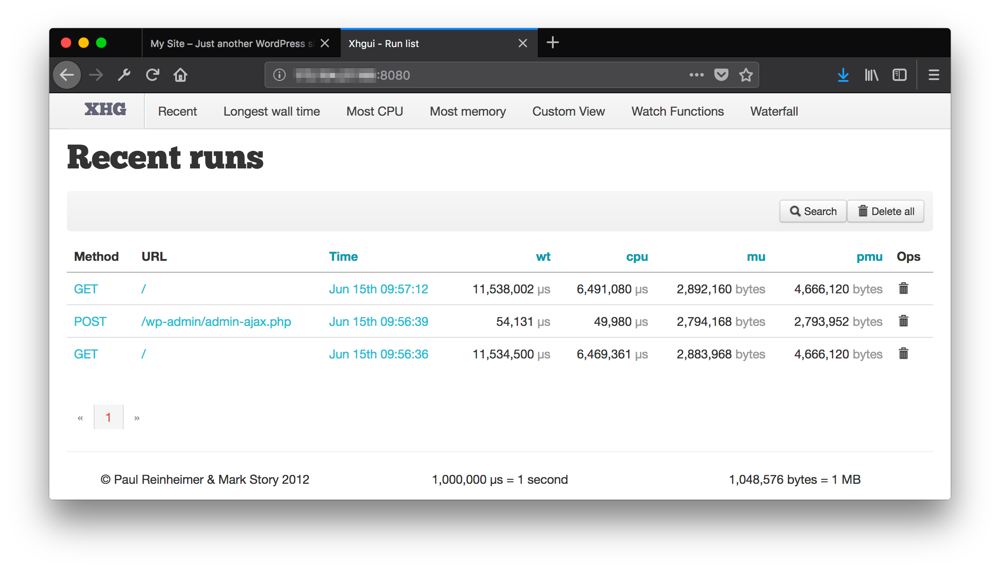
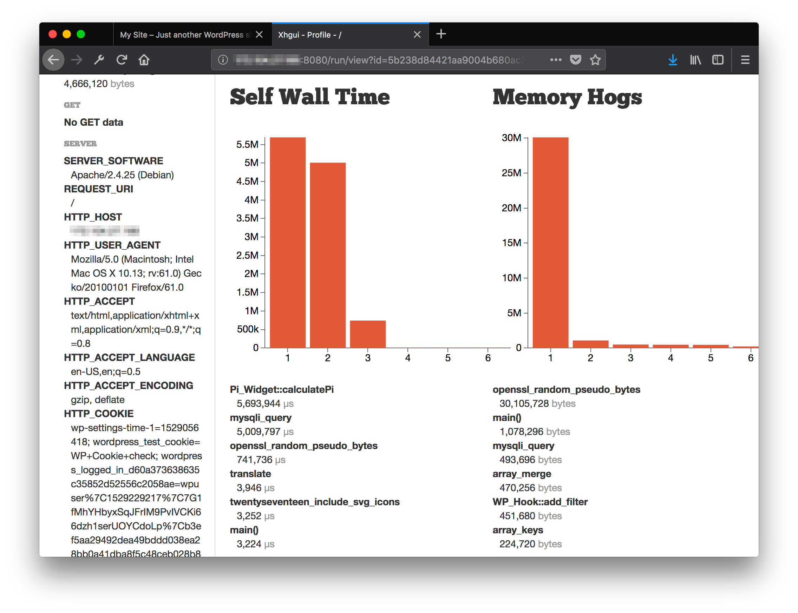
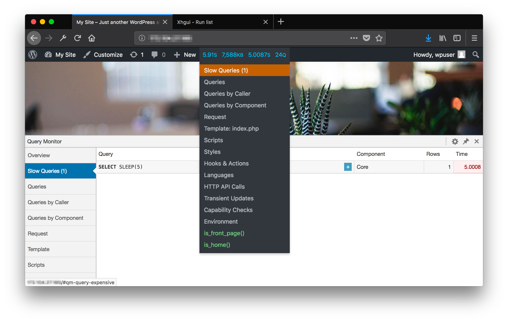
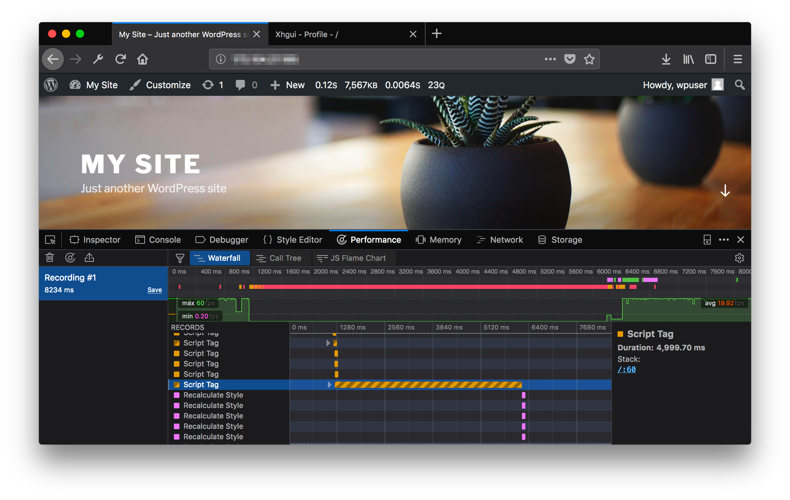
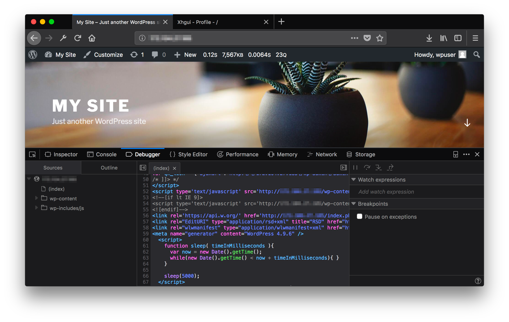

## Goals For This Guide

This guide outlines two primary steps to lowering the response time of a WordPress website:

- Analyze and identify performance bottlenecks.

- Implement best practices for site optimization.

### How This Guide is Structured

This guide provides a testing environment which will be used to illustrate the process of optimizing WordPress. The environment has two components:

-  A Docker Compose file is provided which sets up a WordPress installation. This installation is intentionally pre-configured with poorly performing customizations. When the site is initially loaded in a web browser, it will take upwards of 15-20 seconds to appear.

    This test environment was designed to highlight the kinds of performance bottlenecks that can appear in some plugins or themes: high CPU usage, high memory usage, slow SQL queries, and slow JavaScript. This guide will focus on troubleshooting the test site by removing those customizations until the response time for requests is minimized.

    The Docker Compose file also installs a PHP profiling tool which collects performance data for each request to the website. This data is pushed to a Mongo database that the second Docker Compose file provisions.

-  A second Docker Compose file is responsible for the Mongo database that collects profiling data from the site. This second Compose file also runs a visualization app for viewing that profiling data. This tool will be used to identify the slow customizations that were installed.

These two Compose files are decoupled. This decoupling allows you to separately install the second Compose file on a server running your own WordPress site instead of the test site after you finish reading the guide.

## Setting Up the Test Environment

You can use this guide without installing the environment, but working through the steps presented may help you better understand the process. If you would prefer to not perform this work, skip to the [Profiling the Application](#profiling-the-application) section.

To install the test environment, you will need a Linode which does not have any running processes already bound to ports `80`, `8080`, `3306`, and `27017`.

### Install Docker



### Install Docker Compose



### Download the Test Environment

Run these commands from your Linode:

1.  Download the test environment Tar file:

        wget https://raw.githubusercontent.com/linode/docs-scripts/master/hosted_scripts/how-to-speed-up-a-wordpress-website/speed-up-wp-test-env.tar

2.  Unpack the file:

        tar -xvf speed-up-wp-test-env.tar

### Start the WordPress Test Site

1.  Change to the directory containing the Compose file:

        cd speed-up-wp-test-env/xhprof_host_net_wordpress/

2.  Run the Compose file in a detached state:

        docker-compose up -d

3.  Verify that you can view the site by loading `http://<your-Linode-IP-address>` in a web browser. This should take 15-20 seconds to load.

4.  Open a Bash shell on the WordPress Docker container:

        docker exec -it xhprof_host_net_wordpress_wordpress_1 bash

5.  Set the password for the WordPress admin user via the WordPress CLI:

        wp --path='/var/www/html' --allow-root user update wpuser --user_pass='your_new_wordpress_login_password'

6.  Verify that you can login to the WordPress admin site at `http://<your-Linode-IP-address>/wp-admin` with the password you've set. Enter `wpuser` for the admin user name.

7.  Exit the Bash shell in the WordPress container:

        exit

### Start the PHP Profile Visualization Application

1.  Change to the directory containing the Compose file:

        cd ../xhgui_app/

2.  Run the Compose file in a detached state:

        docker-compose up -d

3.  Verify that you can view the visualization app by loading `http://<your-Linode-IP-address>:8080` in a web browser:

    

## Profiling the Application

The profiling visualization app used in this guide is named [XHGUI](https://github.com/perftools/xhgui). This app provides bar charts, line plots, flamegraphs, and other representations of the raw profiling data collected for the test WordPress site.

The profiling data is collected by a tool called [XHProf](http://pecl.php.net/package/xhprof). The original XHProf distribution does not support PHP 7 (which the test WordPress site runs on), so this guide uses a PHP 7-compatible fork of XHProf called [Tideways](https://github.com/tideways/php-xhprof-extension). The data generated by Tideways will be stored in a Mongo database, and XHGUI will read from this database.

### Test Response Time

Run this `curl` command from your home computer to test the site speed prior to troubleshooting:

    time curl http://<your-Linode-IP-address> -s 1>/dev/null


12.79 real
0.01 user
0.02 sys


The time displayed can vary between requests. If you do not have `curl` installed on your computer, you can use an in-browser speed test like [Google PageSpeed Insights](https://developers.google.com/speed/pagespeed/insights/).

### View the Profiling Data

1.  Visit XHGUI in your browser on port `8080`: `http://<your-Linode-IP-address>:8080`. A page which lists entries for your recent requests should appear:

    

2.  Click the timestamp link for the most recent `GET` request on `/`. A page will appear which shows detailed information for that request, including bar charts of the highest CPU usage (referred to as Wall Time) and memory usage ordered by function. This page also has links to other useful visualizations for the request, like the Flamegraph:

    

### Investigate CPU Usage: Pi_Widget::calculatePi

Under the bar chart for CPU usage, the first item listed is labeled `Pi_Widget::calculatePi`. This function had a wall time of `5,693,944 µs`, or about 5.7 seconds. To find the code responsible for this function call, execute these commands from the Linode:

1.  Open a Bash shell on the WordPress Docker container:

        docker exec -it xhprof_host_net_wordpress_wordpress_1 bash

2.  From the document root of the container, search for the function name:

        root@localhost:/var/www/html# grep -R calculatePi .

    
./wp-content/plugins/pi_widget/pi_widget.php:		public function calculatePi() {
./wp-content/plugins/pi_widget/pi_widget.php:			echo $this->calculatePi();


    We can see that a plugin (named Pi Widget) is responsible for this call, though we may have guessed that from the XHGUI view. Further examination of the plugin shows that it calculates a value for Pi using 100 billion iterations of an approximation algorithm.

3.  Deactivate this plugin from the Plugins section of your site's WordPress admin page.

4.  Re-test the site response time from your home computer:

        time curl http://<your-Linode-IP-address> -s 1>/dev/null

    
5.96 real
0.01 user
0.02 sys


### Investigate CPU Usage: mysqli_query

The next highest CPU usage function call displayed by XHGUI was labeled `mysqli_query`. This is the PHP-MySQL interface that WordPress uses to run database queries.

This name is too generic for us to search the WordPress code base for the cause of the query. To continue troubleshooting:

1.  Install the *Query Monitor* WordPress plugin, which will show the individual queries that WordPress runs. Go to the Plugins section of your site's WordPress admin page, click the `Add New` button at the top, and then search for `Query Monitor`. Be sure to activate the plugin once you install it.

2.  Re-load the WordPress site in your browser. In the admin menu bar at the top you will see an orange-highlighted collection of site statistics. Hovering over this highlight will show a drop-down menu, and clicking on the Slow Queries option will bring up a list of slow queries:

    

    The slow query that was found is the following statement: `SELECT SLEEP(5)`. This simply sleeps the database for 5 seconds without taking any other action.

3.  The Queries by Component section of Query Monitor will sometimes show the name of a plugin that was responsible for the query. That is not the case for this query, so you will search the code base for where it appears. Run this command from the Bash shell you already opened on the WordPress Docker container:

        root@localhost:/var/www/html# grep -R 'SELECT SLEEP' .

    
./wp-content/plugins/slow_query_test/slow_query_test.php:      $wpdb->query($wpdb->prepare ( "SELECT SLEEP(%d)", array(5) ));


4.  This reveals that the Slow Query Test plugin is responsible. Deactivate this plugin from the WordPress admin page.

5.  Re-test the site response time from your home computer:

        time curl http://<your-Linode-IP-address> -s 1>/dev/null

    
0.96 real
0.00 user
0.02 sys


### Investigate Memory Usage: openssl_random_pseudo_bytes

XHGUI showed that a function named openssl_random_pseudo_bytes was responsible for allocating 30 MB of memory. Searching the code base reveals that the High Memory Test plugin is responsible:

    root@localhost:/var/www/html# grep -R openssl_random_pseudo_bytes .


./wp-content/plugins/high_memory_test/high_memory_test.php:		$data = openssl_random_pseudo_bytes(1000000);
./wp-includes/random_compat/random_bytes_openssl.php: * Since openssl_random_pseudo_bytes() uses openssl's
./wp-includes/random_compat/random_bytes_openssl.php:    $buf = openssl_random_pseudo_bytes($bytes, $secure);
./wp-includes/random_compat/random_bytes_com_dotnet.php: * openssl_random_pseudo_bytes() available, so let's use
./wp-includes/random_compat/random.php:         *   5. openssl_random_pseudo_bytes() (absolute last resort)
./wp-includes/random_compat/random.php:         * openssl_random_pseudo_bytes()


Other files in the `wp-includes` folder call this function, but they are part of the WordPress core. Deactivate the High Memory Test plugin and then re-test speed:

    time curl http://<your-Linode-IP-address> -s 1>/dev/null


0.20 real
0.00 user
0.02 sys


### Investigate Slow Loading Time: Render-Blocking JavaScript

The load time reported by cURL is now low, but if you load the page in a web browser, it can still take 5 seconds to show content. Because of this, we can deduce that the slowness is likely the result of a client-side bottleneck. We will use the developer tools of the [Firefox Developer Edition](https://www.mozilla.org/en-US/firefox/developer/) browser to investigate this:

1.  Visit the WordPress site in Firefox and then open the [Performance](https://developer.mozilla.org/en-US/docs/Tools/Performance) tab of the developer tools.

2.  Click the *Start Recording Performance* button and then reload the page in the browser.

3.  When the page has finished loading, click the *Stop Recording Performance* button.

4.  A waterfall graph will appear, and each row in it represents a browser rendering event. Scroll down in this graph until you see the following longer event, and then click on that event:

    

5.  In the panel that appears on the right side, click on the numbered blue link. A view of the HTML document tree will appear and will highlight the responsible script. The responsible script is a sleep function:

    

6.  In the Bash shell on your WordPress Docker container, search for this code:

        root@localhost:/var/www/html# grep -R 'function sleep( timeInMilliseconds ){' .

    
./wp-content/plugins/blocking_js_test/blocking_js_test.php:		function sleep( timeInMilliseconds ){


7.  The Blocking JS Test plugin is responsible for this code. Deactivate this plugin. The page should now load in less than a second in the browser.

### A Note About Plugins and Themes

The slow code examples used all correlated with specific plugins, and the solution was to deactivate them. If you need the functionality of a plugin but it is slow to load, try searching for other plugins that do the same thing and test them to see if they are more efficient.

Slow code can also be found in WordPress themes, and so if you can't find bottlenecks in your plugins, it's also a good idea to try different themes.

## Best Practices

In addition to identifying bottlenecks in your code, you can implement general best practices for speeding up your site. Many of these practices can be easily set up by publicly-available WordPress plugins.

### Asset Optimization

High-resolution images can slow down the speed of a site. Reduce the resolution of your images and optimize them for the web. Plugins like [WP Smush](https://wordpress.org/plugins/wp-smushit/) can handle this task.

Minify CSS and JavaScript loaded by your site. Minification is the process of compressing code so that it is harder for a human to read, but faster for a computer to process. Scripts are often distributed in minified and non-minified versions, so you can look up the minified style for each of your scripts and upload them to your server. Some WordPress plugins can also automatically minify your scripts.

### Browser Caching

By default, all page assets (images, scripts, styles) are downloaded from your site's web server each time a user visits it, even if they have recently visited it and already downloaded those items. Your web server can be set to flag assets so that the browser instead caches those items on disk. The [mod_expires](http://httpd.apache.org/docs/current/mod/mod_expires.html) module controls this behavior for Apache.

### Web Server File Compression

Your web server can be configured to compress files on the server before they are sent to your web browser, reducing download sizes:

- [Apache mod_deflate](https://httpd.apache.org/docs/2.4/mod/mod_deflate.html)

- [NGINX Compression and Decompression](https://docs.nginx.com/nginx/admin-guide/web-server/compression/)

### WordPress Caching Plugins

When you visit a WordPress page, the page is dynamically generated on each request by PHP and your database process. This is more taxing on your server than serving a static HTML page. WordPress caching plugins pre-compile your pages into static downloads. Two example plugins that do this are [WP Rocket](https://wp-rocket.me/) and [W3 Total Cache](https://wordpress.org/plugins/w3-total-cache/). Some of these plugins also bundle in other best practices.

### Web Server and Database Tuning

After you fix code performance bottlenecks and install other best practice measures, you can fine-tune the basic settings for your web server and database. This involves estimating the average memory and CPU usage of a request, comparing it with the total level of resources for your server, and then adjusting your software configuration to make the most of those resources. Linode has guides on optimizing Apache and MySQL:

- [Tuning Your Apache Server](/docs/guides/tuning-your-apache-server/)

- [How to Optimize MySQL Performance Using MySQLTuner](/docs/guides/how-to-optimize-mysql-performance-using-mysqltuner/)

## Optional: Profile Your Own WordPress Site

You can reuse the XHGUI Docker Compose file provided by this guide to profile your own WordPress site. There are two halves to setting this up:

1.  Run the provided XHGUI Docker Compose file to store and view profiling data from your WordPress site.

2.  Insert the XHProf code into your WordPress app so that the data is actually generated on each request.

Perform the steps in the Setting Up the Test Environment section, and stop after you [Download the Test Environment](#download-the-test-environment).

### Run the XHGUI app

1.  Change into the directory that corresponds with this Docker Compose file:

        cd speed-up-wp-test-env/xhgui_app/

2.  Start the app:

        docker-compose up -d

### Insert the XHProf code into your WordPress site

These instructions will only succeed if you are running PHP 7, and have `unzip` and the `php-dev` packages installed. For earlier versions of PHP, you will need to replace Tideways with the original distribution of XHProf.

These instructions walk through downloading the source code for XHGUI. This may seem strange, as the Docker Compose file is already responsible for running the XHGUI app. The reason the code is downloaded again is because XHGUI also provides helper tools for injecting the XHProf/Tideways profiling code into your app. Without these helper functions, you would need to manually add calls to XHProf/Tideways to your WordPress code, and also set up the connection to the Mongo database running inside Docker Compose.

1.  Install Tideways:

        wget -O tideways-xhprof.zip https://github.com/tideways/php-xhprof-extension/archive/master.zip
        unzip tideways-xhprof.zip
        cd php-xhprof-extension-master/
        phpize
        ./configure
        make
        sudo make install

2.  Add a line with the value `extension=tideways_xhprof.so` to your `php.ini` configuration file.

    
There may be multiple `php.ini` files in different locations, like `/etc/php/7.0/apache2/php.ini` and `/etc/php/7.0/cli/php.ini`. Add this value in each `php.ini` file both in this step and in Step 4 that follows.


3.  Install the MongoDB PHP Driver:

        sudo pecl install mongodb

4.  Add a line with the value `extension=mongodb.so` to your `php.ini` configuration file.

5. Download the source for XHGUI, install its dependencies (via the provided `install.php`), and copy the source to your document root. Replace instances of `/var/www/html` with the document root for your web server:

        wget -O xhgui.zip https://github.com/perftools/xhgui/archive/master.zip
        unzip xhgui.zip
        sudo cp -r xhgui-master /var/www/html/xhgui
        cd /var/www/html/xhgui/xhgui-master
        sudo chown www-data:www-data -R .
        sudo php install.php
        sudo cp config/config.default.php config/config.php

6.  Install XHGUI's helper injection function.

    **For Apache servers,** insert this line into your Virtual Host--remember to substitute in your document root-- and then reload Apache with `sudo systemctl reload apache2`:

        php_admin_value auto_prepend_file "/var/www/html/xhgui/external/header.php"

    This line will call XHGUI's `header.php` at the beginning of every PHP file that is served.

    **For NGINX,** add this line to your server block, then reload the configuration file with `sudo nginx -s reload`:

        fastcgi_param PHP_VALUE "auto_prepend_file=/var/www/html/xhgui/external/header.php";

7.  Configure which web requests are profiled by updating the `profiler.enable` function in `xhgui/config/config.php`. The default configuration will profile 1 in 100 requests:

        'profiler.enable' => function() {
            return rand(1, 100) === 42;
        }

    If you want to profile every request, change this to always return true:

        'profiler.enable' => function() {
            return true;
        }

8.  Your XHGUI app should now be collecting profiling data for requests on your site. The XHGUI app can be reached on port `8080` at your Linode's IP address.
