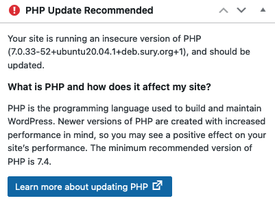

[WordPress](https://wordpress.org/) is one of the most popular free web publishing tools available. Authoring content on WordPress is straightforward, however,  you need to perform regular maintenance on your WordPress site to keep it secure and up to date. One of those maintenance tasks is to regularly update [PHP](https://www.php.net/), which WordPress uses as a server-side programming language. This guide explains how and when to upgrade PHP without adversely affecting your site.

## Why You Should Upgrade PHP for Applications Like WordPress

At regular intervals, a new version of the open-source PHP application is released. Older versions of the platform then, become obsolete. This means they are no longer updated and do not receive any further security patches. This allows vulnerabilities to accumulate and makes any site using an outdated version an easier target for intruders. Therefore, it is very important to use the minimum supported version of PHP and keep all PHP packages updated.

Some reasons to keep WordPress and PHP updated are listed below:

- An outdated PHP installation can cause security issues. These flaws might allow the site to be compromised.
- WordPress can have compatibility issues with older versions of PHP, especially after an update. Themes and plug-ins might not work with older versions.
- After PHP is updated, the site might run faster. Newer versions of PHP have performance improvements, and memory usage has also been improved.
- It often becomes more difficult to upgrade PHP if this task is left too long. Plug-ins and themes might not work properly afterward, which could require major rework.

Updating PHP is more complex than updating themes and plug-ins. PHP cannot be directly updated from the WordPress Dashboard. In addition, you should back up the site before upgrading PHP and, if necessary, restore it afterward.

Additional best practices for WordPress upgrades are listed below:

- Generate a routine or schedule for upgrades, including PHP upgrades.
- Update and upgrade the packages on the Linode regularly.
- Use strong passwords to access the WordPress Dashboard.
- Take regular backup copies of the site and its database.
- Regularly upgrade themes or plug-ins and keep all licenses.

## Before You Begin

1.  If you have not already done so, create a Linode account and Compute Instance. See our [Getting Started with Linode](/docs/guides/getting-started/) and [Creating a Compute Instance](/docs/guides/creating-a-compute-instance/) guides.

1.  Follow our [Setting Up and Securing a Compute Instance](/docs/guides/set-up-and-secure/) guide to update your system. You may also wish to set the timezone, configure your hostname, create a limited user account, and harden SSH access. **Do not** follow the *Configure a Firewall* section yet as this guide includes firewall rules specifically for an OpenVPN server.

1. A full LAMP stack must already be installed. See the [How to Install a LAMP Stack on Ubuntu 20.04](/docs/guides/how-to-install-a-lamp-stack-on-ubuntu-20-04/) guide for more details.

1. WordPress should already be installed. See the Linode guides on [Installing WordPress](/docs/guides/install-wordpress-ubuntu-18-04/) and [Deploying WordPress from Marketplace Apps](/docs/products/tools/marketplace/guides/wordpress/).


The steps in this guide are written for a non-root user. Commands that require elevated privileges are prefixed with `sudo`. If you are not familiar with the `sudo` command, see the [Linux Users and Groups](/docs/guides/linux-users-and-groups/) guide.


## How to Update PHP

PHP usually has to be upgraded in one of two situations; when WordPress is first installed, or when it is upgraded to a newer version. Currently, the minimum recommended version of PHP is 7.4, while the latest version of PHP is 8.0. This guide describes how to update PHP to version 7.4. These instructions are designed for Ubuntu users but are generally applicable to all Linux distributions.


Certain plug-ins or themes might not be compatible with the latest version of PHP. In this case, temporarily use an older version.


### How to Determine if PHP Should Be Updated

The easiest way to tell whether the current version of PHP does not meet the minimum requirements is to review the *WordPress Dashboard*. Your Dashboard can be found at `yourdomain.name/wp-admin/`. If PHP is out of date, a panel on the left-hand side of the Dashboard displays a "PHP Update Recommended" warning. It cautions that "Your site is running an insecure version of PHP" and encourages you to update it. The panel also displays the minimum recommended version of PHP. This is currently version 7.4. To suppress this warning, PHP must be updated to this version or a more recent one.


Third-party WordPress management panels can hide maintenance issues related to PHP and other components.


### How to Check Your Current Version of PHP

There are two ways to find out what version of PHP is currently installed.

1. Consult the WordPress Dashboard. If PHP is out of date, it displays the current version.
1. Verify the PHP version of PHP from the command line using the following command.

        sudo php -v
    
PHP 7.0.33-52+ubuntu20.04.1+deb.sury.org+1 (cli) (built: Jul  1 2021 16:04:17) ( NTS )
Copyright (c) 1997-2017 The PHP Group
    

### Prepare a Backup in WordPress

Although unlikely, the site or its contents could be corrupted during the update. You should always back up your site before upgrading PHP. There are two parts involved when backing up your site:

1. Back up the WordPress site and associated files.
1. Back up the WordPress database.

The WordPress site can be backed up externally using FTP or SCP. It can also be backed up in a different folder on the Linode. In the long run, it is much safer to back up the files and database to external storage space. This preserves the archive in the event the server hard drive becomes corrupted or access to the server is permanently lost. However, to quickly upgrade WordPress or PHP, a temporary backup copy can be made somewhere else on the Linode.


For a nominal fee, Linode can take a snapshot of your site through its [Backup Service](/docs/products/storage/backups/). A variety of third-party tools are also available. [cPanel](/docs/guides/use-cpanel-to-manage-domains-and-databases/) can be used to back up a site, but it has a licensing fee. A variety of third-party WordPress plug-ins are also available for this purpose.


To back up the WordPress files on the Linode, follow the below steps:

1. Create a directory in your home directory to store the WordPress archive.

        mkdir wpbackup
1. Locate the `public_html` folder containing the WordPress files and `cd` to this directory. In a standard Apache configuration, this folder is found in `/var/www/html/yourdomainname.com`.

        cd /var/www/html/yourdomainname.com
1. Copy the contents of the `public_html` directory to the `wpbackup` directory.

        sudo cp  public_html/ -r  ~/wpbackup

    
To back up files to another system, launch an FTP application from the other system and connect to Linode. Navigate to the `/var/www/html/yourdomainname.com` and copy over the entire contents of the `public_html` directory. For more information on using FTP, see our [Transfer Files with FileZilla](/docs/guides/filezilla/) guide.
    

There are several alternatives for backing up a WordPress database. The [phpMyAdmin](https://www.phpmyadmin.net/) application is a popular choice. Many plug-ins can also back up the database. However, the MySQL utility `mysqldump` works in all situations without any additional tools. Back up your WordPress database by following the below procedure.

1. Use the `mysqldump` command in the following format, `mysqldump -u username --databases database_name > /backup_file.sql`.

    The `username` is the name of the WordPress MySQL account, but a `root` account can also be used. WordPress prompts for a password if one is required. The `database_name` is the name of the WordPress database. This database was created when WordPress was first installed and is typically named `wordpress`. The `backup_file.sql` value indicates the full path of the directory where the backup should be saved.

        mysqldump -u username wordpress > /backup_file.sql

### Update PHP on Ubuntu 20.04

To use a newer version of PHP, all necessary PHP modules must be upgraded to the new version. The current minimum recommended version of PHP is 7.4. To upgrade PHP, follow the instructions below:

1. Install the basic version of PHP 7.4.

        sudo apt install php7.4

    
If the `php7.4` component cannot be found on the system, version 7.4 might still be the default version. To determine the default version of the `php` package, run the command `sudo apt list php`. If this displays a reference to version 7.4, run the command `sudo apt install php`. To install a different version of PHP, follow the instructions in the [How to Install a Specific Version of PHP](/docs/guides/how-to-update-php-for-wordpress/#how-to-install-a-specific-version-of-php) section.
    

1. Install the 7.4 version of the other PHP modules, along with the `libapache2-mod-php7.4` component. The following list includes the essential PHP libraries for WordPress.

        sudo apt install php7.4-common php7.4-mysql php7.4-cgi libapache2-mod-php7.4 php7.4-mbstring php7.4-curl php7.4-gd php7.4-xml php7.4-xmlrpc

    
If NGINX is used as the web server, the `php7.4-fpm` package must also be installed.
    

1. The `php-pear` module is also recommended with PHP 7.4.

        sudo apt install php-pear

1. Verify PHP has been upgraded to version 7.4.

        php -v

    
PHP 7.4.21 (cli) (built: Jul  1 2021 16:09:41) ( NTS )
Copyright (c) The PHP Group
    

1. Disable the older version of the `libapache2` module and enable the new one. The following command illustrates how to disable PHP 7.0 and enable version 7.4.

        sudo a2dismod php7.0
        sudo a2enmod php7.4

    
If NGINX is used as the web server, run the following commands instead:

    sudo systemctl start php7.4-fpm
    sudo systemctl enable php7.4-fpm

Also, change the `fastcgi_pass` value in `/etc/nginx/conf.d/yourdomain.com.conf` to `fastcgi_pass unix:/var/run/php/php7.4-fpm.sock;`.

Consult the Linode guide on [NGINX and PHP](/docs/guides/serve-php-php-fpm-and-nginx/) for more details.
    

1. Restart the Apache server to apply the changes.

        sudo systemctl restart apache2

1. Reload the WordPress Control Panel. The notification about the outdated PHP application should no longer be visible.

### How to Install a Specific Version of PHP

There could be occasions when a different version of PHP is required, for example, when compatibility with a theme must be maintained. To install a specific version of PHP, follow the instructions below.

Depending on the system, the necessary PHP packages might already be available. To determine whether this is the case, follow the steps in the following section.

1. To verify whether the package for PHP version x.y is already available, run the command `sudo apt list phpx.y`. If the command displays details about the package, then it can be immediately installed. Packages are available for all currently supported versions.

        sudo apt list php7.3
    
Listing... Done
php7.3/focal 7.3.29-1+ubuntu20.04.1+deb.sury.org+1 all
    
1. Install this version of PHP.

        sudo apt install php7.3
1. Update all other PHP packages to the same version at the same time. For example, `php7.3-mysql` and `libapache2-mod-php7.3` must also be installed. See the [Update PHP on Ubuntu 20.04](/docs/guides/how-to-update-php-for-wordpress/#update-php-on-ubuntu-2004) section for a complete list.

If the package is not available, it might be available via the `ondrej` *Personal Package Archive* (PPA), developed by Ondřej Surý. This archive provides access to the most recent versions of PHP. The same naming convention as above is used.

1. Add the `ondrej/php` repository using `apt`.

        sudo add-apt-repository ppa:ondrej/php
    
Co-installable PHP versions: PHP 5.6, PHP 7.x and most requested extensions are included. Only Supported Versions of PHP (<http://php.net/supported-versions.php>) for Supported Ubuntu Releases (<https://wiki.ubuntu.com/Releases>) are provided.
    
1. Add the corresponding `apache2` PPA.

        sudo add-apt-repository ppa:ondrej/apache2
1. Upgrade the packages.

        sudo apt-get update
1. Install the various PHP packages using the instructions in the previous section.

        sudo apt install php5.6

If more than one version is installed, set the default version of PHP using the `update-alternatives` command. The following command sets the default PHP version to 7.0.

    sudo update-alternatives --set php /usr/bin/php7.0

update-alternatives: using /usr/bin/php7.0 to provide /usr/bin/php (php) in manual mode


### How to Restore a Backup

The backup procedures are executed in reverse to restore the backup copy.


Do not add any content or make any changes to the site before restoring the original content. Any further changes are overwritten when the WordPress database is restored.


1. Before proceeding to restore the backups, inspect the site. If all the content is still available and the site is behaving normally, it might not be necessary to restore the archive. If any content appears to be missing, something does not look right, or to guarantee the site content has not changed, proceed with the next steps.
1. Copy the backup copy of the WordPress site from the temporary directory to `/var/www/html/yourdomainname.com/public_html`.

        cd ~/wpbackup
        sudo cp public_html/ -r /var/www/html/yourdomainname.com
1. Enter the MySQL database.

        sudo mysql -u root
1. The database must be empty before it can be restored, so it must be dropped and then re-created. In most cases, the WordPress database is named `wordpress`, but it might have been given another name at installation time. To list all of the MySQL databases, run the command `SHOW DATABASES;`.

        DROP DATABASE wordpress;
1. Re-create the database and grant privileges to the WordPress user. Replace `username` with the name of the actual WordPress user account.

        CREATE DATABASE wordpress;
        GRANT ALL PRIVILEGES ON wordpress.* TO 'username'@'localhost';
1. Exit the MySQL database, and restore the old database using the `mysql` command. Do not use `mysqldump` because this does not accurately re-create the database schema. Replace the `username` field with the actual name of the WordPress account and specify the path to the location of the `sql` database archive.

        mysql -u username -p wordpress < /pathto/filename.sql
1. Login back into the WordPress site and verify the content is present and the site behaves as expected. WordPress asks you for the username, password, and database name again. This is because the original `wordpress` table no longer exists and it must re-evaluate your credentials.
1. (**Optional**) You might want to take this opportunity to upgrade all themes and plug-ins and inspect the WordPress Dashboard for any further issues. It is also a good idea to remove any unused plug-ins.
