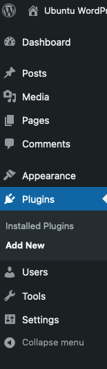
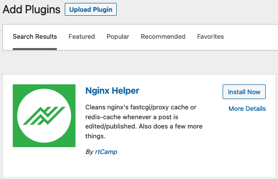
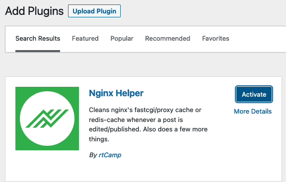
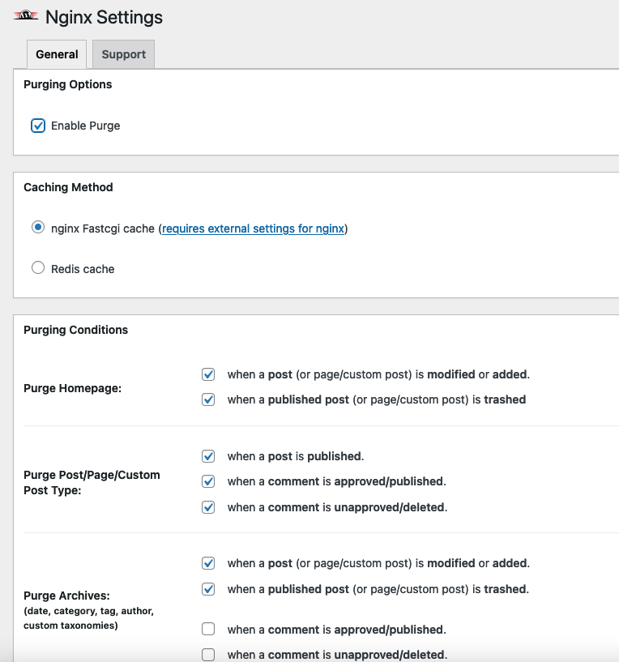

[NGINX](https://www.nginx.com/) typically fetches a new copy of a web page each time a new request is made. However for complex sites such as WordPress, each new request often involves querying a database and executing PHP code. For heavily used sites, this can cause performance issues and increased latency. As a workaround, NGINX offers the FastCGI page cache, allowing it to serve a static copy of the page more quickly. This guide explains how to enable caching for a WordPress site hosted on an NGINX web server. It also demonstrates how to configure non-cachable exceptions and how to test whether caching is working.

## How Does Caching Work on NGINX?

When NGINX receives a request for a WordPress file, it typically has to perform extra processing. The usual work flow for this type of request follows this process:

1.  NGINX receives a request for a WordPress page. It locates the page and determines if further processing is required.
2.  Most WordPress pages include PHP code, which the web server cannot directly interpret. To execute the PHP code, NGINX sends the page to the *PHP-FPM* (PHP FastCGI Process Manager) module. PHP-FPM is a popular and efficient implementation of the FastCGI protocol. FastCGI allows a web server to interactively interface with other programs.
3.  PHP-FPM interprets the PHP code. If necessary, it connects to a MySQL or MariaDB database and executes any SQL queries in the code.
4.  PHP-FPM converts the original page into a static HTML page and sends it back to NGINX.
5.  NGINX serves the static page to the original web client.

Unfortunately, this takes more time than serving a static HTML page. The PHP-FPM module must always parse the PHP code and there is often an additional delay to contact the database. For low-volume WordPress sites, this is typically not a problem. But for popular sites, these delays can result in serious performance bottlenecks and unacceptably high latency.

Caching is one way of speeding up execution and improving performance. When caching is enabled, NGINX stores the pages it receives from the PHP-FPM as static HTML web pages. The next time the page is requested, NGINX does not contact the PHP-FPM to generate a new version of the page. Instead, it retrieves the static HTML version of the page from cache and transmits it to the client. Because it is much faster to retrieve a static page from the NGINX cache, site performance usually improves.

As an additional bonus, NGINX can serve a cached version of the page even if the database or the PHP interpreter are not reachable. This optimization improves site reliability and robustness. The cached files typically expire after a certain length of time, so users do not continue to receive stale content. Extra configuration can also be added to allow certain pages to bypass the cache.

No additional components or applications are required to enable the NGINX cache. All cache directives are added to existing virtual host or NGINX configuration files. However, WordPress plugins can improve cache management, allowing the cache to be purged under certain circumstances, such as when a page is updated.

## Before You Begin

1.  If you have not already done so, create a Linode account and Compute Instance. See our [Getting Started with Linode](/docs/products/platform/get-started/) and [Creating a Compute Instance](/docs/products/compute/compute-instances/guides/create/) guides.

1.  Follow our [Setting Up and Securing a Compute Instance](/docs/products/compute/compute-instances/guides/set-up-and-secure/) guide to update your system. You may also wish to set the timezone, configure your hostname, create a limited user account, and harden SSH access.

1.  Configure a LEMP stack on the server, consisting of the NGINX web server, the MariaDB database, and the PHP programming language. MySQL can be substituted in place of MariaDB. For information on how to install and configure a LEMP stack, see the Linode guide on [installing a LEMP stack on Ubuntu 22.04](/docs/guides/how-to-install-a-lemp-stack-on-ubuntu-22-04/).

1.  Ensure WordPress is installed and updated. To install WordPress, review the Linode guide on [installing WordPress on Ubuntu](/docs/guides/how-to-install-wordpress-ubuntu-22-04/).

1.  WordPress sites are almost always accessed using a domain name. For more information on domains and how to create a DNS record, see the [Linode DNS Manager guide](/docs/products/networking/dns-manager/).


This guide is written for a non-root user. Commands that require elevated privileges are prefixed with `sudo`. If you are not familiar with the `sudo` command, see the [Users and Groups](/docs/guides/linux-users-and-groups/) guide.


## How to Configure the LEMP Stack to Support Caching

WordPress caching can be enabled on NGINX without installing additional components. Ensure all Linux packages are updated before proceeding.

The FastCGI instructions require a LEMP stack including the NGINX web server rather than the more common LAMP stack. These instructions are geared towards Ubuntu 22.04 LTS, but are generally applicable to any Linux distribution using a LEMP stack.

## How to Configure The WordPress Virtual Host for Caching

Caching is typically enabled on a site-by-site basis. Caching directives are added directly to the `.conf` file for the WordPress virtual host. If encryption using HTTPS is enabled, the structure of the file might be different. However, the cache directives should still be added to the `server` and `php` code blocks as shown below. To enable the NGINX cache for WordPress, follow these instructions. For more information on these directives, see the [NGINX documentation for the HTTP FastCGI module](http://nginx.org/en/docs/http/ngx_http_fastcgi_module.html).

1.  Edit the virtual host `.conf` file for the WordPress domain. If WordPress is configured according to the Linode guide, this file is found at `/etc/nginx/sites-available/example.com.conf`. Substitute the actual name of the WordPress domain for `example.com.conf`.

    ```command
    sudo nano /etc/nginx/sites-available/example.com.conf
    ```

2.  At the top of the file, before the `server` block, add the following three directives. Some attributes can be configured to best meet the requirements of the site.
    -   The `fastcgi_cache_path` directive specifies the location of the cache and the cache parameters.
    -   The `keys_zone` attribute defines the `wpcache` cache and the size of the shared memory zone. `200m` is enough space for over a million keys. In many cases, this can be set to a smaller size.
    -   The `max_size` field indicates the maximum size of the actual cache on disk. This guide sets `max_size` to `10g`. Feel free to choose a larger or smaller amount.
    -   The `inactive` attribute tells NGINX when to purge data from the cache. This example uses a two-hour limit, indicated by `inactive=2h`. Cache contents that have not been accessed during this period are deleted.
    -   The `fastcgi_cache_key` directive defines the key format.
    -   `fastcgi_ignore_headers` disables the processing of certain response header fields that could adversely affect caching.

    
This example only enables caching on the WordPress domain. However, the directives in this section can also be configured on a server-wide basis. To apply these instructions to the entire server, add them to the top of the `/etc/nginx/nginx.conf` file instead. The remaining configuration must be added to the WordPress virtual host file.
    

    ```file {title="/etc/nginx/sites-available/example.com.conf" lang="aconf"}
    fastcgi_cache_path /etc/nginx/cache levels=1:2 keys_zone=wpcache:200m max_size=10g inactive=2h use_temp_path=off;
    fastcgi_cache_key "$scheme$request_method$host$request_uri";
    fastcgi_ignore_headers Cache-Control Expires Set-Cookie;
    ```

3.  Include exceptions for any pages that must not be cached. Some examples of pages to bypass are the WordPress administration panel, cookies, session data, queries, and POST requests. When any of the following conditions are met, the temporary variable `skip_cache` is set to `1`. Later on, this variable is used to inform NGINX not to search the cache or cache the new contents. Add the following lines inside the `server` block, immediately after the line beginning with `index`.

    ```file {title="/etc/nginx/sites-available/example.com.conf" lang="aconf"}
    set $skip_cache 0;

    if ($request_method = POST) {
        set $skip_cache 1;
    }
    if ($query_string != "") {
        set $skip_cache 1;
    }

    if ($request_uri ~* "/wp-admin/|/xmlrpc.php|wp-.*.php|^/feed/*|/tag/.*/feed/*|index.php|/.*sitemap.*\.(xml|xsl)") {
        set $skip_cache 1;
    }

    if ($http_cookie ~* "comment_author|wordpress_[a-f0-9]+|wp-postpass|wordpress_no_cache|wordpress_logged_in") {
        set $skip_cache 1;
    }
    ```

4.  **Optional** To avoid caching requests from a specific access or test address, include the following lines. Substitute the actual addresses for `testaddr1` and `testaddr2`.

    
Adding this rule means it is not possible to test caching from these addresses.
    

    ```file {title="/etc/nginx/sites-available/example.com.conf" lang="aconf"}
    if ($remote_addr ~* "testaddr1|testaddr2") {
        set $skip_cache 1;
    }
    ```

5.  Add the next set of directives to the block beginning with `location ~ \.php$` beneath any pre-existing instructions. This configuration includes the following directive:
    -   The `fastcgi_cache` tells NGINX to enable caching. The name of the cache must match the name of the cache defined in the `fastcgi_cache_path` directive.
    -   `fastcgi_cache_valid` defines the cache expiry time for specific HTTP status codes.
    -   A handy NGINX attribute is the ability to deliver cached content when PHP-FPM or the database are unavailable. `fastcgi_cache_use_stale error` defines the conditions where NGINX should serve stale content. In many cases, this is preferable to returning an error page to clients.
    -   `fastcgi_cache_min_uses` indicates how many times a page must be requested before it is cached. Setting this attribute to a larger value avoids caching rarely-used pages and can help manage the cache size.
    -   `fastcgi_cache_lock` tells NGINX how to handle concurrent requests.
    -   The `fastcgi_cache_bypass` and `fastcgi_no_cache` are assigned based on the value of `skip_cache` from the previous section. This tells NGINX not to search the cache and not to store any new content.
    -   The `add_header` instruction is used to add a header field indicating whether the resource is taken from the cache or not. This field is handy for debug purposes, but is not strictly required in production code.

    ```file {title="/etc/nginx/sites-available/example.com.conf" lang="aconf"}
    fastcgi_cache wpcache;
    fastcgi_cache_valid 200 301 302 2h;
    fastcgi_cache_use_stale error timeout updating invalid_header http_500 http_503;
    fastcgi_cache_min_uses 1;
    fastcgi_cache_lock on;
    fastcgi_cache_bypass $skip_cache;
    fastcgi_no_cache $skip_cache;
    add_header X-FastCGI-Cache $upstream_cache_status;
    ```

6.  The entire file should be similar to the following example.

    ```file {title="/etc/nginx/sites-available/example.com.conf" lang="aconf"}
    fastcgi_cache_path /etc/nginx/cache levels=1:2 keys_zone=wpcache:200m max_size=10g inactive=2h use_temp_path=off;
    fastcgi_cache_key "$scheme$request_method$host$request_uri";
    fastcgi_ignore_headers Cache-Control Expires Set-Cookie;

    server {
        listen 80;
        listen [::]:80;

        server_name example.com www.example.com;
        root /var/www/html/example.com/public_html;
        index index.html;
        set $skip_cache 0;

        if ($request_method = POST) {
            set $skip_cache 1;
        }
        if ($query_string != "") {
            set $skip_cache 1;
        }

        if ($request_uri ~* "/wp-admin/|/xmlrpc.php|wp-.*.php|^/feed/*|/tag/.*/feed/*|index.php|/.*sitemap.*\.(xml|xsl)") {
            set $skip_cache 1;
        }

        if ($http_cookie ~* "comment_author|wordpress_[a-f0-9]+|wp-postpass|wordpress_no_cache|wordpress_logged_in") {
            set $skip_cache 1;
        }

        location / {
            index index.php index.html index.htm;
            try_files $uri $uri/ =404;
        }
        location ~ \.php$ {
            fastcgi_pass unix:/var/run/php/php8.1-fpm.sock;
            include snippets/fastcgi-php.conf;
            fastcgi_cache wpcache;
            fastcgi_cache_valid 200 301 302 2h;
            fastcgi_cache_use_stale error timeout updating invalid_header http_500 http_503;
            fastcgi_cache_min_uses 1;
            fastcgi_cache_lock on;
            fastcgi_cache_bypass $skip_cache;
            fastcgi_no_cache $skip_cache;
            add_header X-FastCGI-Cache $upstream_cache_status;
        }

        location ~ /\.ht {
            deny all;
        }
    }
    ```

7.  Test the NGINX configuration to ensure it contains no errors.

    ```command
    sudo nginx -t
    ```

    
nginx: the configuration file /etc/nginx/nginx.conf syntax is ok
nginx: configuration file /etc/nginx/nginx.conf test is successful
    

8.  Restart NGINX to apply the changes.

    ```command
    sudo systemctl restart nginx
    ```

## How to Test the WordPress Cache

To test whether the WordPress cache is working correctly, use the command `curl -I http://example.com`, replacing `example.com` with the actual name of the WordPress site. Ensure you are not logged in to WordPress from this host and have not excluded the host address as a test domain address.

1.  Run the `curl` command and review the output. The `X-FastCGI-Cache` indicates `MISS` because the item has not been cached yet.

    ```command
    curl -I http://example.com/
    ```

    
HTTP/1.1 200 OK
Server: nginx/1.18.0 (Ubuntu)
Date: Wed, 23 Nov 2022 15:16:03 GMT
Content-Type: text/html; charset=UTF-8
Connection: keep-alive
Link: <http://example.com/index.php?rest_route=/>; rel="https://api.w.org/"
X-FastCGI-Cache: MISS
    

2.  Run the `curl` command again. This time, `X-FastCGI-Cache` now displays `HIT` because the item is retrieved from the NGINX cache.

    ```command
    curl -I http://example.com/
    ```

    
HTTP/1.1 200 OK
Server: nginx/1.18.0 (Ubuntu)
Date: Wed, 23 Nov 2022 15:16:08 GMT
Content-Type: text/html; charset=UTF-8
Connection: keep-alive
Link: <http://example.com/index.php?rest_route=/>; rel="https://api.w.org/"
X-FastCGI-Cache: HIT
    

3.  Run the command a few more times to confirm the cache is `HIT` each time.

4.  To ensure the exceptions are in effect, use `curl` to access the `wp-admin` page. This time, the `X-FastCGI-Cache` should indicate `BYPASS`.

    ```command
    curl -I http://example.com/wp-admin/post.php
    ```

    
Cache-Control: no-cache, must-revalidate, max-age=0
...
X-FastCGI-Cache: BYPASS
    

## (Optional) How to Enable WordPress Cache Purging

NGINX does not provide an easy way to clear the cache. While it is possible to write a purge function using NGINX commands, it is easier to use an existing WordPress plugin. The [Nginx Helper](https://wordpress.org/plugins/nginx-helper/) plugin is fully compatible with WordPress and allows users to configure how and when to purge the cache. This plugin also allows users to manually clear the cache. To install and configure Nginx Helper, follow these steps.

1.  To support cache purging, install the following NGINX module.

    ```command
    sudo apt install libnginx-mod-http-cache-purge
    ```

2.  Using the WordPress administration panel, install the Nginx Helper plugin. Select the **Plugins** option on the side panel, then select **Add New**.

    

3.  In the search box on the upper right corner of the WordPress administration panel, type `NGINX Helper` and hit **Enter**. The Nginx Helper plugin is one of the top results on the first line of the plugins. Click the **Install Now** button beside it to install.

    

4.  After WordPress installs the plugin, select the **Activate** button to enable it.

    

5.  The Nginx Helper plugin requires some further configuration. From the side navigation panel, click the **Settings** label, then select **Nginx Helper**.

    

6.  On the Nginx Helper Settings page, select **Enable Purge**. After this option is enabled, the WordPress administration panel displays more options. Ensure the `Caching Method` is set to `nginx Fastcgi cache`. Select the `Purging Conditions` according to your preferences. In most cases, the default settings are appropriate. Select the **Save All Changes** button to confirm and save the selections.

    
`Debug Options` are available near the bottom of the configuration page to enable logging and timestamps for easier troubleshooting.
    

    

7.  Inside `/etc/nginx/sites-available/example.com.conf`, add the following lines to the `server` context. Add this block immediately after the `location ~ \.php$` block.

    ```file {title="/etc/nginx/sites-available/example.com.conf" lang="aconf"}
    location ~ /purge(/.*) {
          fastcgi_cache_purge wpcache "$scheme$request_method$host$1";
    }
    ```

8.  Test the NGINX configuration and restart the web server.

    ```command
    sudo nginx -t
    sudo systemctl restart nginx
    ```

9.  Update the main page for the WordPress site. Access the site from an address that is not logged in to WordPress. Despite the caching configuration, the browser displays the updated page.

## Conclusion

The NGINX FastCGI caching mechanism improves site performance and reduces latency. The NGINX cache stores WordPress pages as static HTTP pages. This eliminates the demand to execute any PHP code or access the database. To enable caching on a WordPress site, add the configuration directly to the WordPress virtual host file. No additional components are required. The FastCGI cache directives allow users to set the cache size and expiry time and add further refinements. NGINX does not directly provide a method for purging the cache, but WordPress plugins like Nginx Helper provide this functionality.
